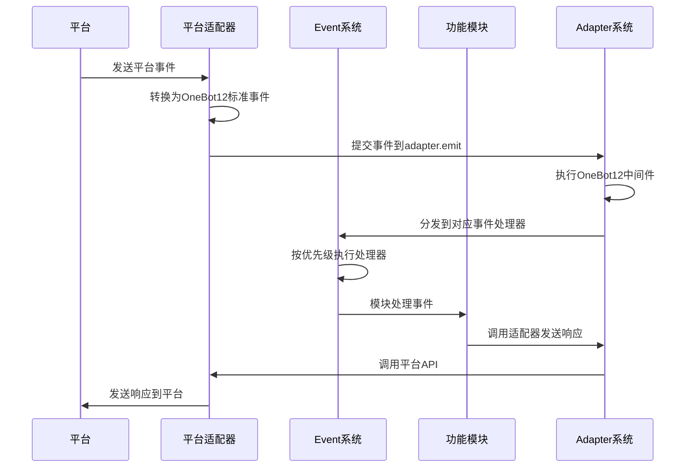

# ErisPulse 模块开发文档

**生成时间**: 2025-08-19 05:51:17

本文件由多个开发文档合并而成，用于辅助开发者理解 ErisPulse 的相关功能。

## 目录

1. [快速开始指南](#quick-startmd)
2. [基础架构和设计理念](#conceptsmd)
3. [核心模块](#modulesmd)
4. [适配器](#adaptersmd)
5. [事件系统](#event-systemmd)
6. [平台功能说明](#platform-featuresmd)
7. [标准事件的定义](#event-conversionmd)
8. [api响应的格式](#api-responsemd)

## 各文件对应内容说明

| 文件名 | 作用 |
|--------|------|
| [quick-start.md](#quick-startmd) | 快速开始指南 |
| [concepts.md](#conceptsmd) | 基础架构和设计理念 |
| [modules.md](#modulesmd) | 核心模块 |
| [adapters.md](#adaptersmd) | 适配器 |
| [event-system.md](#event-systemmd) | 事件系统 |
| [platform-features.md](#platform-featuresmd) | 平台功能说明 |
| [event-conversion.md](#event-conversionmd) | 标准事件的定义 |
| [api-response.md](#api-responsemd) | api响应的格式 |

---

<a id="quick-startmd"></a>
## 快速开始指南

# 快速开始

## 安装ErisPulse

### 使用 pip 安装
确保你的 Python 版本 >= 3.8，然后使用 pip 安装 ErisPulse：
```bash
pip install ErisPulse
```

### 更先进的安装方法
> 采用 [`uv`](https://github.com/astral-sh/uv) 作为 Python 工具链

### 1. 安装 uv

#### 通用方法 (pip):
```bash
pip install uv
```

#### macOS/Linux:
```bash
curl -LsSf https://astral.sh/uv/install.sh | sh
```

#### Windows (PowerShell):
```powershell
powershell -ExecutionPolicy ByPass -c "irm https://astral.sh/uv/install.ps1 | iex"
```

验证安装:
```bash
uv --version
```

### 2. 创建虚拟环境,并安装 ErisPulse

```bash
uv python install 3.12              # 安装 Python 3.12
uv venv                             # 创建虚拟环境
source .venv/bin/activate           # 激活环境 (Windows: .venv\Scripts\activate)
uv pip install ErisPulse --upgrade  # 安装框架
```

---

## 初始化项目

1. 创建项目目录并进入：

```bash
mkdir my_bot && cd my_bot
```

2. 初始化 SDK 并生成配置文件：

```bsah
ep-init
```
这将在当前目录下生成 `config.yml` 和 `main.py` 入口。

---

## 安装模块

你可以通过 CLI 安装所需模块：

```bash
epsdk install Yunhu AIChat
```

你也可以手动编写模块逻辑，参考开发者文档进行模块开发。

---

## 运行你的机器人
运行我们自动生成的程序入口：
```bash
epsdk run main.py
```

或者使用热重载模式（开发时推荐）：

```bash
epsdk run main.py --reload
```


---

<a id="conceptsmd"></a>
## 基础架构和设计理念

# ErisPulse 的基础架构和设计理念

## 设计理念
- 模块化架构：通过模块化设计实现功能的解耦和复用
- 事件驱动模型：基于事件驱动的架构提高系统的响应性和扩展性
- 跨平台支持：通过适配器系统实现对多种平台的支持
- 用户/AI体验优先：简化开发流程，提供友好的API接口

## 核心组件


## 工作流程
1. **事件接收**：平台适配器接收来自平台的原始事件
2. **事件标准化**：适配器将原始事件转换为OneBot12标准事件格式
3. **事件提交**：通过`adapter.emit`方法将标准化事件提交到适配器系统
4. **中间件处理**：执行注册的OneBot12中间件对事件进行预处理
5. **事件分发**：适配器系统将事件分发到对应的事件处理器
6. **事件处理**：Event系统按照优先级顺序执行注册的事件处理器
7. **模块响应**：功能模块处理事件并生成响应
8. **响应发送**：模块通过适配器系统发送响应到平台


---

<a id="modulesmd"></a>
## 核心模块

# ErisPulse 核心模块

ErisPulse 提供了多个核心模块，为开发者提供基础功能支持。

## 0. 核心模块概览

| 名称 | 用途 |
|------|------|
| `sdk` | SDK对象 |
| `storage`/`sdk.storage` | 获取/设置数据库配置 |
| `config`/`sdk.config` | 获取/设置模块配置 |
| `module_registry`/`sdk.module_registry` | 模块状态管理器 |
| `adapter`/`sdk.adapter` | 适配器管理/获取实例 |
| `module`/`sdk.module` | 获取模块实例 |
| `logger`/`sdk.logger` | 日志记录器 |
| `BaseAdapter`/`sdk.BaseAdapter` | 适配器基类 |
| `Event`/`sdk.Event` | 事件处理模块 |

> 注意: `Event` 模块是 ErisPulse 2.2.0 引入的新模块,发布模块时请注意提醒用户兼容性问题
Event 模块包含以下子模块：

| 子模块 | 用途 |
|-------|------|
| `Event.command` | 命令处理 |
| `Event.message` | 消息事件处理 |
| `Event.notice` | 通知事件处理 |
| `Event.request` | 请求事件处理 |
| `Event.meta` | 元事件处理 |
| `Event.exceptions` | 事件异常处理 |

```python
# 直接导入方式
from ErisPulse.Core import (
        storage, config, module_registry,
        adapter, module, logger,
        BaseAdapter, Event
    )

# 通过SDK对象方式
from ErisPulse import sdk
sdk.storage  # 等同于直接导入的storage
```

## 1. 存储系统 (storage)

基于 SQLite 的键值存储系统，支持复杂数据类型的持久化存储。

### 主要功能

- 键值存储：`storage.set(key, value)` / `storage.get(key, default)`
- 事务支持：通过 `storage.transaction()` 上下文管理器
- 数据快照和恢复
- 自动备份机制
- 批量操作：`storage.set_multi(dict)` / `storage.delete_multi(list)`

### 使用示例

```python
from ErisPulse import sdk

# 设置存储项
sdk.storage.set("user.settings", {"theme": "dark", "language": "zh-CN"})

# 获取存储项
settings = sdk.storage.get("user.settings", {})

# 使用事务
with sdk.storage.transaction():
    sdk.storage.set("key1", "value1")
    sdk.storage.set("key2", "value2")

# 批量操作
sdk.storage.set_multi({
    "key1": "value1",
    "key2": "value2"
})
sdk.storage.delete_multi(["key1", "key2"])
```

## 2. 配置管理 (config)

TOML 格式配置文件管理器，用于管理模块和适配器配置。

### 主要功能

- 模块配置读取：`config.getConfig(key, default)`
- 配置项设置：`config.setConfig(key, value)`
- 支持嵌套配置结构

### 使用示例

```python
from ErisPulse import sdk

# 获取模块配置
module_config = sdk.config.getConfig("MyModule", {})

# 设置默认配置
if not module_config:
    default_config = {
        "api_url": "https://api.example.com",
        "timeout": 30
    }
    sdk.config.setConfig("MyModule", default_config)

# 嵌套配置访问
nested_value = sdk.config.getConfig("MyModule.subkey.value", "default")
sdk.config.setConfig("MyModule.subkey.value", "new_value")
```

## 3. 日志系统 (logger)

模块化日志系统，支持多级日志和内存存储。

### 主要功能

- 模块级日志级别控制
- 内存日志存储
- 文件日志输出
- 丰富的日志格式
- 子模块日志记录器

### 使用示例

```python
from ErisPulse import sdk

# 记录日志
sdk.logger.info("模块已加载")
sdk.logger.error("发生错误: %s", str(error))

# 设置模块日志级别
sdk.logger.set_module_level("MyModule", "DEBUG")

# 获取子日志记录器
child_logger = sdk.logger.get_child("submodule")
child_logger.info("子模块日志")

# 更多日志级别
sdk.logger.debug("调试信息")
sdk.logger.info("运行状态")
sdk.logger.warning("警告信息")
sdk.logger.error("错误信息")
sdk.logger.critical("致命错误")  # 会触发程序崩溃

# 保存日志到文件
sdk.logger.save_logs("log.txt")
sdk.logger.set_output_file("app.log")
```

## 4. 异常处理 (exceptions)

统一的异常处理机制。

### 主要功能

- 全局异常捕获
- 异步异常处理
- 格式化的错误信息输出

### 使用示例

```python
from ErisPulse import sdk
import asyncio

# 为事件循环设置异常处理器
loop = asyncio.get_running_loop()
sdk.exceptions.setup_async_loop(loop)
```

## 5. 模块管理 (module)

模块管理系统，用于管理模块的启用/禁用状态。

### 主要功能

- 模块状态管理
- 模块信息查询
- 模块依赖处理
- 模块启用/禁用

### 使用示例

```python
from ErisPulse import sdk

# 直接获取模块实例
my_module = sdk.module.get("MyModule")

# 通过属性访问获取模块实例
my_module = sdk.module.MyModule

# 检查模块是否存在且启用
if "MyModule" in sdk.module:
    sdk.module.MyModule.do_something()

# 获取模块信息
module_info = sdk.module.get_info("MyModule")

# 列出所有模块
all_modules = sdk.module.list_modules()

# 启用/禁用模块
sdk.module.enable("MyModule")
sdk.module.disable("MyModule")
```

## 6. 适配器管理 (adapter)

适配器管理系统，用于管理与不同平台的连接和交互。

### 主要功能

- 适配器实例管理
- 事件监听注册
- 消息发送接口

### 使用示例

```python
from ErisPulse import sdk

# 获取适配器实例
adapter_instance = sdk.adapter.yunhu

# 发送消息
sdk.adapter.yunhu.Send.To("user", "U1001").Text("Hello")

# 监听事件
@sdk.adapter.yunhu.on("message")
async def handler(data):
    sdk.logger.info(f"收到原生事件: {data}")

# 监听标准事件
@sdk.adapter.on("message")
async def handler(data):
    if data["platform"] == "yunhu":
        sdk.logger.info(f"收到云湖标准事件: {data}")
```

## 7. 事件处理 (Event)
> 更完整的事件处理示例，请参考 docs/core/event-system.md 文档

事件处理模块，提供了一套完整的事件处理机制。

### 主要功能

- 命令处理
- 消息事件处理
- 通知事件处理
- 请求事件处理
- 元事件处理
- 事件异常处理

### 使用示例

```python
from ErisPulse.Core.Event import message, command, notice, request, meta

# 消息事件处理
@message.on_message()
async def message_handler(event):
    sdk.logger.info(f"收到消息事件: {event}")

# 命令处理
@command(["help", "h"], aliases=["帮助"], help="显示帮助信息")
async def help_handler(event):
    sdk.logger.info(f"收到命令事件: {event}")

# 通知事件处理
@notice.on_group_increase()
async def notice_handler(event):
    sdk.logger.info(f"收到群成员增加事件: {event}")

# 请求事件处理
@request.on_friend_request()
async def request_handler(event):
    sdk.logger.info(f"收到好友请求事件: {event}")

# 元事件处理
@meta.on_connect()
async def connect_handler(event):
    sdk.logger.info(f"平台连接成功: {event['platform']}")
```

## 模块使用规范

- 所有模块通过 `sdk` 对象统一管理
- 每个模块拥有独立命名空间，使用 `sdk` 进行调用
- 可以在模块间使用 `sdk.<module_name>.<func>` 的方式调用其他模块中的方法

## 配置管理

### 1. 命令前缀配置
```toml
[ErisPulse]
[ErisPulse.event]
[ErisPulse.event.command]
prefix = "/"
case_sensitive = true
allow_space_prefix = false

[ErisPulse.event.message]
ignore_self = true
```

### 2. 框架配置
```toml
[ErisPulse]
[ErisPulse.server]
host = "0.0.0.0"
port = 8000
ssl_certfile = ""
ssl_keyfile = ""

[ErisPulse.logger]
level = "INFO"
log_files = []
memory_limit = 1000
```


---

<a id="adaptersmd"></a>
## 适配器

# ErisPulse 适配器系统

适配器系统是 ErisPulse 实现跨平台支持的核心组件，负责将不同平台的事件转换为统一的 OneBot12 标准事件。

## 适配器职责

1. **事件转换**：将平台特定事件转换为 OneBot12 标准事件
2. **响应发送**：将 OneBot12 标准响应转换为平台特定格式
3. **连接管理**：管理与平台的连接和通信


### 1. SendDSL 消息发送

适配器通过 SendDSL 实现链式调用风格的消息发送接口：

发送中间方法示例：
```python
from ErisPulse.Core import adapter

my_platform = adapter.get("MyPlatform")

# 指定会话类型和对应id的发送接口
my_platform.To('user', '123').Example("hello world")

# 仅指定id的接口（比如email可以仅指定一个ID）
my_platform.To('123').Example("hello world")

# 使用指定账号的发送接口
my_platform.Using('account_id').Example("hello world")

# 直接调用（适用于某些场景，比如没有指定的会话和id）
my_platform.Example("hello world")
```

发送方法示例：
```python
from ErisPulse.Core import adapter

# 使用方式
my_platform = adapter.get("MyPlatform")

# 不等待结果，消息在后台发送
my_platform.Send.To("user", "123").Text("Hello")

# 由于适配器的DSL发送接口返回的是一个AsyncTask，因此你可以自行决定需不需要等待结果

# 等待结果，消息在发送后返回结果
task = my_platform.Send.To("user", "123").Text("Hello")

# 等待结果，并获取结果
result = await task

# 等待结果，并获取结果
result = await my_platform.Send.To("user", "123").Text("Hello")
```
> 返回的 Task 维持了协程的完整状态机，因此可以将其存储在变量中供后续使用 
> **提示**：对于大多数消息发送场景，您不需要等待发送结果。只有在需要确认消息是否成功发送或获取特定返回信息时，才需要 `await` Task 对象。


### 2. 事件监听

有三种事件监听方式：

1. 平台原生事件监听：
   ```python
   from ErisPulse.Core import adapter, logger
   
   @adapter.<AdapterName>.on("event_type")
   async def handler(data):
       logger.info(f"收到原生事件: {data}")
   ```

2. OneBot12标准事件监听：
   ```python
   from ErisPulse.Core import adapter, logger

   @adapter.on("event_type")  # 所有平台的标准事件
   async def handler(data):
       if data["platform"] == "yunhu":
           logger.info(f"收到云湖标准事件: {data}")
   ```

3. 使用 `ErisPulse` 内置的 `Event` 模块进行事件监听（OneBot12标准事件）
    ```python
    from ErisPulse.Core.Event import message, command, notice, request

    @message.on_message()
    async def message_handler(event):
      logger.info(f"收到消息事件: {event}")

    @command(["help", "h"], aliases=["帮助"], help="显示帮助信息")
    async def help_handler(event):
      logger.info(f"收到命令事件: {event}")

    @notice.on_group_increase()
    async def notice_handler(event):
      logger.info(f"收到群成员增加事件: {event}")
    
    @request.on_friend_request()
    async def request_handler(event):
      logger.info(f"收到好友请求事件: {event}")
    ```

ErisPulse对于OneBot12协议进行了一些修改，你可能需要先阅读 `docs/standards` 下的转换标准和api返回规则。


更建议你使用 `Event` 模块来处理事件，它提供了更丰富的功能和语法。


---

<a id="event-systemmd"></a>
## 事件系统

# ErisPulse 事件系统

事件系统是 ErisPulse 的核心组件之一，负责处理各种类型的事件，包括消息、命令、通知、请求和元事件。

## 事件类型

ErisPulse 支持多种事件类型：

- **消息事件**：处理用户发送的消息
- **命令事件**：处理用户输入的命令
- **通知事件**：处理系统通知（如好友添加、群成员变化等）
- **请求事件**：处理请求（如好友请求、群邀请等）
- **元事件**：处理系统级事件（如连接、断开连接等）

### 命令处理
```python
from ErisPulse.Core.Event import command

# 基本命令
@command("hello", help="发送问候消息")
async def hello_command(event):
    platform = event["platform"]
    user_id = event["user_id"]
    
    # 发送回复消息
    adapter_instance = getattr(sdk.adapter, platform)
    await adapter_instance.Send.To("user", user_id).Text("Hello World!")

# 带别名的命令
@command(["help", "h"], aliases=["帮助"], help="显示帮助信息")
async def help_command(event):
    platform = event["platform"]
    user_id = event["user_id"]
    help_text = command.help()
    
    adapter_instance = getattr(sdk.adapter, platform)
    await adapter_instance.Send.To("user", user_id).Text(help_text)

# 带权限检查的命令
def is_admin(event):
    # 检查是否为管理员
    user_id = event.get("user_id")
    return user_id in ["admin_id_1", "admin_id_2"]

@command("admin", permission=is_admin, help="管理员命令")
async def admin_command(event):
    # 只有管理员才能执行
    pass

# 隐藏命令
@command("secret", hidden=True, help="秘密命令")
async def secret_command(event):
    # 不会在帮助中显示
    pass

# 命令组
@command("admin.reload", group="admin", help="重新加载模块")
async def reload_command(event):
    # 管理员命令逻辑
    pass

# 等待用户回复的交互式命令
@command("ask", help="询问用户信息")
async def ask_command(event):
    platform = event["platform"]
    user_id = event["user_id"]
    detail_type = "group" if event.get("detail_type") == "group" else "user"
    target_id = event.get("group_id") or user_id
    
    adapter_instance = getattr(sdk.adapter, platform)
    
    # 等待用户回复
    reply_event = await command.wait_reply(
        event, 
        prompt="请输入您的姓名:", 
        timeout=30.0
    )
    
    if reply_event:
        # 提取用户回复内容
        user_reply = ""
        for segment in reply_event.get("message", []):
            if segment.get("type") == "text":
                user_reply = segment.get("data", {}).get("text", "")
                break
        
        if user_reply:
            await adapter_instance.Send.To(detail_type, target_id).Text(f"您好，{user_reply}！")
        else:
            await adapter_instance.Send.To(detail_type, target_id).Text("我没有收到有效的回复。")
    else:
        await adapter_instance.Send.To(detail_type, target_id).Text("您没有在规定时间内回复。")

# 带验证和回调的高级交互命令
@command("confirm", help="确认操作")
async def confirm_command(event):
    platform = event["platform"]
    user_id = event["user_id"]
    detail_type = "group" if event.get("detail_type") == "group" else "user"
    target_id = event.get("group_id") or user_id
    
    adapter_instance = getattr(sdk.adapter, platform)
    
    # 定义验证函数
    def validate_yes_no(reply_event):
        text_content = ""
        for segment in reply_event.get("message", []):
            if segment.get("type") == "text":
                text_content = segment.get("data", {}).get("text", "").strip().lower()
                break
        return text_content in ["是", "否", "yes", "no", "y", "n"]
    
    # 定义回调函数
    async def handle_confirmation(reply_event):
        text_content = ""
        for segment in reply_event.get("message", []):
            if segment.get("type") == "text":
                text_content = segment.get("data", {}).get("text", "").strip().lower()
                break
        
        if text_content in ["是", "yes", "y"]:
            await adapter_instance.Send.To(detail_type, target_id).Text("操作已确认！")
        else:
            await adapter_instance.Send.To(detail_type, target_id).Text("操作已取消。")
    
    # 等待用户确认
    await command.wait_reply(
        event,
        prompt="您确定要执行此操作吗？请输入'是'或'否':",
        timeout=30.0,
        callback=handle_confirmation,
        validator=validate_yes_no
    )
```

### 消息处理
```python
from ErisPulse.Core.Event import message

# 处理所有消息
@message.on_message()
async def handle_message(event):
    sdk.logger.info(f"收到消息: {event['alt_message']}")

# 处理私聊消息
@message.on_private_message()
async def handle_private_message(event):
    user_id = event["user_id"]
    sdk.logger.info(f"收到私聊消息，来自用户: {user_id}")

# 处理群聊消息
@message.on_group_message()
async def handle_group_message(event):
    group_id = event["group_id"]
    user_id = event["user_id"]
    sdk.logger.info(f"收到群消息，群: {group_id}，用户: {user_id}")

# 处理@消息
@message.on_at_message()
async def handle_at_message(event):
    user_id = event["user_id"]
    sdk.logger.info(f"收到@消息，来自用户: {user_id}")
```

### 通知处理
```python
from ErisPulse.Core.Event import notice

# 处理好友添加通知
@notice.on_friend_add()
async def handle_friend_add(event):
    user_id = event["user_id"]
    sdk.logger.info(f"新好友添加: {user_id}")
    
    # 发送欢迎消息
    platform = event["platform"]
    adapter_instance = getattr(sdk.adapter, platform)
    await adapter_instance.Send.To("user", user_id).Text("欢迎添加我为好友！")

# 处理群成员增加通知
@notice.on_group_increase()
async def handle_group_increase(event):
    group_id = event["group_id"]
    user_id = event["user_id"]
    sdk.logger.info(f"新成员加入群: {group_id}，用户: {user_id}")

# 处理好友删除通知
@notice.on_friend_remove()
async def handle_friend_remove(event):
    user_id = event["user_id"]
    sdk.logger.info(f"好友删除: {user_id}")

# 处理群成员减少通知
@notice.on_group_decrease()
async def handle_group_decrease(event):
    group_id = event["group_id"]
    user_id = event["user_id"]
    sdk.logger.info(f"群成员减少，群: {group_id}，用户: {user_id}")
```

### 请求处理
```python
from ErisPulse.Core.Event import request

# 处理好友请求
@request.on_friend_request()
async def handle_friend_request(event):
    user_id = event["user_id"]
    sdk.logger.info(f"收到好友请求，来自用户: {user_id}")

# 处理群邀请请求
@request.on_group_request()
async def handle_group_request(event):
    group_id = event["group_id"]
    user_id = event["user_id"]
    sdk.logger.info(f"收到群邀请请求，群: {group_id}，用户: {user_id}")
```

### 元事件处理
```python
from ErisPulse.Core.Event import meta

# 处理连接事件
@meta.on_connect()
async def handle_connect(event):
    platform = event["platform"]
    sdk.logger.info(f"平台 {platform} 连接成功")

# 处理断开连接事件
@meta.on_disconnect()
async def handle_disconnect(event):
    platform = event["platform"]
    sdk.logger.info(f"平台 {platform} 断开连接")

# 处理心跳事件
@meta.on_heartbeat()
async def handle_heartbeat(event):
    platform = event["platform"]
    sdk.logger.debug(f"平台 {platform} 心跳")
```

### 高级功能

#### 优先级控制
```python
# 设置处理器优先级
@message.on_message(priority=10)
async def high_priority_handler(event):
    # 高优先级处理器先执行
    pass

@message.on_message(priority=20)
async def low_priority_handler(event):
    # 低优先级处理器后执行
    pass
```

#### 条件处理器
```python
# 定义条件函数
def keyword_condition(event):
    message_segments = event.get("message", [])
    for segment in message_segments:
        if segment.get("type") == "text":
            text = segment.get("data", {}).get("text", "")
            return "关键词" in text
    return False

# 注册条件处理器
@message.on_message(condition=keyword_condition)
async def keyword_handler(event):
    # 只有消息包含"关键词"时才会执行
    pass
```


---

<a id="platform-featuresmd"></a>
## 平台功能说明

# ErisPulse PlatformFeatures 文档
> 基线协议：(OneBot12)[https://12.onebot.dev/] 
> 
> 本文档为**平台特定功能指南**，包含：
> - 各适配器支持的Send方法链式调用示例
> - 平台特有的事件/消息格式说明
> 
> 通用使用方法请参考：
> - [使用核心模块](docs/UseCore.md)
> - [适配器开发指南](docs/Development/Adapter.md)
> - [事件转换标准](docs/AdapterStandards/event-conversion.md)  
> - [API响应规范](docs/AdapterStandards/api-response.md)

---

## 平台特定功能

### 1. YunhuAdapter
YunhuAdapter 是基于云湖协议构建的适配器，整合了所有云湖功能模块，提供统一的事件处理和消息操作接口。

#### 支持的消息发送类型
所有发送方法均通过链式语法实现，例如：
```python
from ErisPulse.Core import adapter
yunhu = adapter.get("yunhu")

await yunhu.Send.To("user", user_id).Text("Hello World!")
```

支持的发送类型包括：
- `.Text(text: str, buttons: List = None)`：发送纯文本消息，可选添加按钮。
- `.Html(html: str, buttons: List = None)`：发送HTML格式消息。
- `.Markdown(markdown: str, buttons: List = None)`：发送Markdown格式消息。
- `.Image(file: bytes, buttons: List = None)`：发送图片消息。
- `.Video(file: bytes, buttons: List = None)`：发送视频消息。
- `.File(file: bytes, buttons: List = None)`：发送文件消息。
- `.Batch(target_ids: List[str], message: str)`：批量发送消息。
- `.Edit(msg_id: str, text: str, buttons: List = None)`：编辑已有消息。
- `.Recall(msg_id: str)`：撤回消息。
- `.Board(board_type: str, content: str, **kwargs)`：发布公告看板。
- `.Stream(content_type: str, generator: AsyncGenerator)`：发送流式消息。

Borard board_type 支持以下类型：
- `local`：指定用户看板
- `global`：全局看板

##### 按钮参数说明
`buttons` 参数是一个嵌套列表，表示按钮的布局和功能。每个按钮对象包含以下字段：

| 字段         | 类型   | 是否必填 | 说明                                                                 |
|--------------|--------|----------|----------------------------------------------------------------------|
| `text`       | string | 是       | 按钮上的文字                                                         |
| `actionType` | int    | 是       | 动作类型：<br>`1`: 跳转 URL<br>`2`: 复制<br>`3`: 点击汇报            |
| `url`        | string | 否       | 当 `actionType=1` 时使用，表示跳转的目标 URL                         |
| `value`      | string | 否       | 当 `actionType=2` 时，该值会复制到剪贴板<br>当 `actionType=3` 时，该值会发送给订阅端 |

示例：
```python
buttons = [
    [
        {"text": "复制", "actionType": 2, "value": "xxxx"},
        {"text": "点击跳转", "actionType": 1, "url": "http://www.baidu.com"},
        {"text": "汇报事件", "actionType": 3, "value", "xxxxx"}
    ]
]
await yunhu.Send.To("user", user_id).Text("带按钮的消息", buttons=buttons)
```
> **注意：**
> - 只有用户点击了**按钮汇报事件**的按钮才会收到推送，**复制***和**跳转URL**均无法收到推送。

#### OneBot12协议转换说明
云湖事件转换到OneBot12协议，其中标准字段完全遵守OneBot12协议，但存在一些差异，你需要阅读以下内容：
需要 platform=="yunhu" 检测再使用本平台特性

##### 核心差异点
1. 特有事件类型：
    - 表单（如表单指令）：yunhu_form
    - 按钮点击：yunhu_button_click
    - 机器人设置：yunhu_bot_setting
    - 快捷菜单：yunhu_shortcut_menu
2. 扩展字段：
    - 所有特有字段均以yunhu_前缀标识
    - 保留原始数据在yunhu_raw字段
    - 私聊中self.user_id表示机器人ID

3. 特殊字段示例：
```python
# 表单命令
{
  "type": "yunhu_form",
  "data": {
    "id": "1766",
    "name": "123123",
    "fields": [
      {
        "id": "abgapt",
        "type": "textarea",
        "value": ""
      },
      {
        "id": "mnabyo", 
        "type": "select",
        "value": ""
      }
    ]
  },
  "yunhu_command": {
    "name": "123123",
    "id": "1766",
    "form": {
      "abgapt": {
        "id": "abgapt",
        "type": "textarea",
        "value": ""
      },
      "mnabyo": {
        "id": "mnabyo",
        "type": "select",
        "value": ""
      }
    }
  }
}

# 按钮事件
{
  "detail_type": "yunhu_button_click",
  "yunhu_button": {
    "id": "",
    "value": "test_button_value"
  }
}

# 机器人设置
{
  "detail_type": "yunhu_bot_setting",
  "yunhu_setting": {
    "lokola": {
      "id": "lokola",
      "type": "radio",
      "value": ""
    },
    "ngcezg": {
      "id": "ngcezg",
      "type": "input",
      "value": null
    }
  }
}

# 快捷菜单
{
  "detail_type": "yunhu_shortcut_menu", 
  "yunhu_menu": {
    "id": "B4X00M5B",
    "type": 1,
    "action": 1
  }
}
```

---

### 2. TelegramAdapter
TelegramAdapter 是基于 Telegram Bot API 构建的适配器，支持多种消息类型和事件处理。

#### 支持的消息发送类型
所有发送方法均通过链式语法实现，例如：
```python
from ErisPulse.Core import adapter
telegram = adapter.get("telegram")

await telegram.Send.To("user", user_id).Text("Hello World!")
```

支持的发送类型包括：
- `.Text(text: str)`：发送纯文本消息。
- `.Image(file: bytes, caption: str = "")`：发送图片消息。
- `.Video(file: bytes, caption: str = "")`：发送视频消息。
- `.Audio(file: bytes, caption: str = "")`：发送音频消息。
- `.Document(file: bytes, caption: str = "")`：发送文件消息。
- `.EditMessageText(message_id: int, text: str)`：编辑已有消息。
- `.DeleteMessage(message_id: int)`：删除指定消息。
- `.GetChat()`：获取聊天信息。

#### 数据格式示例
> 略: 使用你了解的 TG 事件数据格式即可,这里不进行演示

#### OneBot12协议转换说明
Telegram事件转换到OneBot12协议，其中标准字段完全遵守OneBot12协议，但存在以下差异：

##### 核心差异点
1. 特有事件类型：
   - 内联查询：telegram_inline_query
   - 回调查询：telegram_callback_query
   - 投票事件：telegram_poll
   - 投票答案：telegram_poll_answer

2. 扩展字段：
   - 所有特有字段均以telegram_前缀标识
   - 保留原始数据在telegram_raw字段
   - 频道消息使用detail_type="channel"

3. 特殊字段示例：
```python
# 回调查询事件
{
  "type": "notice",
  "detail_type": "telegram_callback_query",
  "user_id": "123456",
  "user_nickname": "YingXinche",
  "telegram_callback": {
    "id": "cb_123",
    "data": "callback_data",
    "message_id": "msg_456"
  }
}

# 内联查询事件
{
  "type": "notice",
  "detail_type": "telegram_inline_query",
  "user_id": "789012",
  "user_nickname": "YingXinche",
  "telegram_inline": {
    "id": "iq_789",
    "query": "search_text",
    "offset": "0"
  }
}

# 频道消息
{
  "type": "message",
  "detail_type": "channel",
  "message_id": "msg_345",
  "channel_id": "channel_123",
  "telegram_channel": {
    "title": "News Channel",
    "username": "news_official"
  }
}
```

---

### 3. OneBot11Adapter
OneBot11Adapter 是基于 OneBot V11 协议构建的适配器。

#### 支持的消息发送类型
所有发送方法均通过链式语法实现，例如：
```python
from ErisPulse.Core import adapter
onebot = adapter.get("onebot11")

await onebot.Send.To("group", group_id).Text("Hello World!")
```

支持的发送类型包括：
- `.Text(text: str)`：发送纯文本消息。
- `.Image(file: str)`：发送图片消息（支持 URL 或 Base64）。
- `.Voice(file: str)`：发送语音消息。
- `.Video(file: str)`：发送视频消息。
- `.Raw(message_list: List[Dict])`：发送原生 OneBot 消息结构。
- `.Recall(message_id: int)`：撤回消息。
- `.Edit(message_id: int, new_text: str)`：编辑消息。
- `.Batch(target_ids: List[str], text: str)`：批量发送消息。


#### 数据格式示例
> 略: 使用你了解的 OneBot v11 事件数据格式即可,这里不进行演示
#### OneBot12协议转换说明
OneBot11事件转换到OneBot12协议，其中标准字段完全遵守OneBot12协议，但存在以下差异：

##### 核心差异点
1. 特有事件类型：
   - CQ码扩展事件：onebot11_cq_{type}
   - 荣誉变更事件：onebot11_honor
   - 戳一戳事件：onebot11_poke

2. 扩展字段：
   - 所有特有字段均以onebot11_前缀标识
   - 保留原始CQ码消息在onebot11_raw_message字段
   - 保留原始事件数据在onebot11_raw字段

3. 特殊字段示例：
```python
# 荣誉变更事件
{
  "type": "notice",
  "detail_type": "onebot11_honor",
  "group_id": "123456",
  "user_id": "789012",
  "onebot11_honor_type": "talkative",
  "onebot11_operation": "set"
}

# 戳一戳事件
{
  "type": "notice",
  "detail_type": "onebot11_poke",
  "group_id": "123456",
  "user_id": "789012",
  "target_id": "345678",
  "onebot11_poke_type": "normal"
}

# CQ码消息段
{
  "type": "message",
  "message": [
    {
      "type": "onebot11_face",
      "data": {"id": "123"}
    },
    {
      "type": "onebot11_shake",
      "data": {} 
    }
  ]
}
```

---

### 4. MailAdapter
MailAdapter 是基于SMTP/IMAP协议的邮件适配器，支持邮件发送、接收和处理。

#### 支持的消息发送类型
所有发送方法均通过链式语法实现，例如：
```python
from ErisPulse.Core import adapter
mail = adapter.get("email")

# 简单文本邮件
await mail.Send.Using("from@example.com").To("to@example.com").Subject("测试").Text("内容")

# 带附件的HTML邮件
await mail.Send.Using("from@example.com") \
    .To("to@example.com") \
    .Subject("HTML邮件") \
    .Cc(["cc1@example.com", "cc2@example.com"]) \
    .Attachment("report.pdf") \
    .Html("<h1>HTML内容</h1>")

# 注意：使用链式语法时，参数方法必须在发送方法（Text，Html）之前设置
```

支持的发送类型包括：
- `.Text(text: str)`：发送纯文本邮件
- `.Html(html: str)`：发送HTML格式邮件
- `.Attachment(file: str, filename: str = None)`：添加附件
- `.Cc(emails: Union[str, List[str]])`：设置抄送
- `.Bcc(emails: Union[str, List[str]])`：设置密送
- `.ReplyTo(email: str)`：设置回复地址

#### 特有参数说明
| 参数       | 类型               | 说明                          |
|------------|--------------------|-----------------------------|
| Subject    | str                | 邮件主题                      |
| From       | str                | 发件人地址(通过Using设置)      |
| To         | str                | 收件人地址                    |
| Cc         | str 或 List[str]   | 抄送地址列表                  |
| Bcc        | str 或 List[str]   | 密送地址列表                  |
| Attachment | str 或 Path        | 附件文件路径                 |

#### 事件格式
邮件接收事件格式：
```python
{
  "type": "message",
  "detail_type": "private",  # 邮件默认为私聊
  "platform": "email",
  "self": {"platform": "email", "user_id": account_id},
  "message": [
    {
      "type": "text",
      "data": {
        "text": f"Subject: {subject}\nFrom: {from_}\n\n{text_content}"
      }
    }
  ],
  "email_raw": {
    "subject": subject,
    "from": from_,
    "to": to,
    "date": date,
    "text_content": text_content,
    "html_content": html_content,
    "attachments": [att["filename"] for att in attachments]
  },
  "attachments": [  # 附件数据列表
    {
      "filename": "document.pdf",
      "content_type": "application/pdf",
      "size": 1024,
      "data": b"..."  # 附件二进制数据
    }
  ]
}
```

#### OneBot12协议转换说明
邮件事件转换到OneBot12协议，主要差异点：

1. 特有字段：
   - `email_raw`: 包含原始邮件数据
   - `attachments`: 附件数据列表

2. 特殊处理：
   - 邮件主题和发件人信息会包含在消息文本中
   - 附件数据会以二进制形式提供
   - HTML内容会保留在email_raw字段中

3. 示例：
```python
{
  "type": "message",
  "platform": "email",
  "message": [
    {
      "type": "text",
      "data": {
        "text": "Subject: 会议通知\nFrom: sender@example.com\n\n请查收附件"
      }
    }
  ],
  "email_raw": {
    "subject": "会议通知",
    "from": "sender@example.com",
    "to": "receiver@example.com",
    "html_content": "<p>请查收附件</p>",
    "attachments": ["document.pdf"]
  },
  "attachments": [
    {
      "filename": "document.pdf",
      "data": b"...",  # 附件二进制数据
      "size": 1024
    }
  ]
}
```

---

## 参考链接
ErisPulse 项目：
- [主库](https://github.com/ErisPulse/ErisPulse/)
- [ErisPulse Yunhu 适配器库](https://github.com/ErisPulse/ErisPulse-YunhuAdapter)
- [ErisPulse Telegram 适配器库](https://github.com/ErisPulse/ErisPulse-TelegramAdapter)
- [ErisPulse OneBot 适配器库](https://github.com/ErisPulse/ErisPulse-OneBotAdapter)

相关官方文档：
- [OneBot V11 协议文档](https://github.com/botuniverse/onebot-11)
- [Telegram Bot API 官方文档](https://core.telegram.org/bots/api)
- [云湖官方文档](https://www.yhchat.com/document/1-3)

---

## 参与贡献

我们欢迎更多开发者参与编写和维护适配器文档！请按照以下步骤提交贡献：
1. Fork [ErisPuls](https://github.com/ErisPulse/ErisPulse) 仓库。
2. 在 `docs/` 目录下找到 ADAPTER.md 适配器文档。
3. 提交 Pull Request，并附上详细的描述。

感谢您的支持！


---

<a id="event-conversionmd"></a>
## 标准事件的定义

# ErisPulse 适配器标准化转换规范

## 1. 核心原则
1. 严格兼容：所有标准字段必须完全遵循OneBot12规范
2. 明确扩展：平台特有功能必须添加 {platform}_ 前缀（如 yunhu_form）
3. 数据完整：原始事件数据必须保留在 {platform}_raw 字段中
4. 时间统一：所有时间戳必须转换为10位Unix时间戳（秒级）
5. 平台统一：platform项命名必须与你在ErisPulse中注册的名称/别称一致

## 2. 基础字段规范
### 2.1 必填字段（所有事件）
|字段|类型|要求|
|-|-|-|
|id|string|必须存在，原始事件无ID时使用UUID生成|
|time|int|10位秒级时间戳（毫秒级需转换）|
|type|string|必须为 message/notice/request 之一|
|platform|string|必须与适配器注册名完全一致|
|self|object|必须包含 platform 和 user_id|

### 2.2 条件字段
|字段|触发条件|示例|
|-|-|-|
|detail_type|所有事件必须|"group"/"private"|
|sub_type|需要细分时|"invite"/"leave"|
|message_id|消息事件|"msg_123"|
|user_id|涉及用户|"user_456"|
|group_id|群组事件|"group_789"|

### 2.3 非标准字段（非必须，但建议实现）
|字段|触发类型|示例|
|-|-|-|
|user_nickname|涉及用户|"用户昵称"|

## 3. 完整事件模板
### 3.1 消息事件 (message)
```json
{
  "id": "event_123",
  "time": 1752241220,
  "type": "message",
  "detail_type": "group",
  "sub_type": "",
  "platform": "yunhu",
  "self": {
    "platform": "yunhu",
    "user_id": "bot_123"
  },
  "message_id": "msg_abc",
  "message": [
    {
      "type": "text",
      "data": {"text": "你好"}
    },
    {
      "type": "image",
      "data": {
        "file_id": "img_xyz",
        "url": "https://example.com/image.jpg",
        "file_name": "example.jpg",
        "size": 102400,
        "width": 800,
        "height": 600
      }
    }
  ],
  "alt_message": "你好[图片]",
  "user_id": "user_456",
  "user_nickname": "YingXinche",
  "group_id": "group_789",
  "yunhu_raw": {...},
  "yunhu_command": {
    "name": "抽奖",
    "args": "超级大奖"
  }
}
```
### 3.2 通知事件 (notice)
```json
{
  "id": "event_456",
  "time": 1752241221,
  "type": "notice",
  "detail_type": "group_member_increase",
  "sub_type": "invite",
  "platform": "yunhu",
  "self": {
    "platform": "yunhu",
    "user_id": "bot_123"
  },
  "user_id": "user_456",
  "user_nickname": "YingXinche",
  "group_id": "group_789",
  "operator_id": "",
  "yunhu_raw": {...},
}
```
### 3.3 请求事件 (request)
```json
{
  "id": "event_789",
  "time": 1752241222,
  "type": "request",
  "detail_type": "friend",
  "platform": "onebot11",
  "self": {
    "platform": "onebot11",
    "user_id": "bot_123"
  },
  "user_id": "user_456",
  "user_nickname": "YingXinche",
  "comment": "请加好友",
  "onebot11_raw": {...},
}
```
## 4. 消息段标准
### 4.1 通用消息段
|类型|必填字段|扩展字段|
|-|-|-|
|text|text|-|
|image|url|file_name, size, width, height|
|video|url|duration, file_name|
|file|url|size, file_name|

## 5. 错误处理规范
### 5.1 字段缺失处理
```python
def safe_get(data: dict, key: str, default=None):
    """安全获取字段并记录警告"""
    if key not in data:
        logger.warning(f"Missing field '{key}' in {data.get('eventType', 'unknown')}")
    return data.get(key, default)
```
### 5.2 未知事件处理
```json
{
  "id": "event_999",
  "time": 1752241223,
  "type": "unknown",
  "platform": "yunhu",
  "yunhu_raw": {...},
  "warning": "Unsupported event type: special_event",
  "alt_message": "This event type is not supported by this system."
}
```
## 6. 时间戳转换标准
```python
def convert_timestamp(ts: Any) -> int:
    """标准化时间戳处理"""
    if isinstance(ts, str):
        if len(ts) == 13:  # 毫秒级
            return int(ts) // 1000
        return int(ts)
    elif isinstance(ts, (int, float)):
        if ts > 9999999999:  # 毫秒级
            return int(ts // 1000)
        return int(ts)
    return int(time.time())  # 默认当前时间
```
## 7. 适配器实现检查清单
- [ ] 所有标准字段已正确映射
- [ ] 平台特有字段已添加前缀
- [ ] 时间戳已转换为10位秒级
- [ ] 原始数据保存在 {platform}_raw
- [ ] 消息段的 alt_message 已生成
- [ ] 所有事件类型已通过单元测试
- [ ] 文档包含完整示例和说明
## 8. 最佳实践示例
### 云湖表单消息处理
```python
def _convert_form_message(self, raw_form: dict) -> dict:
    """转换表单消息为标准格式"""
    return {
        "type": "yunhu_form",
        "data": {
            "id": raw_form.get("formId"),
            "fields": [
                {
                    "id": field.get("fieldId"),
                    "type": field.get("fieldType"),
                    "label": field.get("label"),
                    "value": field.get("value")
                }
                for field in raw_form.get("fields", [])
            ]
        }
    }
```
### 消息ID生成规则
```python
def generate_message_id(platform: str, raw_id: str) -> str:
    """标准化消息ID格式"""
    return f"{platform}_msg_{raw_id}" if raw_id else f"{platform}_msg_{uuid.uuid4()}"
```
本规范确保所有适配器：
1. 保持与OneBot12的完全兼容性
2. 平台特有功能可识别且不冲突
3. 转换过程可追溯（通过_raw字段）
4. 数据类型和格式统一
建议配合自动化测试验证所有转换场景，特别是：
- 边界值测试（如空消息、超大文件）
- 特殊字符测试（消息内容含emoji/特殊符号）
- 压力测试（连续事件转换）


---

<a id="api-responsemd"></a>
## api响应的格式

# ErisPulse 适配器标准化返回规范

## 1. 说明
为什么会有这个规范？

为了确保各平台发送接口返回统一性与OneBot12兼容性，ErisPulse适配器在API响应格式上采用了OneBot12定义的消息发送返回结构标准。

但ErisPulse的协议有一些特殊性定义:
- 1. 基础字段中，message_id是必须的，但OneBot12标准中无此字段
- 2. 返回内容中需要添加 {platform_name}_raw 字段，用于存放原始响应数据

## 2. 基础返回结构
所有动作响应必须包含以下基础字段：

| 字段名 | 数据类型 | 必选 | 说明 |
|-------|---------|------|------|
| status | string | 是 | 执行状态，必须是"ok"或"failed" |
| retcode | int64 | 是 | 返回码，遵循OneBot12返回码规则 |
| data | any | 是 | 响应数据，成功时包含请求结果，失败时为null |
| message_id | string | 是 | 消息ID，用于标识消息, 没有则为空字符串 |
| message | string | 是 | 错误信息，成功时为空字符串 |
| {platform_name}_raw | any | 否 | 原始响应数据 |

可选字段：
| 字段名 | 数据类型 | 必选 | 说明 |
|-------|---------|------|------|
| echo | string | 否 | 当请求中包含echo字段时，原样返回 |

## 3. 完整字段规范

### 3.1 通用字段

#### 成功响应示例
```json
{
    "status": "ok",
    "retcode": 0,
    "data": {
        "message_id": "1234",
        "time": 1632847927.599013
    },
    "message_id": "1234",
    "message": "",
    "echo": "1234",
    "telegram_raw": {...}
}
```

#### 失败响应示例
```json
{
    "status": "failed",
    "retcode": 10003,
    "data": null,
    "message_id": "",
    "message": "缺少必要参数: user_id",
    "echo": "1234",
    "telegram_raw": {...}
}
```

### 3.2 返回码规范

#### 0 成功（OK）
- 0: 成功（OK）

#### 1xxxx 动作请求错误（Request Error）
| 错误码 | 错误名 | 说明 |
|-------|-------|------|
| 10001 | Bad Request | 无效的动作请求 |
| 10002 | Unsupported Action | 不支持的动作请求 |
| 10003 | Bad Param | 无效的动作请求参数 |
| 10004 | Unsupported Param | 不支持的动作请求参数 |
| 10005 | Unsupported Segment | 不支持的消息段类型 |
| 10006 | Bad Segment Data | 无效的消息段参数 |
| 10007 | Unsupported Segment Data | 不支持的消息段参数 |
| 10101 | Who Am I | 未指定机器人账号 |
| 10102 | Unknown Self | 未知的机器人账号 |

#### 2xxxx 动作处理器错误（Handler Error）
| 错误码 | 错误名 | 说明 |
|-------|-------|------|
| 20001 | Bad Handler | 动作处理器实现错误 |
| 20002 | Internal Handler Error | 动作处理器运行时抛出异常 |

#### 3xxxx 动作执行错误（Execution Error）
| 错误码范围 | 错误类型 | 说明 |
|-----------|---------|------|
| 31xxx | Database Error | 数据库错误 |
| 32xxx | Filesystem Error | 文件系统错误 |
| 33xxx | Network Error | 网络错误 |
| 34xxx | Platform Error | 机器人平台错误 |
| 35xxx | Logic Error | 动作逻辑错误 |
| 36xxx | I Am Tired | 实现决定罢工 |

#### 保留错误段
- 4xxxx、5xxxx: 保留段，不应使用
- 6xxxx～9xxxx: 其他错误段，供实现自定义使用

## 4. 实现要求
1. 所有响应必须包含status、retcode、data和message字段
2. 当请求中包含非空echo字段时，响应必须包含相同值的echo字段
3. 返回码必须严格遵循OneBot12规范
4. 错误信息(message)应当是人类可读的描述

## 5. 注意事项
- 对于3xxxx错误码，低三位可由实现自行定义
- 避免使用保留错误段(4xxxx、5xxxx)
- 错误信息应当简洁明了，便于调试


---

