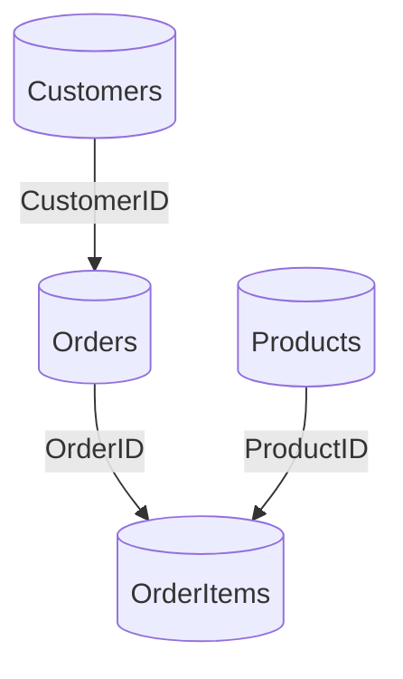

### Example dataset

#### Training grounds (no real dragons, just synthetic ones)
This is your practice arena. Swing at sample SQLs and learn their moves. The JSONs are your coaches—copy their form exactly.

- Path: `examples/warehouse/`
- Warm-ups: base tables, staging views, facts, and aggregates
- Advanced drills: stars, UNIONs, procedures with temp tables

Remember: numbering helps you keep the monsters in order.

Plain: a small dataset for learning and testing.

#### Audience & prerequisites
- Audience: users learning lineage extraction and testing changes

- Prerequisites: basic SQL; Python; ability to run CLI commands

### Step-by-Step Tutorial
1. Open your terminal (command line).
2. Navigate to the project folder: `cd /Users/macin/Git/InfoTracker`.
3. Run the command: `infotracker extract --sql-dir examples/warehouse/sql --out-dir build/lineage`.
4. Check the output: Open a file like `build/lineage/01_customers.json` and compare it to `examples/warehouse/lineage/01_customers.json`.

### How to run
- Create lineage JSONs from SQL:
  ```bash
  infotracker extract --sql-dir examples/warehouse/sql --out-dir build/lineage
  ```
- Compare with the gold JSONs in `examples/warehouse/lineage`.

### Quick validation queries (optional)
Run these to understand the data shape (in any MS SQL instance with similar tables):
```sql
-- Count orders
SELECT COUNT(*) FROM dbo.Orders;
-- Recent orders in last 30 days (matches example views)
SELECT COUNT(*) FROM dbo.Orders WHERE OrderDate >= DATEADD(DAY,-30, CAST(GETDATE() AS DATE));
-- Basic revenue calc example
SELECT SUM(Quantity * UnitPrice) FROM dbo.OrderItems;
```

Location: `examples/warehouse/`

```
sql/
  01_customers.sql
  02_orders.sql
  03_products.sql
  04_order_items.sql
  10_stg_orders.sql
  11_stg_order_items.sql
  12_stg_customers.sql
  20_vw_recent_orders.sql
  30_dim_customer.sql
  31_dim_product.sql
  40_fct_sales.sql
  41_agg_sales_by_day.sql
  50_vw_orders_all.sql
  51_vw_orders_all_enriched.sql
  52_vw_order_details_star.sql
  53_vw_products_all.sql
  54_vw_recent_orders_star_cte.sql
  55_vw_orders_shipped_or_delivered.sql
  56_vw_orders_union_star.sql
  90_usp_refresh_sales_with_temp.sql
  91_usp_snapshot_recent_orders_star.sql
  92_usp_rebuild_recent_sales_with_vars.sql
  93_usp_top_products_since_var.sql
  94_fn_customer_orders_tvf.sql
  95_usp_customer_metrics_dataset.sql
  96_demo_usage_tvf_and_proc.sql
lineage/
  one JSON per SQL file with OpenLineage column lineage
```

### SQL ↔ JSON mapping
- Follow the filename pattern: `sql/NN_name.sql` ↔ `lineage/NN_name.json`
- Examples:
  - `sql/02_orders.sql` ↔ `lineage/02_orders.json`
  - `sql/41_agg_sales_by_day.sql` ↔ `lineage/41_agg_sales_by_day.json`

### Data dictionary snapshot (core tables)
- Orders: `OrderID (INT, PK)`, `CustomerID (INT)`, `OrderDate (DATE)`, `OrderStatus (VARCHAR)`
- OrderItems: `OrderID (INT)`, `ProductID (INT)`, `Quantity (INT)`, `UnitPrice (DECIMAL)`
- Products: `ProductID (INT, PK)`, `Category (VARCHAR)`, `Name (VARCHAR)`

### Comparing generated vs gold
Gold JSONs are the correct answers, like a teacher's key for homework.
1. Generate lineage:
   ```bash
   infotracker extract --sql-dir examples/warehouse/sql --out-dir build/lineage
   ```
2. Compare to gold JSONs in `examples/warehouse/lineage` using your diff tool or CI
3. Any difference indicates a behavior change; adjust parsing/resolution and retry

Use these SQL files and the expected JSONs as the supervised “gold” for your agentic loop and regression tests. 

### ER overview


### File-by-file notes (highlights)
- `01_customers.sql`: Base table (DDL) — schema facet only
- `02_orders.sql`: Base table — used in many downstream examples
- `10_stg_orders.sql`: CAST + CASE; introduces boolean-like derivation
- `11_stg_order_items.sql`: arithmetic derived column `ExtendedPrice`
- `20_vw_recent_orders.sql`: CTE with 30-day filter
- `40_fct_sales.sql`: Join stg tables; simple fact grain
- `41_agg_sales_by_day.sql`: Aggregates with GROUP BY and SUM
- `50_*` to `56_*`: star expansion variants, UNION, filters
- `90_*` to `93_*`: procedures with temp tables, SELECT INTO, and variables
- `94_fn_customer_orders_tvf.sql`: parametrized tabular function with two syntax variants (RETURN AS and RETURN TABLE)
- `95_usp_customer_metrics_dataset.sql`: procedure that returns a dataset for further processing
- `96_demo_usage_tvf_and_proc.sql`: demonstration of using both objects together in workflows

### Using the corpus
- Treat JSON files in `lineage/` as gold outputs — your extractor must match them exactly
- Add new cases in numbered order; keep SQL and JSON filenames aligned
- Run regression on changes; failing diffs indicate a behavior change

### Extending the dataset
- Add correlated subqueries, window frames, PIVOT/UNPIVOT, INTERSECT/EXCEPT
- Include negative tests (ambiguous columns, unsupported syntax) to validate warnings

### Hands-On Modification Example
1. Open `examples/warehouse/sql/01_customers.sql`.
2. Add a new column, like `Email VARCHAR(100)`.
3. Re-run the extract command.
4. See how the JSON changes—now it includes the new column.
