### Column-level lineage: concepts

#### See the strands of power (aka where columns come from)
Put on your SQL spectacles and watch how outputs inherit their magic from inputs. It’s like genealogy, but for data—and fewer awkward family dinners.

- Trace: table → view → procedure → snapshot
- Decode: casts, cases, windows, and unions
- Outcome: confidence in what feeds what

If a node name has parentheses, quote it—Mermaid likes polite labels.

Plain: outputs depend on inputs; arrows show that link.

#### Audience & prerequisites
- Audience: readers new to column-level lineage and impact analysis
- Prerequisites: basic SQL; familiarity with SELECT/JOIN/GROUP BY

### Diagram legend
- Node = `db.schema.object.column`
- Arrow (`A --> B`) = A is used to compute B

Column lineage explains how output columns are derived from input columns across tables, views, joins, and transforms.

#### Simple transform
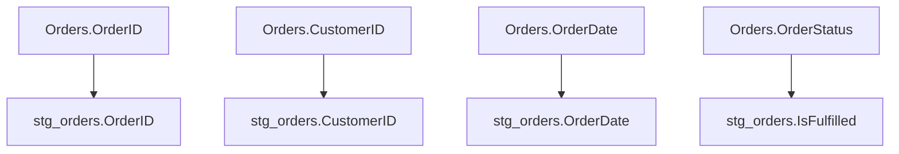

#### Join + derived measure
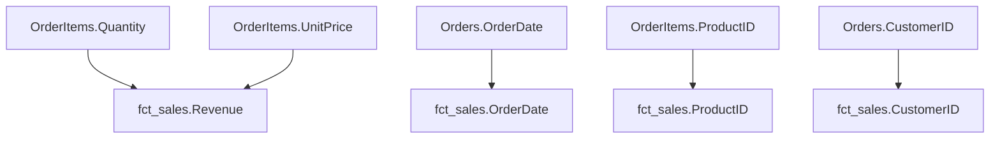

Why it matters:
- Accurate impact analysis for safer changes
- Compliance and data governance
- Debugging data issues through source tracing 

#### Rename + cast example
SQL:
```sql
CREATE VIEW dbo.stg_orders_cast AS
SELECT
  o.OrderID AS id,
  CAST(o.OrderDate AS DATE) AS OrderDate
FROM dbo.Orders AS o;
```
Lineage:
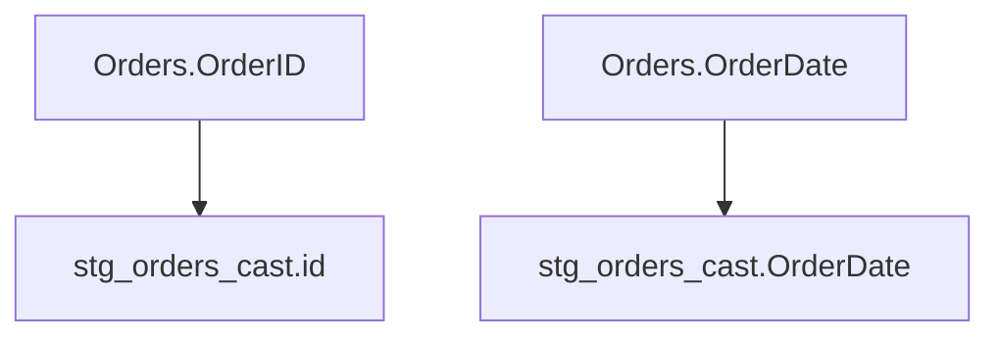

#### CASE-derived column example
SQL:
```sql
CREATE VIEW dbo.stg_orders_flags AS
SELECT
  o.OrderID,
  CASE WHEN o.OrderStatus IN ('shipped','delivered') THEN 1 ELSE 0 END AS IsFulfilled
FROM dbo.Orders AS o;
```
Lineage:
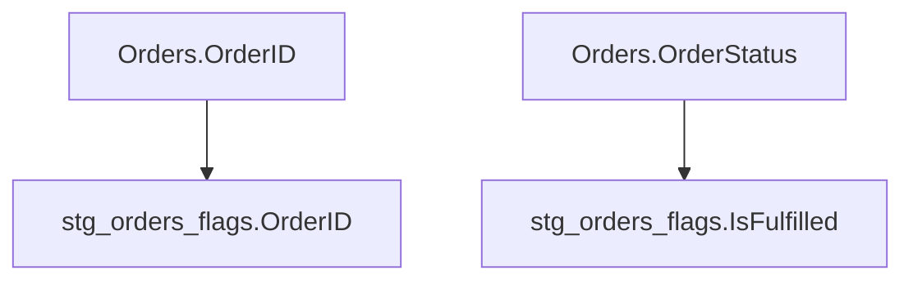

#### Aggregation example
SQL:
```sql
CREATE VIEW dbo.agg_sales_by_day AS
SELECT
  CAST(o.OrderDate AS DATE) AS OrderDate,
  SUM(oi.Quantity) AS TotalQuantity,
  SUM(oi.Quantity * oi.UnitPrice) AS TotalRevenue
FROM dbo.stg_order_items AS oi
JOIN dbo.stg_orders AS o
  ON oi.OrderID = o.OrderID
GROUP BY CAST(o.OrderDate AS DATE);
```
Lineage:
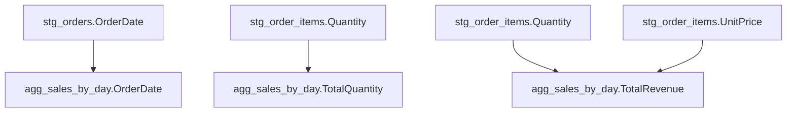

#### Window function example
SQL:
```sql
CREATE VIEW dbo.vw_customer_order_rank AS
SELECT
  o.OrderID,
  o.CustomerID,
  ROW_NUMBER() OVER (PARTITION BY o.CustomerID ORDER BY o.OrderDate DESC) AS OrderRank
FROM dbo.stg_orders AS o;
```
Lineage:
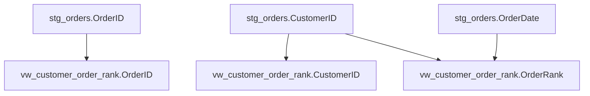

#### CTE + filter + projection example
SQL:
```sql
CREATE VIEW dbo.vw_recent_ids AS
WITH r AS (
  SELECT * FROM dbo.Orders WHERE OrderDate >= DATEADD(DAY,-30, CAST(GETDATE() AS DATE))
)
SELECT r.OrderID, r.CustomerID FROM r;
```
Lineage:
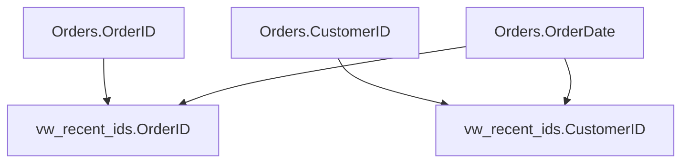

#### UNION ALL alignment example
SQL:
```sql
CREATE VIEW dbo.vw_orders_union AS
SELECT OrderID, CustomerID FROM dbo.Orders WHERE OrderStatus = 'shipped'
UNION ALL
SELECT OrderID, CustomerID FROM dbo.Orders WHERE OrderStatus = 'delivered';
```
Lineage:
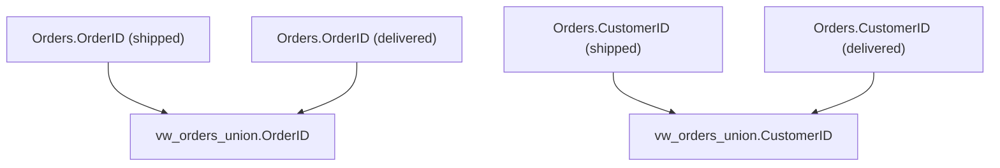

#### SELECT INTO snapshot example
SQL:
```sql
CREATE OR ALTER PROCEDURE dbo.usp_snapshot_orders AS
BEGIN
  SET NOCOUNT ON;
  IF OBJECT_ID('dbo.orders_snapshot','U') IS NULL
  BEGIN
    SELECT CAST(GETDATE() AS DATE) AS SnapshotDate, o.OrderID, o.CustomerID, o.OrderDate
    INTO dbo.orders_snapshot
    FROM dbo.vw_recent_orders_star_cte AS o;
  END
  ELSE
  BEGIN
    INSERT INTO dbo.orders_snapshot (SnapshotDate, OrderID, CustomerID, OrderDate)
    SELECT CAST(GETDATE() AS DATE), o.OrderID, o.CustomerID, o.OrderDate
    FROM dbo.vw_recent_orders_star_cte AS o;
  END
END;
```
Lineage (table outputs):
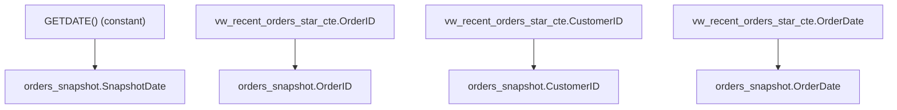

#### Tabular function example (inline)
SQL:
```sql
CREATE FUNCTION dbo.fn_customer_orders_inline
(
    @CustomerID INT,
    @StartDate DATE,
    @EndDate DATE
)
RETURNS TABLE
AS
RETURN
(
    SELECT
        o.OrderID,
        o.CustomerID,
        o.OrderDate,
        oi.ProductID,
        CAST(oi.Quantity * oi.UnitPrice AS DECIMAL(18,2)) AS ExtendedPrice
    FROM dbo.Orders AS o
    INNER JOIN dbo.OrderItems AS oi ON o.OrderID = oi.OrderID
    WHERE o.CustomerID = @CustomerID
      AND o.OrderDate BETWEEN @StartDate AND @EndDate
);
```
Lineage (function outputs treated as view-like):
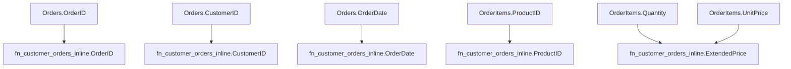

#### Procedure returning dataset example
SQL:
```sql
CREATE PROCEDURE dbo.usp_customer_metrics_dataset
    @CustomerID INT = NULL,
    @StartDate DATE = NULL
AS
BEGIN
    SELECT
        c.CustomerID,
        c.CustomerName,
        COUNT(DISTINCT o.OrderID) AS TotalOrders,
        SUM(oi.Quantity * oi.UnitPrice) AS TotalRevenue
    FROM dbo.Customers AS c
    LEFT JOIN dbo.Orders AS o ON c.CustomerID = o.CustomerID
    LEFT JOIN dbo.OrderItems AS oi ON o.OrderID = oi.OrderID
    WHERE (@CustomerID IS NULL OR c.CustomerID = @CustomerID)
    GROUP BY c.CustomerID, c.CustomerName;
END;
```
Lineage (procedure outputs treated as view-like):
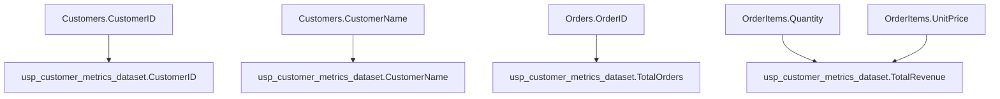

### Key definitions
- Source column: fully qualified `db.schema.object.column`
- Output column: column produced by a query/view/CTE/procedure step
- Expression: AST representing how an output is computed from inputs
- Lineage edge: relation from input column(s) to an output column

### Tabular functions and procedures in lineage
Tabular functions and procedures that return datasets are treated as view-like objects in lineage analysis. They represent a transformation layer that can be used as inputs to other operations.

#### Tabular function characteristics
- **Inline table-valued functions (RETURN AS)**: Single SELECT statement, optimized by query optimizer
- **Multi-statement table-valued functions (RETURN TABLE)**: Multiple statements with table variable, more complex logic
- Both types accept parameters and return result sets that can be joined with other objects
- Lineage shows them as outputs with their computed columns mapping back to source tables

#### Procedure returning dataset characteristics
- **Single SELECT statement**: Procedure ends with a SELECT that returns data
- **Parameterized filtering**: Can accept parameters to control data scope
- **EXEC into temp table**: Results can be captured with `INSERT INTO #temp EXEC procedure`
- **Downstream usage**: Captured results become inputs to other operations
- **Lineage visibility**: Procedure output columns show lineage to source tables and computed values

#### Usage patterns
```sql
-- Using tabular function like a view
SELECT f.*, p.Category 
FROM dbo.fn_customer_orders_inline(1, '2024-01-01', '2024-12-31') AS f
INNER JOIN dbo.Products AS p ON f.ProductID = p.ProductID;

-- Using procedure output in workflow
INSERT INTO #customer_metrics
EXEC dbo.usp_customer_metrics_dataset @CustomerID = 1;

-- Further processing of procedure results
SELECT cm.*, 'High Value' AS Tier
FROM #customer_metrics AS cm
WHERE cm.TotalRevenue >= 10000;
```

### Transformation taxonomy
- IDENTITY/RENAME: direct pass-through or alias rename
- CAST/TYPE_COERCION: explicit or implicit type changes
- ARITHMETIC: +, -, *, /, scalar math
- STRING_PARSE: SUBSTRING, LEFT/RIGHT, CONCAT, etc.
- CASE/IF: conditional branching
- AGGREGATION: SUM, AVG, COUNT, MIN, MAX with GROUP BY keys
- ARITHMETIC_AGGREGATION: arithmetic operations combined with aggregation functions
- COMPLEX_AGGREGATION: multi-step calculations involving multiple aggregations and functions
- WINDOW: functions over partitions and orderings
- SET_OP: UNION/UNION ALL/INTERSECT/EXCEPT alignment by ordinal and type
- CONSTANT: literals and NOW/GETDATE
- DATE_FUNCTION: date/time calculations like DATEDIFF, DATEADD
- DATE_FUNCTION_AGGREGATION: date functions applied to aggregated results
- CASE_AGGREGATION: CASE statements applied to aggregated results
- JOIN: keys do not create columns, but affect nullability and cardinality of outputs

### Granularity and graph model
- Two-layer graph: object graph (nodes = objects), column graph (nodes = fully qualified columns)
- Column node id format: `db.schema.object.column`
- For CTEs and temp tables, scope nodes within the defining object; collapse once materialized

### Handling ambiguity
- Ambiguous column references (same name from multiple tables): require alias qualification; if missing, mark as ambiguous and report
- Function determinism: mark non-deterministic (e.g., GETDATE) as CONSTANT with note
- Unknown schema (e.g., external refs): emit placeholder schema and warn; allow user-supplied catalog

### OpenLineage mapping
- Dataset = object (`namespace` + `name`)
- `schema` facet: output fields and types
- `columnLineage` facet: per-field `inputFields`, `transformationType`, and `transformationDescription`
- Include concise expressions in descriptions; avoid full SQL dumps

See also `docs/openlineage_mapping.md` for mapping details.

### Naming and qualification rules
- MS SQL is case-insensitive; normalize internally but preserve display casing
- Prefer 3-part names `db.schema.object` in processing; allow `schema.object` and infer db if configured
- Avoid duplicate column names in outputs; if duplicates arise, qualify or rename deterministically 

### Direct vs indirect lineage (simple view)
- Direct lineage: the output column uses an input column directly.
  - Example: `SELECT o.OrderID AS id` → `id` comes straight from `Orders.OrderID`.
- Indirect lineage: the output value is affected by a column that is not shown in the output. Like how a filter in a coffee machine affects the taste without being in the cup.
  - This happens with JOIN keys, WHERE filters, GROUP BY keys, and WINDOW partitions.

Small examples:
- JOIN (indirect):
  ```sql
  SELECT o.OrderID
  FROM dbo.Orders o
  INNER JOIN dbo.Customers c ON o.CustomerID = c.CustomerID;
  ```
  Here `Customers.CustomerID` does not appear in the SELECT, but it controls which orders survive the join. It is indirect lineage for `OrderID`.

- Filter (indirect):
  ```sql
  SELECT o.OrderID
  FROM dbo.Orders o
  WHERE o.OrderStatus = 'shipped';
  ```
  `OrderStatus` is not in the output, but it changes which rows exist. It is indirect lineage for `OrderID`.

Note on JOINs: INNER JOIN may drop rows; LEFT JOIN keeps left rows and can add NULLs to right columns. This can change row counts and nullability. 

Beginner Note: Start with the simple transform example before jumping to windows.

### End-to-end lineage (recursive)
We track lineage across many steps. From source to target, the link is continuous.

SQL chain (one column through 4 objects):
```sql
-- 1) Base table
CREATE TABLE dbo.Orders (
  OrderID INT,
  CustomerID INT,
  OrderDate DATE
);

-- 2) First view (pass-through)
CREATE VIEW dbo.stg_orders AS
SELECT o.OrderID
FROM dbo.Orders AS o;

-- 3) Second view (still pass-through)
CREATE VIEW dbo.vw_orders_clean AS
SELECT s.OrderID
FROM dbo.stg_orders AS s;

-- 4) Final view (target)
CREATE VIEW dbo.vw_orders_final AS
SELECT c.OrderID
FROM dbo.vw_orders_clean AS c;
```
Lineage chain (Orders → stg_orders → vw_orders_clean → vw_orders_final):
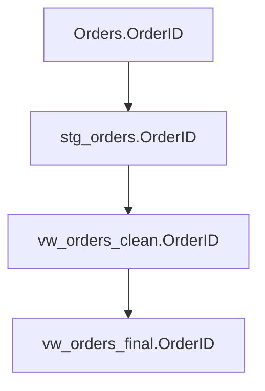
Plain: we follow the column across each step, so end-to-end lineage is clear.

Tip: use the impact command to see the full path (see `docs/cli_usage.md`).

#### Impact path example
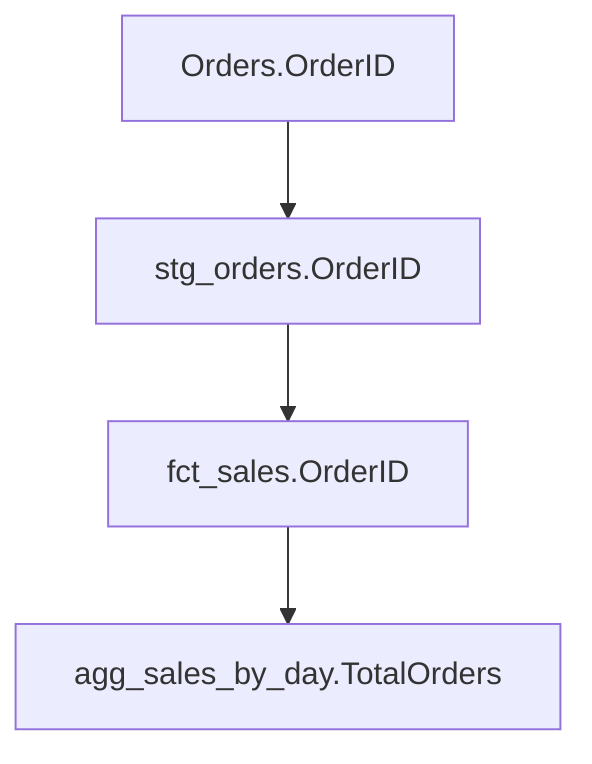

#### Build Your Own Exercise
Try this: Write a simple SQL like `SELECT id, name FROM students WHERE age > 18`. Draw arrows showing lineage for 'id' (direct from students.id, indirect from students.age because of the filter).

### See also
- `docs/overview.md`
- `docs/breaking_changes.md`
- `docs/cli_usage.md`
- `docs/openlineage_mapping.md` 