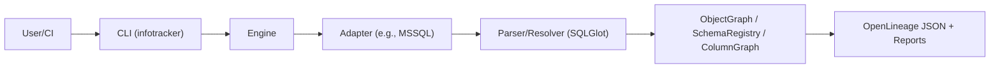

### Overview

#### Your quest begins here (a very serious adventure, but with snacks)
Welcome, brave data adventurer. InfoTracker is your enchanted compass through the SQL labyrinth. You’ll dodge UNION trolls, outsmart CAST goblins, and return with… column-level lineage. Glory awaits!

- What you’ll wield: a Python CLI, adaptable adapters, and a tidy bag of OpenLineage scrolls
- What you’ll slay: mystery schema breaks, spooky silent data drift, and duplication issues
- Loot: reliable impact analysis, clear diffs, and fewer late-night alerts

Pro tip: If something looks scary, it’s probably just an INNER JOIN in a cloak.

#### Plain version
This tool reads SQL files, builds column-level lineage (a map showing how data in one column comes from others), shows who depends on what, and warns about changes. First focus is MS SQL.

#### Audience & prerequisites
- Audience: data engineers, analytics engineers, platform engineers
- Prerequisites: basic SQL (like simple SELECT statements); comfortable with CLI and git; Python 3.10+

#### Not this
It does not run queries or optimize performance. It parses and explains.

InfoTracker is a Python CLI that extracts column-level lineage from SQL, performs impact analysis, detects breaking changes between branches, and is extensible via adapters. The first adapter targets MS SQL.

#### Goals
- Parse multiple SQL files and produce OpenLineage-compliant column lineage
- Upstream/downstream impact analysis from any `Table.Column`
- Breaking change detection (local vs branch, branch vs base)
- Extensible architecture (adapters per platform)
- Agentic workflow to iterate toward correctness using gold lineage files
- `pip install infotracker`

#### Feature highlights
- Extract lineage from T-SQL (MS SQL first)
- Impact analysis: upstream and downstream
- Breaking change detection with severity classification
- Adapters: pluggable; MSSQL included
- Deterministic outputs and JSON/logs for CI

#### Scope
- Input: SQL files (T-SQL initially), optional catalog metadata
- Output: OpenLineage JSON per object, CLI reports for impact/diff
- Non-goals (initial): runtime execution, query performance optimization 

### Objectives (detailed)
- Produce deterministic OpenLineage column-level lineage for provided SQL corpus. (Deterministic means the output is always the same for the same input.)
- Provide actionable impact analysis (upstream and downstream paths) for any `db.schema.object.column`. (Upstream: sources that feed into it; Downstream: what depends on it.)
- Detect and report breaking changes between branches with severity classification. (Breaking changes are edits that could cause errors downstream.)
- Design for adapter extensibility; MS SQL first, clean boundaries to add more engines. (Adapters handle different SQL types, like MS SQL.)

To achieve this:
1. Parse SQL files into a structure (AST).
2. Build graphs to show dependencies.
3. Resolve schemas and extract lineage.
4. Compare versions for changes.

### Deliverables
- Python package `infotracker` installable via pip
- CLI with `extract`, `impact`, `diff` commands
- Adapter interface + MS SQL adapter implementation
- Example corpus with passing lineage generation and regression tests
- Documentation (`docs/`) and quickstart examples

### Architecture at a glance

### Non-functional requirements
- Correctness over performance; prefer clear, testable code
- Idempotent CLI outputs; stable ordering for diffs
- Configurable logging, structured JSON outputs for CI
- Reasonable performance on 100–500 SQL files; cache where safe

### Constraints & assumptions
- Initial focus: T-SQL syntax subset used in examples
- Catalog metadata optional; schema inferred from DDL and resolved lineage
- Dynamic SQL not supported in v1; detect and warn
- Case-insensitive identifiers for MS SQL; preserve original casing in outputs

#### Limitations (v1)
- Dynamic SQL not supported (warn and skip)
- Partial T-SQL syntax coverage per examples
- No runtime execution or query performance tuning
- External catalog optional; unknown schemas produce warnings

### Success criteria
- All example SQL produce lineage matching the gold JSON exactly
- Impact queries return correct column paths for test selectors
- Diff identifies intentional breaking edits in the examples
- CI runs green on changes within `examples/warehouse/{sql,lineage}`

### Milestones
1. Parse + object graph + simple views
2. Star expansion + joins + aggregations
3. Temp tables + SELECT INTO + variables
4. Impact analysis graph
5. Diff and severity classification
6. Packaging, docs, and CI

### Risks and mitigations
- SQL dialect drift: constrain scope; add targeted test cases
- Over-fitting to examples: diversify edge cases; document limitations
- Ambiguity in lineage: adopt conservative rules and emit warnings with locations

#### Glossary
- OpenLineage: A standard format for describing data lineage.
- Lineage: How data flows from sources to outputs.
- Adapter: A module that handles specific SQL dialects.

### See also
- `docs/lineage_concepts.md`
- `docs/cli_usage.md`
- `docs/breaking_changes.md`
- `docs/architecture.md`
- `docs/configuration.md`
- `docs/openlineage_mapping.md`
- `docs/dbt_integration.md`