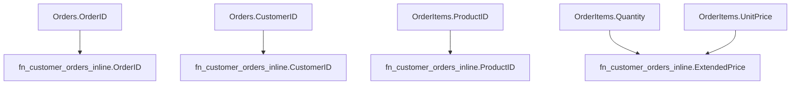
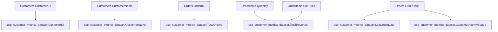
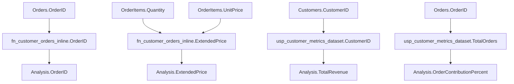

# Advanced Use Cases: Tabular Functions and Procedures

## Overview
This document covers advanced SQL patterns that extend beyond basic views and procedures. These patterns are important for lineage analysis because they represent reusable transformation layers that can be used as inputs to other operations.

## Use Case 1: Parametrized Tabular Functions

### What are Tabular Functions?
Tabular functions are SQL Server objects that accept parameters and return table result sets. They behave like parameterized views and can be used in JOINs, subqueries, and other SQL operations.

### Two Syntax Variants

#### 1. Inline Table-Valued Function (RETURN AS)
```sql
CREATE FUNCTION dbo.fn_customer_orders_inline
(
    @CustomerID INT,
    @StartDate DATE,
    @EndDate DATE
)
RETURNS TABLE
AS
RETURN
(
    SELECT
        o.OrderID,
        o.CustomerID,
        o.OrderDate,
        oi.ProductID,
        CAST(oi.Quantity * oi.UnitPrice AS DECIMAL(18,2)) AS ExtendedPrice
    FROM dbo.Orders AS o
    INNER JOIN dbo.OrderItems AS oi ON o.OrderID = oi.OrderID
    WHERE o.CustomerID = @CustomerID
      AND o.OrderDate BETWEEN @StartDate AND @EndDate
);
```

**Characteristics:**
- Single SELECT statement
- Optimized by query optimizer
- Inlined into calling query for better performance
- Parameters control data scope

#### 2. Multi-Statement Table-Valued Function (RETURN TABLE)
```sql
CREATE FUNCTION dbo.fn_customer_orders_mstvf
(
    @CustomerID INT,
    @StartDate DATE,
    @EndDate DATE
)
RETURNS @Result TABLE
(
    OrderID INT,
    CustomerID INT,
    OrderDate DATE,
    ProductID INT,
    ExtendedPrice DECIMAL(18,2),
    DaysSinceOrder INT
)
AS
BEGIN
    INSERT INTO @Result
    SELECT
        o.OrderID,
        o.CustomerID,
        o.OrderDate,
        oi.ProductID,
        CAST(oi.Quantity * oi.UnitPrice AS DECIMAL(18,2)) AS ExtendedPrice,
        DATEDIFF(DAY, o.OrderDate, GETDATE()) AS DaysSinceOrder
    FROM dbo.Orders AS o
    INNER JOIN dbo.OrderItems AS oi ON o.OrderID = oi.OrderID
    WHERE o.CustomerID = @CustomerID
      AND o.OrderDate BETWEEN @StartDate AND @EndDate;
    
    RETURN;
END;
```

**Characteristics:**
- Multiple statements possible
- Table variable for intermediate results
- More complex logic and calculations
- Better for complex business rules

### Lineage Analysis for Tabular Functions
Tabular functions are treated as view-like objects in lineage analysis:



**Key Points:**
- Function parameters affect filtering but don't create columns
- Output columns show lineage to source table columns
- Computed columns (like ExtendedPrice) show lineage to multiple inputs
- Functions can be used as inputs to other operations

## Use Case 2: Procedures Returning Datasets

### What are Dataset-Returning Procedures?
These are stored procedures that perform calculations and end with a SELECT statement that returns data. The results can be captured into temp tables for further processing.

### Example Procedure
```sql
CREATE PROCEDURE dbo.usp_customer_metrics_dataset
    @CustomerID INT = NULL,
    @StartDate DATE = NULL,
    @EndDate DATE = NULL,
    @IncludeInactive BIT = 0
AS
BEGIN
    SET NOCOUNT ON;
    
    -- Set default parameters if not provided
    IF @StartDate IS NULL SET @StartDate = DATEADD(MONTH, -3, GETDATE());
    IF @EndDate IS NULL SET @EndDate = GETDATE();
    
    -- Main calculation query that returns the dataset
    SELECT
        c.CustomerID,
        c.CustomerName,
        COUNT(DISTINCT o.OrderID) AS TotalOrders,
        SUM(oi.Quantity * oi.UnitPrice) AS TotalRevenue,
        MAX(o.OrderDate) AS LastOrderDate,
        CASE 
            WHEN MAX(o.OrderDate) >= DATEADD(MONTH, -1, GETDATE()) THEN 'Active'
            WHEN MAX(o.OrderDate) >= DATEADD(MONTH, -3, GETDATE()) THEN 'Recent'
            ELSE 'Inactive'
        END AS CustomerActivityStatus
    FROM dbo.Customers AS c
    LEFT JOIN dbo.Orders AS o ON c.CustomerID = o.CustomerID
    LEFT JOIN dbo.OrderItems AS oi ON o.OrderID = oi.OrderID
    WHERE (@CustomerID IS NULL OR c.CustomerID = @CustomerID)
      AND (@IncludeInactive = 1 OR c.IsActive = 1)
      AND (o.OrderDate IS NULL OR o.OrderDate BETWEEN @StartDate AND @EndDate)
    GROUP BY c.CustomerID, c.CustomerName
    HAVING COUNT(DISTINCT o.OrderID) > 0
    ORDER BY TotalRevenue DESC;
END;
```

**Characteristics:**
- Ends with a single SELECT statement
- Parameters control data scope and filtering
- Complex calculations and aggregations
- Results can be captured for further processing

### Usage Patterns

#### 1. EXEC into Temp Table
```sql
-- Create temp table to capture procedure output
IF OBJECT_ID('tempdb..#customer_metrics') IS NOT NULL 
    DROP TABLE #customer_metrics;

-- Execute procedure and capture results into temp table
INSERT INTO #customer_metrics
EXEC dbo.usp_customer_metrics_dataset 
    @CustomerID = NULL,
    @StartDate = '2024-01-01',
    @EndDate = '2024-12-31',
    @IncludeInactive = 0;
```

#### 2. Further Processing
```sql
-- Use the temp table for downstream operations
SELECT 
    cm.*,
    CASE 
        WHEN cm.TotalRevenue >= 10000 THEN 'High Value'
        WHEN cm.TotalRevenue >= 5000 THEN 'Medium Value'
        ELSE 'Standard'
    END AS CustomerTier
FROM #customer_metrics AS cm
WHERE cm.CustomerActivityStatus IN ('Active', 'Recent');
```

#### 3. Insert into Permanent Table
```sql
-- Archive procedure results
INSERT INTO dbo.customer_metrics_archive (
    ArchiveDate, CustomerID, CustomerName, TotalOrders, TotalRevenue
)
SELECT 
    GETDATE(),
    cm.*
FROM #customer_metrics AS cm;
```

### Lineage Analysis for Dataset Procedures
Procedures that return datasets are treated as view-like objects:



**Key Points:**
- Procedure output columns show lineage to source tables
- Aggregated columns show lineage to source columns used in aggregation
- Computed columns show lineage to multiple inputs
- Procedure can become an input to other operations via temp tables

## Combined Workflow Example

### End-to-End Lineage
```sql
-- Step 1: Use tabular function
SELECT f.*, p.Category 
FROM dbo.fn_customer_orders_inline(1, '2024-01-01', '2024-12-31') AS f
INNER JOIN dbo.Products AS p ON f.ProductID = p.ProductID;

-- Step 2: Use procedure output
INSERT INTO #customer_metrics
EXEC dbo.usp_customer_metrics_dataset @CustomerID = 1;

-- Step 3: Combine both for analysis
SELECT 
    f.CustomerID,
    f.OrderID,
    f.ExtendedPrice,
    cm.TotalRevenue,
    CAST(f.ExtendedPrice / NULLIF(cm.TotalRevenue, 0) * 100 AS DECIMAL(5,2)) AS OrderContributionPercent
FROM dbo.fn_customer_orders_inline(1, '2024-01-01', '2024-12-31') AS f
INNER JOIN #customer_metrics AS cm ON f.CustomerID = cm.CustomerID;
```

### Lineage Chain


## Implementation Considerations

### For Lineage Extraction
1. **Function Detection**: Identify `CREATE FUNCTION` statements with `RETURNS TABLE`
2. **Procedure Detection**: Identify `CREATE PROCEDURE` statements ending with `SELECT`
3. **Parameter Handling**: Track parameters that affect filtering but don't create columns
4. **Output Schema**: Extract column definitions from function returns or procedure SELECT
5. **Dependency Mapping**: Map output columns to source table columns

### For Impact Analysis
1. **Function Usage**: Track where tabular functions are used as inputs
2. **Procedure Results**: Track where procedure outputs are captured and used
3. **Temp Table Lifecycle**: Understand temp table creation, population, and usage
4. **Downstream Effects**: Follow lineage from functions/procedures to final targets

### Testing Scenarios
1. **Parameter Variations**: Test functions with different parameter values
2. **Complex Calculations**: Verify lineage for multi-step computations
3. **Temp Table Workflows**: Test EXEC into temp table patterns
4. **Combined Usage**: Test functions and procedures used together
5. **Edge Cases**: Test with NULL parameters, empty results, etc.

## Best Practices

### For Developers
1. **Clear Naming**: Use descriptive names for functions and procedures
2. **Parameter Validation**: Validate input parameters early
3. **Consistent Output**: Maintain consistent column structure
4. **Documentation**: Document parameter effects and return values

### For Lineage Analysis
1. **Schema Tracking**: Track function and procedure schemas
2. **Parameter Impact**: Understand how parameters affect lineage
3. **Temp Table Handling**: Properly track temp table creation and usage
4. **Performance Considerations**: Be aware of function inlining and optimization

## Conclusion
Tabular functions and dataset-returning procedures represent powerful patterns for creating reusable transformation layers. They extend the lineage analysis beyond simple views and tables, requiring careful handling of parameters, computed columns, and complex workflows. Proper implementation of these patterns enables comprehensive data lineage tracking across modern SQL Server environments.
