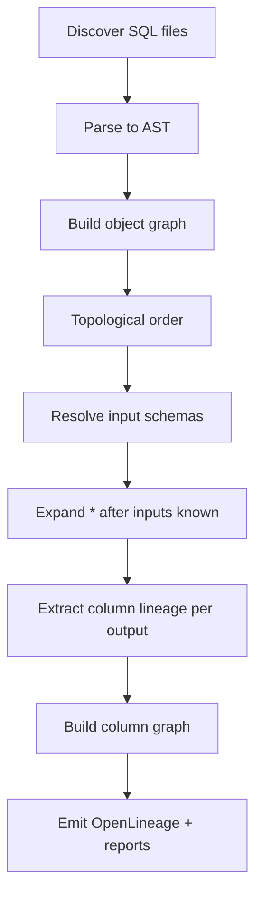

### High-level algorithm

#### Map the labyrinth (bring string, not MINUS)
To escape the SQL maze, you’ll build maps: object graphs, schemas, and column lineage webs. One step at a time, no special math needed.

- Scout terrain: parse files → objects → dependencies
- Place torches: resolve schemas, expand stars where safe
- Trace footprints: build column graph for impact and diff

If you see a star `*`, don’t panic—just expand it after you know what’s upstream.

Plain: compute inputs first, then dependents (this is topological sort).

#### Audience & prerequisites
- Audience: data engineers, analytics engineers, platform engineers

- Prerequisites: basic SQL; comfortable with CLI and git; Python 3.10+; AST familiarity helpful but optional (AST is Abstract Syntax Tree: a breakdown of code structure).

1. Discover SQL assets and parse to AST (normalize identifiers)
2. Build object-level dependency graph (views, CTEs, procs/temp tables)
3. Resolve schemas topologically; expand `*` after inputs known
4. Extract column-level lineage per output column expression
5. Build bidirectional column graph for impact analysis
6. Detect breaking changes by diffing base vs head graphs/schemas/expressions
7. Output OpenLineage JSON + CLI reports 

### Data structures
- ObjectGraph: nodes = objects {name, type, statements}, edges = dependencies
- SchemaRegistry: map object -> [columns {name, type, nullable, ordinal}]
- ColumnGraph: nodes = fully qualified columns, edges = lineage relations

### Pseudocode (high-level)
```
files = load_sql(dir)
objects = parse(files)            # AST per object
objGraph = build_object_graph(objects)
order = topo_sort(objGraph)
for obj in order:
  schema_in = schemas_of_inputs(obj)
  schema_out, lineage = resolve(obj.AST, schema_in)
  SchemaRegistry[obj] = schema_out
  ColumnGraph.add(lineage)
```

### Resolve() essentials
- Name resolution: qualify identifiers using input schemas and aliases
- Star expansion: replace `*` with ordered columns from the resolved input
- Expression lineage: walk AST; collect input column refs per output column
- Type/nullable inference: derive from operations (e.g., CAST types, SUM numeric, CASE nullability = union of branches)
- Join semantics: track how join type affects nullability of columns
- Set ops: ensure column counts/types align; union lineage inputs

### Type/nullable rules (examples)
- `CAST(x AS T)` → type T
- `a + b` → numeric promotion; nullable if a or b nullable
- `CASE WHEN p THEN x ELSE y` → type = LUB(type(x), type(y)); nullable if either branch nullable or no ELSE
- `SUM(x)` → numeric; nullable unless GROUP present and engine semantics dictate otherwise

### Error handling and diagnostics
- On unresolved identifiers: record error with location; skip column lineage for affected outputs
- On unsupported syntax: emit warning; continue best-effort resolution
- Deterministic ordering of outputs and diagnostics for stable diffs
- Don’t crash the whole run for one bad file; continue and report

### Performance notes
- Cache parsed ASTs and resolved schemas by file hash
- Short-circuit lineage for unchanged objects between branches 

### Impact search (recursive)
- Upstream: walk edges from selected column to its input columns until sources are reached
- Downstream: walk edges from selected column to outputs until targets are reached
- Stop conditions: max-depth (if given), visited-set to avoid cycles 

### Flowchart


### Star expansion worked example
```sql
CREATE VIEW dbo.vw_orders_all_enriched AS
SELECT o.*, c.Region
FROM dbo.Orders o
JOIN dbo.Customers c ON o.CustomerID = c.CustomerID;
```
- Resolve `Orders` and `Customers` schemas first
- Expand `o.*` by ordinal from `Orders`; append `Region`
- Track nullability impact from the JOIN type

### Determinism requirements
- Deterministic output column ordering and schema serialization
- Deterministic diagnostics (stable file/line ordering)
- Stable JSON field ordering to make diffs meaningful 

### Simple Example Walkthrough
Take this SQL: `SELECT id AS student_id FROM students;`

1. Parse to AST: Break into parts like 'SELECT', 'id', 'AS student_id'.
2. Build object graph: Note dependency on 'students'.
3. Resolve schemas: Output has 'student_id' from 'students.id'.
4. Extract lineage: student_id comes from students.id. 