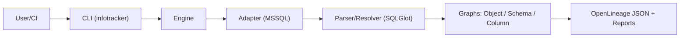
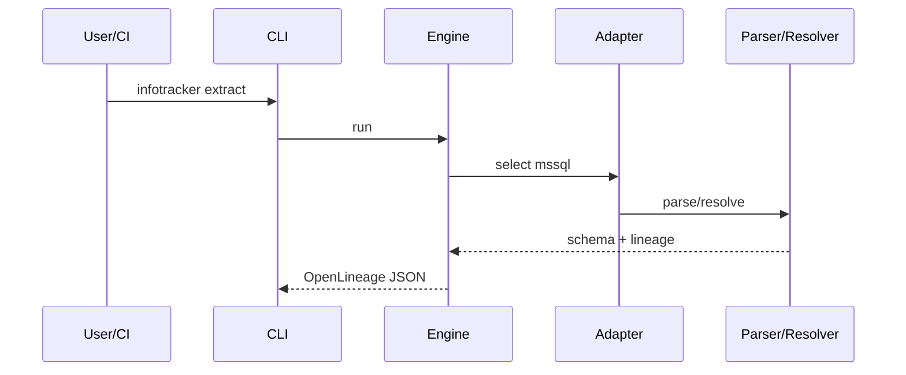

### Architecture

#### System diagram

#### Extract sequence

#### Components
- CLI: argument parsing, command dispatch, IO
- Engine: orchestration, graph building, diffing
- Adapter: dialect-specific parsing, qualification, resolution
- Parser/Resolver: AST, schema inference, lineage extraction
- Outputs: OpenLineage payloads, text/JSON reports 