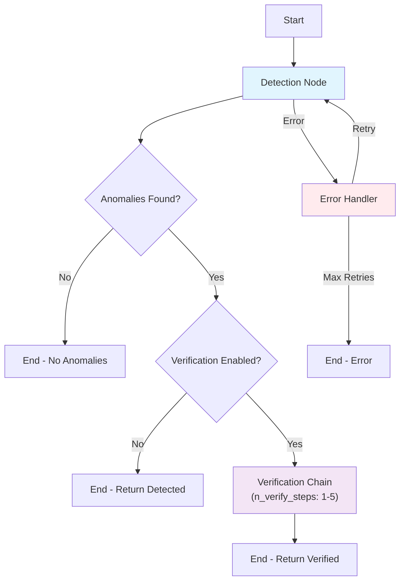

# Anomaly Agent

[](https://codespaces.new/andrewm4894/anomaly-agent)
[](https://github.com/pre-commit/pre-commit)
[](https://github.com/andrewm4894/anomaly-agent/actions/workflows/tests.yml)
[](https://codecov.io/gh/andrewm4894/anomaly-agent)

<a target="_blank" href="https://pypi.org/project/anomaly-agent">
  
</a>
<a target="_blank" href="https://pypi.org/project/anomaly-agent">
  
</a>
<a target="_blank" href="https://pypi.org/project/anomaly-agent">
  
</a>
<a target="_blank" href="https://pypi.org/project/anomaly-agent">
  
</a>
<a target="_blank" href="https://colab.research.google.com/github/andrewm4894/anomaly-agent/blob/main/notebooks/examples.ipynb">
  
</a>

A Python package for detecting anomalies in time series data using Large Language Models.

## How It Works

The AnomalyAgent uses a LangGraph-based state machine to orchestrate anomaly detection and verification workflows:



**Key Components:**
- **Detection Node**: Analyzes time series data to identify potential anomalies using LLM
- **Verification Node(s)**: Re-examines detected anomalies through multiple rounds to reduce false positives
- **Error Handler**: Manages retries and failure scenarios with exponential backoff
- **Graph Caching**: Reuses compiled graphs across agents with same configuration for efficiency

## Installation

```bash
pip install anomaly-agent
```

## Usage

See the [examples.ipynb](https://github.com/andrewm4894/anomaly-agent/tree/main/notebooks/examples.ipynb) notebook for some usage examples.

```python
import os
from anomaly_agent.utils import make_df, make_anomaly_config
from anomaly_agent.plot import plot_df
from anomaly_agent import AnomalyAgent

# set openai api key if not in environment
# os.environ['OPENAI_API_KEY'] = "<your-openai-api-key>"

# get anomaly config to generate some dummy data
anomaly_cfg = make_anomaly_config()
print(anomaly_cfg)

# generate some dummy data
df = make_df(100, 3, anomaly_config=anomaly_cfg)
df.head()

# create anomaly agent (uses cost-optimized gpt-5-nano by default)
anomaly_agent = AnomalyAgent()

# detect anomalies
anomalies = anomaly_agent.detect_anomalies(df)

# print anomalies
print(anomalies)
```

```json
{
  "var1":"AnomalyList(anomalies="[
    "Anomaly(timestamp=""2020-02-05",
    variable_value=3.279153,
    "anomaly_description=""Abrupt spike in value, significantly higher than previous observations."")",
    "Anomaly(timestamp=""2020-02-15",
    variable_value=5.001551,
    "anomaly_description=""Abrupt spike in value, significantly higher than previous observations."")",
    "Anomaly(timestamp=""2020-02-20",
    variable_value=3.526827,
    "anomaly_description=""Abrupt spike in value, significantly higher than previous observations."")",
    "Anomaly(timestamp=""2020-03-23",
    variable_value=3.735584,
    "anomaly_description=""Abrupt spike in value, significantly higher than previous observations."")",
    "Anomaly(timestamp=""2020-04-05",
    variable_value=8.207361,
    "anomaly_description=""Abrupt spike in value, significantly higher than previous observations."")",
    "Anomaly(timestamp=""2020-02-06",
    variable_value=0.0,
    "anomaly_description=""Missing value (NaN) detected."")",
    "Anomaly(timestamp=""2020-02-24",
    variable_value=0.0,
    "anomaly_description=""Missing value (NaN) detected."")",
    "Anomaly(timestamp=""2020-04-09",
    variable_value=0.0,
    "anomaly_description=""Missing value (NaN) detected."")"
  ]")",
  "var2":"AnomalyList(anomalies="[
    "Anomaly(timestamp=""2020-01-27",
    variable_value=3.438903,
    "anomaly_description=""Significantly high spike compared to previous values."")",
    "Anomaly(timestamp=""2020-02-15",
    variable_value=3.374155,
    "anomaly_description=""Significantly high spike compared to previous values."")",
    "Anomaly(timestamp=""2020-02-29",
    variable_value=3.194132,
    "anomaly_description=""Significantly high spike compared to previous values."")",
    "Anomaly(timestamp=""2020-03-03",
    variable_value=3.401919,
    "anomaly_description=""Significantly high spike compared to previous values."")"
  ]")",
  "var3":"AnomalyList(anomalies="[
    "Anomaly(timestamp=""2020-01-15",
    variable_value=4.116716,
    "anomaly_description=""Significantly higher value compared to previous days."")",
    "Anomaly(timestamp=""2020-02-15",
    variable_value=2.418594,
    "anomaly_description=""Unusually high value than expected."")",
    "Anomaly(timestamp=""2020-02-29",
    variable_value=0.279798,
    "anomaly_description=""Lower than expected value in the series."")",
    "Anomaly(timestamp=""2020-03-29",
    variable_value=8.016581,
    "anomaly_description=""Extremely high value deviating from the norm."")",
    "Anomaly(timestamp=""2020-04-07",
    variable_value=7.609766,
    "anomaly_description=""Another extreme spike in value."")"
  ]")"
}
```

```python
# get anomalies in long format
df_anomalies_long = anomaly_agent.get_anomalies_df(anomalies)
df_anomalies_long.head()
```

```
	timestamp	variable_name	value	anomaly_description
0	2020-02-05	var1	3.279153	Abrupt spike in value, significantly higher th...
1	2020-02-15	var1	5.001551	Abrupt spike in value, significantly higher th...
2	2020-02-20	var1	3.526827	Abrupt spike in value, significantly higher th...
3	2020-03-23	var1	3.735584	Abrupt spike in value, significantly higher th...
4	2020-04-05	var1	8.207361	Abrupt spike in value, significantly higher th...
```

## Advanced Features

### Debug Mode

Enable debug mode to get detailed logging of the anomaly detection process:

```python
from anomaly_agent import AnomalyAgent

# Create agent with debug mode enabled
agent = AnomalyAgent(debug=True)

# Run detection - you'll see detailed logs
anomalies = agent.detect_anomalies(df)
```

This will show detailed information about:
- Column processing stages
- Node execution timing
- Anomaly detection results
- Verification filtering
- Graph transitions

### Custom Model Selection

Choose different GPT-5 models based on your needs:

```python
# Cost-optimized (default)
agent = AnomalyAgent(model_name="gpt-5-nano")  # ~$0.05/$0.40 per 1M tokens

# Balanced performance  
agent = AnomalyAgent(model_name="gpt-5-mini")  # ~$0.25/$2.00 per 1M tokens

# Premium reasoning
agent = AnomalyAgent(model_name="gpt-5")       # ~$1.25/$10.00 per 1M tokens
```

### Advanced Configuration

```python
from anomaly_agent import AnomalyAgent

agent = AnomalyAgent(
    model_name="gpt-5-nano",
    verify_anomalies=True,        # Enable/disable verification step
    n_verify_steps=2,            # Number of verification rounds (1-5)
    max_retries=3,               # Configure retry behavior
    timeout_seconds=300,         # Set operation timeout
    debug=True                   # Enable detailed logging
)
```

### Multiple Verification Steps

Improve detection accuracy by running multiple verification rounds to reduce false positives:

```python
# Single verification (default, fastest)
agent_single = AnomalyAgent(n_verify_steps=1)

# Double verification (good balance for production)
agent_double = AnomalyAgent(n_verify_steps=2)  

# Triple verification (maximum confidence)
agent_triple = AnomalyAgent(n_verify_steps=3)

# Runtime override
anomalies = agent_single.detect_anomalies(df, n_verify_steps=4)
```

**Benefits:**
- **Reduced false positives** through multiple LLM evaluations
- **Better consistency** due to stochastic nature of LLMs  
- **Configurable trade-off** between accuracy and cost
- **Detailed metadata** tracking for each verification step

**Performance considerations:**
- `n_verify_steps=1`: Fastest, standard accuracy
- `n_verify_steps=2`: 2x verification cost, good production balance
- `n_verify_steps=3+`: Higher cost, maximum confidence for critical applications

### Streaming and Parallel Processing

Enhanced user experience and performance for multiple time series variables:

```python
# Real-time streaming with progress updates
def progress_handler(column, event, data):
    if event == "start":
        print(f"🔍 Starting {column}")
    elif event == "column_complete":
        print(f"✅ {column}: {data['anomaly_count']} anomalies")

anomalies = agent.detect_anomalies_streaming(df, progress_callback=progress_handler)

# Parallel processing for faster execution
import asyncio

async def detect_parallel():
    anomalies = await agent.detect_anomalies_parallel(
        df, 
        max_concurrent=3,  # Process up to 3 columns simultaneously
        progress_callback=progress_handler
    )
    return anomalies

results = asyncio.run(detect_parallel())

# Async streaming for responsive applications
async def process_with_streaming():
    async for event in agent.detect_anomalies_streaming_async(df):
        if event["event"] == "result":
            print(f"Column {event['column']}: {event['data']['anomaly_count']} anomalies")

asyncio.run(process_with_streaming())
```

**Key Features:**
- **Real-time Progress**: Stream updates as each detection step completes
- **Parallel Execution**: Process multiple time series variables concurrently
- **Configurable Concurrency**: Control resource usage with `max_concurrent` parameter
- **Error Resilience**: Graceful handling of failures in parallel execution
- **Performance Monitoring**: Built-in timing and progress metrics

**Use Cases:**
- **Streaming**: Interactive dashboards, real-time monitoring, user feedback
- **Parallel**: Batch processing, large datasets, performance-critical applications  
- **Async Streaming**: Web applications, reactive UIs, progressive data loading

### Custom Prompts

Customize the detection and verification prompts for domain-specific analysis:

```python
custom_detection_prompt = """
You are a financial analyst specializing in market anomaly detection.
Focus on detecting price movements that exceed normal volatility ranges...
"""

agent = AnomalyAgent(
    detection_prompt=custom_detection_prompt,
    verification_prompt=custom_verification_prompt
)
```

### Architecture Components

For advanced users, you can access the underlying components:

```python
from anomaly_agent import (
    AnomalyAgent, 
    GraphManager,           # Graph caching and management
    DetectionNode,          # Anomaly detection node
    VerificationNode,       # Anomaly verification node
    ErrorHandlerNode,       # Error handling and retry logic
    AgentConfig,            # Configuration models
    AgentState              # State management
)
```
