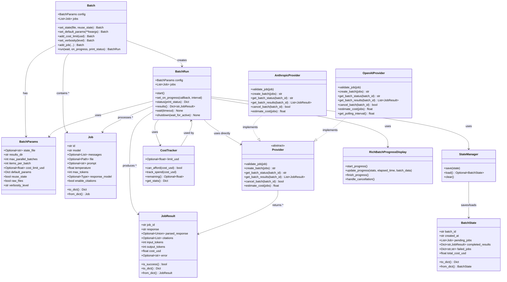

# Development Guide

## Architecture Overview



### Key Design Patterns

- **Builder Pattern**: `Batch` provides fluent interface for configuration
- **Provider Pattern**: Abstract provider interface for different AI services (Anthropic, OpenAI)  
- **Synchronous Processing**: `BatchRun` processes jobs in batches synchronously
- **State Persistence**: Automatic saving/resuming via `StateManager`
- **Cost Control**: Built-in cost tracking and limits via `CostTracker`

## Running Tests

Tests require API keys for providers since some tests make real API calls.

```bash
# Install dependencies
uv sync --dev

# Set API keys
export ANTHROPIC_API_KEY="your-api-key"
export OPENAI_API_KEY="your-api-key"

# Run all tests (parallel)
uv run pytest -v -n auto 

# Run a specific test file
uv run pytest tests/test_ai_batch.py

# Run a specific test
uv run pytest tests/test_ai_batch.py::test_batch_empty_messages
```

## Documentation Generation

Generate API documentation using pdoc:

```bash
# Generate docs (run on each version)
uv run pdoc -o docs/ batchata
```

## Releasing a New Version

```bash
# One-liner to update version, commit, push, and release
VERSION=0.0.2 && \
sed -i '' "s/version = \".*\"/version = \"$VERSION\"/" pyproject.toml && \
uv run pdoc -o docs/ batchata && \
git add pyproject.toml docs/ && \
git commit -m "Bump version to $VERSION" && \
git push && \
gh release create v$VERSION --title "v$VERSION" --generate-notes
```

## GitHub Secrets Setup

For tests to run in GitHub Actions, add your API keys as secrets:
1. Go to Settings → Secrets and variables → Actions
2. Add secrets: `ANTHROPIC_API_KEY`, `OPENAI_API_KEY`

## Debug Files Structure

When `raw_files=True` (default), debug files are saved to help with troubleshooting:

```
results_dir/
├── raw_files/
│   ├── requests/        # Batch request files
│   │   ├── anthropic_batch_{id}.json      # Anthropic requests (JSON)
│   │   └── openai_batch_{id}.jsonl        # OpenAI requests (JSONL)
│   └── responses/       # Batch response files
│       ├── anthropic_batch_{id}.json      # Anthropic responses (JSON)
│       ├── openai_batch_{id}.jsonl        # OpenAI responses (JSONL)
│       └── {job_id}_raw.json              # Individual job responses
└── [job results]        # Processed JobResult files
```

## Provider-Specific Features

### Anthropic Provider
- **Polling Interval**: 1 second
- **Citations**: Full citation support with page mapping
- **Batch Format**: Native Anthropic batch API
- **File Support**: PDFs, images with text extraction validation

### OpenAI Provider  
- **Polling Interval**: 5 seconds (avoids Cloudflare rate limiting)
- **Citations**: Not supported
- **Batch Format**: JSONL file upload to batch API
- **File Support**: PDFs, images with base64 encoding