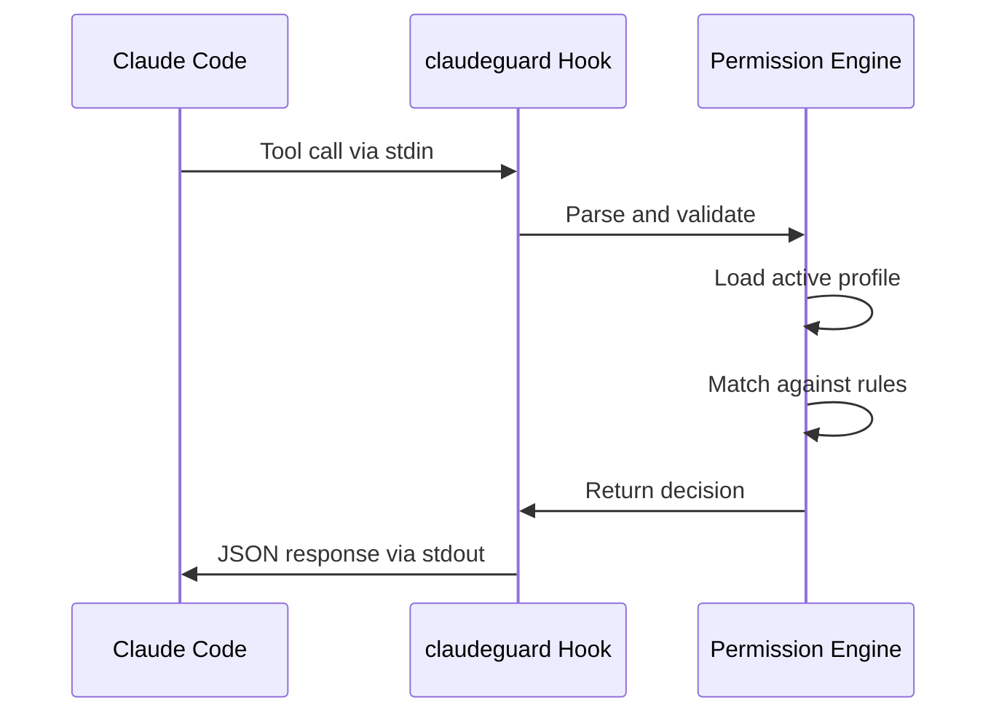

# Architecture Overview

claudeguard implements a comprehensive security layer for Claude Code through intelligent pattern matching and hook-based permission interception.

## System Architecture

```
┌─────────────────┐    ┌─────────────────┐    ┌─────────────────┐
│  Claude Code    │    │    claudeguard      │    │   User Project  │
│                 │    │                 │    │                 │
│  ┌───────────┐  │    │  ┌───────────┐  │    │  ┌───────────┐  │
│  │ Tool Call │──┼────┼──│ Hook      │  │    │  │ Profiles  │  │
│  └───────────┘  │    │  └───────────┘  │    │  └───────────┘  │
│                 │    │        │        │    │                 │
│  ┌───────────┐  │    │  ┌───────────┐  │    │  ┌───────────┐  │
│  │ Settings  │──┼────┼──│ CLI       │  │    │  │ Audit Log│  │
│  └───────────┘  │    │  └───────────┘  │    │  └───────────┘  │
└─────────────────┘    └─────────────────┘    └─────────────────┘
```

## Core Components

### 1. Hook System (`hook.py`)
**Role**: Intercepts Claude Code tool calls before execution
**Integration**: Claude Code `permissionDecision` hook
**Communication**: JSON-based stdin/stdout protocol

### 2. Permission Engine (`permission_decision.py`)
**Role**: Makes security decisions based on rules and patterns
**Input**: Tool calls with parameters
**Output**: `allow`, `ask`, or `deny` decisions

### 3. Pattern Matcher (`pattern_matcher.py`)
**Role**: Matches tool calls against security rule patterns
**Algorithms**: Glob, regex, and MCP-specific matching
**Security**: DoS protection and input validation

### 4. Profile System (`profile_loader.py`, `models.py`)
**Role**: Loads and manages security rule collections
**Storage**: YAML files in `.claudeguard/profiles/`
**Hierarchy**: Project → Home → Built-in defaults

### 5. CLI Interface (`cli.py`)
**Role**: User interaction and profile management
**Framework**: Click-based professional CLI
**Functions**: Install, status, profile management

## Design Patterns

### Strategy Pattern - Resource Matching
```python
class ResourceMatcher(ABC):
    @abstractmethod
    def matches(self, pattern: str, resource: str) -> bool:
        pass

class GlobResourceMatcher(ResourceMatcher):
    # Glob pattern matching implementation

class RegexResourceMatcher(ResourceMatcher):
    # Regex pattern matching with security

class McpResourceMatcher(ResourceMatcher):
    # MCP tool-specific matching
```

### Chain of Responsibility - Rule Processing
```python
def evaluate_rules(tool_call: ToolCall, rules: tuple[ProfileRule, ...]) -> MatchResult:
    """Process rules in order until first match"""
    for rule in rules:
        if matches_pattern(tool_call, rule.pattern):
            return MatchResult(action=rule.action, rule=rule)
    return MatchResult(action="ask", rule=None)  # Default fallback
```

### Immutable Data - Thread Safety
```python
@dataclass(frozen=True)
class Profile:
    metadata: ProfileMetadata
    rules: tuple[ProfileRule, ...]  # Immutable collection

@dataclass(frozen=True)
class ProfileRule:
    pattern: str
    action: Literal["allow", "ask", "deny"]
    comment: str = ""
```

### Fail-Safe Architecture
Every component defaults to secure behavior on errors:
- Unknown patterns → `ask`
- Missing profiles → built-in defaults
- Processing errors → `ask`
- Timeout errors → `ask`

## Data Flow

### 1. Tool Call Interception


### 2. Profile Loading Hierarchy
```python
def load_active_profile() -> Profile:
    """Load profile with fallback hierarchy"""

    # 1. Project-specific profile
    if project_profile := load_project_profile():
        return project_profile

    # 2. Home directory profile
    if home_profile := load_home_profile():
        return home_profile

    # 3. Built-in default
    return create_default_profile()
```

### 3. Pattern Matching Pipeline
```python
def matches_pattern(tool_call: ToolCall, pattern: str) -> bool:
    """Multi-stage pattern matching"""

    # 1. Extract relevant resource from tool call
    resource = extract_resource(tool_call)

    # 2. Choose appropriate matcher
    matcher = select_matcher(pattern)

    # 3. Perform matching with security checks
    return matcher.matches(pattern, resource)
```

## Security Architecture

### Defense in Depth

1. **Input Validation**
   - Tool call parameter validation
   - Pattern syntax validation
   - File path traversal protection

2. **Process Isolation**
   - Hook runs in separate process
   - Timeout protection (30 seconds)
   - Resource limits

3. **Error Sanitization**
   - No sensitive data in error messages
   - Controlled error propagation
   - Audit trail of all decisions

4. **Fail-Safe Defaults**
   - Errors default to "ask"
   - Missing profiles use safe defaults
   - Invalid patterns are rejected

### Regex DoS Protection
```python
class RegexResourceMatcher:
    MAX_PATTERN_LENGTH = 1000
    MAX_QUANTIFIERS = 20
    TIMEOUT_SECONDS = 0.1

    def is_safe_pattern(self, pattern: str) -> bool:
        """Validate regex pattern for security"""
        if len(pattern) > self.MAX_PATTERN_LENGTH:
            return False

        quantifier_count = pattern.count("*") + pattern.count("+")
        if quantifier_count > self.MAX_QUANTIFIERS:
            return False

        # Check for dangerous patterns
        if ".*.*" in pattern or ".+.+" in pattern:
            return False

        return True
```

### Path Traversal Protection
```python
def extract_file_path(tool_input: dict) -> str:
    """Safely extract file path from tool input"""
    path = tool_input.get("file_path", "")

    # Resolve to absolute path
    resolved = Path(path).resolve()

    # Validate within project bounds
    if not is_safe_path(resolved):
        raise SecurityError(f"Unsafe path: {path}")

    return str(resolved)
```

## Performance Considerations

### Pattern Matching Optimization

1. **Early Exit Strategy**
   - First matching rule stops processing
   - Universal patterns (`*`) short-circuit

2. **Compiled Pattern Caching**
   ```python
   class RegexResourceMatcher:
       _compiled_patterns: dict[str, Pattern] = {}

       def get_compiled_pattern(self, pattern: str) -> Pattern:
           if pattern not in self._compiled_patterns:
               self._compiled_patterns[pattern] = re.compile(pattern)
           return self._compiled_patterns[pattern]
   ```

3. **Efficient Directory Matching**
   ```python
   def matches_directory_pattern(pattern: str, path: str) -> bool:
       """Optimized matching for src/** patterns"""
       if "**" in pattern:
           base_dir = pattern.split("**")[0]
           return path.startswith(base_dir)
       return fnmatch.fnmatch(path, pattern)
   ```

4. **Memory Efficiency**
   - Immutable data structures prevent memory leaks
   - Tuple usage instead of lists for rules
   - Lazy loading of profiles

### I/O Optimization
- Minimal file system operations
- Efficient YAML parsing
- Atomic file operations
- Profile loading caching

## Extensibility Points

### 1. New Resource Matchers
```python
class CustomResourceMatcher(ResourceMatcher):
    """Example: Database query pattern matching"""

    def matches(self, pattern: str, resource: str) -> bool:
        # Custom matching logic for database operations
        return custom_db_pattern_logic(pattern, resource)

# Register in pattern matcher
RESOURCE_MATCHERS.append(CustomResourceMatcher())
```

### 2. New Tool Support
```python
def extract_resource(tool_call: ToolCall) -> str:
    """Extend for new tool types"""
    tool_name = tool_call.tool

    if tool_name == "CustomTool":
        return extract_custom_tool_resource(tool_call.input)

    # Existing tool extraction logic...
```

### 3. Additional Profile Formats
```python
class ProfileLoader:
    def load_profile(self, path: Path) -> Profile:
        """Support multiple profile formats"""
        if path.suffix == ".yaml":
            return self._load_yaml_profile(path)
        elif path.suffix == ".json":
            return self._load_json_profile(path)
        elif path.suffix == ".toml":
            return self._load_toml_profile(path)
```

### 4. Custom Hook Integrations
```python
class PermissionEngine:
    def __init__(self, hooks: list[SecurityHook] = None):
        self.pre_decision_hooks = hooks or []

    def make_decision(self, tool_call: ToolCall) -> HookResponse:
        # Run pre-decision hooks
        for hook in self.pre_decision_hooks:
            if result := hook.pre_decision(tool_call):
                return result

        # Standard decision logic...
```

## Integration Points

### Claude Code Integration
- **Hook Protocol**: JSON stdin/stdout communication
- **Settings Management**: `.claude/settings.local.json` modification
- **Process Management**: Subprocess execution model

### File System Integration
- **Profile Storage**: `.claudeguard/profiles/` directory structure
- **Active Profile**: `.claudeguard/active_profile` tracking file
- **Audit Logging**: `.claudeguard/audit.log` security events

### Git Integration
- **Version Control**: Profiles designed for git workflow
- **Team Sharing**: Project-level profile sharing
- **History Tracking**: Git-based profile change auditing

### External Tool Integration
- **MCP Support**: Model Context Protocol tool matching
- **Shell Commands**: Comprehensive bash command pattern support
- **Web Operations**: URL pattern matching for web tools

## Error Handling Strategy

### Hierarchical Error Recovery

1. **Component Level**: Each component handles its own errors
2. **System Level**: Overall system provides fallback behavior
3. **User Level**: Clear error messages with actionable guidance

### Error Categories

1. **Configuration Errors**
   - Missing or corrupted profiles
   - Invalid YAML syntax
   - File permission issues

2. **Runtime Errors**
   - Pattern matching failures
   - Resource extraction issues
   - Communication timeouts

3. **Security Errors**
   - Path traversal attempts
   - Regex DoS attacks
   - Invalid input validation

### Recovery Strategies
```python
def safe_profile_load() -> Profile:
    """Fail-safe profile loading"""
    try:
        return load_project_profile()
    except ProfileLoadError:
        try:
            return load_home_profile()
        except ProfileLoadError:
            return create_default_profile()  # Always succeeds
```

## Testing Architecture

### Test Strategy Layers

1. **Unit Tests**: Individual component testing
2. **Integration Tests**: Component interaction testing
3. **System Tests**: End-to-end CLI testing
4. **Security Tests**: Attack scenario testing

### Mock Strategy
```python
# Extensive mocking for external dependencies
@pytest.fixture
def mock_file_system():
    with patch("pathlib.Path.exists") as mock_exists:
        with patch("pathlib.Path.read_text") as mock_read:
            yield MockFileSystem(mock_exists, mock_read)
```

### Test Data Factories
```python
def create_test_profile(**overrides) -> Profile:
    """Factory for consistent test data"""
    defaults = {
        "name": "test-profile",
        "description": "Test profile",
        "rules": (
            ProfileRule(pattern="Read(*)", action="allow"),
            ProfileRule(pattern="*", action="ask"),
        )
    }
    return Profile(**{**defaults, **overrides})
```

## Performance Metrics

### Key Performance Indicators

1. **Hook Response Time**: < 100ms for permission decisions
2. **Pattern Matching**: < 10ms for complex patterns
3. **Profile Loading**: < 50ms for profile loading
4. **Memory Usage**: < 10MB for typical operation

### Profiling Strategy
```python
import cProfile
import time

def profile_permission_decision():
    """Profile the core decision-making process"""
    profiler = cProfile.Profile()
    profiler.enable()

    # Run permission decision logic
    make_permission_decision(test_tool_call)

    profiler.disable()
    profiler.print_stats(sort="cumulative")
```

## Future Architecture Considerations

### Scalability
- **Rule Caching**: Cache compiled patterns across invocations
- **Profile Preprocessing**: Pre-compile profiles for faster loading
- **Parallel Processing**: Concurrent rule evaluation for complex profiles

### Observability
- **Metrics Collection**: Performance and usage metrics
- **Distributed Tracing**: End-to-end request tracing
- **Health Monitoring**: System health and error rate monitoring

### Advanced Security
- **Cryptographic Signatures**: Signed security profiles
- **Role-Based Access**: User role integration
- **Policy Compliance**: Automated compliance checking

This architecture provides a solid foundation for secure, scalable, and maintainable Claude Code permission management.
