# Django jqGrid Architecture

## System Architecture Overview

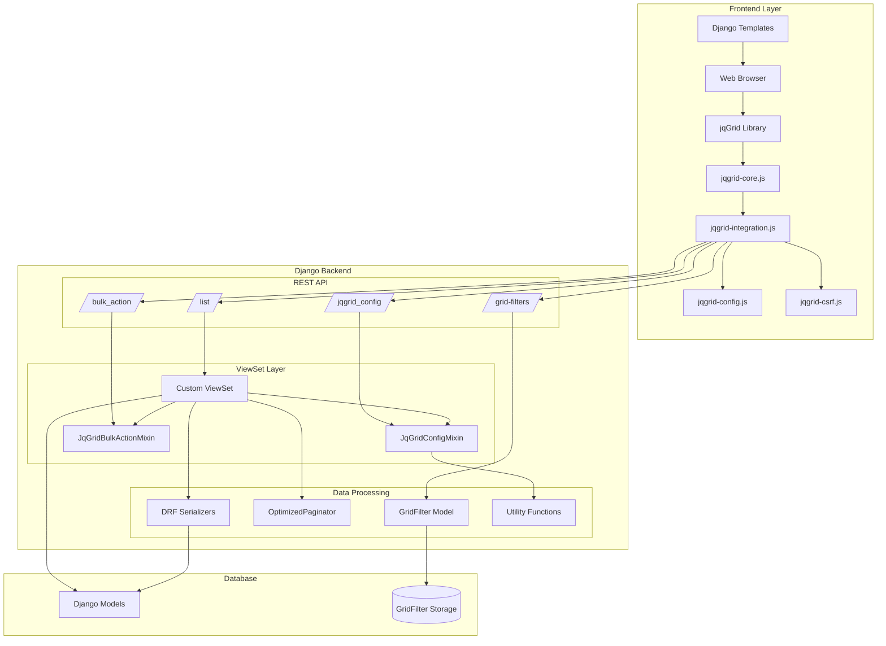

## Component Architecture

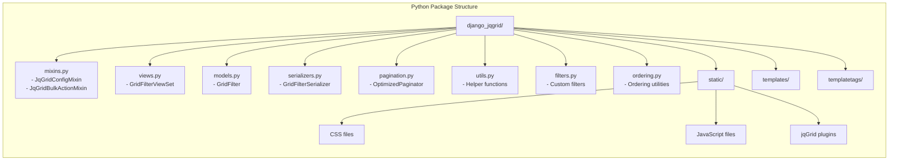

## Data Flow Architecture

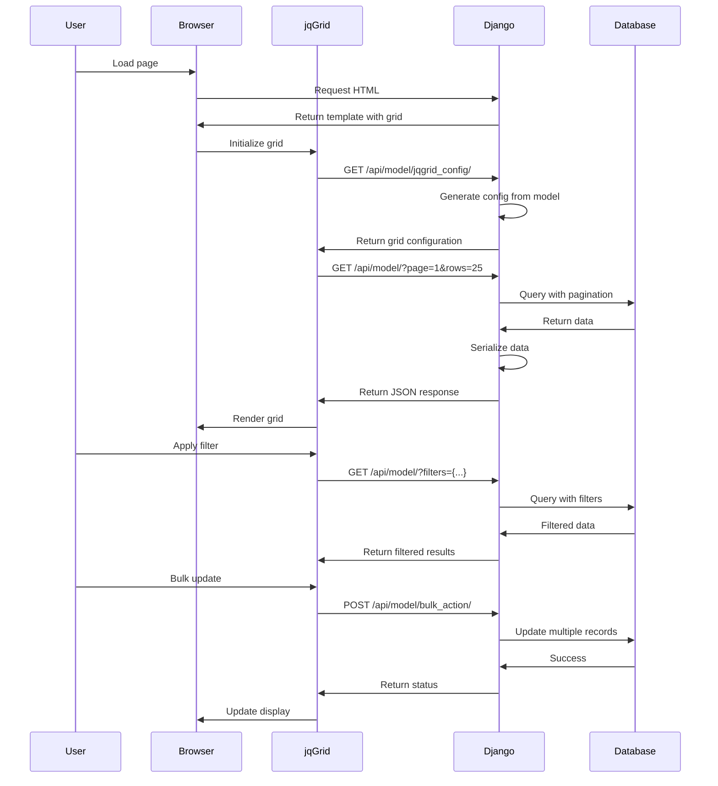

## Class Hierarchy

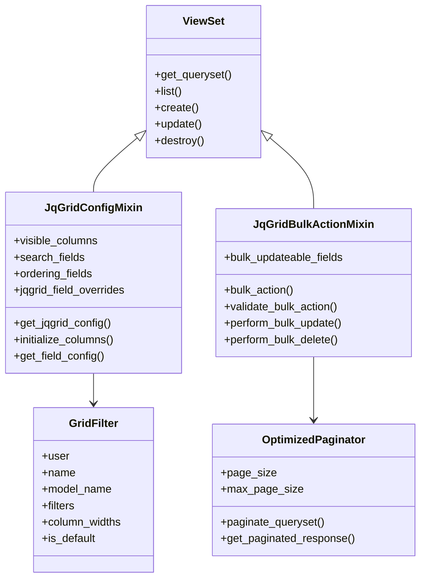

## Frontend Architecture

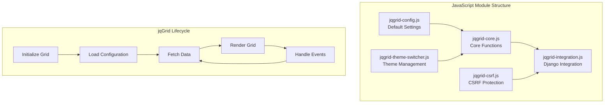

## API Architecture

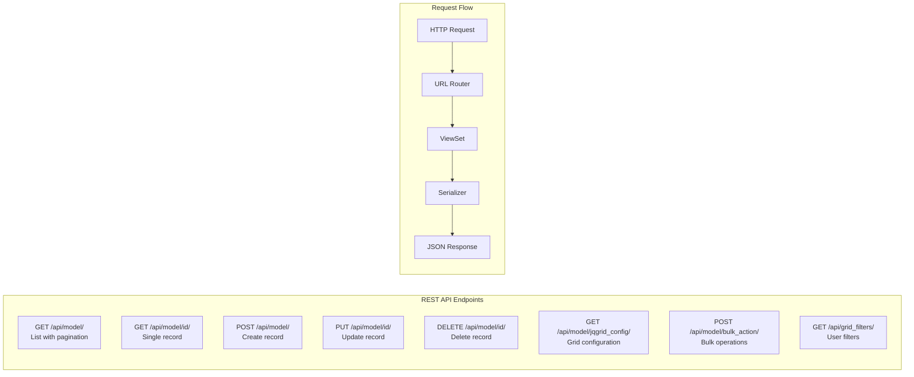

## Configuration Flow

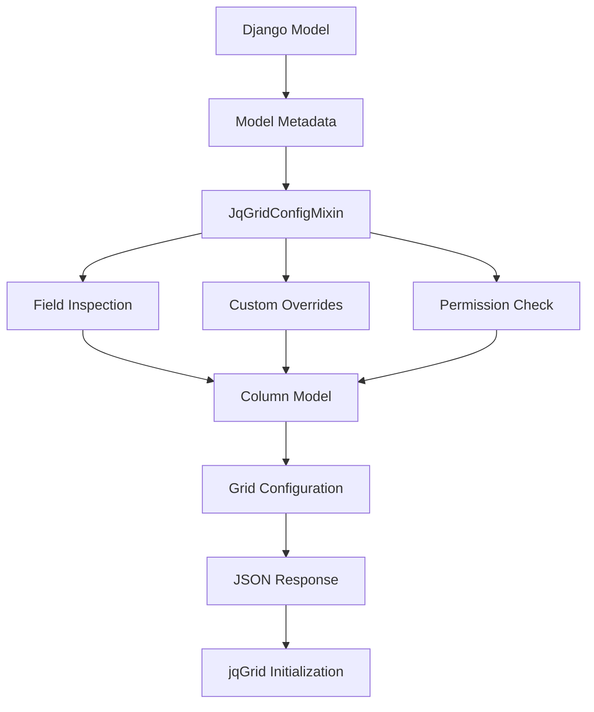

## Template Tag Architecture

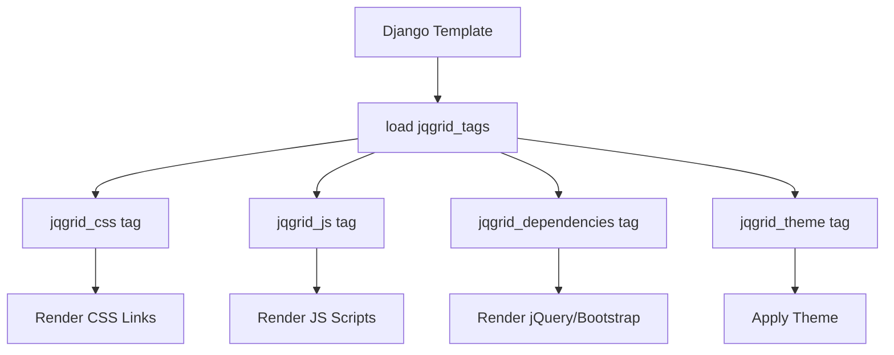

## Security Architecture

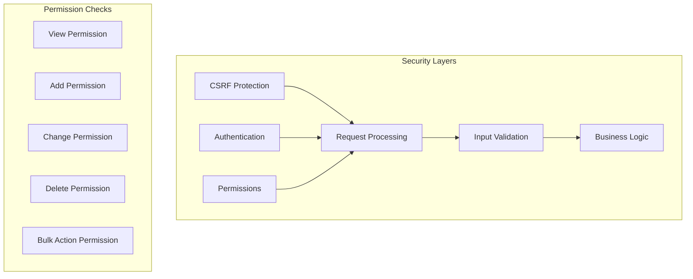

## Deployment Architecture

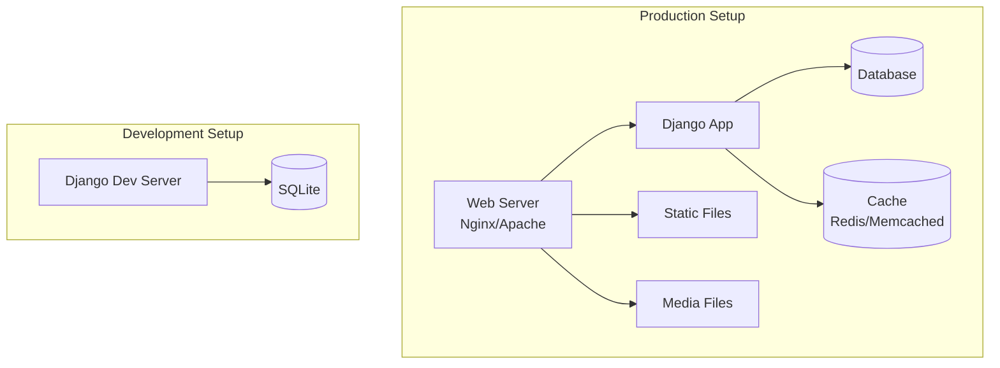

## Plugin Extension Points

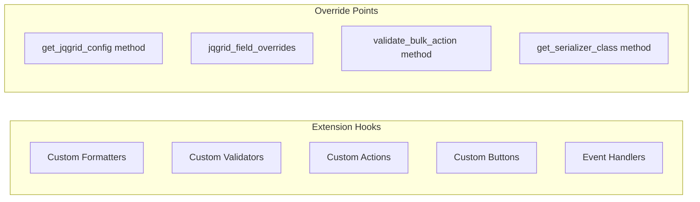

## Performance Optimization Points

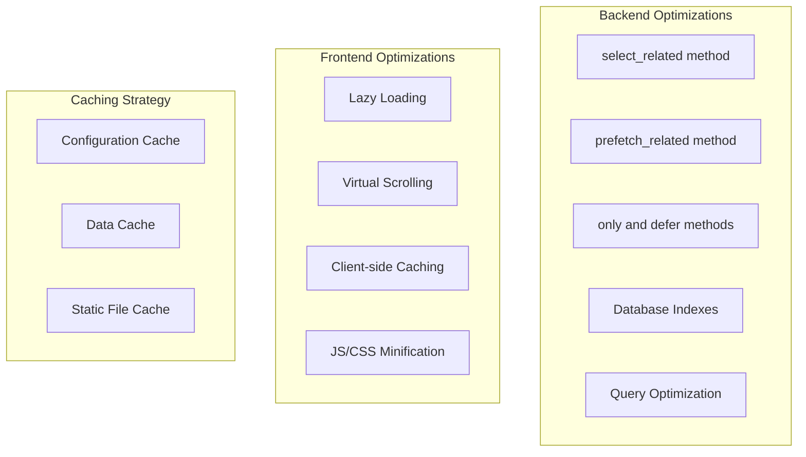

## Error Handling Flow

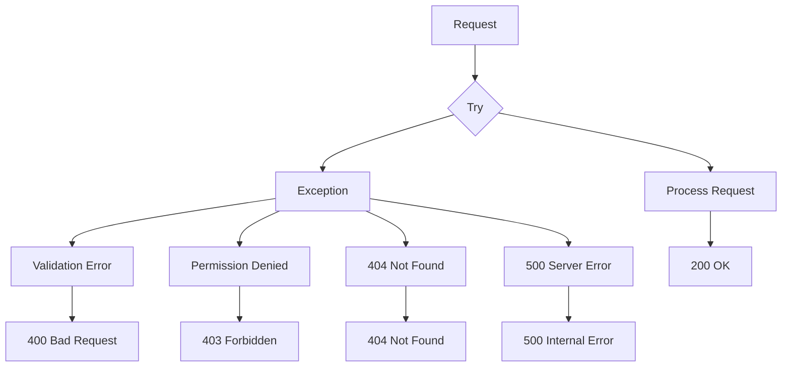

## Key Design Patterns

### 1. Mixin Pattern
- `JqGridConfigMixin`: Adds grid configuration capability
- `JqGridBulkActionMixin`: Adds bulk operations
- Allows flexible composition of features

### 2. Strategy Pattern
- Different formatters for different field types
- Pluggable pagination strategies
- Customizable filtering backends

### 3. Template Method Pattern
- Base configuration methods that can be overridden
- Hook methods for customization
- Standard flow with extension points

### 4. Factory Pattern
- Automatic configuration generation from models
- Dynamic column model creation
- Serializer field mapping

### 5. Observer Pattern
- JavaScript event handlers
- Grid state change notifications
- Real-time update capabilities

## Integration Points

1. **Django REST Framework**
   - ViewSets and Mixins
   - Serializers
   - Pagination
   - Filtering

2. **Django ORM**
   - Model introspection
   - Query optimization
   - Database operations

3. **jqGrid Library**
   - Grid initialization
   - Event handling
   - Data formatting
   - UI interactions

4. **Bootstrap/jQuery UI**
   - Theme integration
   - Responsive design
   - UI components

## Data Flow Summary

1. **Configuration Phase**
   - Model metadata extraction
   - Permission checking
   - Column model generation
   - Grid options setup

2. **Data Loading Phase**
   - Request parsing
   - Query building
   - Database fetching
   - Serialization
   - Pagination

3. **Interaction Phase**
   - Event handling
   - CRUD operations
   - Bulk actions
   - Filter management

4. **Response Phase**
   - Data formatting
   - Error handling
   - Status codes
   - JSON response