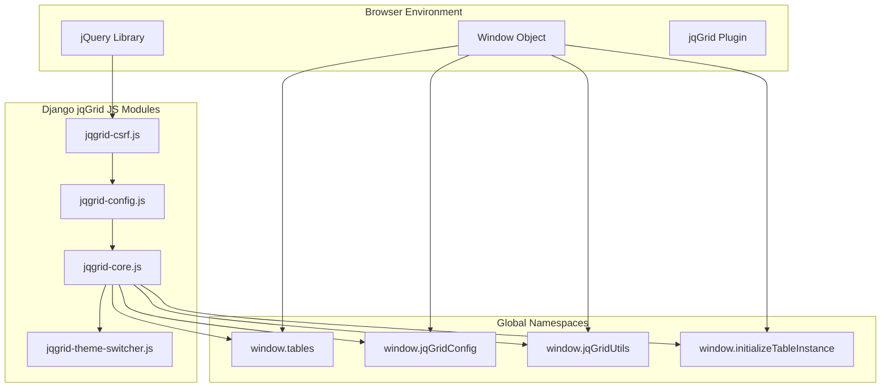
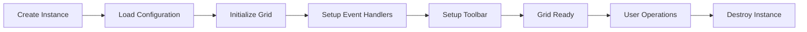
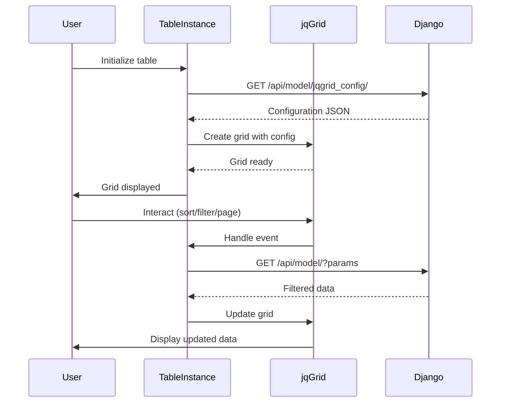

# Django jqGrid JavaScript Architecture

## Overview

The JavaScript layer of django-jqgrid consists of modular components that work together to provide a seamless integration between Django backend and jqGrid frontend. The architecture follows a layered approach with clear separation of concerns.

## JavaScript File Structure

```
django_jqgrid/static/django_jqgrid/js/
├── jqgrid-csrf.js          # CSRF token handling
├── jqgrid-config.js        # Global configuration
├── jqgrid-core.js          # Core functionality and table management
├── jqgrid-integration.js   # Django-specific integration (if present)
└── jqgrid-theme-switcher.js # Theme management
```

## Module Architecture Diagram



## File-by-File Architecture

### 1. jqgrid-csrf.js - CSRF Token Management

**Purpose**: Handles Django's CSRF protection for AJAX requests

**Architecture**:
```javascript
// Structure
{
    // Extracts CSRF token from cookies
    getCookie(name) -> string
    
    // Configures jQuery AJAX defaults
    $.ajaxSetup({
        beforeSend: function(xhr, settings) {
            // Adds X-CSRFToken header to non-GET requests
        }
    })
}
```

**Key Features**:
- Automatic CSRF token extraction from cookies
- Seamless integration with jQuery AJAX
- Protects all POST, PUT, DELETE requests
- Works with Django's CSRF middleware

### 2. jqgrid-config.js - Global Configuration

**Purpose**: Defines default settings and configurations for all grids

**Architecture**:
```javascript
window.jqGridConfig = {
    // Default grid options
    defaultGridOptions: {
        datatype: 'json',
        mtype: 'GET',
        viewrecords: true,
        // ... more defaults
    },
    
    // Feature flags
    features: {
        enableFilters: true,
        enableExport: true,
        enableImport: true
    },
    
    // API endpoints
    endpoints: {
        config: '/jqgrid_config/',
        bulkAction: '/bulk_action/',
        filters: '/api/grid-filters/'
    }
}
```

**Key Components**:
- Default grid settings
- Feature toggles
- API endpoint configuration
- Theme settings
- Localization options

### 3. jqgrid-core.js - Core Functionality

**Purpose**: Main engine that manages grid instances and provides core functionality

**Architecture**:
```javascript
// Global namespaces
window.tables = {};  // Stores all table instances
window.jqGridConfig = window.jqGridConfig || {};
window.jqGridUtils = {};  // Utility functions

// Main components
{
    // 1. Configuration Management
    jqGridConfig: {
        notify: function(type, message, tableInstance),
        timeSince: function(date),
        formatters: {},
        rowRenderers: {},
        customButtons: {},
        defaultGridOptions: {},
        hooks: {
            beforeInitGrid: function(tableInstance),
            afterInitGrid: function(tableInstance),
            beforeSubmitBulkUpdate: function(tableInstance, data),
            afterSubmitBulkUpdate: function(tableInstance, response)
        }
    },
    
    // 2. Formatter System
    initFormatters(): {
        // Base formatters
        statusBadge: function(cellval, opts),
        timeSince: function(cellval, opts),
        fileSize: function(cellval, opts),
        // Custom formatters from jqGridConfig.formatters
    },
    
    // 3. Utility Functions
    jqGridUtils: {
        notify: function(type, message, tableInstance),
        timeSince: function(date),
        isEmpty: function(obj),
        safeJsonParse: function(str)
    },
    
    // 4. Table Instance Manager
    initializeTableInstance: function(tableId, appName, tableName, options) {
        // Creates and manages individual table instances
        return TableInstance
    },
    
    // 5. Table Instance Class
    TableInstance: {
        // Properties
        tableId: string,
        gridSelector: string,
        pagerSelector: string,
        appName: string,
        tableName: string,
        options: object,
        config: object,
        currentFilter: object,
        
        // Methods
        init(): void,
        loadConfig(): Promise,
        initializeGrid(): void,
        setupEventHandlers(): void,
        setupToolbar(): void,
        handleBulkOperations(): void,
        saveFilter(): void,
        loadFilter(): void,
        deleteFilter(): void,
        exportData(): void,
        importData(): void,
        refresh(): void,
        destroy(): void
    }
}
```

**Core Features**:

#### Table Instance Lifecycle


#### Event Flow


### 4. jqgrid-theme-switcher.js - Theme Management

**Purpose**: Manages dynamic theme switching and styling

**Architecture**:
```javascript
window.jqGridTheme = {
    // Current theme settings
    current: {
        theme: 'bootstrap4',
        iconSet: 'fontAwesome'
    },
    
    // Theme configurations
    themes: {
        bootstrap4: {
            styleUI: 'Bootstrap4',
            iconSet: 'fontAwesome',
            css: ['ui.jqgrid-bootstrap4.css']
        },
        bootstrap5: {
            styleUI: 'Bootstrap5',
            iconSet: 'fontAwesome',
            css: ['ui.jqgrid-bootstrap5.css']
        },
        jqueryui: {
            styleUI: 'jQueryUI',
            iconSet: 'jQueryUI',
            css: ['ui.jqgrid.css']
        }
    },
    
    // Methods
    switch: function(themeName),
    apply: function(gridId),
    loadCSS: function(cssFiles)
}
```

## Data Flow Architecture

### 1. Initialization Flow
```javascript
// Step 1: Page loads, CSRF token setup
jqgrid-csrf.js -> Sets up AJAX defaults

// Step 2: Configuration loaded
jqgrid-config.js -> Defines global settings

// Step 3: Core initialized
jqgrid-core.js -> Sets up namespaces and utilities

// Step 4: Table instance created
window.initializeTableInstance(
    'productGrid',     // Table ID
    'products',        // App name
    'product',         // Model name
    {                  // Options
        pagerSelector: '#productGridPager',
        height: 400
    }
)

// Step 5: Configuration fetched from Django
GET /api/products/product/jqgrid_config/
-> Returns column model, options, permissions

// Step 6: Grid initialized with jqGrid
$('#productGrid').jqGrid(mergedConfig)

// Step 7: Data loaded
GET /api/products/product/?page=1&rows=25
-> Returns paginated data
```

### 2. User Interaction Flow
```javascript
// Filter/Search
User Input -> jqGrid Events -> TableInstance.handleSearch()
-> Build filter params -> GET /api/model/?filters=...
-> Update grid with results

// Sort
Column Header Click -> jqGrid Sort Event -> TableInstance.handleSort()
-> GET /api/model/?sidx=column&sord=asc
-> Update grid with sorted data

// Bulk Operations
Select Rows -> Click Bulk Action -> TableInstance.handleBulkAction()
-> Show bulk dialog -> Collect changes
-> POST /api/model/bulk_action/ with data
-> Refresh grid -> Show notification

// Export
Click Export -> TableInstance.exportData()
-> Gather current data/filters
-> Generate CSV/Excel client-side
-> Trigger download

// Import
Select File -> TableInstance.importData()
-> Parse CSV/Excel -> Validate data
-> POST /api/model/bulk_create/
-> Refresh grid -> Show results
```

## Key Design Patterns

### 1. Module Pattern
Each file uses the module pattern to encapsulate functionality:
```javascript
(function() {
    // Private variables and functions
    var privateVar = 'hidden';
    
    function privateFunc() {
        // ...
    }
    
    // Public API
    window.publicAPI = {
        publicMethod: function() {
            return privateFunc();
        }
    };
})();
```

### 2. Singleton Pattern
Global configuration objects are singletons:
```javascript
window.jqGridConfig = window.jqGridConfig || {
    // Ensures single instance
};
```

### 3. Factory Pattern
Table instances are created through a factory function:
```javascript
window.initializeTableInstance = function(tableId, appName, tableName, options) {
    // Creates new table instance
    var instance = new TableInstance(tableId, appName, tableName, options);
    window.tables[tableId] = instance;
    return instance;
};
```

### 4. Observer Pattern
Event hooks allow extending functionality:
```javascript
window.jqGridConfig.hooks = {
    beforeInitGrid: function(tableInstance) {
        // Custom logic before grid init
    },
    afterInitGrid: function(tableInstance) {
        // Custom logic after grid init
    }
};
```

### 5. Strategy Pattern
Formatters and renderers use the strategy pattern:
```javascript
window.jqGridConfig.formatters.custom = function(cellval, opts) {
    // Custom formatting strategy
    return formattedValue;
};
```

## Extension Points

### 1. Custom Formatters
```javascript
// Add custom formatter
window.jqGridConfig.formatters.myFormatter = function(cellval, opts) {
    return '<span class="custom">' + cellval + '</span>';
};
```

### 2. Custom Validators
```javascript
// Add validation
window.jqGridConfig.validators.email = function(value) {
    return /^[^\s@]+@[^\s@]+\.[^\s@]+$/.test(value);
};
```

### 3. Event Hooks
```javascript
// Hook into lifecycle
window.jqGridConfig.hooks.afterInitGrid = function(tableInstance) {
    console.log('Grid initialized:', tableInstance.tableId);
};
```

### 4. Custom Buttons
```javascript
// Add toolbar button
window.jqGridConfig.customButtons.myButton = {
    label: 'Custom Action',
    icon: 'fa-star',
    action: function(tableInstance) {
        // Custom action
    }
};
```

## Performance Considerations

### 1. Lazy Loading
- Grids load data on demand
- Configuration cached after first load
- Formatters initialized once

### 2. Event Delegation
- Uses jQuery's event delegation for dynamic content
- Minimizes event listener overhead

### 3. Debouncing
- Search input debounced to reduce API calls
- Resize events throttled

### 4. Memory Management
- Table instances properly destroyed
- Event listeners cleaned up
- DOM references released

## Browser Compatibility

### Required Dependencies
- jQuery 3.x+
- jqGrid 5.x+
- Modern browser with ES6 support

### Polyfills
For older browsers, include polyfills for:
- Object.entries
- Object.assign
- Promise
- Array.includes

## Security Considerations

### 1. XSS Prevention
- All user input sanitized
- HTML encoding for display
- Safe JSON parsing

### 2. CSRF Protection
- Automatic token inclusion
- Secure cookie handling

### 3. Input Validation
- Client-side validation for UX
- Server-side validation for security

## Debugging Guide

### 1. Enable Debug Mode
```javascript
window.jqGridConfig.debug = true;
```

### 2. Console Logging
```javascript
// Logs all grid events
window.jqGridConfig.hooks.beforeInitGrid = function(tableInstance) {
    console.log('Initializing grid:', tableInstance);
};
```

### 3. Network Monitoring
Use browser DevTools to monitor:
- API calls and responses
- Request headers (CSRF token)
- Response times

### 4. Common Issues

**Grid not loading:**
```javascript
// Check configuration endpoint
console.log('Config URL:', tableInstance.getConfigUrl());
// Check for JS errors
window.addEventListener('error', function(e) {
    console.error('JS Error:', e);
});
```

**Formatters not working:**
```javascript
// Verify formatter registration
console.log('Registered formatters:', $.fn.fmatter);
```

**Events not firing:**
```javascript
// Check event bindings
$('#gridId').on('jqGridAfterLoadComplete', function() {
    console.log('Grid loaded');
});
```

## Best Practices

### 1. Initialization
```javascript
// Always wait for DOM ready
$(document).ready(function() {
    window.initializeTableInstance('gridId', 'app', 'model');
});
```

### 2. Custom Extensions
```javascript
// Extend, don't replace
$.extend(true, window.jqGridConfig, {
    customProperty: 'value'
});
```

### 3. Error Handling
```javascript
// Always handle errors gracefully
tableInstance.loadConfig().catch(function(error) {
    window.jqGridUtils.notify('error', 'Failed to load configuration');
});
```

### 4. Cleanup
```javascript
// Destroy instances when done
if (window.tables[tableId]) {
    window.tables[tableId].destroy();
    delete window.tables[tableId];
}
```

## Integration with Django

### 1. Template Integration
```django



    



    <table id="myGrid"></table>
    <div id="myGridPager"></div>



    
    
    <script>
        $(document).ready(function() {
            window.initializeTableInstance('myGrid', 'myapp', 'mymodel', {
                pagerSelector: '#myGridPager'
            });
        });
    </script>

```

### 2. Backend Integration
The JavaScript layer expects specific API endpoints:
- `GET /api/{app}/{model}/jqgrid_config/` - Grid configuration
- `GET /api/{app}/{model}/` - Data with pagination
- `POST /api/{app}/{model}/bulk_action/` - Bulk operations
- `GET /api/grid-filters/` - User filters

### 3. Data Format
Expected JSON response format:
```json
{
    "page": 1,
    "total": 10,
    "records": 100,
    "rows": [
        {"id": 1, "name": "Item 1", ...},
        {"id": 2, "name": "Item 2", ...}
    ]
}
```

## Future Enhancements

### Planned Features
1. **WebSocket Support** - Real-time grid updates
2. **Virtual Scrolling** - Better performance for large datasets
3. **Offline Mode** - Local storage caching
4. **Progressive Enhancement** - Work without JavaScript
5. **TypeScript Definitions** - Better IDE support

### Architecture Improvements
1. **ES6 Modules** - Modern module system
2. **Build Pipeline** - Webpack/Rollup integration
3. **Unit Tests** - Jest/Mocha test suite
4. **API Versioning** - Support multiple API versions
5. **Plugin System** - Easier third-party extensions

## Conclusion

The JavaScript architecture of django-jqgrid is designed to be:
- **Modular**: Clear separation of concerns
- **Extensible**: Multiple extension points
- **Performant**: Optimized for large datasets
- **Secure**: Built-in security features
- **Maintainable**: Clean code structure

This architecture enables developers to quickly implement feature-rich data grids while maintaining flexibility for customization and extension.