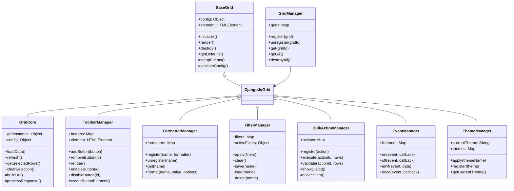

# Extensible JavaScript Architecture for Django jqGrid

## Overview

This document outlines a refactored, class-based JavaScript architecture that allows users to easily override and extend functionality through inheritance and method overriding.

## Core Design Principles

1. **Inheritance-Based Extension**: All components are classes that can be extended
2. **Method Overriding**: Any method can be overridden in child classes
3. **Plugin System**: Register custom implementations without modifying core
4. **Event-Driven**: Loosely coupled components communicate via events
5. **Configuration Over Code**: Behavior controlled through configuration objects

## Proposed Class Architecture



## Refactored File Structure

```
django_jqgrid/static/django_jqgrid/js/
├── core/
│   ├── BaseGrid.js          # Abstract base class for all grids
│   ├── GridManager.js       # Manages all grid instances
│   ├── EventManager.js      # Event handling system
│   └── Utils.js            # Utility functions
├── components/
│   ├── GridCore.js         # Core grid functionality
│   ├── ToolbarManager.js   # Toolbar and button management
│   ├── FormatterManager.js  # Cell formatting system
│   ├── FilterManager.js     # Filter management
│   ├── BulkActionManager.js # Bulk operations
│   └── ThemeManager.js     # Theme switching
├── widgets/
│   ├── Button.js           # Button widget class
│   ├── Dialog.js           # Dialog widget class
│   └── Notification.js     # Notification widget class
├── django/
│   ├── DjangoJqGrid.js     # Django-specific grid implementation
│   ├── CSRFManager.js      # CSRF token handling
│   └── APIClient.js        # Django API communication
└── index.js                # Main entry point
```

## Base Classes Implementation

### 1. BaseGrid Class (core/BaseGrid.js)

```javascript
/**
 * Abstract base class for all grid implementations
 * Users can extend this class to create custom grid types
 */
class BaseGrid {
    constructor(element, config = {}) {
        if (this.constructor === BaseGrid) {
            throw new Error("BaseGrid is an abstract class and cannot be instantiated directly");
        }
        
        this.element = typeof element === 'string' ? document.querySelector(element) : element;
        this.config = this.mergeConfig(config);
        this.eventManager = new EventManager();
        this.initialized = false;
    }
    
    /**
     * Initialize the grid - Override this method for custom initialization
     */
    async initialize() {
        this.validateConfig();
        await this.loadDependencies();
        this.setupEvents();
        this.render();
        this.initialized = true;
        this.eventManager.emit('initialized', this);
        return this;
    }
    
    /**
     * Get default configuration - Override to provide custom defaults
     */
    getDefaults() {
        return {
            height: 400,
            width: 'auto',
            autowidth: true,
            shrinkToFit: true,
            responsive: true,
            rowNum: 25,
            rowList: [10, 25, 50, 100],
            pager: true,
            viewrecords: true,
            sortable: true,
            multiselect: false
        };
    }
    
    /**
     * Merge user config with defaults - Override for custom merging logic
     */
    mergeConfig(userConfig) {
        return Object.assign({}, this.getDefaults(), userConfig);
    }
    
    /**
     * Validate configuration - Override to add custom validation
     */
    validateConfig() {
        if (!this.element) {
            throw new Error("Grid element is required");
        }
        return true;
    }
    
    /**
     * Load required dependencies - Override to load custom dependencies
     */
    async loadDependencies() {
        // Base implementation - override in child classes
        return Promise.resolve();
    }
    
    /**
     * Setup event handlers - Override to add custom events
     */
    setupEvents() {
        // Base implementation
        this.eventManager.on('error', this.handleError.bind(this));
        this.eventManager.on('warning', this.handleWarning.bind(this));
    }
    
    /**
     * Render the grid - Must be implemented by child classes
     */
    render() {
        throw new Error("render() method must be implemented by child class");
    }
    
    /**
     * Destroy the grid and cleanup - Override for custom cleanup
     */
    destroy() {
        this.eventManager.emit('beforeDestroy', this);
        this.eventManager.removeAll();
        if (this.element) {
            this.element.innerHTML = '';
        }
        this.initialized = false;
        this.eventManager.emit('destroyed', this);
    }
    
    /**
     * Error handler - Override for custom error handling
     */
    handleError(error) {
        console.error('Grid Error:', error);
    }
    
    /**
     * Warning handler - Override for custom warning handling
     */
    handleWarning(warning) {
        console.warn('Grid Warning:', warning);
    }
}
```

### 2. ToolbarManager Class (components/ToolbarManager.js)

```javascript
/**
 * Manages toolbar and buttons
 * Users can extend this class to create custom toolbar implementations
 */
class ToolbarManager {
    constructor(grid, config = {}) {
        this.grid = grid;
        this.config = config;
        this.buttons = new Map();
        this.element = null;
    }
    
    /**
     * Initialize toolbar - Override for custom initialization
     */
    initialize() {
        this.element = this.createElement();
        this.setupDefaultButtons();
        this.render();
        return this;
    }
    
    /**
     * Create toolbar element - Override for custom toolbar structure
     */
    createElement() {
        const toolbar = document.createElement('div');
        toolbar.className = this.getToolbarClasses();
        return toolbar;
    }
    
    /**
     * Get toolbar CSS classes - Override for custom styling
     */
    getToolbarClasses() {
        return 'jqgrid-toolbar btn-toolbar mb-2';
    }
    
    /**
     * Setup default buttons - Override to change default buttons
     */
    setupDefaultButtons() {
        // Add default buttons
        this.addButton(new RefreshButton(this.grid));
        this.addButton(new ExportButton(this.grid));
        
        if (this.config.enableBulkActions) {
            this.addButton(new BulkEditButton(this.grid));
            this.addButton(new BulkDeleteButton(this.grid));
        }
    }
    
    /**
     * Add a button to toolbar - Override for custom button handling
     */
    addButton(button) {
        if (!(button instanceof Button)) {
            throw new Error("Button must be an instance of Button class");
        }
        this.buttons.set(button.id, button);
        if (this.element) {
            this.renderButton(button);
        }
        return this;
    }
    
    /**
     * Remove a button - Override for custom removal logic
     */
    removeButton(buttonId) {
        const button = this.buttons.get(buttonId);
        if (button) {
            button.destroy();
            this.buttons.delete(buttonId);
        }
        return this;
    }
    
    /**
     * Render a single button - Override for custom button rendering
     */
    renderButton(button) {
        const buttonElement = button.render();
        this.element.appendChild(buttonElement);
        return buttonElement;
    }
    
    /**
     * Render entire toolbar - Override for custom rendering
     */
    render() {
        this.element.innerHTML = '';
        this.buttons.forEach(button => {
            this.renderButton(button);
        });
        return this.element;
    }
    
    /**
     * Enable/disable button - Override for custom state management
     */
    setButtonState(buttonId, enabled) {
        const button = this.buttons.get(buttonId);
        if (button) {
            button.setEnabled(enabled);
        }
        return this;
    }
    
    /**
     * Destroy toolbar - Override for custom cleanup
     */
    destroy() {
        this.buttons.forEach(button => button.destroy());
        this.buttons.clear();
        if (this.element && this.element.parentNode) {
            this.element.parentNode.removeChild(this.element);
        }
    }
}
```

### 3. Button Base Class (widgets/Button.js)

```javascript
/**
 * Base class for all buttons
 * Users can extend this class to create custom buttons
 */
class Button {
    constructor(grid, config = {}) {
        this.grid = grid;
        this.id = config.id || this.generateId();
        this.config = Object.assign({}, this.getDefaults(), config);
        this.element = null;
        this.enabled = true;
    }
    
    /**
     * Get default button configuration - Override in child classes
     */
    getDefaults() {
        return {
            label: 'Button',
            icon: '',
            className: 'btn btn-default',
            tooltip: '',
            position: 'left'
        };
    }
    
    /**
     * Generate unique button ID - Override for custom ID generation
     */
    generateId() {
        return 'btn_' + Math.random().toString(36).substr(2, 9);
    }
    
    /**
     * Render button element - Override for custom rendering
     */
    render() {
        this.element = document.createElement('button');
        this.element.id = this.id;
        this.element.className = this.getButtonClasses();
        this.element.innerHTML = this.getButtonContent();
        this.element.title = this.config.tooltip;
        
        this.setupEvents();
        return this.element;
    }
    
    /**
     * Get button CSS classes - Override for custom styling
     */
    getButtonClasses() {
        return `${this.config.className} ${this.enabled ? '' : 'disabled'}`;
    }
    
    /**
     * Get button content HTML - Override for custom content
     */
    getButtonContent() {
        let content = '';
        if (this.config.icon) {
            content += `<i class="${this.config.icon}"></i> `;
        }
        content += this.config.label;
        return content;
    }
    
    /**
     * Setup button events - Override for custom event handling
     */
    setupEvents() {
        this.element.addEventListener('click', (e) => {
            e.preventDefault();
            if (this.enabled) {
                this.onClick(e);
            }
        });
    }
    
    /**
     * Handle button click - Must be implemented by child classes
     */
    onClick(event) {
        throw new Error("onClick() method must be implemented by child class");
    }
    
    /**
     * Enable/disable button - Override for custom state management
     */
    setEnabled(enabled) {
        this.enabled = enabled;
        if (this.element) {
            this.element.disabled = !enabled;
            this.element.className = this.getButtonClasses();
        }
        return this;
    }
    
    /**
     * Update button configuration - Override for custom updates
     */
    update(config) {
        Object.assign(this.config, config);
        if (this.element) {
            this.element.innerHTML = this.getButtonContent();
            this.element.className = this.getButtonClasses();
            this.element.title = this.config.tooltip;
        }
        return this;
    }
    
    /**
     * Destroy button - Override for custom cleanup
     */
    destroy() {
        if (this.element && this.element.parentNode) {
            this.element.parentNode.removeChild(this.element);
        }
        this.element = null;
    }
}

/**
 * Example: Custom Refresh Button
 */
class RefreshButton extends Button {
    getDefaults() {
        return Object.assign(super.getDefaults(), {
            label: 'Refresh',
            icon: 'fa fa-refresh',
            className: 'btn btn-primary',
            tooltip: 'Refresh grid data'
        });
    }
    
    onClick(event) {
        this.grid.refresh();
    }
}

/**
 * Example: Custom Export Button
 */
class ExportButton extends Button {
    getDefaults() {
        return Object.assign(super.getDefaults(), {
            label: 'Export',
            icon: 'fa fa-download',
            className: 'btn btn-success',
            tooltip: 'Export grid data'
        });
    }
    
    onClick(event) {
        this.showExportDialog();
    }
    
    showExportDialog() {
        // Custom export logic
        const dialog = new ExportDialog(this.grid);
        dialog.show();
    }
}
```

### 4. FormatterManager Class (components/FormatterManager.js)

```javascript
/**
 * Manages cell formatters
 * Users can extend this class to add custom formatter logic
 */
class FormatterManager {
    constructor(grid) {
        this.grid = grid;
        this.formatters = new Map();
        this.setupDefaultFormatters();
    }
    
    /**
     * Setup default formatters - Override to change defaults
     */
    setupDefaultFormatters() {
        this.register('date', new DateFormatter());
        this.register('currency', new CurrencyFormatter());
        this.register('boolean', new BooleanFormatter());
        this.register('link', new LinkFormatter());
        this.register('status', new StatusFormatter());
    }
    
    /**
     * Register a formatter - Override for custom registration logic
     */
    register(name, formatter) {
        if (typeof formatter === 'function') {
            formatter = new FunctionFormatter(formatter);
        }
        if (!(formatter instanceof Formatter)) {
            throw new Error("Formatter must be an instance of Formatter class");
        }
        this.formatters.set(name, formatter);
        return this;
    }
    
    /**
     * Unregister a formatter - Override for custom cleanup
     */
    unregister(name) {
        this.formatters.delete(name);
        return this;
    }
    
    /**
     * Get a formatter - Override for custom retrieval logic
     */
    get(name) {
        return this.formatters.get(name);
    }
    
    /**
     * Format a value - Override for custom formatting pipeline
     */
    format(name, value, row, column) {
        const formatter = this.get(name);
        if (formatter) {
            return formatter.format(value, row, column, this.grid);
        }
        return value;
    }
    
    /**
     * Get all formatter names - Override for filtering
     */
    getFormatterNames() {
        return Array.from(this.formatters.keys());
    }
}

/**
 * Base Formatter class
 */
class Formatter {
    constructor(config = {}) {
        this.config = config;
    }
    
    /**
     * Format a value - Must be implemented by child classes
     */
    format(value, row, column, grid) {
        throw new Error("format() method must be implemented by child class");
    }
    
    /**
     * Unformat a value (for editing) - Override if needed
     */
    unformat(value, row, column, grid) {
        return value;
    }
}

/**
 * Example: Date Formatter
 */
class DateFormatter extends Formatter {
    format(value, row, column, grid) {
        if (!value) return '';
        const date = new Date(value);
        return date.toLocaleDateString(this.config.locale || 'en-US', {
            year: 'numeric',
            month: 'short',
            day: 'numeric'
        });
    }
}

/**
 * Example: Status Formatter with custom styling
 */
class StatusFormatter extends Formatter {
    format(value, row, column, grid) {
        const statusConfig = {
            active: { class: 'badge-success', icon: 'fa-check' },
            inactive: { class: 'badge-danger', icon: 'fa-times' },
            pending: { class: 'badge-warning', icon: 'fa-clock' }
        };
        
        const config = statusConfig[value.toLowerCase()] || { class: 'badge-secondary', icon: '' };
        
        return `<span class="badge ${config.class}">
                    ${config.icon ? `<i class="fa ${config.icon}"></i>` : ''}
                    ${value}
                </span>`;
    }
}
```

### 5. DjangoJqGrid Implementation (django/DjangoJqGrid.js)

```javascript
/**
 * Django-specific grid implementation
 * Users can extend this class to customize Django integration
 */
class DjangoJqGrid extends BaseGrid {
    constructor(element, config = {}) {
        super(element, config);
        
        // Initialize managers
        this.toolbarManager = this.createToolbarManager();
        this.formatterManager = this.createFormatterManager();
        this.filterManager = this.createFilterManager();
        this.bulkActionManager = this.createBulkActionManager();
        this.themeManager = this.createThemeManager();
        this.apiClient = this.createAPIClient();
        
        // Django-specific properties
        this.appName = config.appName;
        this.modelName = config.modelName;
        this.permissions = {};
    }
    
    /**
     * Factory methods for creating managers - Override to use custom managers
     */
    createToolbarManager() {
        return new ToolbarManager(this, this.config.toolbar || {});
    }
    
    createFormatterManager() {
        return new FormatterManager(this);
    }
    
    createFilterManager() {
        return new FilterManager(this);
    }
    
    createBulkActionManager() {
        return new BulkActionManager(this);
    }
    
    createThemeManager() {
        return new ThemeManager(this);
    }
    
    createAPIClient() {
        return new DjangoAPIClient(this);
    }
    
    /**
     * Get Django-specific defaults - Override for custom defaults
     */
    getDefaults() {
        return Object.assign(super.getDefaults(), {
            url: this.getDataUrl(),
            datatype: 'json',
            mtype: 'GET',
            jsonReader: this.getJsonReader(),
            ajaxGridOptions: { contentType: 'application/json' },
            beforeRequest: this.beforeRequest.bind(this),
            loadComplete: this.loadComplete.bind(this),
            onSelectRow: this.onSelectRow.bind(this),
            ondblClickRow: this.onDoubleClickRow.bind(this)
        });
    }
    
    /**
     * Get data URL - Override for custom URL building
     */
    getDataUrl() {
        return `/api/${this.appName}/${this.modelName}/`;
    }
    
    /**
     * Get configuration URL - Override for custom config endpoint
     */
    getConfigUrl() {
        return `/api/${this.appName}/${this.modelName}/jqgrid_config/`;
    }
    
    /**
     * Get JSON reader configuration - Override for custom response format
     */
    getJsonReader() {
        return {
            repeatitems: false,
            id: 'id',
            root: 'rows',
            page: 'page',
            total: 'total',
            records: 'records'
        };
    }
    
    /**
     * Load configuration from Django - Override for custom config loading
     */
    async loadConfiguration() {
        try {
            const response = await this.apiClient.get(this.getConfigUrl());
            this.processConfiguration(response);
            return response;
        } catch (error) {
            this.handleConfigError(error);
            throw error;
        }
    }
    
    /**
     * Process configuration response - Override for custom processing
     */
    processConfiguration(response) {
        if (response.jqgrid_options) {
            Object.assign(this.config, response.jqgrid_options);
        }
        if (response.permissions) {
            this.permissions = response.permissions;
        }
        this.eventManager.emit('configurationLoaded', response);
    }
    
    /**
     * Initialize the Django grid - Override for custom initialization
     */
    async initialize() {
        await this.loadConfiguration();
        await super.initialize();
        
        // Initialize managers
        this.toolbarManager.initialize();
        this.setupFormatters();
        this.setupFilters();
        this.setupBulkActions();
        
        return this;
    }
    
    /**
     * Setup formatters - Override to register custom formatters
     */
    setupFormatters() {
        // Register any custom formatters from config
        if (this.config.customFormatters) {
            Object.entries(this.config.customFormatters).forEach(([name, formatter]) => {
                this.formatterManager.register(name, formatter);
            });
        }
    }
    
    /**
     * Setup filters - Override for custom filter setup
     */
    setupFilters() {
        if (this.config.enableFilters) {
            this.filterManager.initialize();
        }
    }
    
    /**
     * Setup bulk actions - Override for custom bulk actions
     */
    setupBulkActions() {
        if (this.config.enableBulkActions && this.permissions.change) {
            this.bulkActionManager.initialize();
        }
    }
    
    /**
     * Render the grid - Override for custom rendering
     */
    render() {
        // Create jqGrid instance
        $(this.element).jqGrid(this.config);
        
        // Add toolbar
        if (this.toolbarManager.element) {
            this.element.parentNode.insertBefore(
                this.toolbarManager.element,
                this.element
            );
        }
        
        this.eventManager.emit('rendered', this);
    }
    
    /**
     * Hook: Before request - Override for custom request preparation
     */
    beforeRequest() {
        this.eventManager.emit('beforeRequest', this);
    }
    
    /**
     * Hook: Load complete - Override for custom post-load processing
     */
    loadComplete(data) {
        this.eventManager.emit('loadComplete', data);
    }
    
    /**
     * Hook: Row selection - Override for custom selection handling
     */
    onSelectRow(rowId, status, event) {
        this.eventManager.emit('rowSelected', { rowId, status, event });
    }
    
    /**
     * Hook: Double click row - Override for custom double-click handling
     */
    onDoubleClickRow(rowId, rowIndex, columnIndex, event) {
        this.eventManager.emit('rowDoubleClicked', { rowId, rowIndex, columnIndex, event });
    }
    
    /**
     * Refresh grid data - Override for custom refresh logic
     */
    refresh() {
        $(this.element).trigger('reloadGrid');
        this.eventManager.emit('refreshed', this);
    }
    
    /**
     * Destroy the grid - Override for custom cleanup
     */
    destroy() {
        // Destroy managers
        this.toolbarManager?.destroy();
        this.filterManager?.destroy();
        this.bulkActionManager?.destroy();
        
        // Destroy jqGrid
        $(this.element).jqGrid('GridDestroy');
        
        // Call parent destroy
        super.destroy();
    }
}
```

## User Extension Examples

### 1. Custom Grid with Additional Features

```javascript
// User's custom grid implementation
class MyCustomGrid extends DjangoJqGrid {
    // Override toolbar creation to use custom toolbar
    createToolbarManager() {
        return new MyCustomToolbar(this, this.config.toolbar);
    }
    
    // Add custom initialization logic
    async initialize() {
        await super.initialize();
        
        // Add custom features
        this.addSearchBar();
        this.addStatusIndicator();
        
        return this;
    }
    
    // Add custom search bar
    addSearchBar() {
        const searchBar = document.createElement('input');
        searchBar.type = 'text';
        searchBar.className = 'form-control grid-search';
        searchBar.placeholder = 'Search...';
        
        searchBar.addEventListener('input', (e) => {
            this.handleSearch(e.target.value);
        });
        
        this.toolbarManager.element.appendChild(searchBar);
    }
    
    // Custom search handling
    handleSearch(query) {
        $(this.element).jqGrid('setGridParam', {
            postData: { search: query }
        }).trigger('reloadGrid');
    }
    
    // Override row selection for custom behavior
    onSelectRow(rowId, status, event) {
        super.onSelectRow(rowId, status, event);
        
        // Custom logic: Show details panel
        if (status) {
            this.showDetailsPanel(rowId);
        }
    }
}
```

### 2. Custom Toolbar with Project-Specific Buttons

```javascript
class MyCustomToolbar extends ToolbarManager {
    // Override default buttons
    setupDefaultButtons() {
        // Don't call super to skip default buttons
        
        // Add only the buttons we want
        this.addButton(new RefreshButton(this.grid));
        this.addButton(new MyCustomImportButton(this.grid));
        this.addButton(new MyCustomReportButton(this.grid));
    }
    
    // Override toolbar classes for custom styling
    getToolbarClasses() {
        return 'my-custom-toolbar d-flex justify-content-between align-items-center p-2';
    }
    
    // Override render for custom layout
    render() {
        // Create button groups
        const leftGroup = document.createElement('div');
        leftGroup.className = 'btn-group';
        
        const rightGroup = document.createElement('div');
        rightGroup.className = 'btn-group';
        
        // Sort buttons by position
        this.buttons.forEach(button => {
            const element = button.render();
            if (button.config.position === 'right') {
                rightGroup.appendChild(element);
            } else {
                leftGroup.appendChild(element);
            }
        });
        
        this.element.appendChild(leftGroup);
        this.element.appendChild(rightGroup);
        
        return this.element;
    }
}

// Custom button implementation
class MyCustomImportButton extends Button {
    getDefaults() {
        return {
            label: 'Import Data',
            icon: 'fa fa-upload',
            className: 'btn btn-info',
            tooltip: 'Import data from CSV/Excel',
            position: 'left'
        };
    }
    
    onClick(event) {
        // Custom import logic
        const input = document.createElement('input');
        input.type = 'file';
        input.accept = '.csv,.xlsx';
        
        input.addEventListener('change', (e) => {
            this.handleFileImport(e.target.files[0]);
        });
        
        input.click();
    }
    
    async handleFileImport(file) {
        // Custom file processing
        const data = await this.parseFile(file);
        const response = await this.grid.apiClient.post('/import/', data);
        
        if (response.success) {
            this.grid.refresh();
            this.showSuccess('Data imported successfully');
        }
    }
}
```

### 3. Custom Formatter with Business Logic

```javascript
class PriceFormatter extends Formatter {
    format(value, row, column, grid) {
        // Apply business logic
        const price = parseFloat(value);
        const discount = row.discount || 0;
        const finalPrice = price * (1 - discount / 100);
        
        // Format with currency
        const formatted = new Intl.NumberFormat('en-US', {
            style: 'currency',
            currency: 'USD'
        }).format(finalPrice);
        
        // Add visual indicators
        if (discount > 0) {
            return `
                <div class="price-display">
                    <span class="original-price text-muted">
                        <del>$${price.toFixed(2)}</del>
                    </span>
                    <span class="final-price text-success ml-2">
                        ${formatted}
                    </span>
                    <span class="badge badge-danger ml-1">
                        -${discount}%
                    </span>
                </div>
            `;
        }
        
        return `<span class="price">${formatted}</span>`;
    }
    
    unformat(value, row, column, grid) {
        // Extract numeric value for editing
        return value.replace(/[^0-9.-]/g, '');
    }
}

// Register the custom formatter
class MyCustomGrid extends DjangoJqGrid {
    setupFormatters() {
        super.setupFormatters();
        
        // Register custom formatters
        this.formatterManager.register('price', new PriceFormatter());
        this.formatterManager.register('rating', new RatingFormatter());
        this.formatterManager.register('progress', new ProgressBarFormatter());
    }
}
```

### 4. Custom Bulk Action Implementation

```javascript
class CustomBulkActionManager extends BulkActionManager {
    setupDefaultActions() {
        // Register custom bulk actions
        this.register(new BulkPriceUpdateAction(this.grid));
        this.register(new BulkCategoryChangeAction(this.grid));
        this.register(new BulkExportAction(this.grid));
    }
}

class BulkPriceUpdateAction extends BulkAction {
    constructor(grid) {
        super(grid, {
            id: 'bulk-price-update',
            label: 'Update Prices',
            icon: 'fa fa-dollar',
            requireConfirmation: true
        });
    }
    
    // Validate selected rows
    validate(selectedRows) {
        if (selectedRows.length === 0) {
            throw new Error('Please select at least one item');
        }
        return true;
    }
    
    // Show custom dialog for price update
    async showDialog(selectedRows) {
        const dialog = new PriceUpdateDialog(selectedRows);
        const result = await dialog.show();
        return result;
    }
    
    // Execute the bulk action
    async execute(selectedRows, data) {
        const response = await this.grid.apiClient.post('/bulk-price-update/', {
            ids: selectedRows,
            adjustment: data.adjustment,
            type: data.type // percentage or fixed
        });
        
        if (response.success) {
            this.grid.refresh();
            this.showNotification('success', `Updated prices for ${response.count} items`);
        }
        
        return response;
    }
}
```

## Plugin Registration System

```javascript
// Global plugin registry
class PluginRegistry {
    constructor() {
        this.plugins = new Map();
    }
    
    register(name, plugin) {
        this.plugins.set(name, plugin);
        return this;
    }
    
    get(name) {
        return this.plugins.get(name);
    }
    
    // Auto-discover and load plugins
    loadPlugins() {
        // Load from global config
        if (window.jqGridPlugins) {
            Object.entries(window.jqGridPlugins).forEach(([name, plugin]) => {
                this.register(name, plugin);
            });
        }
    }
}

// Global registry instance
window.jqGridRegistry = new PluginRegistry();

// Register custom implementations
window.jqGridRegistry.register('grids', {
    default: DjangoJqGrid,
    custom: MyCustomGrid
});

window.jqGridRegistry.register('buttons', {
    refresh: RefreshButton,
    export: ExportButton,
    import: MyCustomImportButton
});

window.jqGridRegistry.register('formatters', {
    date: DateFormatter,
    price: PriceFormatter,
    status: StatusFormatter
});

// Factory function to create grids
window.createGrid = function(element, config) {
    const GridClass = config.gridClass || 
                     window.jqGridRegistry.get('grids')[config.gridType] || 
                     DjangoJqGrid;
    
    return new GridClass(element, config);
};
```

## Usage Example

```html
<!-- In your template -->
<div id="myGrid"></div>

<script>
// Simple usage with defaults
const grid = window.createGrid('#myGrid', {
    appName: 'products',
    modelName: 'product'
});

// Advanced usage with custom implementations
const customGrid = window.createGrid('#myGrid', {
    gridClass: MyCustomGrid,  // Use custom grid class
    appName: 'products',
    modelName: 'product',
    toolbar: {
        buttons: ['refresh', 'import', 'custom-report'],
        position: 'top'
    },
    customFormatters: {
        price: new PriceFormatter({ currency: 'EUR' }),
        rating: new RatingFormatter({ maxStars: 5 })
    },
    bulkActions: {
        enabled: true,
        actions: ['price-update', 'category-change']
    },
    events: {
        onRowSelect: function(data) {
            console.log('Row selected:', data);
        },
        onDataLoaded: function(data) {
            updateDashboard(data);
        }
    }
});

// Initialize the grid
customGrid.initialize().then(() => {
    console.log('Grid initialized');
});
</script>
```

## Benefits of This Architecture

1. **Extensibility**: Every component can be extended through inheritance
2. **Modularity**: Clear separation of concerns with focused classes
3. **Flexibility**: Users can override any method to customize behavior
4. **Maintainability**: Clean class hierarchy makes code easy to understand
5. **Reusability**: Components can be reused across different projects
6. **Testability**: Each class can be unit tested independently
7. **Type Safety**: Can easily add TypeScript definitions
8. **Plugin System**: Easy to add third-party extensions
9. **Event-Driven**: Loose coupling through events
10. **Configuration**: Behavior controlled through configuration objects

## Migration Path

To migrate from the current implementation to this architecture:

1. **Phase 1**: Create base classes alongside existing code
2. **Phase 2**: Refactor existing functions into class methods
3. **Phase 3**: Add inheritance and override capabilities
4. **Phase 4**: Implement plugin registration system
5. **Phase 5**: Update documentation and examples
6. **Phase 6**: Deprecate old API (with backward compatibility)
7. **Phase 7**: Remove deprecated code in next major version

This architecture provides a solid foundation for users to customize every aspect of the grid while maintaining clean, maintainable code.