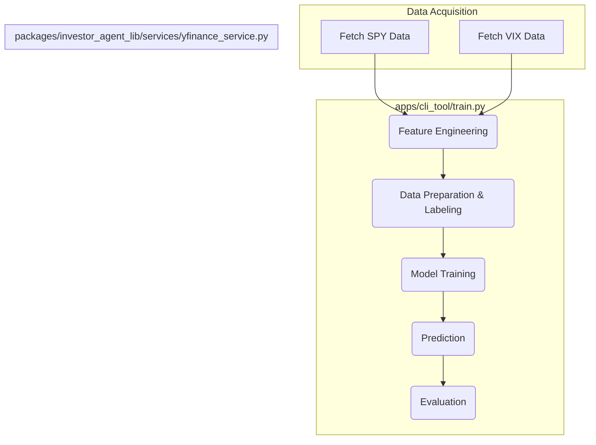

# Project Plan: SPY 10-Day Trend Prediction (Final)

This plan outlines the steps to build a machine learning pipeline to predict the 10-day trend of the SPY ETF, incorporating the VIX index as a feature.

## 1. Core Components & Architecture

The architecture is a clear pipeline from data acquisition to evaluation, primarily implemented in `apps/cli_tool/train.py`.

## 2. Detailed Breakdown

### Step 1: Data Acquisition
*   **Sources:**
    1.  Daily OHLCV data for 'SPY'.
    2.  Daily OHLCV data for '^VIX' (the VIX index ticker on Yahoo Finance).
*   **Implementation:** Use `get_price_history(ticker, period='5y', raw=True)` from `packages/investor_agent_lib/services/yfinance_service.py` for both tickers. The two datasets will be merged on the date index.

### Step 2: Feature Engineering
*   **Sliding Window:** **20-day** sliding window.
*   **Features:**
    *   **SPY Technical Indicators:** RSI (14), MACD, ADX (14), CCI (14), Bollinger Bands (20, 2), ATR (14), OBV.
    *   **SPY Lag Features:** Lagged returns for the past 1, 3, and 5 days.
    *   **VIX Features:** The VIX closing price and its 1, 3, and 5-day lagged values will be added as features.

### Step 3: Label Definition
*   **Prediction Target:** The trend over the **next 10 trading days**.
*   **Definition:** For each day `t`, the label is determined by the price change between `Close_t` and `Close_t+10`.
    *   **Up (2):** `(Close_t+10 - Close_t) / Close_t > 3%`
    *   **Down (0):** `(Close_t+10 - Close_t) / Close_t < -3%`
    *   **Sideways (1):** Otherwise

### Step 4: Data Preparation
*   **Process:** Iterate through the merged historical data, creating feature vectors from the 20-day window and pairing them with the corresponding 10-day forward-looking label.
*   **Data Split:** Random 80/20 split: 80% for training and 20% for testing.

### Step 5: Model Training
*   **Model:** `XGBoost Classifier` (`xgboost.XGBClassifier`).
*   **Process:** Train the model on the prepared training data. Use cross-validation to tune hyperparameters for optimal performance.

### Step 6: Prediction & Evaluation
*   **Prediction:** Use the trained model to predict the 10-day trend on the unseen test data.
*   **Evaluation Metrics:**
    *   Classification Report (Precision, Recall, F1-score)
    *   Confusion Matrix
    *   Overall Accuracy