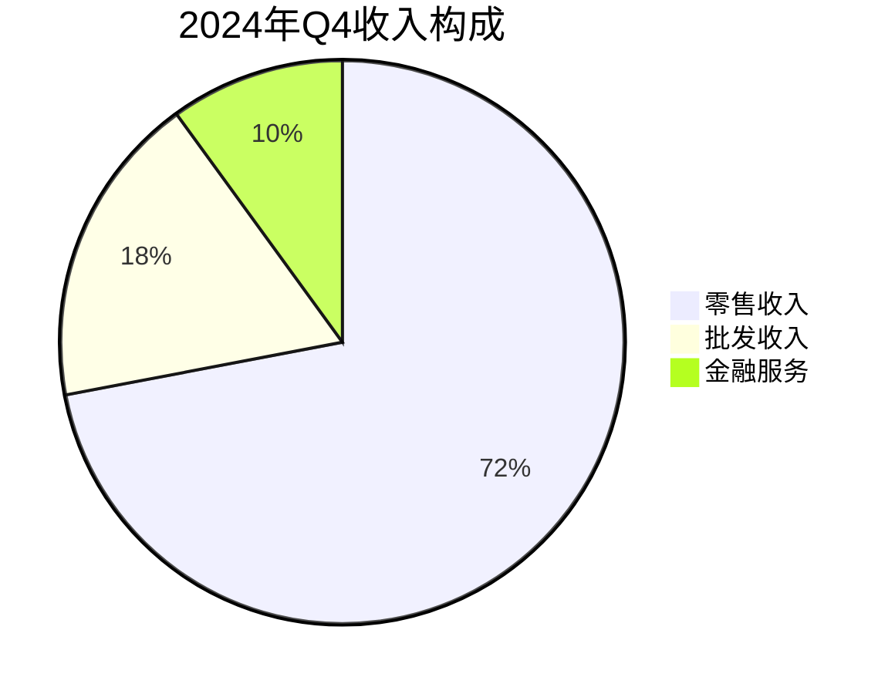
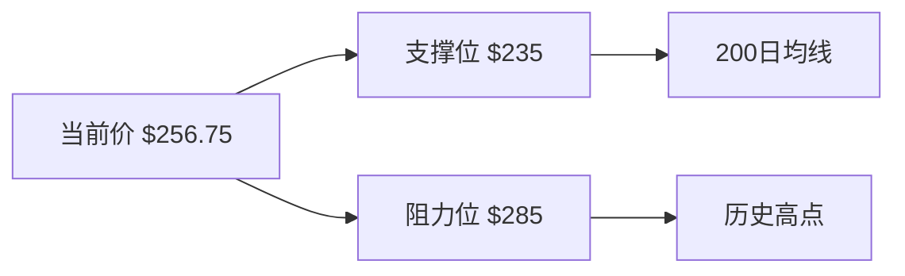
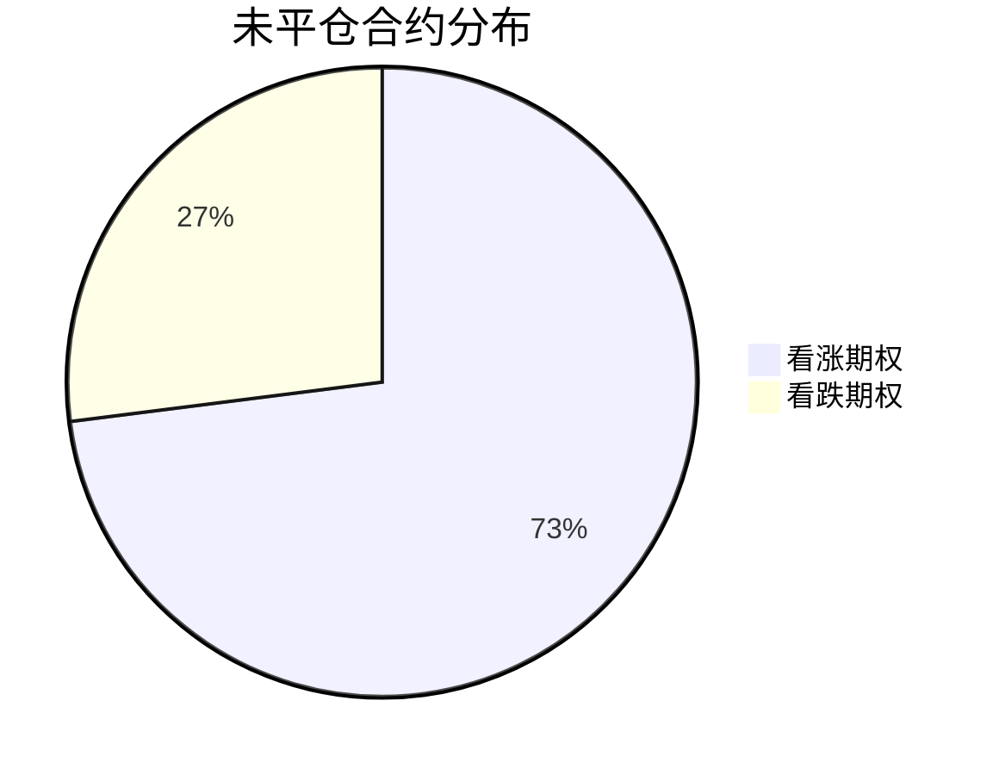

# Carvana (CVNA) 深度研究报告

## 核心财务指标

## 技术分析

## 期权市场

## 完整分析内容

### 一、商业模式优势
1. 全数字化交易流程
2. 专利汽车自动售货机提升品牌认知
3. 垂直整合供应链(检测/翻新/物流/金融)

### 二、财务表现
| 指标         | 2024Q4 | 2023Q4 | 变化 |
|--------------|--------|--------|------|
| 收入(亿美元) | 35.2   | 24.1   | +46% |
| 毛利率       | 21.8%  | 18.3%  | +350bps |
| 调整后EBITDA | 3.84   | 0.45   | +753% |

### 三、风险因素
1. 高估值风险(PE 161)
2. 债务负担(负债权益比444.58)
3. 经济衰退对二手车需求影响

### 四、操作建议
1. 短期关注5月7日财报表现
2. 突破285美元可上看320目标位
3. 长期需观察库存周转和毛利率变化