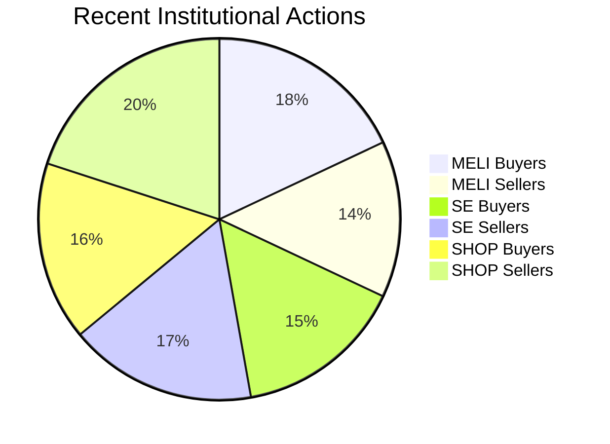
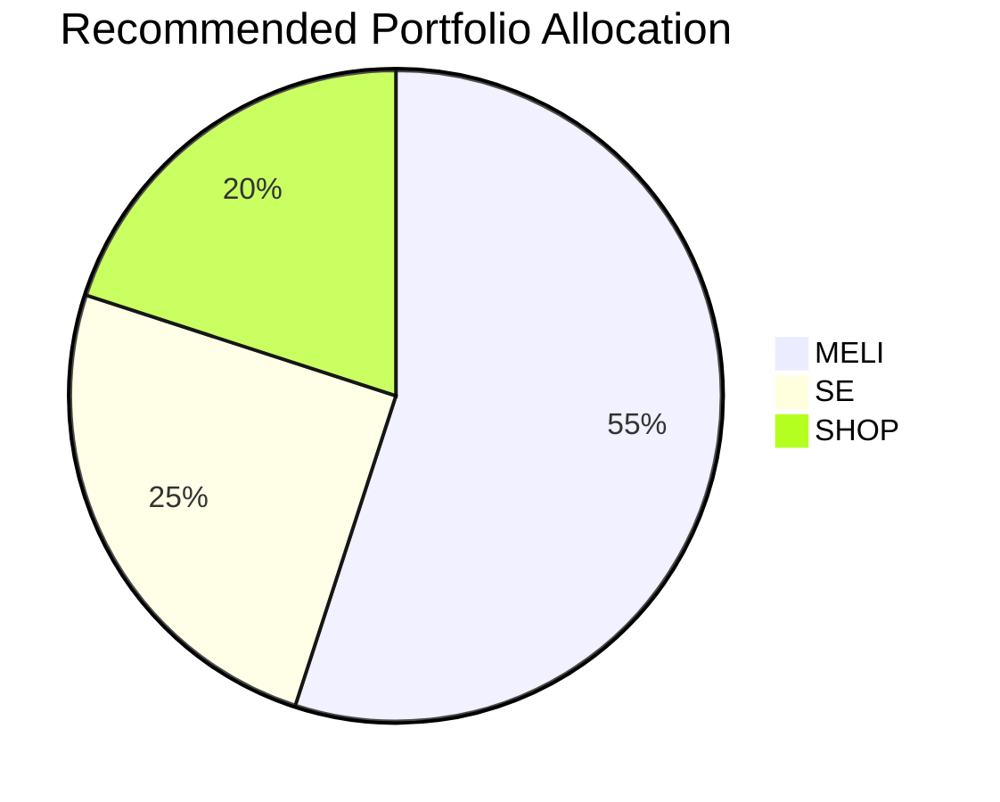

# Comparative Analysis Report: MELI vs SE vs SHOP (2025-05-04)

## 1. Fundamental Analysis

```vega-lite
{
  "$schema": "https://vega.github.io/vega-lite/v5.json",
  "description": "Fundamental Metrics Comparison for MELI, SE, and SHOP",
  "data": {
    "values": [
      {"Metric": "Revenue Growth", "Company": "MELI", "Value": 51.5},
      {"Metric": "Revenue Growth", "Company": "SE", "Value": 5.9},
      {"Metric": "Revenue Growth", "Company": "SHOP", "Value": 19.6},
      {"Metric": "Profit Margin", "Company": "MELI", "Value": 9.2},
      {"Metric": "Profit Margin", "Company": "SE", "Value": 2.6},
      {"Metric": "Profit Margin", "Company": "SHOP", "Value": 22.7},
      {"Metric": "P/E Ratio", "Company": "MELI", "Value": 60.6},
      {"Metric": "P/E Ratio", "Company": "SE", "Value": 191.6},
      {"Metric": "P/E Ratio", "Company": "SHOP", "Value": 64.0}
    ]
  },
  "mark": "bar",
  "encoding": {
    "x": {"field": "Company", "type": "nominal", "axis": null},
    "y": {"field": "Value", "type": "quantitative"},
    "color": {"field": "Company", "type": "nominal"},
    "column": {"field": "Metric", "type": "nominal", "header": {"titleOrient": "bottom", "labelOrient": "bottom"}}
  },
  "config": {
    "categoryField": {"title": "Metric"}
  },
  "width": 100
}
```
- MELI shows highest revenue growth (51.5% ROE) but moderate profit margin (9.2%)
- SHOP has strongest profitability (22.7% margin) but faces tariff risks
- SE has weakest fundamentals (5.9% ROE) with excessive valuation (191.6 P/E)

## 2. Technical Analysis

- SE had strongest rally (+112.7%) but with high volatility (43.4%)
- MELI showed steady growth (+39.9%) with better risk-adjusted returns
- SHOP struggled with -47.5% max drawdown despite 33.3% annual gain

## 3. Institutional Activity



Key Observations:
- MELI saw net institutional accumulation (+10)
- SE had slight institutional selling (-4)
- SHOP experienced significant institutional outflow (-10)

## 4. Market Sentiment

- CNN Fear & Greed Index: 42 (Fear)
- MELI: Most positive analyst sentiment (85% Buy ratings)
- SE: Mixed reviews despite price surge
- SHOP: Growing concerns about tariff impacts

## 5. Investment Recommendation



### Key Rationale:
1. MELI (55%):
   - Strongest fundamental growth story
   - Technical breakout confirmation
   - Least affected by tariffs

2. SE (25%):
   - High-risk/high-reward proposition
   - Requires close monitoring of profitability
   - Technical overbought signals emerging

3. SHOP (20%):
   - Valuation more attractive after pullback
   - Needs confirmation of trend reversal
   - Highest sensitivity to macro conditions

## 6. Risk Management Parameters

| Stock | Stop-loss | Take-profit | Key Levels to Watch |
|-------|-----------|-------------|----------------------|
| MELI  | $2150     | $2500       | $2400 resistance     |
| SE    | $130      | $160        | $145 support         |
| SHOP  | $95       | $120        | $105 resistance      |

Report generated at: 2025-05-04 18:46 SGT