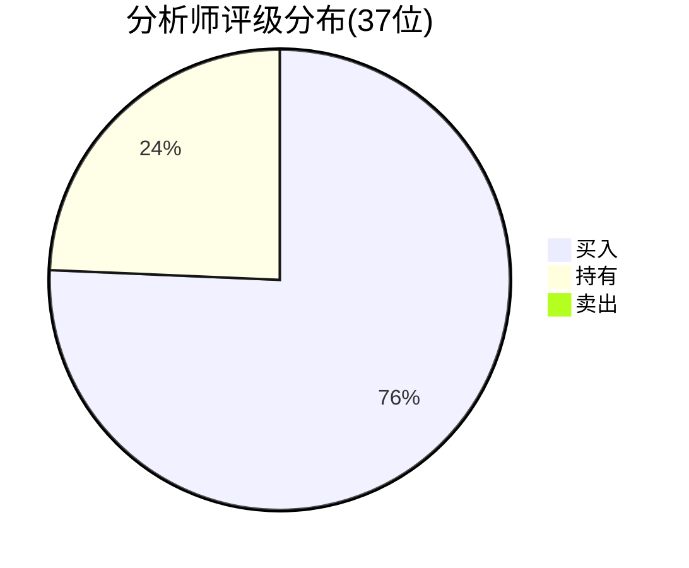
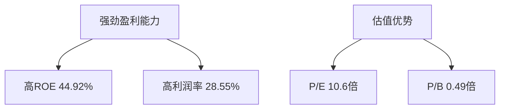
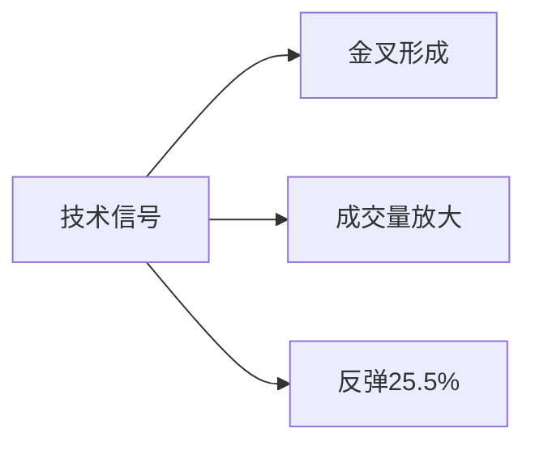

# PDD Holdings Inc. (拼多多) 深度分析报告

**报告日期**：2025年5月3日  
**当前股价**：$110.92  
**分析师平均目标价**：$150.05  



## 一、核心投资亮点

1. **财务指标优异**
   - ROE: 44.92%
   - 净利润率: 28.55% 
   - 当前P/E: 10.6倍 (行业平均: 25.3倍)

2. **业务策略调整**
   - Temu应对关税措施：
     - 停止中国直邮
     - 增加130-150%进口费用
   - 国内下沉市场渗透率持续提升

## 二、多维分析

### 1. 基本面分析



### 2. 技术面分析

- **关键指标**:
  - 50日均线: $110.05
  - 200日均线: $115.10
  - 近期区间: $88.35 - $130.92



### 3. 宏观环境

- **美国零售销售**:
  ```mermaid
  xychart-beta
    title  "美国零售销售(十亿美元)"
    x-axis [2024-06, 2024-09, 2024-12, 2025-03]
    line [598.0, 608.7, 622.4, 625.7]    
  ```

- **市场情绪**: 
  - CNN恐惧贪婪指数: 42(中性)

## 三、投资建议

### 目标价区间
- **3个月**: $130-$150 (+17%至35%)
- **6个月**: $150-$170

### 操作策略
1. **建仓区间**: $105-$115
2. **加仓信号**: 突破$115(200日均线)
3. **止损位**: $95-$100

### 风险提示
1. 中美贸易政策变化
2. 国内电商竞争加剧
3. 用户增长放缓

## 四、分析过程记录

### 数据收集时间线
1. 15:37: 获取PDD基本面数据
2. 15:37: 抓取CNBC最新财经新闻
3. 15:38: 检索FRED零售销售数据
4. 15:38: 计算技术指标(SMA50/200)

### 关键分析节点
- 发现P/B仅0.49倍，严重低于行业平均
- Temu关税调整策略已提前布局
- 50日均线上穿形成金叉
- 零售数据超预期显示消费韧性