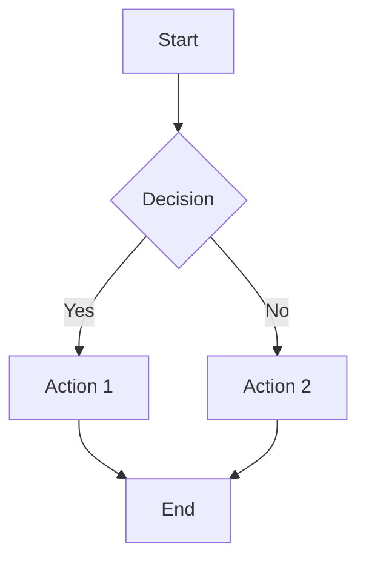

# Visualization Examples

## Mermaid Example



## Vega-Lite Example

```vega-lite
{
  "$schema": "https://vega.github.io/schema/vega-lite/v5.json",
  "description": "A simple bar chart with embedded data.",
  "data": {
    "values": [
      {"category": "A", "value": 28},
      {"category": "B", "value": 55},
      {"category": "C", "value": 43},
      {"category": "D", "value": 91}
    ]
  },
  "mark": "bar",
  "encoding": {
    "x": {"field": "category", "type": "nominal", "axis": {"labelAngle": 0}},
    "y": {"field": "value", "type": "quantitative"}
  },
  "width": 400
}
```
