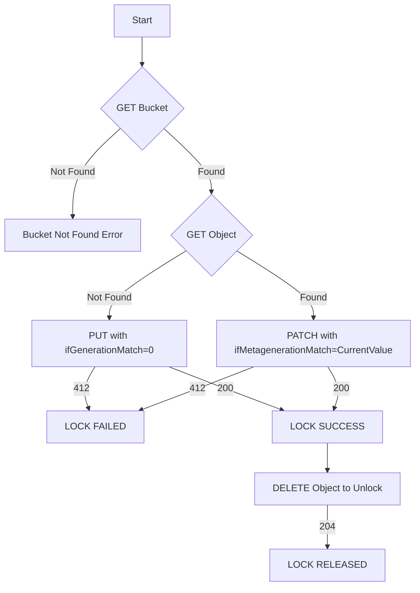

# gcs-atomic-lock

Google Cloud Storage (GCS) object generations and metagenerations are used to implement a lightweight distributed lock with strong, atomic semantics. This library wraps the key conditional operations and provides a simple Python API (context manager) to acquire and release a lock stored as a GCS object.

- Language: Python 3.10
- Package manager: uv
- Status: Library + unit tests
- License: See LICENSE

## Why use this?

- Atomic lock acquisition via GCS conditional writes (`ifGenerationMatch=0`)
- Lock extension/update using metageneration preconditions (`ifMetagenerationMatch`)
- Simple Pythonic API (with-context)
- Pluggable access layer for HTTP/credential handling
- Helpful exceptions and logging
- Optional in-memory TTL map to minimize redundant work

## How it works (high level)

1. Check lock object
   - GET the lock object in the bucket.
   - If not found → lock appears free (or expired; see metadata).
   - If found → read `generation`, `metageneration`, `metadata`.

2. Try to acquire (create) the lock
   - PUT (or upload) with `ifGenerationMatch=0`.
   - If the object already exists, GCS returns 412 Precondition Failed → lock acquisition fails.
   - If created (200 OK), you hold the lock.

3. Update metadata (optional/renew)
   - PATCH the object with `ifMetagenerationMatch=<current>`.
   - If someone else updated it in between, 412 is returned → treat as contention.
   - On success (200 OK) → your lock metadata (e.g., owner, expiry) is updated.

4. Release the lock
   - DELETE the object to unlock (204 No Content on success).
   - Optionally validate ownership based on stored metadata before deleting.

## Flow


## Installation
```shell
pip install gcslock
```

## Example
```python
from gcslock import GcsLock, LockState
from gcslock.exception import GcsLockError

BUCKET = "your-bucket-name"
OBJECT = "locks/my-resource.lock"
OWNER = "your-owner-id"
LOCK_EXPIRES_SEC = 60

lock = GcsLock(BUCKET, OBJECT, lock_owner=OWNER)

try:
    with lock.acquire(lock_id=OBJECT, expires_seconds=LOCK_EXPIRES_SEC) as lock:
        # Critical section
        ...
except GcsLockError as e:
    print(f"Lock error: {e}")
```
