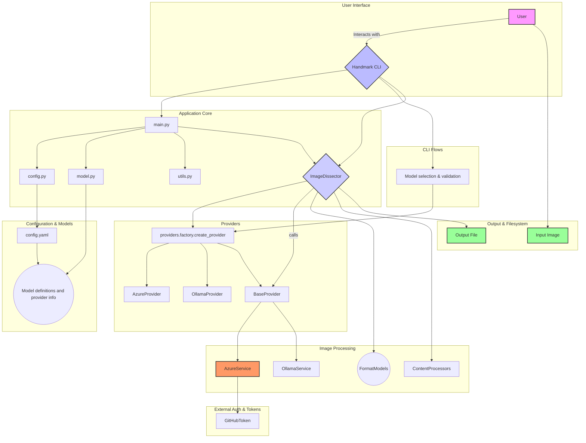

# Handmark

**Handmark** is a Python CLI tool that converts handwritten notes from images into structured documents. It supports multiple AI providers (Azure AI and Ollama) and output formats (Markdown, JSON, YAML, XML), making it easy to digitize handwritten content with flexible processing options.

[](LICENSE)
[](https://github.com/devgabrielsborges/handmark)

---

## Architecture



---

## Features

* 🖼️ **Multi-Format Document Generation** - Transform handwritten notes into Markdown, JSON, YAML, or XML
* 🧠 **Intelligent Title Extraction** - Automatically detects and extracts titles from content for smart file naming
* ⚡ **Easy CLI Interface** - Simple, intuitive commands with rich console output and comprehensive error handling
* 🤖 **Dual AI Provider Support** - Choose between Azure AI (remote) or Ollama (local) for processing
* 🔧 **Advanced Model Configuration** - Select from multiple AI models with availability validation
* 🔐 **Secure Authentication** - GitHub token-based authentication with secure local storage
* 📁 **Flexible Output** - Customize output directory and filename options with intelligent fallbacks
* ⚙️ **YAML Configuration** - Centralized configuration via `config.yaml` for easy customization
* 🎯 **Multiple Output Formats** - Support for Markdown, JSON, YAML, and XML output formats with format-specific processing
* 🏠 **Local Processing Option** - Use Ollama for completely local, offline image processing
* 🔄 **Provider Factory Pattern** - Automatic provider selection based on model configuration and availability

---

## Quick Start

1. **Install Handmark:**

   ```bash
   pip install handmark
   ```
2. **Configure authentication:**

   ```bash
   handmark auth
   ```
3. **Process your first image:**

   ```bash
   handmark digest path/to/your/image.jpg
   ```

That's it! Your handwritten notes will be converted to a Markdown file.

---

## Installation

### Requirements

- Python 3.10 or higher
- A GitHub token (for Azure AI access)

### Install from PyPI

```bash
pip install handmark
```

### Install with uv (recommended)

```bash
uv pip install handmark
```

### Install from source

```bash
git clone https://github.com/devgabrielsborges/handmark.git
cd handmark
pip install -e .
```

---

## Usage

### Getting Started

Before processing images, you need to configure authentication:

```bash
handmark auth
```

This will prompt you to enter your GitHub token, which provides access to Azure AI services.

### Commands Overview

| Command                      | Description                                                      |
| ---------------------------- | ---------------------------------------------------------------- |
| `handmark digest <image>`  | Convert handwritten image to specified format (MD/JSON/YAML/XML) |
| `handmark auth`            | Configure GitHub token authentication                            |
| `handmark set-model`       | Select and configure AI model (Azure/Ollama)                     |
| `handmark config`          | View current configuration settings                              |
| `handmark status`          | Check provider availability and model status                     |
| `handmark test-connection` | Test connection to AI service                                    |
| `handmark --version`       | Show version information                                         |

### Process an Image

```bash
handmark digest <image_path> [options]
```

**Options:**

* `-o, --output <directory>` - Specify output directory (default: current directory)
* `-f, --format <format>` - Output format: markdown, json, yaml, xml (default: markdown)
* `--filename <name>` - Custom output filename (default: auto-generated)

**Examples:**

```bash
# Basic usage - process image to markdown
handmark digest samples/prova.jpeg

# Custom output format
handmark digest samples/prova.jpeg -f json

# Custom output directory and format
handmark digest samples/prova.jpeg -o ./notes -f yaml

# Custom filename with XML format
handmark digest samples/prova.jpeg --filename lecture-notes.xml -f xml

# All options combined
handmark digest samples/prova.jpeg -o ./outputs --filename my-notes.json -f json
```

#### Supported Image Formats

Handmark supports common image formats including:

* JPEG/JPG
* PNG
* And other formats supported by Azure AI Vision

### Configure Authentication

```bash
handmark auth
```

This will prompt you to enter your GitHub token, which is required for Azure AI integration. The token is securely stored in a `.env` file in the project directory.

### Configure Model

```bash
handmark set-model
```

This command lets you select and configure the AI model used for image processing. You can choose from:

* **Azure AI Models (Remote)** - GitHub token-based access to cloud models
* **Ollama Models (Local)** - Locally installed models for offline processing

The system will show model availability and guide you through installation if needed. Your selection will be saved for future runs. If no model is configured, the system will use a default Azure model.

### Check Provider Status

```bash
handmark status
```

This command shows the availability of both Azure and Ollama providers, installed models, and current configuration status.

### Check Version

```bash
handmark --version
```

---

## Configuration

Handmark uses a centralized YAML configuration system that allows you to customize:

* **AI model prompts** - Customize how the AI processes your images
* **Output format settings** - Configure file extensions, content types, and format-specific options
* **Available models** - Add or modify the list of AI models
* **Default settings** - Set default output formats and directories

### Configuration File

The main configuration is stored in `config.yaml` in the project root. You can customize:

```yaml
# Example customizations
formats:
  markdown:
    system_message_content: "Custom prompt for better academic note processing"
    user_message_content: "Convert this academic content with proper citations"

available_models:
  - name: "custom/model"
    pretty_name: "Custom Model"
    provider: "Custom Provider"
    rate_limit: "100 requests/day"
```

### Configuration Commands

* `handmark config` - View current configuration

For detailed configuration options, see [CONFIG.md](CONFIG.md).

---

## Example

Here's a real-world example of Handmark in action:

**Input image** (`samples/prova.jpeg`):


**Command used:**

```bash
handmark digest samples/prova.jpeg -f markdown
```

**Output** (`primeiro-exercicio-escolar-2025-1.md`):

```markdown
# Primeiro Exercício Escolar - 2025.1

Leia atentamente todas as questões antes de começar a prova. As respostas obtidas somente terão validade se respondidas nas folhas entregues. Os cálculos podem ser escritos à lápis e em qualquer ordem. Evite usar material diferente do que foi apresentado em sala ou justifique o material extra adequadamente para validá-lo. Não é permitido uso de celular ou calculadora.

1. (2 pontos) Determine a equação do plano tangente a função $f(x,y) = \sqrt{20 - x^2 - 7y^2}$ em (2,1). Em seguida, calcule um valor aproximado para $f(1,9 , 1,1)$.

2. (2 pontos) Determine a derivada direcional de $f(x,y) = (xy)^{1/2}$ em $P(2,8)$, na direção de $Q(5,4)$.

3. (2 pontos) Determine e classifique os extremos de $f(x,y) = x^4 + y^4 - 4xy + 2$

4. (2 pontos) Usando integrais duplas, calcule o volume acima do cone $z = (x^2 + y^2)^{1/2}$ e abaixo da esfera $x^2 + y^2 + z^2 = 1$

5. (2 pontos). Sabendo que $E$ é o volume delimitado pelo cilindro parabólico $z = 1 - y^2$, e pelos planos $z = 0$, $x = 1$, $x = -1$, apresente um esboço deste volume e calcule a integral tripla.

$$\iiint_E x^2e^y dV$$
```

**Alternative output formats:**

```bash
# Generate JSON format
handmark digest samples/prova.jpeg -f json --filename exam-content.json

# Generate YAML format  
handmark digest samples/prova.jpeg -f yaml -o ./structured-notes

# Generate XML format with custom filename
handmark digest samples/prova.jpeg -f xml --filename exam-questions.xml
```

The output filename is automatically derived from the detected title, and the content is processed according to the selected format with proper validation and formatting.

---

## Troubleshooting

### Common Issues

**Authentication Error:**

```text
Error: GitHub token not configured or invalid
```

**Solution:** Run `handmark auth` to configure your GitHub token.

**Image Format Error:**

```text
Error: Unsupported image format
```

**Solution:** Ensure your image is in a supported format (JPEG, PNG, etc.).

**Timeout Error:**

```bash
HTTPSConnectionPool(host='models.github.ai', port=443): Read timed out
```

**Solution:** The AI service might be experiencing high load. Try:

* Wait a few minutes and retry
* Use a different model with `handmark set-model`
* Check service status with `handmark test-connection`
* Consider using local Ollama models for offline processing

**No Model Configured Warning:**

```bash
No model configured. Using default model
```

**Solution:** Run `handmark set-model` to select your preferred AI model.

**Ollama Service Issues:**

```text
Ollama service is not running
```

**Solution:** Install and start Ollama service:

* Visit [ollama.com](https://ollama.com) for installation
* Start the service and pull vision models: `ollama pull llama3.2-vision`
* Check status with `handmark status`

### Getting Help

* Check the [issues page](https://github.com/devgabrielsborges/handmark/issues) for known problems
* Create a new issue if you encounter a bug
* Use `handmark --help` for command-line help
* Use `handmark test-connection` to diagnose connection issues

---

## Development

### Prerequisites

- Python 3.10 or higher
- A GitHub token for Azure AI integration
- `uv` (recommended) or `pip` for package management

### Setup

1. **Clone the repository:**

   ```bash
   git clone https://github.com/devgabrielsborges/handmark.git
   cd handmark
   ```
2. **Install dependencies:**

   ```bash
   # Using uv (recommended)
   uv pip install -e .

   # Or using pip
   pip install -e .
   ```
3. **Configure for development:**

   ```bash
   handmark auth  # Configure your GitHub token
   handmark conf  # Select preferred AI model
   ```

### Project Structure

- `src/` - Source code
  - `main.py` - CLI interface and command handlers
  - `dissector.py` - Image processing and Azure AI API interaction
  - `model.py` - AI model management and configuration
  - `utils.py` - Helper functions and utilities
- `samples/` - Sample images for testing and demonstration
- `tests/` - Comprehensive unit tests
- `.github/` - GitHub workflows and project instructions

---

---

## Contributing

Contributions are welcome! Please feel free to:

* Open an issue for bug reports or feature requests
* Submit a pull request with improvements
* Help improve documentation
* Share examples of your handwritten notes processed with Handmark

### Development Workflow

1. Fork the repository
2. Create a feature branch (`git checkout -b feature/amazing-feature`)
3. Make your changes
4. Add tests if applicable
5. Commit your changes (`git commit -m 'Add amazing feature'`)
6. Push to the branch (`git push origin feature/amazing-feature`)
7. Open a Pull Request

---

## License

This project is licensed under the MIT License - see the [LICENSE](LICENSE) file for details.

## Author

* Gabriel Borges ([@devgabrielsborges](https://github.com/devgabrielsborges))
