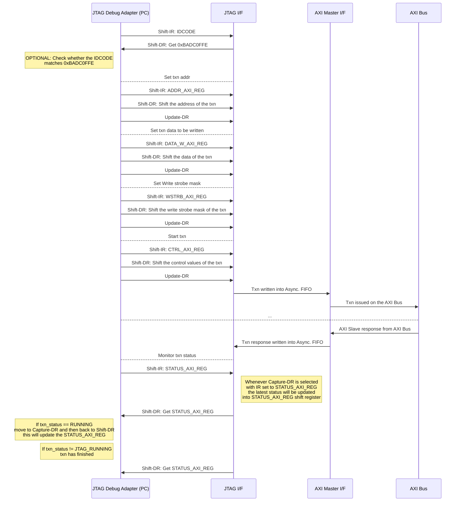
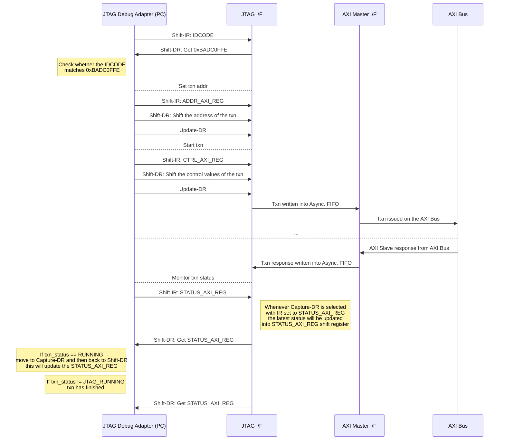

[](https://github.com/aignacio/jtag_axi/actions/workflows/test.yaml) [](https://github.com/aignacio/jtag_axi/actions/workflows/lint.yaml)
# JTAG to AXI master

## Table of Contents
* [Introduction](#intro)
* [Design details](#desc)
* [JTAG Data registers](#jdrs)
	* [Encoding of AXI registers](#axi_drs)
		* [STATUS_AXI_REG](#status_axi)
		* [CTRL_AXI_REG](#ctrl_axi)
* [AXI write/read flow operation](#axi_flow)
* [Test JTAG_AXI with urjtag](#urjtag_detect)
* [License](#lic)

---------------------------------------------

## <a name="intro"></a> Introduction

This design implements a JTAG ([IEEE 1149.1-2013](https://standards.ieee.org/ieee/1149.1/4484/)) interface that is capable of dispatching AXI Lite transactions into an AXI bus. As an AXI master, there are several applications that can be build with it, however, its primary intentions are:

1. To debug SoC peripherals connected to an AXI bus - dispatch read / write single beat burst AXI transactions.
2. Program memories in SoCs to act as a bootloader.
3. Can be used to drive reset IOs through `IC_RESET` output with variable width.
4. User can also set/tie the `USERCODE` to any 32-bit internal design value and read through the JTAG Data Registers.
5. Through `USERDATA` it is possible drive values which could be used to implement some protocol/logic within its integration.

**Note:** For the 2) this requires a JTAG SW lib that can interface with the debug adapter through a fast handle, maybe a low level API in C/C++ that communicates with the debug adapter . The python package developed within this repository (discussed later) uses [pyftdi](https://pypi.org/project/pyftdi/) to interface with the design and it is not capable of dispatching JTAG reads/write through a reasonable speed, which makes the read/writes process through JTAG slow and not so recommended to use to act as bootloader.

## <a name="desc"></a> Design details


The design is divided into two clocks domains as indicated by the diagram above, the JTAG clock domain (tck) and the AXI clock domain. In order to exchange data between the two clock domains 3x AFIFOs are used along with some other CDC 2FF modules for discrete signals.

In the [TAP wrapper](https://github.com/aignacio/jtag_axi/blob/main/rtl/jtag_axi_tap_wrapper.sv) all the JTAG-specific logic is implemented such as the instruction register, the data registers and the TAP fsm following all the standard 16-states. In order to optmise the ammount of logic involved for the data registers, a single [shift register](https://github.com/aignacio/jtag_axi/blob/main/rtl/jtag_axi_data_registers.sv#L60) is defined where its length will depend on the [widest data register to shift](https://github.com/aignacio/jtag_axi/blob/main/rtl/jtag_axi_data_registers.sv#L47). Thus whenever data needs to be shifted in or out, it will use this register entirely or some bits starting from the LSB as the "*exchange*" register. 

For the AXI logic segment, the [dispatch module](https://github.com/aignacio/jtag_axi/blob/main/rtl/jtag_axi_dispatch.sv) encompasses all the required CDC handshake along with the logic that is necessary to drive the AXI master signals. In the [AXI IF](https://github.com/aignacio/jtag_axi/blob/main/rtl/jtag_axi_if.sv), the design receives the requests through the AFIFO and drives the proper AXI channel with the values set by the user, the master ID is set through a parameter called AXI_MASTER_ID on the top of the design instantiation. Following the standard, each AXI channel is individually controlled its **valid** & **ready** handshake, with a causality effect on the respective response channel. For instance, the master will be available only for the response of the respective type of AXI transaction dispatched thus if a read is issued, the [axi.rready](https://github.com/aignacio/jtag_axi/blob/main/rtl/jtag_axi_if.sv#L106) == 1 only when handshake through address channel happens first, that simplifies the general handling logic. Same happens for writes with [axi.bready](https://github.com/aignacio/jtag_axi/blob/main/rtl/jtag_axi_if.sv#L121). 

By default all the `AFIFO`s have [4x slots](https://github.com/aignacio/jtag_axi/blob/main/rtl/include/jtag_axi_pkg.sv#L10) depth which means that up to 4x outstanding transactions can be issued in a row through the `JTAG_AXI` design, however, the python package discussed below and the UML diagrams are suggesting single reads and writes to simplify the general understanding. This means that if the user understand the design well enough, it is possible to create an API that issues 4x reads / writes in-order in a row to speedup the general throughput of the design. The interface module also [keeps track](https://github.com/aignacio/jtag_axi/blob/main/rtl/jtag_axi_dispatch.sv#L100) of the no of OT (outstanding txns) that are issued in order to flag whether the JTAG is running or command processing has been finished.

Each AXI channel has a valid / ready [timeout monitor](https://github.com/aignacio/jtag_axi/blob/main/rtl/jtag_axi_if.sv#L224-L233) to indicate when the AXI bus / slave does not reply within a certain window. It is recommended that both resets are issued if a timeout happens in any of the channels to make sure the design is into a *know-state*. The timeout value is configurable through a parameter as well.

## <a name="jdrs"></a> JTAG Data Registers

This design follows the JTAG ([IEEE 1149.1-2013](https://standards.ieee.org/ieee/1149.1/4484/)) standard by implementing a **TAP** (Test Access Port, **instruction register** and **data registers**. However, there are some exceptions in the design, for instance the *boundary scan* feature is not implemented. The instruction register is capable of decoding `EXTEST` and `SAMPLE_PRELOAD` but the BS features are not part of the original plan, there is a specific encoding for these but it is not an intention to implement at this point (maybe in future). Additionally, other features such as `BYPASS` and `IDCODE` are both implemented, the bypass works similar to any JTAG device where the device will delay the tdi>tdo shifting by a single clock cycle. In terms of encoding for the idcode, the design does not follow the manufacturer / product codes available, instead it is configured by the top parameter `IDCODE_VAL`.

The list of JTAG Data Registers is available below with their respective encodings, acces control and bit length. As mentioned before, `EXTEST` and `SAMPLE_PRELOAD` are not implemented, they are both listed because its encoding is available in the IR (Instruction Register) but there is not a correspondent register to be shifted out. For the `SAMPLE_PRELOAD`, if selected through the IR, it'll work as a bypass SR (Shift Register) with length equal to the width of the main SR in the design.

One of the JTAG Data Register that has external I/F is the `IC_RESET`, this register has its size configurable through the parameter `IC_RST_WIDTH` and can be used to drive the resets within the circuitry in a digital design. In order to change its value, the user needs to *shift_ir* == `IC_RESET` encoding, then switch the TAP state to *shift_dr* where it can start shifting data in the register. Once it is done, the value will get reflected in the `IC_RESET` register when the TAP fsm reaches the state *update_dr*. The same approach should be used to all registers (shift_ir > shift_dr) like any JTAG device, below details are considering the user assumes all other data registers are following the same procedure.

Both `IDCODE` and `BYPASS` as previously mentioned will follow the JTAG standard so nothing differs from the spec. The `USERCODE` was added to allow the designer to add some specific information about its design by driving a 32-bit value on the *jtag_axi.usercode_i*, when IR == `USERCODE`, and the TAP fsm switches to the state *update_dr*, the *jtag_axi.usercode_update_o* will switch high (1) till the fsm moves out of this state. That was designed in case the user wants to update the *jtag_axi.usercode_i* after its read.

The `USERDATA` is a configurable width register that can be used to shift data inside the design where some logic can process through the design output *jtag_axi.userdata_o*. Similar to the `USERCODE`, an output *jtag_axi.userdata_update_o* is available that is asserted when the `USERDATA` register is updated.

|    **Name**    | **Encoding (4 bits)** | **Access (RW/RO)** |        **Bit length**        |                       **Description**                       |
|:--------------:|:---------------------:|:------------------:|:----------------------------:|:-----------------------------------------------------------:|
|     EXTEST     |          0000         |         TBD        |              TBD             |                             TBD                             |
| SAMPLE_PRELOAD |          1010         |         TBD        |    As long as the main SR    |                         No fn - TBD                         |
|    IC_RESET    |          1100         |         RW         |     IC_RST_WIDTH - Def. 4    | Programmable register to be used to control external resets |
|     IDCODE     |          1110         |         RO         |              32              |        Returns the IDCODE of the device - 0xBADC0FFE        |
|     BYPASS     |          1111         |         RW         |               1              |                Standard bypass JTAG register                |
|  ADDR_AXI_REG  |          0001         |         RW         |   ADDR_AXI_WIDTH - Def. 32   |         Indicates the AXI address of the transaction        |
| DATA_W_AXI_REG |          0010         |         RW         |   DATA_AXI_WIDTH - Def. 32   |             Indicates the AXI data to be written            |
|  WSTRB_AXI_REG |          0011         |         RW         |   AXI_DATA_WIDTH/8 - Def. 4  |                    AXI Write strobe mask                    |
|  CTRL_AXI_REG  |          0100         |         RW*        |               8              |               Controls AXI master I/F dispatch              |
| STATUS_AXI_REG |          0101         |         RO         | AXI_DATA_WIDTH + 4 - Def. 36 |           Return the status of the AXI transaction          |
|    USERCODE    |          0111         |         RO         |              32              |                 User input for design values                |
|    USERDATA    |          0110         |         RW         |    USERDATA_WIDTH - Def. 4   |                  User programmable register                 |

***Note**: CTRL_AXI_REG not all registers are RW, more info below.

### <a name="axi_drs"></a> Encoding of AXI registers

Some **AXI**  data registers such as `CTRL_AXI_REG` and `STATUS_AXI_REG` follow a specific format and the its encoding is detailed down below.

#### <a name="status_axi"></a> STATUS_AXI_REG

This register stores the data that is read on AXI read commands and the status of the last transaction issued in order.

| **STATUS_AXI_REG** |                                  **AXI Data Read<br>(32 bits)**                                 |       [**Status<br>(4 bits)**](https://github.com/aignacio/jtag_axi/blob/dc0112d95418772c4b3647618037fcbd5ace4d63/rtl/include/jtag_axi_pkg.sv#L49)       |
|:------------------:|:-----------------------------------------------------------------------------------------------:|:----------------------------------:|
|      Bit order     |                                               MSB                                               |                 LSB                |
| **Access (RW/RO)** |                                                RO                                               |                 RO                 |
|   **Description**  | When read transaction is performed,<br>data read will be written here<br>in order as dispatched | Current status of last transaction |


##### Status encoding:

| **Status code** | **Status alias** |                                                                  **Description**                                                                  |
|:---------------:|:----------------:|:-------------------------------------------------------------------------------------------------------------------------------------------------:|
|        0        |     JTAG_IDLE    |                            That is the default state of the design when no <br>transactions (txn) have been dispatched                            |
|        1        |   JTAG_RUNNING   | When a transaction (txn) is started, the design will change to this state. <br>It should stay there until a response is received or it times out. |
|        2        |  JTAG_TIMEOUT_AR |                                         Indicates a transaction timeout in the AXI - Address Read channel                                         |
|        3        |  JTAG_TIMEOUT_R  |                                           Indicates a transaction timeout in the AXI - Read data channel                                          |
|        4        |  JTAG_TIMEOUT_AW |                                         Indicates a transaction timeout in the AXI - Address Write channel                                        |
|        5        |  JTAG_TIMEOUT_W  |                                          Indicates a transaction timeout in the AXI - Write data channel                                          |
|        6        |  JTAG_TIMEOUT_B  |                                        Indicates a transaction timeout in the AXI - Write response channel                                        |
|        7        |   JTAG_AXI_OKAY  |                                                     Indicates a transaction response: AXI OKAY                                                    |
|        8        |  JTAG_AXI_EXOKAY |                                                    Indicates a transaction response: AXI EXOKAY                                                   |
|        9        |  JTAG_AXI_SLVERR |                                                    Indicates a transaction response: AXI SLVERR                                                   |
|        10       |  JTAG_AXI_DECER  |                                                    Indicates a transaction response: AXI DECER                                                    |


#### <a name="ctrl_axi"></a> CTRL_AXI_REG

This register controls the dispatch of AXI transactions, when CTRL_AXI_REG.start is shift with value 1, it will start a new AXI transaction of type CTRL_AXI_REG.txn_type. The field *free_slots* indicates how many slots are available in the asynchronous FIFO used to handshake between the two clock domains. Lastly, the size_axi_txn follows the same encoding as the AXI specification, i.e data to be transfered == 2^ASIZE bytes. It is recommended for the user to always check the free slots before shifting new instructions to ensure no data is lost in case the AFIFO is full (outstanding txns are being processed). Typically that should not be a problem because JTAG runs in a slower frequency (~10MHz) than the internal logic.

|    CTRL_AXI_REG    |               **Start<br>(1 bit)**               | **Txn type<br>(1 bit)** |               **Free Slots<br>(3 bits)**              |               **Size AXI txn<br>(3 bits)**              |
|:------------------:|:------------------------------------------------:|:-----------------------:|:-----------------------------------------------------:|:-------------------------------------------------------:|
|      Bit order     |                        MSB                       |           ...           |                          ...                          |                           LSB                           |
| **Access (RW/RO)** |           RW          |            RW           |                           RO                          |                            RW                           |
|   **Description**  | Once written 1, dispatches<br>an AXI transaction |   1 - Write, 0 - Read   | Number of slots available<br>in the Asynchronous FIFO | Size of the AXI transaction<br>following AXIv4 encoding |

## <a name="axi_flow"></a> AXI write/read flow operation

In order to perform AXI writes and reads, the user needs to follow a specific JTAG sequence provided below. This sequence will ensure all correct fields are properly set before issuing the AXI master transaction downstream in the AXI bus where the *jtag_axi* master is connected to.

For a **write** sequence:


For a **read** sequence:


## <a name="jtag_axi_pypi"></a> Python package (jtag-axi)

In order to use this design with a real debug adapter, a simple python package was developed called [jtag-axi](https://pypi.org/project/jtag-axi/) which makes usage of the [pyftdi](https://pypi.org/project/pyftdi/) to communicate through FTDI compatible JTAG debug adapters. Some example ICs are listed as:

-   FT2232C/D (dual port, clock up to 6 MHz)
-   FT232H (single port, clock up to 30 MHz)
-   FT2232H (dual port, clock up to 30 MHz)
-   FT4232H (quad port, clock up to 30 MHz)
-   FT4232HA (quad port, clock up to 30 MHz)

JTAG-AXI Python Package `jtag-axi` is a Python package designed for interfacing AXI-based systems using JTAG through FTDI devices. It allows for reading and writing to memory through the JTAG-to-AXI bridge, utilizing the PyFTDI library for low-level JTAG communication. 

This package can be installed with:
```bash
pip install jtag-axi
```
#### Features

* Read and write operations to AXI memory space - 
* Built on top of PyFTDI for handling JTAG communication 

An example on how to use this package can be found in this repository on [`run_me.py`](run_me.py).

#### API

### `JtagToAXIFTDI`

The core class used to interface with JTAG-to-AXI hardware via an FTDI device. When instantiating the object, few input parameters are required to define the design details:

```python
from jtag_axi import JtagToAXIFTDI
...
jtag = JtagToAXIFTDI(
        device="ftdi://ftdi:2232/1", # Pointer to the FTDI device
        name: str = "JTAG to AXI IP", # Object name
        freq: int = 1e6, # JTAG frequency
        trst: bool = False, # trst available?
        debug: bool = False, # Enable debug info
        addr_width: int = 32, # AXI address witdh
        data_width: int = 32, # AXI data width
        async_fifo_depth: int = 4, # Number of AFIFO depth
        ic_reset_width: int = 4, # IC_RESET width
        userdata_width: int = 4, # USERDATA width
       )
```

#### Methods

-   `write_axi(address, data, size=None, wstrb=0xF)`: Writes data to a specified AXI address.
-   `read_axi(address, size=None)`: Reads data from a specified AXI address.
-   `reset()`: Resets the JTAG interface.
-   `write_ic_reset(value)`: Writes to the IC_RESET register.
-   `write_userdata(value)`: Writes to the USERDATA register.
-   `read_jdrs()`:  Reads all JTAG data registers

## <a name="urjtag_detect"></a> Test JTAG_AXI with urjtag

Once design is synthesized and you want to run a quick test to check whether the design works, try the commands below. It should indicate whether the correct `IDCODE` is read.
```bash
jtag
> cable jlink # or another debug adapter
> frequency 10000000
> detect
```

## <a name="lic"></a> License
`jtag_axi` is licensed under the permissive MIT license.Please refer to the [LICENSE](LICENSE) file for details.
