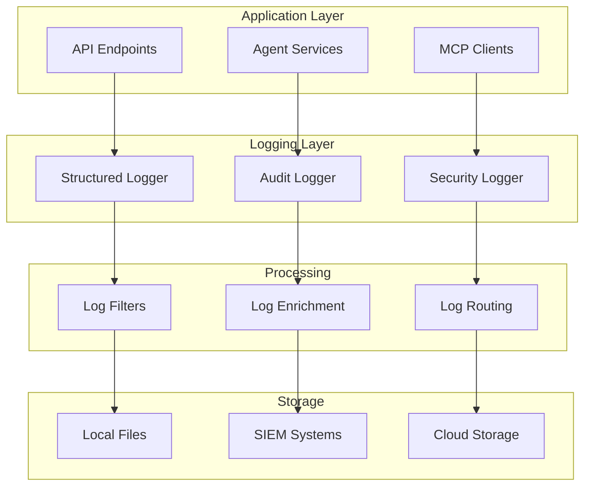

# 📝 Enterprise-Logging API

<!-- API aus Code generieren -->

::: enterprise_logging.EnterpriseLogger

::: enterprise_logging.LogContext

::: enterprise_logging.get_logger

::: enterprise_logging.configure_logging

## 🏗️ Logging-Architektur



## 📊 Logging-API

### Enterprise-Logger-Konfiguration

```python
import logging
import json
from datetime import datetime
from typing import Dict, Any, Optional
from enum import Enum

class LogLevel(Enum):
    DEBUG = "DEBUG"
    INFO = "INFO"
    WARNING = "WARNING"
    ERROR = "ERROR"
    CRITICAL = "CRITICAL"

class LogCategory(Enum):
    SYSTEM = "system"
    SECURITY = "security"
    AUDIT = "audit"
    PERFORMANCE = "performance"
    BUSINESS = "business"

class EnterpriseLogger:
    """Enterprise-Logger mit erweiterten Funktionen."""

    def __init__(self, service_name: str, version: str):
        self.service_name = service_name
        self.version = version
        self.logger = logging.getLogger(f"keiko.{service_name}")

    async def log_event(
        self,
        level: LogLevel,
        category: LogCategory,
        message: str,
        details: Optional[Dict[str, Any]] = None,
        user_id: Optional[str] = None,
        correlation_id: Optional[str] = None,
        sensitive_data: bool = False
    ):
        """Protokolliert Enterprise-Event."""

        log_entry = {
            "timestamp": datetime.utcnow().isoformat() + "Z",
            "service": self.service_name,
            "version": self.version,
            "level": level.value,
            "category": category.value,
            "message": message,
            "details": details or {},
            "user_id": user_id,
            "correlation_id": correlation_id,
            "sensitive_data": sensitive_data
        }

        # Sensitive Daten maskieren
        if sensitive_data:
            log_entry = self._mask_sensitive_data(log_entry)

        # Log-Entry ausgeben
        getattr(self.logger, level.value.lower())(json.dumps(log_entry))

    def _mask_sensitive_data(self, log_entry: Dict[str, Any]) -> Dict[str, Any]:
        """Maskiert sensitive Daten in Log-Entries."""

        sensitive_fields = ['password', 'token', 'api_key', 'secret']

        def mask_dict(d: Dict[str, Any]) -> Dict[str, Any]:
            masked = {}
            for key, value in d.items():
                if any(field in key.lower() for field in sensitive_fields):
                    masked[key] = "***MASKED***"
                elif isinstance(value, dict):
                    masked[key] = mask_dict(value)
                else:
                    masked[key] = value
            return masked

        if log_entry.get('details'):
            log_entry['details'] = mask_dict(log_entry['details'])

        return log_entry

# Audit-Logger für Compliance
class AuditLogger(EnterpriseLogger):
    """Spezialisierter Audit-Logger für Compliance."""

    async def log_user_action(
        self,
        user_id: str,
        action: str,
        resource: str,
        result: str,
        details: Optional[Dict[str, Any]] = None,
        correlation_id: Optional[str] = None
    ):
        """Protokolliert Benutzer-Aktionen für Audit-Trail."""

        await self.log_event(
            level=LogLevel.INFO,
            category=LogCategory.AUDIT,
            message=f"User action: {action} on {resource}",
            details={
                "action": action,
                "resource": resource,
                "result": result,
                "additional_details": details or {}
            },
            user_id=user_id,
            correlation_id=correlation_id
        )

    async def log_system_change(
        self,
        change_type: str,
        component: str,
        old_value: Any,
        new_value: Any,
        changed_by: str,
        correlation_id: Optional[str] = None
    ):
        """Protokolliert System-Änderungen."""

        await self.log_event(
            level=LogLevel.WARNING,
            category=LogCategory.AUDIT,
            message=f"System change: {change_type} in {component}",
            details={
                "change_type": change_type,
                "component": component,
                "old_value": str(old_value),
                "new_value": str(new_value),
                "changed_by": changed_by
            },
            correlation_id=correlation_id
        )

# Security-Logger für Sicherheitsereignisse
class SecurityLogger(EnterpriseLogger):
    """Spezialisierter Security-Logger."""

    async def log_authentication_event(
        self,
        user_id: str,
        event_type: str,
        success: bool,
        ip_address: str,
        user_agent: str,
        details: Optional[Dict[str, Any]] = None
    ):
        """Protokolliert Authentifizierungs-Ereignisse."""

        level = LogLevel.INFO if success else LogLevel.WARNING

        await self.log_event(
            level=level,
            category=LogCategory.SECURITY,
            message=f"Authentication {event_type}: {'success' if success else 'failure'}",
            details={
                "event_type": event_type,
                "success": success,
                "ip_address": ip_address,
                "user_agent": user_agent,
                "additional_details": details or {}
            },
            user_id=user_id
        )

    async def log_security_violation(
        self,
        violation_type: str,
        severity: str,
        source_ip: str,
        details: Dict[str, Any],
        user_id: Optional[str] = None
    ):
        """Protokolliert Sicherheitsverletzungen."""

        level_map = {
            "low": LogLevel.WARNING,
            "medium": LogLevel.ERROR,
            "high": LogLevel.CRITICAL,
            "critical": LogLevel.CRITICAL
        }

        await self.log_event(
            level=level_map.get(severity, LogLevel.ERROR),
            category=LogCategory.SECURITY,
            message=f"Security violation: {violation_type}",
            details={
                "violation_type": violation_type,
                "severity": severity,
                "source_ip": source_ip,
                "violation_details": details
            },
            user_id=user_id
        )
```

## 🔍 Log-Abfrage-API

### Log-Query-Endpunkte

```python
from fastapi import APIRouter, Query, Depends
from typing import List, Optional
from datetime import datetime, timedelta

router = APIRouter(prefix="/api/v1/logs", tags=["Enterprise Logging"])

@router.get("/audit")
async def get_audit_logs(
    start_time: Optional[datetime] = Query(None),
    end_time: Optional[datetime] = Query(None),
    user_id: Optional[str] = Query(None),
    action: Optional[str] = Query(None),
    resource: Optional[str] = Query(None),
    limit: int = Query(100, le=1000),
    offset: int = Query(0, ge=0)
):
    """Ruft Audit-Logs ab."""

    # Standard-Zeitraum: letzte 24 Stunden
    if not start_time:
        start_time = datetime.utcnow() - timedelta(days=1)
    if not end_time:
        end_time = datetime.utcnow()

    # Log-Abfrage implementieren
    logs = await query_audit_logs(
        start_time=start_time,
        end_time=end_time,
        user_id=user_id,
        action=action,
        resource=resource,
        limit=limit,
        offset=offset
    )

    return {
        "logs": logs,
        "total": len(logs),
        "start_time": start_time.isoformat(),
        "end_time": end_time.isoformat()
    }

@router.get("/security")
async def get_security_logs(
    start_time: Optional[datetime] = Query(None),
    end_time: Optional[datetime] = Query(None),
    severity: Optional[str] = Query(None),
    event_type: Optional[str] = Query(None),
    source_ip: Optional[str] = Query(None),
    limit: int = Query(100, le=1000)
):
    """Ruft Security-Logs ab."""

    logs = await query_security_logs(
        start_time=start_time or datetime.utcnow() - timedelta(hours=1),
        end_time=end_time or datetime.utcnow(),
        severity=severity,
        event_type=event_type,
        source_ip=source_ip,
        limit=limit
    )

    return {"logs": logs, "total": len(logs)}

@router.get("/performance")
async def get_performance_logs(
    start_time: Optional[datetime] = Query(None),
    end_time: Optional[datetime] = Query(None),
    service: Optional[str] = Query(None),
    min_duration: Optional[float] = Query(None),
    limit: int = Query(100, le=1000)
):
    """Ruft Performance-Logs ab."""

    logs = await query_performance_logs(
        start_time=start_time or datetime.utcnow() - timedelta(hours=1),
        end_time=end_time or datetime.utcnow(),
        service=service,
        min_duration=min_duration,
        limit=limit
    )

    return {"logs": logs, "total": len(logs)}

@router.post("/export")
async def export_logs(
    export_request: Dict[str, Any]
):
    """Exportiert Logs in verschiedenen Formaten."""

    format_type = export_request.get("format", "json")  # json, csv, xlsx
    filters = export_request.get("filters", {})

    # Export-Task erstellen
    export_task_id = await create_log_export_task(format_type, filters)

    return {
        "export_task_id": export_task_id,
        "status": "initiated",
        "estimated_completion": datetime.utcnow() + timedelta(minutes=5)
    }
```

## 📈 Log-Metriken

### Logging-Metriken

```python
from prometheus_client import Counter, Histogram, Gauge

# Log-Metriken
LOG_ENTRIES_TOTAL = Counter(
    'keiko_log_entries_total',
    'Gesamtanzahl der Log-Entries',
    ['level', 'category', 'service']
)

LOG_PROCESSING_TIME = Histogram(
    'keiko_log_processing_seconds',
    'Zeit für Log-Verarbeitung',
    ['category'],
    buckets=[0.001, 0.005, 0.01, 0.025, 0.05, 0.1, 0.25]
)

AUDIT_EVENTS_TOTAL = Counter(
    'keiko_audit_events_total',
    'Gesamtanzahl der Audit-Events',
    ['action', 'resource', 'result']
)

SECURITY_EVENTS_TOTAL = Counter(
    'keiko_security_events_total',
    'Gesamtanzahl der Security-Events',
    ['event_type', 'severity']
)

LOG_STORAGE_SIZE = Gauge(
    'keiko_log_storage_bytes',
    'Größe des Log-Storage in Bytes',
    ['storage_type']
)

def monitor_logging(func):
    """Decorator für Logging-Monitoring."""

    @wraps(func)
    async def wrapper(*args, **kwargs):
        start_time = time.time()

        try:
            result = await func(*args, **kwargs)

            # Metriken aufzeichnen
            if hasattr(result, 'level') and hasattr(result, 'category'):
                LOG_ENTRIES_TOTAL.labels(
                    level=result.level,
                    category=result.category,
                    service=result.service
                ).inc()

            return result

        finally:
            duration = time.time() - start_time
            category = kwargs.get('category', 'unknown')
            LOG_PROCESSING_TIME.labels(category=category).observe(duration)

    return wrapper
```

## 🔒 Log-Sicherheit

### Sichere Log-Verarbeitung

```python
import hashlib
import hmac
from cryptography.fernet import Fernet

class SecureLogProcessor:
    """Sichere Log-Verarbeitung mit Verschlüsselung und Integrität."""

    def __init__(self, encryption_key: bytes, signing_key: bytes):
        self.cipher = Fernet(encryption_key)
        self.signing_key = signing_key

    def encrypt_log_entry(self, log_entry: Dict[str, Any]) -> str:
        """Verschlüsselt Log-Entry."""

        log_json = json.dumps(log_entry, sort_keys=True)
        encrypted_data = self.cipher.encrypt(log_json.encode())

        # Signatur erstellen
        signature = hmac.new(
            self.signing_key,
            encrypted_data,
            hashlib.sha256
        ).hexdigest()

        return f"{encrypted_data.decode()}:{signature}"

    def decrypt_log_entry(self, encrypted_log: str) -> Dict[str, Any]:
        """Entschlüsselt Log-Entry und prüft Integrität."""

        try:
            encrypted_data, signature = encrypted_log.rsplit(':', 1)

            # Signatur prüfen
            expected_signature = hmac.new(
                self.signing_key,
                encrypted_data.encode(),
                hashlib.sha256
            ).hexdigest()

            if not hmac.compare_digest(signature, expected_signature):
                raise ValueError("Log-Entry-Integrität verletzt")

            # Entschlüsseln
            decrypted_data = self.cipher.decrypt(encrypted_data.encode())
            return json.loads(decrypted_data.decode())

        except Exception as e:
            raise ValueError(f"Fehler beim Entschlüsseln des Log-Entries: {e}")
```

## 📋 Compliance-Features

### GDPR-konforme Logging

```python
class GDPRCompliantLogger(EnterpriseLogger):
    """GDPR-konformer Logger mit Datenminimierung."""

    def __init__(self, service_name: str, version: str):
        super().__init__(service_name, version)
        self.pii_fields = ['email', 'name', 'address', 'phone', 'ip_address']

    async def log_with_privacy(
        self,
        level: LogLevel,
        category: LogCategory,
        message: str,
        details: Optional[Dict[str, Any]] = None,
        user_id: Optional[str] = None,
        retention_period: Optional[int] = None  # Tage
    ):
        """Protokolliert mit Datenschutz-Berücksichtigung."""

        # PII-Daten pseudonymisieren
        if details:
            details = self._pseudonymize_pii(details)

        # Retention-Metadaten hinzufügen
        if retention_period:
            if not details:
                details = {}
            details['_retention_days'] = retention_period
            details['_delete_after'] = (
                datetime.utcnow() + timedelta(days=retention_period)
            ).isoformat()

        await self.log_event(
            level=level,
            category=category,
            message=message,
            details=details,
            user_id=self._hash_user_id(user_id) if user_id else None
        )

    def _pseudonymize_pii(self, data: Dict[str, Any]) -> Dict[str, Any]:
        """Pseudonymisiert PII-Daten."""

        def pseudonymize_value(value: str) -> str:
            return hashlib.sha256(value.encode()).hexdigest()[:16]

        pseudonymized = {}
        for key, value in data.items():
            if any(pii_field in key.lower() for pii_field in self.pii_fields):
                if isinstance(value, str):
                    pseudonymized[f"{key}_hash"] = pseudonymize_value(value)
                else:
                    pseudonymized[key] = value
            else:
                pseudonymized[key] = value

        return pseudonymized

    def _hash_user_id(self, user_id: str) -> str:
        """Hasht User-ID für Pseudonymisierung."""
        return hashlib.sha256(user_id.encode()).hexdigest()[:16]
```

!!! warning "Compliance-Hinweis"
Stellen Sie sicher, dass Ihre Logging-Konfiguration den geltenden Datenschutz- und Compliance-Anforderungen entspricht.

!!! info "Log-Retention"
Implementieren Sie automatische Log-Rotation und -Löschung basierend auf Retention-Richtlinien und rechtlichen Anforderungen.
