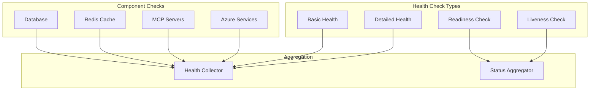

# 🏥 Health-Checks API

<!-- API aus Code generieren -->

::: health_checks.HealthCheckManager

::: health_checks.APIHealthCheck

::: health_checks.MemoryHealthCheck

::: health_checks.HealthStatus

## 🏗️ Health-Check-Architektur



## 🔍 Health-Check-Endpunkte

### Basis-Health-Check

```python
from fastapi import APIRouter, HTTPException
from typing import Dict, Any, List
from enum import Enum
import asyncio
import time

class HealthStatus(Enum):
    HEALTHY = "healthy"
    DEGRADED = "degraded"
    UNHEALTHY = "unhealthy"

router = APIRouter(prefix="/health", tags=["Health Checks"])

@router.get("/")
async def basic_health_check():
    """Basis-Gesundheitsprüfung."""
    return {
        "status": HealthStatus.HEALTHY.value,
        "timestamp": time.time(),
        "version": "2.0.0",
        "uptime": get_uptime_seconds()
    }

@router.get("/detailed")
async def detailed_health_check():
    """Detaillierte Gesundheitsprüfung aller Komponenten."""

    health_checks = [
        check_database_health(),
        check_redis_health(),
        check_mcp_servers_health(),
        check_azure_services_health(),
        check_disk_space(),
        check_memory_usage()
    ]

    results = await asyncio.gather(*health_checks, return_exceptions=True)

    overall_status = HealthStatus.HEALTHY
    component_statuses = {}

    for i, result in enumerate(results):
        component_name = [
            "database", "redis", "mcp_servers",
            "azure_services", "disk", "memory"
        ][i]

        if isinstance(result, Exception):
            component_statuses[component_name] = {
                "status": HealthStatus.UNHEALTHY.value,
                "error": str(result)
            }
            overall_status = HealthStatus.UNHEALTHY
        else:
            component_statuses[component_name] = result
            if result["status"] != HealthStatus.HEALTHY.value:
                if overall_status == HealthStatus.HEALTHY:
                    overall_status = HealthStatus.DEGRADED

    return {
        "status": overall_status.value,
        "timestamp": time.time(),
        "components": component_statuses,
        "version": "2.0.0"
    }

@router.get("/readiness")
async def readiness_check():
    """Kubernetes Readiness-Check."""

    # Kritische Services prüfen
    critical_checks = [
        check_database_health(),
        check_redis_health()
    ]

    results = await asyncio.gather(*critical_checks, return_exceptions=True)

    for result in results:
        if isinstance(result, Exception) or result.get("status") != HealthStatus.HEALTHY.value:
            raise HTTPException(status_code=503, detail="Service not ready")

    return {"status": "ready"}

@router.get("/liveness")
async def liveness_check():
    """Kubernetes Liveness-Check."""

    # Basis-Funktionalität prüfen
    try:
        # Einfacher Memory-Check
        import psutil
        memory_percent = psutil.virtual_memory().percent

        if memory_percent > 95:  # 95% Memory-Nutzung
            raise HTTPException(status_code=503, detail="High memory usage")

        return {"status": "alive", "memory_usage": f"{memory_percent}%"}

    except Exception as e:
        raise HTTPException(status_code=503, detail=f"Liveness check failed: {e}")
```

## 🔧 Component-Health-Checks

### Database-Health-Check

```python
import asyncpg
from sqlalchemy.ext.asyncio import create_async_engine

async def check_database_health() -> Dict[str, Any]:
    """Prüft Database-Gesundheit."""

    try:
        # Connection-Test
        engine = create_async_engine("postgresql://...")

        async with engine.begin() as conn:
            result = await conn.execute("SELECT 1")

        # Performance-Test
        start_time = time.time()
        async with engine.begin() as conn:
            await conn.execute("SELECT COUNT(*) FROM pg_stat_activity")
        query_time = time.time() - start_time

        status = HealthStatus.HEALTHY
        if query_time > 1.0:  # > 1 Sekunde
            status = HealthStatus.DEGRADED

        return {
            "status": status.value,
            "response_time": query_time,
            "connections": await get_db_connection_count(),
            "last_check": time.time()
        }

    except Exception as e:
        return {
            "status": HealthStatus.UNHEALTHY.value,
            "error": str(e),
            "last_check": time.time()
        }

async def check_redis_health() -> Dict[str, Any]:
    """Prüft Redis-Gesundheit."""

    try:
        import redis.asyncio as redis

        client = redis.Redis(host="localhost", port=6379)

        # Ping-Test
        start_time = time.time()
        await client.ping()
        ping_time = time.time() - start_time

        # Memory-Info
        info = await client.info("memory")
        memory_usage = info.get("used_memory", 0)

        status = HealthStatus.HEALTHY
        if ping_time > 0.1:  # > 100ms
            status = HealthStatus.DEGRADED

        return {
            "status": status.value,
            "ping_time": ping_time,
            "memory_usage": memory_usage,
            "last_check": time.time()
        }

    except Exception as e:
        return {
            "status": HealthStatus.UNHEALTHY.value,
            "error": str(e),
            "last_check": time.time()
        }

async def check_mcp_servers_health() -> Dict[str, Any]:
    """Prüft MCP-Server-Gesundheit."""

    try:
        # Registrierte MCP-Server abrufen
        mcp_servers = await get_registered_mcp_servers()

        server_statuses = {}
        overall_healthy = True

        for server in mcp_servers:
            try:
                # Health-Check für jeden Server
                async with aiohttp.ClientSession() as session:
                    async with session.get(
                        f"{server['base_url']}/health",
                        timeout=aiohttp.ClientTimeout(total=5)
                    ) as response:
                        if response.status == 200:
                            server_statuses[server['name']] = {
                                "status": HealthStatus.HEALTHY.value,
                                "response_time": response.headers.get("X-Response-Time")
                            }
                        else:
                            server_statuses[server['name']] = {
                                "status": HealthStatus.UNHEALTHY.value,
                                "http_status": response.status
                            }
                            overall_healthy = False

            except Exception as e:
                server_statuses[server['name']] = {
                    "status": HealthStatus.UNHEALTHY.value,
                    "error": str(e)
                }
                overall_healthy = False

        return {
            "status": HealthStatus.HEALTHY.value if overall_healthy else HealthStatus.DEGRADED.value,
            "servers": server_statuses,
            "total_servers": len(mcp_servers),
            "healthy_servers": sum(1 for s in server_statuses.values()
                                 if s["status"] == HealthStatus.HEALTHY.value),
            "last_check": time.time()
        }

    except Exception as e:
        return {
            "status": HealthStatus.UNHEALTHY.value,
            "error": str(e),
            "last_check": time.time()
        }
```

## 📊 System-Resource-Checks

### Resource-Monitoring

```python
import psutil
import shutil

async def check_disk_space() -> Dict[str, Any]:
    """Prüft verfügbaren Festplattenspeicher."""

    try:
        # Root-Partition prüfen
        disk_usage = shutil.disk_usage("/")

        total_gb = disk_usage.total / (1024**3)
        free_gb = disk_usage.free / (1024**3)
        used_percent = ((disk_usage.total - disk_usage.free) / disk_usage.total) * 100

        status = HealthStatus.HEALTHY
        if used_percent > 90:
            status = HealthStatus.UNHEALTHY
        elif used_percent > 80:
            status = HealthStatus.DEGRADED

        return {
            "status": status.value,
            "total_gb": round(total_gb, 2),
            "free_gb": round(free_gb, 2),
            "used_percent": round(used_percent, 2),
            "last_check": time.time()
        }

    except Exception as e:
        return {
            "status": HealthStatus.UNHEALTHY.value,
            "error": str(e),
            "last_check": time.time()
        }

async def check_memory_usage() -> Dict[str, Any]:
    """Prüft Speicherverbrauch."""

    try:
        memory = psutil.virtual_memory()

        status = HealthStatus.HEALTHY
        if memory.percent > 90:
            status = HealthStatus.UNHEALTHY
        elif memory.percent > 80:
            status = HealthStatus.DEGRADED

        return {
            "status": status.value,
            "total_gb": round(memory.total / (1024**3), 2),
            "available_gb": round(memory.available / (1024**3), 2),
            "used_percent": memory.percent,
            "last_check": time.time()
        }

    except Exception as e:
        return {
            "status": HealthStatus.UNHEALTHY.value,
            "error": str(e),
            "last_check": time.time()
        }

async def check_azure_services_health() -> Dict[str, Any]:
    """Prüft Azure-Services-Gesundheit."""

    try:
        from azure.identity import DefaultAzureCredential
        from azure.mgmt.resource import ResourceManagementClient

        credential = DefaultAzureCredential()

        # Azure-Service-Status prüfen
        # Hier würden Sie spezifische Azure-Services prüfen

        return {
            "status": HealthStatus.HEALTHY.value,
            "services": {
                "ai_foundry": {"status": "healthy"},
                "storage": {"status": "healthy"},
                "key_vault": {"status": "healthy"}
            },
            "last_check": time.time()
        }

    except Exception as e:
        return {
            "status": HealthStatus.UNHEALTHY.value,
            "error": str(e),
            "last_check": time.time()
        }
```

## 🚨 Health-Check-Monitoring

### Health-Metriken

```python
from prometheus_client import Gauge, Counter, Histogram

# Health-Check-Metriken
HEALTH_CHECK_STATUS = Gauge(
    'keiko_health_check_status',
    'Health-Check-Status (1=healthy, 0.5=degraded, 0=unhealthy)',
    ['component']
)

HEALTH_CHECK_DURATION = Histogram(
    'keiko_health_check_duration_seconds',
    'Dauer der Health-Checks',
    ['component'],
    buckets=[0.1, 0.25, 0.5, 1.0, 2.5, 5.0]
)

HEALTH_CHECK_FAILURES = Counter(
    'keiko_health_check_failures_total',
    'Anzahl fehlgeschlagener Health-Checks',
    ['component', 'error_type']
)

def monitor_health_check(component_name: str):
    """Decorator für Health-Check-Monitoring."""

    def decorator(func):
        @wraps(func)
        async def wrapper(*args, **kwargs):
            start_time = time.time()

            try:
                result = await func(*args, **kwargs)

                # Status-Metrik setzen
                status_value = {
                    HealthStatus.HEALTHY.value: 1.0,
                    HealthStatus.DEGRADED.value: 0.5,
                    HealthStatus.UNHEALTHY.value: 0.0
                }.get(result.get("status"), 0.0)

                HEALTH_CHECK_STATUS.labels(component=component_name).set(status_value)

                return result

            except Exception as e:
                HEALTH_CHECK_FAILURES.labels(
                    component=component_name,
                    error_type=type(e).__name__
                ).inc()

                HEALTH_CHECK_STATUS.labels(component=component_name).set(0.0)
                raise

            finally:
                duration = time.time() - start_time
                HEALTH_CHECK_DURATION.labels(component=component_name).observe(duration)

        return wrapper
    return decorator

# Anwendung der Monitoring-Decorator
@monitor_health_check("database")
async def monitored_database_check():
    return await check_database_health()
```

## 📋 Health-Check-Konfiguration

### Konfigurierbare Health-Checks

```python
from pydantic import BaseModel
from typing import Optional

class HealthCheckConfig(BaseModel):
    """Konfiguration für Health-Checks."""

    enabled: bool = True
    timeout_seconds: float = 5.0
    retry_count: int = 3
    retry_delay: float = 1.0
    warning_threshold: Optional[float] = None
    critical_threshold: Optional[float] = None

class HealthCheckManager:
    """Manager für konfigurierbare Health-Checks."""

    def __init__(self):
        self.configs = {
            "database": HealthCheckConfig(
                timeout_seconds=10.0,
                warning_threshold=1.0,
                critical_threshold=5.0
            ),
            "redis": HealthCheckConfig(
                timeout_seconds=5.0,
                warning_threshold=0.1,
                critical_threshold=1.0
            ),
            "mcp_servers": HealthCheckConfig(
                timeout_seconds=15.0,
                retry_count=2
            )
        }

    async def run_health_check(self, component: str) -> Dict[str, Any]:
        """Führt konfigurierbaren Health-Check aus."""

        config = self.configs.get(component)
        if not config or not config.enabled:
            return {"status": "disabled"}

        check_func = {
            "database": check_database_health,
            "redis": check_redis_health,
            "mcp_servers": check_mcp_servers_health
        }.get(component)

        if not check_func:
            return {"status": "unknown", "error": "No check function"}

        # Health-Check mit Retry-Logic ausführen
        for attempt in range(config.retry_count):
            try:
                result = await asyncio.wait_for(
                    check_func(),
                    timeout=config.timeout_seconds
                )
                return result

            except asyncio.TimeoutError:
                if attempt < config.retry_count - 1:
                    await asyncio.sleep(config.retry_delay)
                    continue
                return {
                    "status": HealthStatus.UNHEALTHY.value,
                    "error": "Timeout"
                }
            except Exception as e:
                if attempt < config.retry_count - 1:
                    await asyncio.sleep(config.retry_delay)
                    continue
                return {
                    "status": HealthStatus.UNHEALTHY.value,
                    "error": str(e)
                }

        return {"status": HealthStatus.UNHEALTHY.value, "error": "Max retries exceeded"}
```

!!! info "Kubernetes Integration"
Die `/health/readiness` und `/health/liveness` Endpunkte sind für Kubernetes Probes optimiert.

!!! tip "Monitoring-Integration"
Nutzen Sie die Prometheus-Metriken für umfassendes Health-Check-Monitoring in Grafana-Dashboards.
