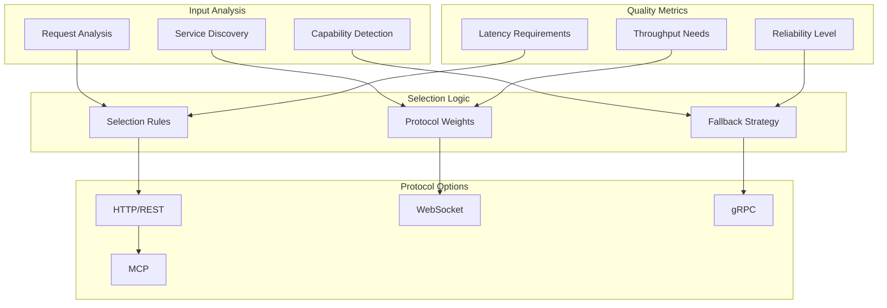

# 🎯 Protocol-Selector

<!-- API aus Code generieren -->

::: protocol_selector.ProtocolSelector

Der Protocol-Selector automatisiert die Auswahl des optimalen Kommunikationsprotokolls basierend auf Service-Eigenschaften und Anforderungen.

## 🏗️ Selector-Architektur

### Protocol-Selection-Pipeline



## 🎛️ Protocol-Selector-Implementation

### Basis-Selector

```python
from enum import Enum
from typing import Dict, Any, Optional, List, Tuple
from dataclasses import dataclass
import asyncio

class ProtocolType(Enum):
    """Verfügbare Protokoll-Typen."""
    HTTP = "http"
    WEBSOCKET = "websocket"
    GRPC = "grpc"
    MCP = "mcp"

@dataclass
class ServiceCapabilities:
    """Service-Fähigkeiten für Protocol-Selection."""
    supports_http: bool = True
    supports_websocket: bool = False
    supports_grpc: bool = False
    supports_mcp: bool = False
    real_time_required: bool = False
    high_throughput: bool = False
    low_latency: bool = False
    streaming: bool = False
    bidirectional: bool = False

@dataclass
class RequestRequirements:
    """Anforderungen für Protocol-Selection."""
    operation_type: str  # "query", "command", "stream", "subscribe"
    data_size: int = 0  # Bytes
    expected_response_time: float = 5.0  # Sekunden
    reliability_level: str = "normal"  # "low", "normal", "high", "critical"
    security_level: str = "standard"  # "basic", "standard", "high", "enterprise"
    concurrent_requests: int = 1

@dataclass
class ProtocolScore:
    """Bewertung eines Protokolls für eine Anfrage."""
    protocol: ProtocolType
    score: float
    reasons: List[str]
    warnings: List[str] = None

class ProtocolSelector:
    """Intelligenter Protocol-Selector."""

    def __init__(self):
        self.protocol_weights = {
            ProtocolType.HTTP: {
                "simplicity": 0.9,
                "compatibility": 0.95,
                "caching": 0.8,
                "real_time": 0.1,
                "throughput": 0.6,
                "latency": 0.5
            },
            ProtocolType.WEBSOCKET: {
                "simplicity": 0.6,
                "compatibility": 0.7,
                "caching": 0.2,
                "real_time": 0.95,
                "throughput": 0.8,
                "latency": 0.9
            },
            ProtocolType.GRPC: {
                "simplicity": 0.4,
                "compatibility": 0.6,
                "caching": 0.3,
                "real_time": 0.7,
                "throughput": 0.95,
                "latency": 0.95
            },
            ProtocolType.MCP: {
                "simplicity": 0.8,
                "compatibility": 0.5,
                "caching": 0.4,
                "real_time": 0.6,
                "throughput": 0.7,
                "latency": 0.7
            }
        }

    def select_protocol(
        self,
        service_capabilities: ServiceCapabilities,
        request_requirements: RequestRequirements,
        available_protocols: Optional[List[ProtocolType]] = None
    ) -> ProtocolScore:
        """Wählt optimales Protokoll basierend auf Anforderungen."""

        if available_protocols is None:
            available_protocols = list(ProtocolType)

        # Verfügbare Protokolle basierend auf Service-Capabilities filtern
        supported_protocols = self._filter_supported_protocols(
            service_capabilities, available_protocols
        )

        if not supported_protocols:
            raise ValueError("Keine unterstützten Protokolle verfügbar")

        # Protokolle bewerten
        scores = []
        for protocol in supported_protocols:
            score = self._calculate_protocol_score(
                protocol, service_capabilities, request_requirements
            )
            scores.append(score)

        # Bestes Protokoll auswählen
        best_score = max(scores, key=lambda x: x.score)
        return best_score

    def _filter_supported_protocols(
        self,
        capabilities: ServiceCapabilities,
        available_protocols: List[ProtocolType]
    ) -> List[ProtocolType]:
        """Filtert unterstützte Protokolle basierend auf Service-Capabilities."""

        supported = []

        for protocol in available_protocols:
            if protocol == ProtocolType.HTTP and capabilities.supports_http:
                supported.append(protocol)
            elif protocol == ProtocolType.WEBSOCKET and capabilities.supports_websocket:
                supported.append(protocol)
            elif protocol == ProtocolType.GRPC and capabilities.supports_grpc:
                supported.append(protocol)
            elif protocol == ProtocolType.MCP and capabilities.supports_mcp:
                supported.append(protocol)

        return supported

    def _calculate_protocol_score(
        self,
        protocol: ProtocolType,
        capabilities: ServiceCapabilities,
        requirements: RequestRequirements
    ) -> ProtocolScore:
        """Berechnet Bewertung für ein Protokoll."""

        weights = self.protocol_weights[protocol]
        score = 0.0
        reasons = []
        warnings = []

        # Real-Time-Anforderungen
        if capabilities.real_time_required or requirements.operation_type == "subscribe":
            real_time_score = weights["real_time"]
            score += real_time_score * 0.3
            if real_time_score > 0.8:
                reasons.append("Exzellente Real-Time-Unterstützung")
            elif real_time_score < 0.3:
                warnings.append("Begrenzte Real-Time-Fähigkeiten")

        # Throughput-Anforderungen
        if capabilities.high_throughput or requirements.data_size > 1024 * 1024:  # > 1MB
            throughput_score = weights["throughput"]
            score += throughput_score * 0.25
            if throughput_score > 0.8:
                reasons.append("Hoher Durchsatz unterstützt")
            elif throughput_score < 0.5:
                warnings.append("Begrenzter Durchsatz")

        # Latency-Anforderungen
        if capabilities.low_latency or requirements.expected_response_time < 1.0:
            latency_score = weights["latency"]
            score += latency_score * 0.25
            if latency_score > 0.8:
                reasons.append("Niedrige Latenz")
            elif latency_score < 0.5:
                warnings.append("Höhere Latenz möglich")

        # Kompatibilität und Einfachheit
        compatibility_score = weights["compatibility"]
        simplicity_score = weights["simplicity"]
        score += (compatibility_score + simplicity_score) * 0.1

        # Sicherheitsanforderungen
        if requirements.security_level in ["high", "enterprise"]:
            if protocol in [ProtocolType.GRPC, ProtocolType.WEBSOCKET]:
                score += 0.1
                reasons.append("Erweiterte Sicherheitsfeatures")

        # Operation-Type-spezifische Bewertung
        if requirements.operation_type == "query":
            if protocol == ProtocolType.HTTP:
                score += 0.15
                reasons.append("Optimal für Query-Operationen")
        elif requirements.operation_type == "stream":
            if protocol in [ProtocolType.WEBSOCKET, ProtocolType.GRPC]:
                score += 0.2
                reasons.append("Streaming-Unterstützung")
        elif requirements.operation_type == "command":
            if protocol in [ProtocolType.HTTP, ProtocolType.MCP]:
                score += 0.1
                reasons.append("Geeignet für Command-Operationen")

        # Concurrent-Request-Handling
        if requirements.concurrent_requests > 100:
            if protocol == ProtocolType.GRPC:
                score += 0.1
                reasons.append("Exzellente Concurrent-Request-Behandlung")
            elif protocol == ProtocolType.HTTP:
                warnings.append("Mögliche Concurrent-Request-Limits")

        return ProtocolScore(
            protocol=protocol,
            score=min(score, 1.0),  # Score auf 1.0 begrenzen
            reasons=reasons,
            warnings=warnings or None
        )

# Advanced Protocol Selector mit Machine Learning
class MLProtocolSelector(ProtocolSelector):
    """ML-basierter Protocol-Selector mit Lernfähigkeiten."""

    def __init__(self):
        super().__init__()
        self.performance_history: Dict[str, List[float]] = {}
        self.selection_history: List[Dict[str, Any]] = []

    def record_performance(
        self,
        protocol: ProtocolType,
        request_id: str,
        latency: float,
        success: bool,
        throughput: Optional[float] = None
    ):
        """Zeichnet Performance-Daten für ML-Training auf."""

        key = f"{protocol.value}_{request_id}"
        if key not in self.performance_history:
            self.performance_history[key] = []

        # Performance-Score berechnen
        performance_score = 1.0 if success else 0.0
        if success and latency > 0:
            performance_score *= min(1.0, 5.0 / latency)  # Latency-Penalty

        if throughput:
            performance_score *= min(1.0, throughput / 1000.0)  # Throughput-Bonus

        self.performance_history[key].append(performance_score)

    def get_adaptive_weights(self, protocol: ProtocolType) -> Dict[str, float]:
        """Berechnet adaptive Gewichte basierend auf Performance-Historie."""

        base_weights = self.protocol_weights[protocol].copy()

        # Performance-Historie analysieren
        protocol_scores = []
        for key, scores in self.performance_history.items():
            if key.startswith(protocol.value):
                protocol_scores.extend(scores)

        if protocol_scores:
            avg_performance = sum(protocol_scores) / len(protocol_scores)

            # Gewichte basierend auf Performance anpassen
            adjustment_factor = avg_performance * 0.2  # Max 20% Anpassung

            for key in base_weights:
                base_weights[key] *= (1.0 + adjustment_factor)
                base_weights[key] = min(1.0, base_weights[key])  # Auf 1.0 begrenzen

        return base_weights

    def select_protocol_with_learning(
        self,
        service_capabilities: ServiceCapabilities,
        request_requirements: RequestRequirements,
        available_protocols: Optional[List[ProtocolType]] = None
    ) -> ProtocolScore:
        """Protocol-Selection mit ML-basierten Anpassungen."""

        # Temporär adaptive Gewichte verwenden
        original_weights = self.protocol_weights.copy()

        try:
            # Adaptive Gewichte für alle Protokolle berechnen
            for protocol in ProtocolType:
                self.protocol_weights[protocol] = self.get_adaptive_weights(protocol)

            # Standard-Selection mit angepassten Gewichten
            result = self.select_protocol(
                service_capabilities, request_requirements, available_protocols
            )

            # Selection-Historie aufzeichnen
            self.selection_history.append({
                'protocol': result.protocol.value,
                'score': result.score,
                'requirements': request_requirements,
                'capabilities': service_capabilities,
                'timestamp': asyncio.get_event_loop().time()
            })

            return result

        finally:
            # Original-Gewichte wiederherstellen
            self.protocol_weights = original_weights

# Verwendungsbeispiele
async def example_protocol_selection():
    """Beispiele für Protocol-Selection."""

    selector = ProtocolSelector()

    # Beispiel 1: Real-Time-Chat-Anwendung
    chat_capabilities = ServiceCapabilities(
        supports_http=True,
        supports_websocket=True,
        real_time_required=True,
        bidirectional=True
    )

    chat_requirements = RequestRequirements(
        operation_type="subscribe",
        expected_response_time=0.1,
        reliability_level="high"
    )

    chat_protocol = selector.select_protocol(chat_capabilities, chat_requirements)
    print(f"Chat-Protokoll: {chat_protocol.protocol.value}")
    print(f"Score: {chat_protocol.score:.2f}")
    print(f"Gründe: {chat_protocol.reasons}")

    # Beispiel 2: Bulk-Datenverarbeitung
    bulk_capabilities = ServiceCapabilities(
        supports_http=True,
        supports_grpc=True,
        high_throughput=True
    )

    bulk_requirements = RequestRequirements(
        operation_type="command",
        data_size=10 * 1024 * 1024,  # 10MB
        concurrent_requests=200,
        reliability_level="critical"
    )

    bulk_protocol = selector.select_protocol(bulk_capabilities, bulk_requirements)
    print(f"\nBulk-Protokoll: {bulk_protocol.protocol.value}")
    print(f"Score: {bulk_protocol.score:.2f}")
    print(f"Gründe: {bulk_protocol.reasons}")

    # Beispiel 3: MCP-Tool-Ausführung
    mcp_capabilities = ServiceCapabilities(
        supports_http=True,
        supports_mcp=True
    )

    mcp_requirements = RequestRequirements(
        operation_type="command",
        expected_response_time=2.0,
        reliability_level="normal"
    )

    mcp_protocol = selector.select_protocol(mcp_capabilities, mcp_requirements)
    print(f"\nMCP-Protokoll: {mcp_protocol.protocol.value}")
    print(f"Score: {mcp_protocol.score:.2f}")
    print(f"Gründe: {mcp_protocol.reasons}")

if __name__ == "__main__":
    asyncio.run(example_protocol_selection())
```

## 📊 Selection-Metriken

### Protocol-Selection-Monitoring

```python
from prometheus_client import Counter, Histogram, Gauge

# Metriken für Protocol-Selection
PROTOCOL_SELECTIONS = Counter(
    'keiko_protocol_selections_total',
    'Gesamtanzahl der Protocol-Selections',
    ['protocol', 'operation_type', 'reason']
)

PROTOCOL_SELECTION_TIME = Histogram(
    'keiko_protocol_selection_duration_seconds',
    'Zeit für Protocol-Selection',
    buckets=[0.001, 0.005, 0.01, 0.025, 0.05, 0.1]
)

PROTOCOL_PERFORMANCE = Gauge(
    'keiko_protocol_performance_score',
    'Performance-Score für Protokolle',
    ['protocol', 'metric_type']
)

def monitor_protocol_selection(func):
    """Decorator für Protocol-Selection-Monitoring."""

    @wraps(func)
    async def wrapper(*args, **kwargs):
        start_time = time.time()

        try:
            result = await func(*args, **kwargs)

            # Metriken aufzeichnen
            PROTOCOL_SELECTIONS.labels(
                protocol=result.protocol.value,
                operation_type=kwargs.get('request_requirements', {}).get('operation_type', 'unknown'),
                reason='success'
            ).inc()

            return result

        except Exception as e:
            PROTOCOL_SELECTIONS.labels(
                protocol='unknown',
                operation_type='unknown',
                reason='error'
            ).inc()
            raise

        finally:
            duration = time.time() - start_time
            PROTOCOL_SELECTION_TIME.observe(duration)

    return wrapper
```

!!! tip "Optimale Protocol-Selection" - Verwenden Sie **HTTP** für einfache Request/Response-Patterns - Wählen Sie **WebSocket** für Real-Time-Kommunikation - Nutzen Sie **gRPC** für High-Performance-Anwendungen - Setzen Sie **MCP** für Model Context Protocol-spezifische Operationen ein

!!! info "Machine Learning"
Der ML-basierte Selector lernt aus Performance-Daten und passt die Protocol-Selection automatisch an veränderte Bedingungen an.
