# Architektur

Das KEI-Agent Python SDK wurde mit einer modernen, modularen Architektur entwickelt, die Enterprise-Anforderungen erfüllt und gleichzeitig eine einfache Developer Experience bietet.

## 🏗️ Architektur-Übersicht

### Design-Prinzipien

Das SDK folgt bewährten Software-Engineering-Prinzipien:

- **Clean Code**: Alle Module ≤200 Zeilen, Funktionen ≤20 Zeilen
- **Single Responsibility**: Jedes Modul hat eine klar definierte Verantwortlichkeit
- **Dependency Inversion**: Abstrakte Interfaces statt konkrete Implementierungen
- **Open/Closed Principle**: Erweiterbar ohne Modifikation bestehender Code
- **Type Safety**: 100% Type Hints für alle öffentlichen APIs

### Architektur-Diagramm

```mermaid
graph TB
    subgraph "🎯 KEI-Agent SDK Architecture"
        subgraph "🌐 Client Layer"
            UC[UnifiedKeiAgentClient<br/>📱 Main API]
        end

        subgraph "🔧 Core Components"
            PT[ProtocolTypes<br/>📋 Configurations]
            SM[SecurityManager<br/>🔐 Auth & Tokens]
            PS[ProtocolSelector<br/>🎯 Smart Selection]
        end

        subgraph "🌐 Protocol Layer"
            RPC[KEIRPCClient<br/>⚡ Sync Operations]
            STREAM[KEIStreamClient<br/>🌊 Real-time]
            BUS[KEIBusClient<br/>📨 Async Messages]
            MCP[KEIMCPClient<br/>🛠️ Tool Integration]
        end

        subgraph "🚀 Enterprise Layer"
            LOG[EnterpriseLogging<br/>📊 Structured JSON]
            HEALTH[HealthChecks<br/>💚 Monitoring]
            VALID[InputValidation<br/>🛡️ Security]
        end

        subgraph "🔌 Transport Layer"
            HTTP[HTTP/HTTPS<br/>🌐 REST APIs]
            WS[WebSockets<br/>⚡ Real-time]
            MSG[Message Bus<br/>📨 Async]
        end
    end

    UC --> PT
    UC --> SM
    UC --> PS
    PS --> RPC
    PS --> STREAM
    PS --> BUS
    PS --> MCP
    UC --> LOG
    UC --> HEALTH
    UC --> VALID
    RPC --> HTTP
    STREAM --> WS
    BUS --> MSG
    MCP --> HTTP

    style UC fill:#e1f5fe
    style LOG fill:#f3e5f5
    style HEALTH fill:#e8f5e8
    style VALID fill:#fff3e0
    style RPC fill:#e3f2fd
    style STREAM fill:#e0f2f1
    style BUS fill:#fff8e1
    style MCP fill:#fce4ec
```



## 📦 Modul-Struktur

### Core-Module

| Modul | Verantwortlichkeit | Zeilen | Abhängigkeiten |
|-------|-------------------|--------|----------------|
| `unified_client_refactored.py` | Haupt-API-Interface | 180 | Core Components |
| `protocol_types.py` | Typ-Definitionen und Konfigurationen | 150 | Pydantic, Enum |
| `security_manager.py` | Authentifizierung und Token-Management | 190 | httpx, asyncio |
| `protocol_selector.py` | Intelligente Protokoll-Auswahl | 170 | Core Types |

### Protocol-Module

| Modul | Verantwortlichkeit | Zeilen | Protokoll |
|-------|-------------------|--------|-----------|
| `protocol_clients.py` | Alle Protokoll-Client-Implementierungen | 200 | KEI-RPC, Stream, Bus, MCP |

### Enterprise-Module

| Modul | Verantwortlichkeit | Zeilen | Features |
|-------|-------------------|--------|----------|
| `enterprise_logging.py` | Strukturiertes JSON-Logging | 180 | Correlation-IDs, Performance |
| `health_checks.py` | System-Monitoring | 190 | Database, API, Memory Checks |
| `input_validation.py` | Input-Validierung und Sanitization | 200 | Security, XSS/SQL Prevention |

## 🔄 Datenfluss

### Request-Response-Zyklus


### Fallback-Mechanismus


## 🎯 Design Patterns

### 1. Factory Pattern

```python
# Protocol Client Factory
def create_protocol_client(protocol: ProtocolType, base_url: str, security: SecurityManager):
    if protocol == ProtocolType.RPC:
        return KEIRPCClient(base_url, security)
    elif protocol == ProtocolType.STREAM:
        return KEIStreamClient(base_url, security)
    # ...
```

### 2. Strategy Pattern

```python
# Protocol Selection Strategy
class ProtocolSelector:
    def select_protocol(self, operation: str, context: Dict[str, Any]) -> ProtocolType:
        # Intelligente Auswahl basierend auf Operation und Kontext
        if "stream" in operation.lower():
            return ProtocolType.STREAM
        elif "async" in operation.lower():
            return ProtocolType.BUS
        # ...
```

### 3. Decorator Pattern

```python
# Logging Decorator
def log_operation(func):
    async def wrapper(*args, **kwargs):
        operation_id = logger.log_operation_start(func.__name__)
        try:
            result = await func(*args, **kwargs)
            logger.log_operation_end(func.__name__, operation_id, success=True)
            return result
        except Exception as e:
            logger.log_operation_end(func.__name__, operation_id, success=False)
            raise
    return wrapper
```

### 4. Observer Pattern

```python
# Health Check Observer
class HealthCheckManager:
    def __init__(self):
        self.observers = []

    def register_observer(self, observer):
        self.observers.append(observer)

    def notify_health_change(self, status):
        for observer in self.observers:
            observer.on_health_change(status)
```

## 🔐 Security-Architektur

### Authentifizierung-Flow

```mermaid
graph LR
    subgraph "🔐 Security Architecture"
        APP[Application] --> SM[SecurityManager]
        SM --> |Bearer| BEARER[Bearer Token Auth]
        SM --> |OIDC| OIDC[OIDC Flow]
        SM --> |mTLS| MTLS[Mutual TLS]

        BEARER --> CACHE[Token Cache]
        OIDC --> CACHE
        CACHE --> REFRESH[Auto Refresh]

        SM --> RBAC[RBAC Check]
        SM --> AUDIT[Audit Log]
    end

    style SM fill:#ffebee
    style RBAC fill:#e8f5e8
    style AUDIT fill:#fff3e0
```



### Security-Layers

1. **Transport Security**: HTTPS/TLS für alle Verbindungen
2. **Authentication**: Bearer Token, OIDC oder mTLS
3. **Authorization**: Role-Based Access Control (RBAC)
4. **Input Validation**: Umfassende Sanitization und Validierung
5. **Audit Logging**: Vollständige Nachverfolgbarkeit

## 📊 Performance-Architektur

### Async-First Design

```python
# Alle I/O-Operationen sind asynchron
async def plan_task(self, objective: str) -> Dict[str, Any]:
    async with self._get_protocol_client(ProtocolType.RPC) as client:
        return await client.plan(objective)
```

### Connection Pooling

```python
# HTTP-Client mit Connection Pooling
self._client = httpx.AsyncClient(
    limits=httpx.Limits(max_keepalive_connections=20, max_connections=100),
    timeout=httpx.Timeout(30.0)
)
```

### Caching-Strategien

- **Token Caching**: Authentifizierungs-Token werden gecacht
- **Protocol Selection**: Intelligente Auswahl wird gecacht
- **Health Check Results**: Temporäres Caching für Performance

## 🔄 Erweiterbarkeit

### Plugin-Architektur

```python
# Custom Protocol Client
class CustomProtocolClient(BaseProtocolClient):
    async def custom_operation(self, data: Dict[str, Any]) -> Dict[str, Any]:
        # Custom implementation
        pass

# Registration
protocol_selector.register_protocol("custom", CustomProtocolClient)
```

### Custom Health Checks

```python
# Custom Health Check
class DatabaseHealthCheck(BaseHealthCheck):
    async def check(self) -> HealthCheckResult:
        # Custom health check logic
        pass

# Registration
health_manager.register_check(DatabaseHealthCheck("database"))
```

### Custom Validators

```python
# Custom Input Validator
class EmailValidator(BaseValidator):
    def validate(self, value: Any) -> ValidationResult:
        # Custom validation logic
        pass

# Registration
input_validator.register_validator("email", EmailValidator("email"))
```

## 🧪 Testing-Architektur

### Test-Pyramide

```mermaid
graph TB
    subgraph "🧪 Testing Architecture"
        E2E[End-to-End Tests<br/>🔗 Full Integration]
        INT[Integration Tests<br/>🔌 Protocol Tests]
        UNIT[Unit Tests<br/>⚡ Component Tests]

        E2E --> INT
        INT --> UNIT
    end

    style UNIT fill:#e8f5e8
    style INT fill:#fff3e0
    style E2E fill:#ffebee
```



### Test-Kategorien

- **Unit Tests**: Isolierte Komponenten-Tests (85%+ Coverage)
- **Integration Tests**: Protokoll-Integration-Tests
- **Security Tests**: Sicherheits-spezifische Tests
- **Performance Tests**: Load- und Stress-Tests

## 📈 Monitoring-Architektur

### Observability-Stack


### Monitoring-Features

- **Structured Logging**: JSON-Format mit Correlation-IDs
- **Performance Metrics**: Request-Timing und Resource-Usage
- **Health Checks**: Proaktive System-Überwachung
- **Distributed Tracing**: End-to-End Request-Verfolgung

---

**Weitere Architektur-Details:**
- [Überblick →](overview.md) - Detaillierte Architektur-Übersicht
- [Design Patterns →](design-patterns.md) - Verwendete Design Patterns
- [Modulstruktur →](modules.md) - Detaillierte Modul-Beschreibungen
- [Protocol Integration →](protocols.md) - Multi-Protocol-Architektur
