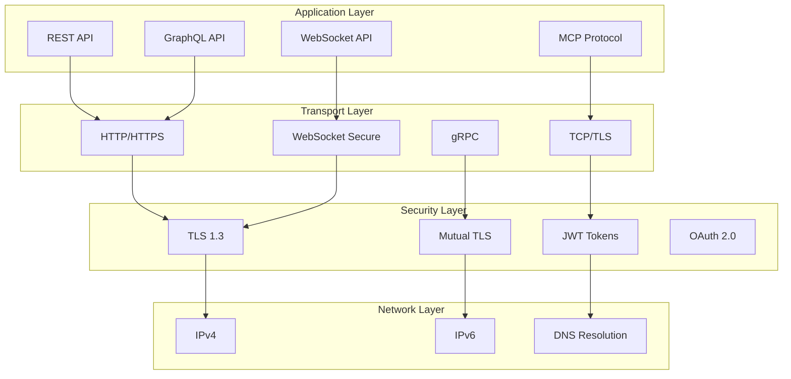

# 🌐 Protocol-Architektur

Keiko Personal Assistant unterstützt verschiedene Kommunikationsprotokolle für flexible Integration und optimale Performance.

## 🏗️ Protocol-Stack



## 🔌 Protocol-Implementations

### HTTP/REST Protocol

```python
# keiko/protocols/http/__init__.py
"""HTTP/REST Protocol Implementation."""

from .client import HTTPClient, HTTPConfig
from .server import HTTPServer
from .middleware import HTTPMiddleware
from .handlers import RequestHandler, ResponseHandler

__all__ = [
    "HTTPClient", "HTTPConfig", "HTTPServer",
    "HTTPMiddleware", "RequestHandler", "ResponseHandler"
]

# keiko/protocols/http/client.py
class HTTPClient:
    """HTTP-Client für REST-API-Kommunikation."""

    def __init__(self, config: HTTPConfig):
        self.config = config
        self.session: Optional[aiohttp.ClientSession] = None
        self.retry_policy = RetryPolicy(
            max_retries=config.max_retries,
            backoff_factor=config.backoff_factor
        )

    async def __aenter__(self):
        await self.connect()
        return self

    async def __aexit__(self, exc_type, exc_val, exc_tb):
        await self.disconnect()

    async def connect(self) -> None:
        """Stellt HTTP-Verbindung her."""
        connector = aiohttp.TCPConnector(
            limit=self.config.connection_pool_size,
            limit_per_host=self.config.max_connections_per_host,
            ttl_dns_cache=300,
            use_dns_cache=True,
            verify_ssl=self.config.verify_ssl
        )

        timeout = aiohttp.ClientTimeout(
            total=self.config.total_timeout,
            connect=self.config.connect_timeout,
            sock_read=self.config.read_timeout
        )

        headers = {
            "User-Agent": f"Keiko-Client/{VERSION}",
            "Accept": "application/json",
            "Content-Type": "application/json"
        }

        if self.config.auth_token:
            headers["Authorization"] = f"Bearer {self.config.auth_token}"

        self.session = aiohttp.ClientSession(
            connector=connector,
            timeout=timeout,
            headers=headers,
            raise_for_status=False
        )

    async def request(
        self,
        method: str,
        url: str,
        data: Optional[Dict[str, Any]] = None,
        params: Optional[Dict[str, str]] = None,
        headers: Optional[Dict[str, str]] = None
    ) -> HTTPResponse:
        """Führt HTTP-Request mit Retry-Logic aus."""

        return await self.retry_policy.execute(
            self._make_request,
            method, url, data, params, headers
        )

    async def _make_request(
        self,
        method: str,
        url: str,
        data: Optional[Dict[str, Any]] = None,
        params: Optional[Dict[str, str]] = None,
        headers: Optional[Dict[str, str]] = None
    ) -> HTTPResponse:
        """Führt einzelnen HTTP-Request aus."""

        request_kwargs = {
            "params": params,
            "headers": headers
        }

        if data:
            request_kwargs["json"] = data

        async with self.session.request(method, url, **request_kwargs) as response:
            response_data = await response.text()

            # JSON-Response versuchen zu parsen
            try:
                json_data = await response.json()
            except (aiohttp.ContentTypeError, json.JSONDecodeError):
                json_data = None

            return HTTPResponse(
                status_code=response.status,
                headers=dict(response.headers),
                text=response_data,
                json=json_data,
                url=str(response.url)
            )

@dataclass
class HTTPResponse:
    """HTTP-Response-Wrapper."""
    status_code: int
    headers: Dict[str, str]
    text: str
    json: Optional[Dict[str, Any]]
    url: str

    @property
    def is_success(self) -> bool:
        """Prüft, ob Response erfolgreich war."""
        return 200 <= self.status_code < 300

    @property
    def is_client_error(self) -> bool:
        """Prüft, ob Client-Fehler vorliegt."""
        return 400 <= self.status_code < 500

    @property
    def is_server_error(self) -> bool:
        """Prüft, ob Server-Fehler vorliegt."""
        return 500 <= self.status_code < 600
```

### WebSocket Protocol

```python
# keiko/protocols/websocket/__init__.py
"""WebSocket Protocol Implementation."""

from .client import WebSocketClient, WebSocketConfig
from .server import WebSocketServer
from .handlers import MessageHandler, EventHandler

__all__ = [
    "WebSocketClient", "WebSocketConfig", "WebSocketServer",
    "MessageHandler", "EventHandler"
]

# keiko/protocols/websocket/client.py
class WebSocketClient:
    """WebSocket-Client für Real-Time-Kommunikation."""

    def __init__(self, config: WebSocketConfig):
        self.config = config
        self.websocket: Optional[websockets.WebSocketServerProtocol] = None
        self.message_handlers: Dict[str, Callable] = {}
        self.is_connected = False
        self._heartbeat_task: Optional[asyncio.Task] = None
        self._message_handler_task: Optional[asyncio.Task] = None

    async def connect(self) -> None:
        """Stellt WebSocket-Verbindung her."""
        headers = {}
        if self.config.auth_token:
            headers["Authorization"] = f"Bearer {self.config.auth_token}"

        extra_headers = []
        for key, value in headers.items():
            extra_headers.append((key, value))

        try:
            self.websocket = await websockets.connect(
                self.config.url,
                extra_headers=extra_headers,
                ping_interval=self.config.ping_interval,
                ping_timeout=self.config.ping_timeout,
                close_timeout=self.config.close_timeout,
                max_size=self.config.max_message_size,
                compression=self.config.compression
            )

            self.is_connected = True

            # Background-Tasks starten
            self._heartbeat_task = asyncio.create_task(self._heartbeat_loop())
            self._message_handler_task = asyncio.create_task(self._message_handler_loop())

        except Exception as e:
            raise ConnectionError(f"WebSocket-Verbindung fehlgeschlagen: {e}")

    async def disconnect(self) -> None:
        """Schließt WebSocket-Verbindung."""
        self.is_connected = False

        # Background-Tasks beenden
        if self._heartbeat_task:
            self._heartbeat_task.cancel()
        if self._message_handler_task:
            self._message_handler_task.cancel()

        if self.websocket:
            await self.websocket.close()
            self.websocket = None

    async def send_message(
        self,
        message_type: str,
        data: Dict[str, Any],
        correlation_id: Optional[str] = None
    ) -> None:
        """Sendet Nachricht über WebSocket."""
        if not self.is_connected or not self.websocket:
            raise ConnectionError("WebSocket nicht verbunden")

        message = {
            "type": message_type,
            "data": data,
            "timestamp": time.time(),
            "correlation_id": correlation_id or str(uuid.uuid4())
        }

        try:
            await self.websocket.send(json.dumps(message))
        except websockets.exceptions.ConnectionClosed:
            self.is_connected = False
            raise ConnectionError("WebSocket-Verbindung unterbrochen")

    async def _heartbeat_loop(self) -> None:
        """Heartbeat-Loop für Verbindungsüberwachung."""
        while self.is_connected:
            try:
                await self.send_message("heartbeat", {"timestamp": time.time()})
                await asyncio.sleep(self.config.heartbeat_interval)
            except Exception:
                self.is_connected = False
                break

    async def _message_handler_loop(self) -> None:
        """Message-Handler-Loop für eingehende Nachrichten."""
        try:
            async for message in self.websocket:
                try:
                    data = json.loads(message)
                    message_type = data.get("type")

                    if message_type in self.message_handlers:
                        handler = self.message_handlers[message_type]
                        asyncio.create_task(handler(data))

                except json.JSONDecodeError:
                    logger.warning(f"Ungültige JSON-Nachricht: {message}")
                except Exception as e:
                    logger.error(f"Fehler beim Verarbeiten der Nachricht: {e}")

        except websockets.exceptions.ConnectionClosed:
            self.is_connected = False
        except Exception as e:
            logger.error(f"Fehler in Message-Handler-Loop: {e}")
            self.is_connected = False

    def register_handler(self, message_type: str, handler: Callable) -> None:
        """Registriert Handler für Nachrichtentyp."""
        self.message_handlers[message_type] = handler

    def unregister_handler(self, message_type: str) -> None:
        """Entfernt Handler für Nachrichtentyp."""
        self.message_handlers.pop(message_type, None)
```

### MCP Protocol

```python
# keiko/protocols/mcp/__init__.py
"""Model Context Protocol Implementation."""

from .client import MCPClient, MCPConfig
from .server import MCPServer
from .messages import MCPMessage, MCPRequest, MCPResponse
from .tools import MCPTool, ToolRegistry

__all__ = [
    "MCPClient", "MCPConfig", "MCPServer",
    "MCPMessage", "MCPRequest", "MCPResponse",
    "MCPTool", "ToolRegistry"
]

# keiko/protocols/mcp/messages.py
@dataclass
class MCPMessage:
    """Basis-MCP-Nachricht."""
    version: str = "1.0"
    message_id: str = field(default_factory=lambda: str(uuid.uuid4()))
    timestamp: float = field(default_factory=time.time)

@dataclass
class MCPRequest(MCPMessage):
    """MCP-Request-Nachricht."""
    method: str
    params: Dict[str, Any] = field(default_factory=dict)

@dataclass
class MCPResponse(MCPMessage):
    """MCP-Response-Nachricht."""
    request_id: str
    success: bool
    result: Optional[Dict[str, Any]] = None
    error: Optional[str] = None

# keiko/protocols/mcp/client.py
class MCPClient:
    """MCP-Client für Model Context Protocol."""

    def __init__(self, config: MCPConfig):
        self.config = config
        self.transport: Optional[MCPTransport] = None
        self.pending_requests: Dict[str, asyncio.Future] = {}

    async def connect(self) -> None:
        """Stellt MCP-Verbindung her."""
        if self.config.transport_type == "http":
            self.transport = HTTPMCPTransport(self.config)
        elif self.config.transport_type == "websocket":
            self.transport = WebSocketMCPTransport(self.config)
        else:
            raise ValueError(f"Unbekannter Transport-Typ: {self.config.transport_type}")

        await self.transport.connect()

        # Message-Handler registrieren
        self.transport.register_handler(self._handle_response)

    async def list_tools(self) -> List[Dict[str, Any]]:
        """Listet verfügbare Tools auf."""
        request = MCPRequest(
            method="tools/list",
            params={}
        )

        response = await self._send_request(request)
        return response.result.get("tools", [])

    async def get_tool_schema(self, tool_name: str) -> Dict[str, Any]:
        """Ruft Tool-Schema ab."""
        request = MCPRequest(
            method="tools/schema",
            params={"tool_name": tool_name}
        )

        response = await self._send_request(request)
        return response.result

    async def execute_tool(
        self,
        tool_name: str,
        arguments: Dict[str, Any]
    ) -> Dict[str, Any]:
        """Führt Tool aus."""
        request = MCPRequest(
            method="tools/execute",
            params={
                "tool_name": tool_name,
                "arguments": arguments
            }
        )

        response = await self._send_request(request)

        if not response.success:
            raise MCPExecutionError(response.error)

        return response.result

    async def _send_request(self, request: MCPRequest) -> MCPResponse:
        """Sendet MCP-Request und wartet auf Response."""
        future = asyncio.Future()
        self.pending_requests[request.message_id] = future

        try:
            await self.transport.send_message(request)

            # Auf Response warten (mit Timeout)
            response = await asyncio.wait_for(
                future,
                timeout=self.config.request_timeout
            )

            return response

        except asyncio.TimeoutError:
            raise MCPTimeoutError(f"Request timeout: {request.message_id}")
        finally:
            self.pending_requests.pop(request.message_id, None)

    async def _handle_response(self, message: Dict[str, Any]) -> None:
        """Behandelt eingehende MCP-Responses."""
        try:
            response = MCPResponse(**message)

            if response.request_id in self.pending_requests:
                future = self.pending_requests[response.request_id]
                future.set_result(response)

        except Exception as e:
            logger.error(f"Fehler beim Verarbeiten der MCP-Response: {e}")
```

### gRPC Protocol

```python
# keiko/protocols/grpc/__init__.py
"""gRPC Protocol Implementation."""

from .client import GRPCClient, GRPCConfig
from .server import GRPCServer
from .interceptors import AuthInterceptor, MetricsInterceptor

__all__ = [
    "GRPCClient", "GRPCConfig", "GRPCServer",
    "AuthInterceptor", "MetricsInterceptor"
]

# keiko/protocols/grpc/client.py
class GRPCClient:
    """gRPC-Client für High-Performance-Kommunikation."""

    def __init__(self, config: GRPCConfig):
        self.config = config
        self.channel: Optional[grpc.aio.Channel] = None
        self.stubs: Dict[str, Any] = {}

    async def connect(self) -> None:
        """Stellt gRPC-Verbindung her."""
        # Channel-Optionen konfigurieren
        options = [
            ("grpc.keepalive_time_ms", 30000),
            ("grpc.keepalive_timeout_ms", 5000),
            ("grpc.keepalive_permit_without_calls", True),
            ("grpc.http2.max_pings_without_data", 0),
            ("grpc.http2.min_time_between_pings_ms", 10000),
            ("grpc.http2.min_ping_interval_without_data_ms", 300000)
        ]

        # TLS-Konfiguration
        if self.config.use_tls:
            credentials = grpc.ssl_channel_credentials()
            self.channel = grpc.aio.secure_channel(
                self.config.server_address,
                credentials,
                options=options
            )
        else:
            self.channel = grpc.aio.insecure_channel(
                self.config.server_address,
                options=options
            )

        # Stubs erstellen
        self._create_stubs()

    async def disconnect(self) -> None:
        """Schließt gRPC-Verbindung."""
        if self.channel:
            await self.channel.close()
            self.channel = None

    def _create_stubs(self) -> None:
        """Erstellt gRPC-Stubs."""
        # Hier würden die generierten gRPC-Stubs erstellt
        # self.stubs["agent"] = agent_pb2_grpc.AgentServiceStub(self.channel)
        # self.stubs["task"] = task_pb2_grpc.TaskServiceStub(self.channel)
        pass
```

## 🔄 Protocol-Selection

### Automatische Protocol-Auswahl

```python
class ProtocolSelector:
    """Automatische Protocol-Auswahl basierend auf Anforderungen."""

    def __init__(self):
        self.protocol_capabilities = {
            "http": {
                "real_time": False,
                "bidirectional": False,
                "streaming": False,
                "performance": "medium",
                "complexity": "low"
            },
            "websocket": {
                "real_time": True,
                "bidirectional": True,
                "streaming": True,
                "performance": "high",
                "complexity": "medium"
            },
            "grpc": {
                "real_time": True,
                "bidirectional": True,
                "streaming": True,
                "performance": "very_high",
                "complexity": "high"
            },
            "mcp": {
                "real_time": False,
                "bidirectional": False,
                "streaming": False,
                "performance": "medium",
                "complexity": "medium"
            }
        }

    def select_protocol(self, requirements: ProtocolRequirements) -> str:
        """Wählt optimales Protokoll basierend auf Anforderungen."""

        scores = {}

        for protocol, capabilities in self.protocol_capabilities.items():
            score = 0

            # Real-Time-Anforderung
            if requirements.real_time_required and capabilities["real_time"]:
                score += 30
            elif requirements.real_time_required and not capabilities["real_time"]:
                score -= 20

            # Bidirektionale Kommunikation
            if requirements.bidirectional and capabilities["bidirectional"]:
                score += 20

            # Streaming-Anforderung
            if requirements.streaming and capabilities["streaming"]:
                score += 25

            # Performance-Anforderung
            performance_scores = {
                "low": 10, "medium": 20, "high": 30, "very_high": 40
            }
            if requirements.performance_level in performance_scores:
                required_score = performance_scores[requirements.performance_level]
                actual_score = performance_scores.get(capabilities["performance"], 0)
                score += min(actual_score, required_score)

            # Komplexitäts-Präferenz (niedrigere Komplexität bevorzugt)
            complexity_penalty = {
                "low": 0, "medium": -5, "high": -10
            }
            score += complexity_penalty.get(capabilities["complexity"], 0)

            scores[protocol] = score

        # Bestes Protokoll auswählen
        best_protocol = max(scores, key=scores.get)
        return best_protocol

@dataclass
class ProtocolRequirements:
    """Anforderungen für Protocol-Selection."""
    real_time_required: bool = False
    bidirectional: bool = False
    streaming: bool = False
    performance_level: str = "medium"  # low, medium, high, very_high
    security_level: str = "standard"   # basic, standard, high, enterprise
```

## 📊 Protocol-Monitoring

### Protocol-Metriken

```python
from prometheus_client import Counter, Histogram, Gauge

# Protocol-Metriken
PROTOCOL_REQUESTS_TOTAL = Counter(
    'keiko_protocol_requests_total',
    'Gesamtanzahl der Protocol-Requests',
    ['protocol', 'method', 'status']
)

PROTOCOL_REQUEST_DURATION = Histogram(
    'keiko_protocol_request_duration_seconds',
    'Dauer der Protocol-Requests',
    ['protocol', 'method'],
    buckets=[0.01, 0.025, 0.05, 0.1, 0.25, 0.5, 1.0, 2.5, 5.0]
)

PROTOCOL_CONNECTIONS_ACTIVE = Gauge(
    'keiko_protocol_connections_active',
    'Anzahl aktiver Protocol-Verbindungen',
    ['protocol']
)

PROTOCOL_ERRORS_TOTAL = Counter(
    'keiko_protocol_errors_total',
    'Gesamtanzahl der Protocol-Fehler',
    ['protocol', 'error_type']
)

def monitor_protocol_request(protocol: str, method: str):
    """Decorator für Protocol-Request-Monitoring."""

    def decorator(func):
        @wraps(func)
        async def wrapper(*args, **kwargs):
            start_time = time.time()

            try:
                result = await func(*args, **kwargs)

                PROTOCOL_REQUESTS_TOTAL.labels(
                    protocol=protocol,
                    method=method,
                    status="success"
                ).inc()

                return result

            except Exception as e:
                PROTOCOL_REQUESTS_TOTAL.labels(
                    protocol=protocol,
                    method=method,
                    status="error"
                ).inc()

                PROTOCOL_ERRORS_TOTAL.labels(
                    protocol=protocol,
                    error_type=type(e).__name__
                ).inc()

                raise

            finally:
                duration = time.time() - start_time
                PROTOCOL_REQUEST_DURATION.labels(
                    protocol=protocol,
                    method=method
                ).observe(duration)

        return wrapper
    return decorator
```

!!! info "Protocol-Wahl"
    - **HTTP/REST**: Für einfache Request/Response-Patterns
    - **WebSocket**: Für Real-Time-Kommunikation und bidirektionale Streams
    - **gRPC**: Für High-Performance-Anwendungen mit starker Typisierung
    - **MCP**: Für Model Context Protocol-spezifische Operationen

!!! tip "Performance-Optimierung"
    Nutzen Sie Connection-Pooling, Keep-Alive-Verbindungen und Compression für bessere Protocol-Performance.
