# Enterprise Features

Das KEI-Agent Python SDK bietet umfassende Enterprise-Features für Production-Deployments, Monitoring und Security-Compliance.

## 🚀 Übersicht

### Enterprise-Ready Features

- **[Structured Logging](logging.md)** - JSON-basiertes Logging mit Correlation-IDs
- **[Health Checks](health-checks.md)** - Umfassende System-Überwachung
- **[Input Validation](input-validation.md)** - Security-Hardening und Sanitization
- **[Security](security.md)** - Multi-Auth und RBAC-Integration
- **[Monitoring](monitoring.md)** - Performance-Metriken und Alerting

### Production-Readiness

Das SDK erfüllt Enterprise-Standards für:

- ✅ **Observability**: Vollständige Logging-, Metrics- und Tracing-Integration
- ✅ **Security**: Multi-Factor-Authentication und Input-Validierung
- ✅ **Reliability**: Health Checks und automatische Fallback-Mechanismen
- ✅ **Performance**: Async-First Design mit Connection Pooling
- ✅ **Compliance**: Audit-Logging und RBAC-Unterstützung

## 📊 Enterprise-Architektur

```mermaid
graph TB
    subgraph "🏢 Enterprise KEI-Agent SDK"
        subgraph "🔐 Security Layer"
            AUTH[Multi-Auth<br/>Bearer/OIDC/mTLS]
            RBAC[Role-Based<br/>Access Control]
            VALID[Input Validation<br/>& Sanitization]
            AUDIT[Audit Logging<br/>& Compliance]
        end

        subgraph "📊 Observability Layer"
            LOGS[Structured Logging<br/>JSON + Correlation-IDs]
            METRICS[Performance Metrics<br/>Timing & Resources]
            HEALTH[Health Checks<br/>Proactive Monitoring]
            TRACE[Distributed Tracing<br/>Request Flow]
        end

        subgraph "⚡ Performance Layer"
            ASYNC[Async-First<br/>Non-blocking I/O]
            POOL[Connection Pooling<br/>Resource Management]
            CACHE[Intelligent Caching<br/>Token & Protocol]
            RETRY[Retry Logic<br/>Circuit Breaker]
        end

        subgraph "🔄 Resilience Layer"
            FALLBACK[Protocol Fallback<br/>Auto-Recovery]
            CIRCUIT[Circuit Breaker<br/>Failure Isolation]
            TIMEOUT[Timeout Handling<br/>Resource Protection]
            GRACEFUL[Graceful Shutdown<br/>Clean Termination]
        end
    end

    style AUTH fill:#ffebee
    style LOGS fill:#e3f2fd
    style ASYNC fill:#e8f5e8
    style FALLBACK fill:#fff3e0
```



## 🔧 Quick Setup

### Basis-Enterprise-Konfiguration

```python
from kei_agent import (
    UnifiedKeiAgentClient,
    AgentClientConfig,
    ProtocolConfig,
    SecurityConfig,
    AuthType,
    configure_logging,
    get_health_manager
)

# Enterprise Logging konfigurieren
logger = configure_logging(
    level="INFO",
    enable_structured=True,
    enable_file=True,
    file_path="/var/log/kei-agent.log",
    extra_fields={
        "service": "kei-agent-production",
        "environment": "production",
        "version": "1.0.0"
    }
)

# Enterprise Security konfigurieren
security_config = SecurityConfig(
    auth_type=AuthType.OIDC,
    oidc_issuer="https://auth.company.com",
    oidc_client_id="kei-agent-prod",
    oidc_client_secret="secure-secret",
    rbac_enabled=True,
    audit_enabled=True,
    token_refresh_enabled=True
)

# Production Protocol konfigurieren
protocol_config = ProtocolConfig(
    rpc_enabled=True,
    stream_enabled=True,
    bus_enabled=True,
    mcp_enabled=True,
    auto_protocol_selection=True,
    protocol_fallback_enabled=True
)

# Agent konfigurieren - Korrekte Konfigurationsstruktur
from kei_agent import ConnectionConfig, RetryConfig

agent_config = AgentClientConfig(
    base_url="https://api.kei-framework.com",
    api_token="production-token",
    agent_id="enterprise-agent-001",
    connection=ConnectionConfig(timeout=30.0),
    retry=RetryConfig(max_attempts=5, base_delay=2.0)
)

# Enterprise Client erstellen
async with UnifiedKeiAgentClient(
    config=agent_config,
    protocol_config=protocol_config,
    security_config=security_config
) as client:
    # Production-ready Agent-Operationen - Korrekte API-Signatur
    plan = await client.plan_task(
        objective="Führe Enterprise-System-Check durch",
        context={"scope": "production", "include_metrics": True}
    )
```

### Health Monitoring Setup

```python
from kei_agent import (
    get_health_manager,
    APIHealthCheck,
    DatabaseHealthCheck,
    MemoryHealthCheck,
    HealthStatus
)

# Health Manager konfigurieren
health_manager = get_health_manager()

# Critical System Checks
health_manager.register_check(APIHealthCheck(
    name="kei_api",
    url="https://api.kei-framework.com/health",
    critical=True,
    timeout_seconds=10
))

health_manager.register_check(DatabaseHealthCheck(
    name="primary_database",
    connection_string="postgresql://...",
    critical=True
))

health_manager.register_check(MemoryHealthCheck(
    name="system_memory",
    warning_threshold=0.8,
    critical_threshold=0.95,
    critical=False
))

# Kontinuierliches Monitoring
async def continuous_monitoring():
    while True:
        summary = await health_manager.run_all_checks()

        if summary.overall_status != HealthStatus.HEALTHY:
            logger.error(
                "System health degraded",
                overall_status=summary.overall_status.value,
                unhealthy_count=summary.unhealthy_count,
                checks=[check.name for check in summary.checks if check.status != "healthy"]
            )

        await asyncio.sleep(60)  # Check every minute

# Background monitoring starten
asyncio.create_task(continuous_monitoring())
```

## 🔐 Security Features

### Multi-Authentication Support

```python
# Bearer Token (Einfach)
bearer_config = SecurityConfig(
    auth_type=AuthType.BEARER,
    api_token="bearer-token-123"
)

# OIDC (Enterprise)
oidc_config = SecurityConfig(
    auth_type=AuthType.OIDC,
    oidc_issuer="https://auth.company.com",
    oidc_client_id="kei-agent",
    oidc_client_secret="client-secret",
    oidc_scope="openid profile kei-agent"
)

# mTLS (High Security)
mtls_config = SecurityConfig(
    auth_type=AuthType.MTLS,
    mtls_cert_path="/etc/ssl/certs/client.crt",
    mtls_key_path="/etc/ssl/private/client.key",
    mtls_ca_path="/etc/ssl/certs/ca.crt"
)
```

### Input Validation & Security

```python
from kei_agent import get_input_validator

validator = get_input_validator()

# Enterprise-Grade Validierung
def validate_enterprise_input(data: Dict[str, Any]) -> Dict[str, Any]:
    """Validiert Enterprise-Input mit Security-Hardening."""

    # Agent-Operation validieren
    result = validator.validate_agent_operation("plan", data)

    if not result.valid:
        # Security-Event loggen
        logger.log_security_event(
            event_type="input_validation_failed",
            severity="high",
            description="Invalid input detected",
            validation_errors=result.errors,
            input_data=data
        )
        raise SecurityError(f"Input validation failed: {result.errors}")

    return result.sanitized_value
```

## 📊 Monitoring & Observability

### Structured Logging

```python
import time
from kei_agent import get_logger, LogContext

# Enterprise Logger
logger = get_logger("enterprise_agent")

# Request-Context setzen - create_correlation_id() setzt bereits den Kontext
correlation_id = logger.create_correlation_id()
logger.set_context(LogContext(
    user_id="enterprise-user-123",
    agent_id="enterprise-agent-001",
    operation="quarterly_report_generation",
    environment="production"
))

# Business-Logic mit Logging
async def generate_quarterly_report():
    operation_id = logger.log_operation_start("quarterly_report")

    try:
        # Performance-Tracking
        start_time = time.time()

        # Business-Logic
        plan = await client.plan_task("Generate Q4 2024 report")
        logger.info("Report plan created", plan_id=plan['plan_id'])

        result = await client.execute_action("generate_report", {
            "template": "quarterly_template",
            "quarter": "Q4-2024"
        })

        # Performance-Metriken
        duration = (time.time() - start_time) * 1000
        logger.log_performance(
            operation="quarterly_report",
            duration_ms=duration,
            memory_usage=get_memory_usage(),
            report_size=result.get('file_size', 0)
        )

        logger.log_operation_end("quarterly_report", operation_id, start_time, success=True)
        return result

    except Exception as e:
        logger.log_operation_end("quarterly_report", operation_id, start_time, success=False)
        logger.error("Report generation failed", error=str(e), exception_type=type(e).__name__)
        raise
```

### Performance Monitoring

```python
import psutil
import time

async def monitor_performance():
    """Kontinuierliches Performance-Monitoring."""

    while True:
        # System-Metriken sammeln
        cpu_percent = psutil.cpu_percent(interval=1)
        memory = psutil.virtual_memory()
        disk = psutil.disk_usage('/')

        # Performance-Metriken loggen
        logger.log_performance(
            operation="system_monitoring",
            duration_ms=1000,  # 1 second interval
            cpu_usage=cpu_percent,
            memory_usage=memory.percent,
            disk_usage=disk.percent,
            memory_available_mb=memory.available // (1024 * 1024)
        )

        # Alerts bei kritischen Werten
        if cpu_percent > 90:
            logger.log_security_event(
                event_type="high_cpu_usage",
                severity="critical",
                description=f"CPU usage critical: {cpu_percent}%"
            )

        if memory.percent > 95:
            logger.log_security_event(
                event_type="high_memory_usage",
                severity="critical",
                description=f"Memory usage critical: {memory.percent}%"
            )

        await asyncio.sleep(60)  # Monitor every minute
```

## 🔄 Production Deployment

### Docker-Integration

```dockerfile
FROM python:3.11-slim

# System-Dependencies
RUN apt-get update && apt-get install -y \
    gcc \
    && rm -rf /var/lib/apt/lists/*

# KEI-Agent SDK installieren
RUN pip install "kei_agent_py_sdk[security,docs]"

# Application Code
COPY . /app
WORKDIR /app

# Health Check
HEALTHCHECK --interval=30s --timeout=10s --start-period=5s --retries=3 \
    CMD python -c "import asyncio; from health_check import check_health; asyncio.run(check_health())"

# Production Command
CMD ["python", "-m", "enterprise_agent"]
```

### Kubernetes-Integration

```yaml
apiVersion: apps/v1
kind: Deployment
metadata:
  name: kei-agent-enterprise
spec:
  replicas: 3
  selector:
    matchLabels:
      app: kei-agent-enterprise
  template:
    metadata:
      labels:
        app: kei-agent-enterprise
    spec:
      containers:
        - name: kei-agent
          image: kei-agent-enterprise:latest
          env:
            - name: KEI_API_URL
              value: "https://api.kei-framework.com"
            - name: KEI_API_TOKEN
              valueFrom:
                secretKeyRef:
                  name: kei-agent-secrets
                  key: api-token
            - name: KEI_AGENT_ID
              value: "k8s-enterprise-agent"
          resources:
            requests:
              memory: "256Mi"
              cpu: "250m"
            limits:
              memory: "512Mi"
              cpu: "500m"
          livenessProbe:
            httpGet:
              path: /health
              port: 8080
            initialDelaySeconds: 30
            periodSeconds: 10
          readinessProbe:
            httpGet:
              path: /ready
              port: 8080
            initialDelaySeconds: 5
            periodSeconds: 5
```

## 📈 Compliance & Governance

### Audit-Logging

```python
# Automatisches Audit-Logging für alle Operationen
async def audit_logged_operation(operation: str, data: Dict[str, Any]):
    """Führt Operation mit vollständigem Audit-Logging aus."""

    # Pre-Operation Audit
    logger.log_security_event(
        event_type="operation_started",
        severity="info",
        description=f"Operation '{operation}' started",
        operation=operation,
        user_id=get_current_user_id(),
        timestamp=datetime.utcnow().isoformat(),
        input_data_hash=hash_sensitive_data(data)
    )

    try:
        result = await client.execute_agent_operation(operation, data)

        # Success Audit
        logger.log_security_event(
            event_type="operation_completed",
            severity="info",
            description=f"Operation '{operation}' completed successfully",
            operation=operation,
            result_hash=hash_sensitive_data(result)
        )

        return result

    except Exception as e:
        # Failure Audit
        logger.log_security_event(
            event_type="operation_failed",
            severity="error",
            description=f"Operation '{operation}' failed",
            operation=operation,
            error_type=type(e).__name__,
            error_message=str(e)
        )
        raise
```

### GDPR-Compliance

```python
# Datenschutz-konforme Datenverarbeitung
def sanitize_for_logging(data: Dict[str, Any]) -> Dict[str, Any]:
    """Entfernt PII-Daten für GDPR-Compliance."""

    sensitive_fields = ['email', 'phone', 'ssn', 'credit_card']
    sanitized = data.copy()

    for field in sensitive_fields:
        if field in sanitized:
            sanitized[field] = "[REDACTED]"

    return sanitized
```

---

**Enterprise-Feature Details:**

- [Structured Logging →](logging.md) - Production-Logging-Setup
- [Health Checks →](health-checks.md) - System-Monitoring
- [Input Validation →](input-validation.md) - Security-Hardening
- [Security →](security.md) - Authentication & Authorization
- [Monitoring →](monitoring.md) - Performance & Alerting
