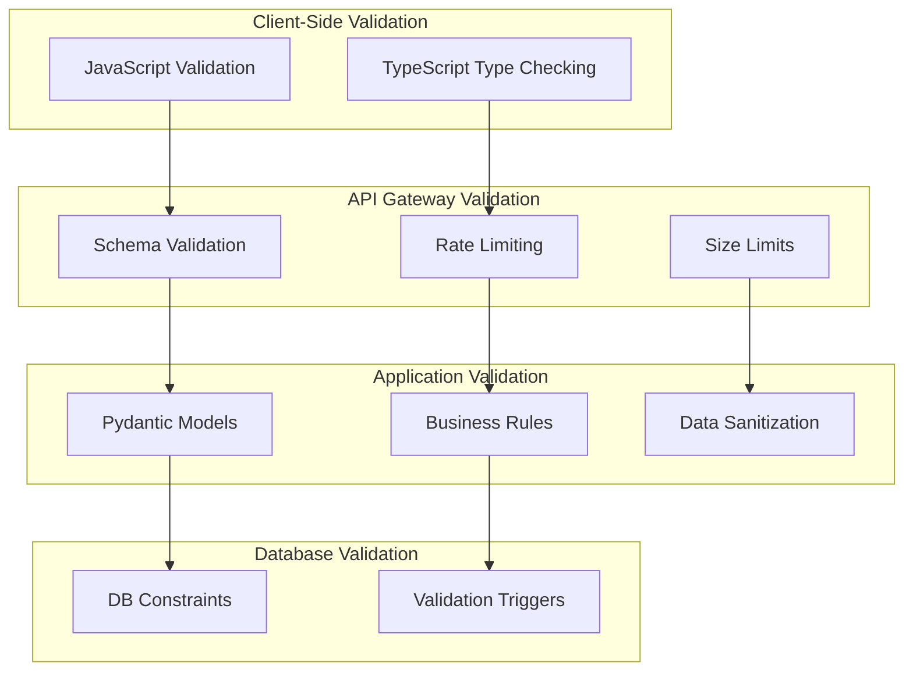

# ✅ Input-Validation

Keiko Personal Assistant implementiert umfassende Input-Validation für Enterprise-Sicherheit und Datenintegrität.

## 🛡️ Validation-Architektur

### Mehrschichtige Validierung



## 📋 Schema-Validation

### Pydantic-Modelle

#### Agent-Task-Validation

```python
from pydantic import BaseModel, Field, validator
from typing import Optional, Dict, Any, List
from enum import Enum

class TaskPriority(str, Enum):
    LOW = "low"
    NORMAL = "normal"
    HIGH = "high"
    CRITICAL = "critical"

class AgentTaskRequest(BaseModel):
    """Validierung für Agent-Task-Anfragen."""

    task_type: str = Field(
        ...,
        min_length=1,
        max_length=100,
        regex=r"^[a-zA-Z0-9_-]+$",
        description="Task-Typ (alphanumerisch, Unterstriche, Bindestriche)"
    )

    parameters: Dict[str, Any] = Field(
        default_factory=dict,
        description="Task-Parameter"
    )

    priority: TaskPriority = Field(
        default=TaskPriority.NORMAL,
        description="Task-Priorität"
    )

    timeout_seconds: Optional[int] = Field(
        default=300,
        ge=1,
        le=3600,
        description="Timeout in Sekunden (1-3600)"
    )

    metadata: Optional[Dict[str, str]] = Field(
        default_factory=dict,
        description="Zusätzliche Metadaten"
    )

    @validator('parameters')
    def validate_parameters(cls, v):
        """Validiert Task-Parameter."""
        if not isinstance(v, dict):
            raise ValueError("Parameters müssen ein Dictionary sein")

        # Maximale Verschachtelungstiefe prüfen
        if cls._get_dict_depth(v) > 5:
            raise ValueError("Parameter-Verschachtelung zu tief (max. 5 Ebenen)")

        # Gefährliche Schlüssel prüfen
        dangerous_keys = ['__class__', '__module__', 'eval', 'exec']
        if any(key in str(v) for key in dangerous_keys):
            raise ValueError("Gefährliche Parameter-Schlüssel erkannt")

        return v

    @validator('metadata')
    def validate_metadata(cls, v):
        """Validiert Metadaten."""
        if v is None:
            return {}

        # Maximale Anzahl Metadaten-Felder
        if len(v) > 20:
            raise ValueError("Zu viele Metadaten-Felder (max. 20)")

        # Schlüssel- und Wert-Längen prüfen
        for key, value in v.items():
            if len(key) > 50:
                raise ValueError(f"Metadaten-Schlüssel zu lang: {key}")
            if len(str(value)) > 500:
                raise ValueError(f"Metadaten-Wert zu lang für Schlüssel: {key}")

        return v

    @staticmethod
    def _get_dict_depth(d: Dict, depth: int = 0) -> int:
        """Berechnet die Verschachtelungstiefe eines Dictionaries."""
        if not isinstance(d, dict) or not d:
            return depth
        return max(
            AgentTaskRequest._get_dict_depth(v, depth + 1)
            for v in d.values()
            if isinstance(v, dict)
        ) if any(isinstance(v, dict) for v in d.values()) else depth
```

#### MCP-Server-Registration

```python
from pydantic import BaseModel, Field, validator, HttpUrl
from typing import Optional, Dict

class MCPServerRegistration(BaseModel):
    """Validierung für MCP-Server-Registrierung."""

    server_name: str = Field(
        ...,
        min_length=3,
        max_length=50,
        regex=r"^[a-zA-Z0-9][a-zA-Z0-9_-]*[a-zA-Z0-9]$",
        description="Server-Name (3-50 Zeichen, alphanumerisch)"
    )

    base_url: HttpUrl = Field(
        ...,
        description="Basis-URL des MCP-Servers"
    )

    timeout_seconds: float = Field(
        default=30.0,
        ge=1.0,
        le=300.0,
        description="Timeout in Sekunden (1-300)"
    )

    description: Optional[str] = Field(
        default="",
        max_length=500,
        description="Server-Beschreibung (max. 500 Zeichen)"
    )

    authentication: Optional[Dict[str, str]] = Field(
        default_factory=dict,
        description="Authentifizierungsinformationen"
    )

    @validator('base_url')
    def validate_base_url(cls, v):
        """Validiert die Basis-URL."""
        url_str = str(v)

        # Nur HTTPS in Produktion
        if not url_str.startswith(('http://', 'https://')):
            raise ValueError("URL muss mit http:// oder https:// beginnen")

        # Localhost nur in Entwicklung
        if 'localhost' in url_str or '127.0.0.1' in url_str:
            import os
            if os.getenv('ENVIRONMENT') == 'production':
                raise ValueError("Localhost-URLs in Produktion nicht erlaubt")

        return v

    @validator('authentication')
    def validate_authentication(cls, v):
        """Validiert Authentifizierungsinformationen."""
        if not v:
            return v

        allowed_types = ['api_key', 'bearer_token', 'basic_auth']
        auth_type = v.get('type')

        if auth_type not in allowed_types:
            raise ValueError(f"Authentifizierungstyp muss einer von {allowed_types} sein")

        # Spezifische Validierung je nach Typ
        if auth_type == 'api_key' and 'api_key' not in v:
            raise ValueError("API-Key erforderlich für api_key Authentifizierung")

        if auth_type == 'bearer_token' and 'token' not in v:
            raise ValueError("Token erforderlich für bearer_token Authentifizierung")

        if auth_type == 'basic_auth':
            if 'username' not in v or 'password' not in v:
                raise ValueError("Username und Password erforderlich für basic_auth")

        return v
```

## 🔒 Sicherheits-Validation

### SQL-Injection-Schutz

```python
import re
from typing import Any

class SecurityValidator:
    """Sicherheits-Validierungen für Eingaben."""

    # Gefährliche SQL-Patterns
    SQL_INJECTION_PATTERNS = [
        r"(\b(SELECT|INSERT|UPDATE|DELETE|DROP|CREATE|ALTER|EXEC|UNION)\b)",
        r"(--|#|/\*|\*/)",
        r"(\b(OR|AND)\s+\d+\s*=\s*\d+)",
        r"(\b(OR|AND)\s+['\"].*['\"])",
        r"(;|\|\||&&)"
    ]

    # XSS-Patterns
    XSS_PATTERNS = [
        r"<script[^>]*>.*?</script>",
        r"javascript:",
        r"on\w+\s*=",
        r"<iframe[^>]*>",
        r"<object[^>]*>",
        r"<embed[^>]*>"
    ]

    @classmethod
    def validate_sql_injection(cls, value: str) -> bool:
        """Prüft auf SQL-Injection-Versuche."""
        if not isinstance(value, str):
            return True

        value_lower = value.lower()

        for pattern in cls.SQL_INJECTION_PATTERNS:
            if re.search(pattern, value_lower, re.IGNORECASE):
                return False

        return True

    @classmethod
    def validate_xss(cls, value: str) -> bool:
        """Prüft auf XSS-Versuche."""
        if not isinstance(value, str):
            return True

        for pattern in cls.XSS_PATTERNS:
            if re.search(pattern, value, re.IGNORECASE):
                return False

        return True

    @classmethod
    def sanitize_string(cls, value: str, max_length: int = 1000) -> str:
        """Bereinigt und begrenzt String-Eingaben."""
        if not isinstance(value, str):
            return str(value)

        # Länge begrenzen
        value = value[:max_length]

        # Gefährliche Zeichen entfernen
        value = re.sub(r'[<>"\']', '', value)

        # Mehrfache Leerzeichen normalisieren
        value = re.sub(r'\s+', ' ', value)

        # Führende/nachfolgende Leerzeichen entfernen
        value = value.strip()

        return value
```

### Custom Validators

```python
from pydantic import validator

def secure_string_validator(field_name: str, max_length: int = 1000):
    """Erstellt einen sicheren String-Validator."""

    def validator_func(cls, v):
        if v is None:
            return v

        if not isinstance(v, str):
            raise ValueError(f"{field_name} muss ein String sein")

        # Sicherheitsprüfungen
        if not SecurityValidator.validate_sql_injection(v):
            raise ValueError(f"{field_name} enthält potentiell gefährliche SQL-Patterns")

        if not SecurityValidator.validate_xss(v):
            raise ValueError(f"{field_name} enthält potentiell gefährliche XSS-Patterns")

        # Längenprüfung
        if len(v) > max_length:
            raise ValueError(f"{field_name} zu lang (max. {max_length} Zeichen)")

        # Bereinigung
        return SecurityValidator.sanitize_string(v, max_length)

    return validator(field_name, allow_reuse=True)(validator_func)
```

## 📊 Rate Limiting & Size Limits

### Request-Limits

```python
from fastapi import HTTPException, Request
from typing import Dict
import time

class RateLimiter:
    """Rate-Limiting für API-Endpunkte."""

    def __init__(self):
        self.requests: Dict[str, list] = {}
        self.limits = {
            "default": {"requests": 100, "window": 60},  # 100 req/min
            "auth": {"requests": 10, "window": 60},      # 10 req/min
            "tasks": {"requests": 20, "window": 60},     # 20 req/min
            "upload": {"requests": 5, "window": 60}      # 5 req/min
        }

    def check_rate_limit(self, client_ip: str, endpoint_type: str = "default") -> bool:
        """Prüft Rate-Limit für Client."""
        now = time.time()
        limit_config = self.limits.get(endpoint_type, self.limits["default"])

        # Client-Requests initialisieren
        if client_ip not in self.requests:
            self.requests[client_ip] = []

        # Alte Requests entfernen
        window_start = now - limit_config["window"]
        self.requests[client_ip] = [
            req_time for req_time in self.requests[client_ip]
            if req_time > window_start
        ]

        # Limit prüfen
        if len(self.requests[client_ip]) >= limit_config["requests"]:
            return False

        # Request hinzufügen
        self.requests[client_ip].append(now)
        return True

# FastAPI Dependency
async def rate_limit_dependency(request: Request, endpoint_type: str = "default"):
    """Rate-Limiting Dependency für FastAPI."""
    client_ip = request.client.host
    rate_limiter = RateLimiter()

    if not rate_limiter.check_rate_limit(client_ip, endpoint_type):
        raise HTTPException(
            status_code=429,
            detail="Rate limit exceeded",
            headers={"Retry-After": "60"}
        )
```

### Content-Size-Limits

```python
from fastapi import HTTPException, Request
import json

class ContentSizeValidator:
    """Validiert Content-Größen."""

    MAX_SIZES = {
        "json": 1024 * 1024,      # 1 MB
        "text": 512 * 1024,       # 512 KB
        "file": 10 * 1024 * 1024, # 10 MB
        "image": 5 * 1024 * 1024   # 5 MB
    }

    @classmethod
    async def validate_request_size(cls, request: Request, content_type: str = "json"):
        """Validiert Request-Größe."""
        max_size = cls.MAX_SIZES.get(content_type, cls.MAX_SIZES["json"])

        # Content-Length Header prüfen
        content_length = request.headers.get("content-length")
        if content_length and int(content_length) > max_size:
            raise HTTPException(
                status_code=413,
                detail=f"Request zu groß (max. {max_size} bytes)"
            )

        # Body-Größe prüfen
        body = await request.body()
        if len(body) > max_size:
            raise HTTPException(
                status_code=413,
                detail=f"Request-Body zu groß (max. {max_size} bytes)"
            )

        return body
```

## 🔍 Validation-Middleware

### FastAPI-Middleware

```python
from fastapi import FastAPI, Request, HTTPException
from fastapi.middleware.base import BaseHTTPMiddleware
import json

class ValidationMiddleware(BaseHTTPMiddleware):
    """Middleware für umfassende Input-Validation."""

    async def dispatch(self, request: Request, call_next):
        # Content-Type validieren
        content_type = request.headers.get("content-type", "")

        if request.method in ["POST", "PUT", "PATCH"]:
            # JSON-Content validieren
            if "application/json" in content_type:
                try:
                    body = await request.body()
                    if body:
                        # JSON-Parsing testen
                        json.loads(body)

                        # Größe prüfen
                        await ContentSizeValidator.validate_request_size(
                            request, "json"
                        )
                except json.JSONDecodeError:
                    raise HTTPException(
                        status_code=400,
                        detail="Ungültiges JSON-Format"
                    )
                except Exception as e:
                    raise HTTPException(
                        status_code=400,
                        detail=f"Validation-Fehler: {str(e)}"
                    )

        # Request weiterleiten
        response = await call_next(request)
        return response

# Middleware registrieren
app = FastAPI()
app.add_middleware(ValidationMiddleware)
```

## 📋 Validation-Checkliste

### Input-Validation

- [ ] **Schema-Validation** mit Pydantic implementiert
- [ ] **SQL-Injection-Schutz** aktiviert
- [ ] **XSS-Schutz** implementiert
- [ ] **Rate-Limiting** konfiguriert
- [ ] **Content-Size-Limits** gesetzt
- [ ] **Content-Type-Validation** aktiviert
- [ ] **Encoding-Validation** implementiert
- [ ] **File-Upload-Validation** konfiguriert

### Sicherheits-Validation

- [ ] **Gefährliche Patterns** erkannt und blockiert
- [ ] **Input-Sanitization** implementiert
- [ ] **Output-Encoding** aktiviert
- [ ] **CSRF-Schutz** implementiert
- [ ] **Path-Traversal-Schutz** aktiviert
- [ ] **Command-Injection-Schutz** implementiert

### Performance-Validation

- [ ] **Request-Timeouts** konfiguriert
- [ ] **Memory-Limits** gesetzt
- [ ] **CPU-Limits** definiert
- [ ] **Concurrent-Request-Limits** implementiert

!!! warning "Sicherheitshinweis"
    Input-Validation ist nur eine Schicht der Sicherheit. Kombinieren Sie sie mit anderen Sicherheitsmaßnahmen wie Authentifizierung, Autorisierung und Monitoring.

!!! info "Performance-Tipp"
    Implementieren Sie Validation-Caching für häufig validierte Patterns, um die Performance zu verbessern.
