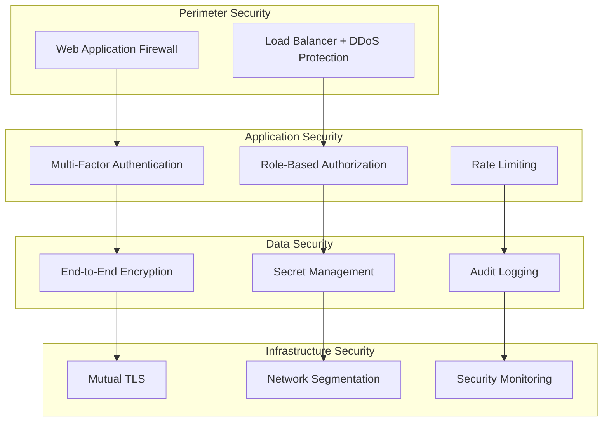

# 🔒 Enterprise-Sicherheit

Keiko Personal Assistant implementiert umfassende Sicherheitsmaßnahmen für Enterprise-Umgebungen mit mehrschichtigen Schutzkonzepten.

## 🛡️ Sicherheitsarchitektur

### Mehrschichtige Sicherheit



## 🔐 Authentifizierung & Autorisierung

### Multi-Faktor-Authentifizierung (MFA)

#### Unterstützte Faktoren

| Faktor             | Typ         | Beschreibung                    | Sicherheitslevel |
| ------------------ | ----------- | ------------------------------- | ---------------- |
| **Passwort**       | Wissen      | Starke Passwort-Richtlinien     | Basis            |
| **TOTP**           | Besitz      | Time-based One-Time Password    | Hoch             |
| **Hardware-Token** | Besitz      | FIDO2/WebAuthn                  | Sehr hoch        |
| **Biometrie**      | Eigenschaft | Fingerabdruck/Gesichtserkennung | Hoch             |

#### MFA-Konfiguration

```python
# MFA-Einstellungen
MFA_SETTINGS = {
    "required": True,
    "methods": ["totp", "hardware_token"],
    "backup_codes": True,
    "session_timeout": 3600,  # 1 Stunde
    "remember_device": False
}
```

### Role-Based Access Control (RBAC)

#### Vordefinierte Rollen

```yaml
roles:
  admin:
    permissions:
      - "system:*"
      - "agents:*"
      - "users:*"
    description: "Vollzugriff auf alle Systemfunktionen"

  operator:
    permissions:
      - "agents:read"
      - "agents:execute"
      - "tasks:*"
    description: "Agent-Verwaltung und Task-Ausführung"

  viewer:
    permissions:
      - "agents:read"
      - "tasks:read"
      - "metrics:read"
    description: "Nur-Lese-Zugriff auf System-Informationen"

  api_user:
    permissions:
      - "api:execute"
      - "tasks:create"
    description: "Programmatischer API-Zugriff"
```

#### Berechtigungsprüfung

```python
# Beispiel-RBAC-Check (vereinfachtes Muster)
from fastapi import HTTPException

def require_permission(permission: str):
    def decorator(func):
        async def wrapper(*args, **kwargs):
            # Hier würde der tatsächliche RBAC-Check stehen
            allowed = True
            if not allowed:
                raise HTTPException(403, "Forbidden")
            return await func(*args, **kwargs)
        return wrapper
    return decorator

@require_permission("agents:execute")
async def execute_agent_task(agent_id: str, task: dict):
    """Führt eine Agent-Task aus (erfordert agents:execute Berechtigung)."""
    return {"status": "ok"}
```

## 🔑 Kryptographie & Verschlüsselung

### Verschlüsselungsstandards

| Komponente           | Algorithmus | Schlüssellänge | Verwendung              |
| -------------------- | ----------- | -------------- | ----------------------- |
| **Datenübertragung** | TLS 1.3     | 256-bit        | HTTPS/WSS               |
| **Daten-at-Rest**    | AES-256-GCM | 256-bit        | Datenbank/Storage       |
| **JWT-Signierung**   | RS256       | 2048-bit       | Token-Authentifizierung |
| **Passwort-Hashing** | Argon2id    | -              | Benutzer-Passwörter     |

### Schlüsselverwaltung

#### Azure Key Vault Integration

```python
# Azure Key Vault Beispiel mit Azure SDK
from azure.identity import DefaultAzureCredential
from azure.keyvault.secrets import SecretClient

credential = DefaultAzureCredential()
client = SecretClient(vault_url="https://keiko-vault.vault.azure.net/", credential=credential)

secret = client.get_secret("data-encryption-key")
print(secret.value)
```

#### Schlüsselrotation

```yaml
key_rotation:
  schedule: "0 2 1 * *" # Monatlich um 2:00 Uhr
  keys:
    - name: "jwt-signing-key"
      type: "rsa"
      size: 2048
      retention_period: "90d"
    - name: "data-encryption-key"
      type: "aes"
      size: 256
      retention_period: "30d"
```

## 🌐 Netzwerksicherheit

### Mutual TLS (mTLS)

#### Client-Zertifikat-Authentifizierung

```python
# mTLS-Konfiguration
MTLS_CONFIG = {
    "enabled": True,
    "ca_cert_path": "/etc/ssl/certs/ca.pem",
    "server_cert_path": "/etc/ssl/certs/server.pem",
    "server_key_path": "/etc/ssl/private/server.key",
    "client_cert_required": True,
    "verify_mode": "CERT_REQUIRED"
}
```

#### Zertifikatsverwaltung

```bash
# Neues Client-Zertifikat erstellen
openssl genrsa -out client.key 2048
openssl req -new -key client.key -out client.csr
openssl x509 -req -in client.csr -CA ca.pem -CAkey ca.key -out client.pem

# Zertifikat validieren
openssl verify -CAfile ca.pem client.pem
```

### Netzwerk-Segmentierung

```yaml
network_policies:
  api_tier:
    ingress:
      - from: "load_balancer"
        ports: [443]
    egress:
      - to: "service_tier"
        ports: [8080]

  service_tier:
    ingress:
      - from: "api_tier"
        ports: [8080]
    egress:
      - to: "data_tier"
        ports: [5432, 6379]

  data_tier:
    ingress:
      - from: "service_tier"
        ports: [5432, 6379]
    egress: [] # Keine ausgehenden Verbindungen
```

## 📊 Security Monitoring

### Sicherheitsereignisse

#### Event-Kategorien

| Kategorie             | Ereignisse                 | Schweregrad | Aktion        |
| --------------------- | -------------------------- | ----------- | ------------- |
| **Authentifizierung** | Login-Versuche, MFA-Fehler | INFO/WARN   | Logging       |
| **Autorisierung**     | Zugriffsverweigerung       | WARN        | Alert         |
| **Anomalien**         | Ungewöhnliche API-Nutzung  | WARN        | Investigation |
| **Angriffe**          | SQL-Injection, XSS         | CRITICAL    | Block + Alert |

#### Security Information and Event Management (SIEM)

```python
# Logging mit SDK-Logger
from kei_agent import get_logger
logger = get_logger("security")
logger.warning(
    "authentication_failure",
    user_id="user123",
    ip_address="192.168.1.100",
    reason="invalid_password",
    attempts=3,
)
```

### Intrusion Detection

#### Anomalie-Erkennung

```python
# Anomalie-Erkennungsregeln
ANOMALY_RULES = {
    "failed_login_threshold": {
        "count": 5,
        "window": "5m",
        "action": "block_ip"
    },
    "api_rate_anomaly": {
        "threshold": "3x_baseline",
        "window": "1h",
        "action": "alert"
    },
    "privilege_escalation": {
        "pattern": "role_change",
        "action": "immediate_alert"
    }
}
```

## 🔍 Compliance & Audit

### Audit-Logging

#### Audit-Ereignisse

```python
from kei_agent import get_logger
logger = get_logger("audit")
logger.info(
    "agent_task_execution",
    user_id="user123",
    resource_id="agent_456",
    task_type="data_processing",
    data_classification="confidential",
    approval_required=True,
    approver="manager789",
)
```

#### Compliance-Standards

| Standard          | Abdeckung              | Status            | Zertifizierung |
| ----------------- | ---------------------- | ----------------- | -------------- |
| **ISO 27001**     | Informationssicherheit | ✅ Implementiert  | Geplant        |
| **SOC 2 Type II** | Service-Sicherheit     | ✅ Implementiert  | In Arbeit      |
| **GDPR**          | Datenschutz            | ✅ Implementiert  | Konform        |
| **HIPAA**         | Gesundheitsdaten       | 🔄 In Entwicklung | Geplant        |

### Datenschutz

#### Datenklassifizierung

```python
# Beispielhafte Datenklassifizierung
def classify(data: str) -> str:
    return "confidential" if "secret" in data.lower() else "public"

level = classify(user_input)
if level == "confidential":
    # Maßnahmen ergreifen
    pass
```

## 🚨 Incident Response

### Sicherheitsvorfälle

#### Incident-Kategorien

| Kategorie         | Beispiele                          | Response-Zeit | Eskalation    |
| ----------------- | ---------------------------------- | ------------- | ------------- |
| **P1 - Kritisch** | Datenleck, System-Kompromittierung | < 15 Min      | CISO          |
| **P2 - Hoch**     | Authentifizierungs-Bypass          | < 1 Std       | Security Team |
| **P3 - Mittel**   | Anomale API-Nutzung                | < 4 Std       | Operations    |
| **P4 - Niedrig**  | Policy-Verletzung                  | < 24 Std      | Team Lead     |

#### Automatisierte Response

```python
# Minimales Incident-Handler-Muster
from typing import Callable, Dict

handlers: Dict[str, Callable] = {}

def incident_handler(event_type: str):
    def register(func: Callable):
        handlers[event_type] = func
        return func
    return register

@incident_handler("authentication_attack")
async def handle_auth_attack(event):
    # Aktionen: blockieren, benachrichtigen, forensik sammeln
    pass
```

## 📋 Security Checklist

### Deployment-Sicherheit

- [ ] **TLS 1.3** für alle externen Verbindungen aktiviert
- [ ] **mTLS** für interne Service-Kommunikation konfiguriert
- [ ] **Starke Passwort-Richtlinien** implementiert
- [ ] **MFA** für alle privilegierten Accounts aktiviert
- [ ] **RBAC** korrekt konfiguriert und getestet
- [ ] **Audit-Logging** für alle kritischen Aktionen aktiviert
- [ ] **Security Monitoring** und Alerting eingerichtet
- [ ] **Vulnerability Scanning** regelmäßig durchgeführt
- [ ] **Penetration Testing** jährlich durchgeführt
- [ ] **Incident Response Plan** dokumentiert und getestet

### Laufende Sicherheit

- [ ] **Sicherheits-Updates** regelmäßig eingespielt
- [ ] **Schlüsselrotation** nach Plan durchgeführt
- [ ] **Access Reviews** quartalsweise durchgeführt
- [ ] **Security Metrics** überwacht
- [ ] **Compliance-Audits** bestanden
- [ ] **Mitarbeiter-Schulungen** durchgeführt

!!! warning "Sicherheitshinweis"
Diese Dokumentation enthält allgemeine Sicherheitsrichtlinien. Für produktive Umgebungen sollten zusätzliche, umgebungsspezifische Sicherheitsmaßnahmen implementiert werden.

!!! info "Weitere Informationen"
Detaillierte Sicherheitskonfigurationen finden Sie in der [Monitoring-Dokumentation](monitoring.md) und [Input-Validation-Dokumentation](input-validation.md).
