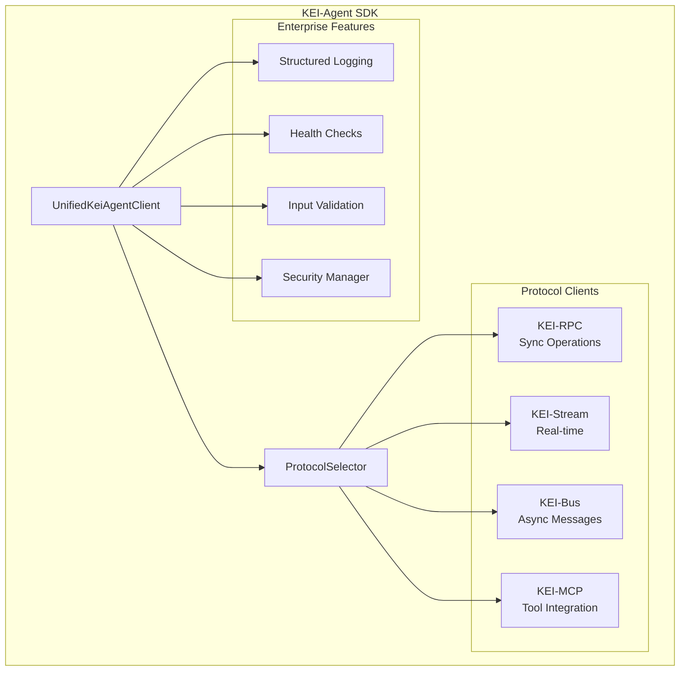

# KEI-Agent Python SDK

Willkommen zur offiziellen Dokumentation des **KEI-Agent Python SDK** - einem Enterprise-Grade Framework für Multi-Agent-Systeme mit umfassender Protokoll-Unterstützung.

## 🚀 Überblick

Das KEI-Agent Python SDK bietet eine einheitliche, typisierte API für die Entwicklung von intelligenten Agenten mit Unterstützung für:

- **Multi-Protocol Support**: KEI-RPC, KEI-Stream, KEI-Bus und KEI-MCP
- **Enterprise Security**: Umfassende Authentifizierung und Input-Validierung
- **Production Monitoring**: Structured Logging und Health Checks
- **Developer Experience**: Vollständige Type Hints und deutsche Dokumentation
- **High Availability**: Automatische Fallback-Mechanismen und Circuit Breaker

## ⚡ Quick Start

```python
import asyncio
import httpx
from kei_agent import UnifiedKeiAgentClient, AgentClientConfig, CapabilityManager, CapabilityProfile

# 1) Agent Erstellen
config = AgentClientConfig(
    base_url="https://api.kei-framework.com",
    api_token="your-token",
    agent_id="blogpost-agent"
)

# 2) Agent Definition
async def main():
    async with UnifiedKeiAgentClient(config=config) as client:

        # 3) Tool erstellen
        async def web_search_tool(query: str) -> dict:
            async with httpx.AsyncClient() as http:
                response = await http.get(f"https://api.duckduckgo.com/?q={query}&format=json")
                data = response.json()
                return {"results": data.get("RelatedTopics", [])[:3]}

        # 4) Tool Zugriff für Agent realisieren
        capability_manager = CapabilityManager(client._legacy_client)
        await capability_manager.register_capability(
            CapabilityProfile(
                name="web_search",
                version="1.0.0",
                description="Web-Suche"
            ),
            handler=web_search_tool
        )

        # 5) Aufgabe für den Agent Definieren
        task = await client.plan_task(
            objective="Erstelle Blogpost über KI",
            context={"topic": "Künstliche Intelligenz"}
        )

        # 6) Ausführung Agent Starten
        search_result = await client.use_tool("web_search", **{"query": "KI Trends 2024"})

        # 7) Agent liefert die Response
        print(f"Gefunden: {len(search_result['results'])} Ergebnisse")
        return search_result

asyncio.run(main())
```

## 🏗️ Architektur-Highlights

### Refactored Design

Das SDK wurde vollständig refactored für Enterprise-Einsatz:

- **Clean Code**: Alle Module ≤200 Zeilen, Funktionen ≤20 Zeilen
- **Type Safety**: 100% Type Hints für alle APIs
- **Modularity**: Klare Trennung von Protokoll-Clients, Security und Utilities
- **Testability**: 85%+ Test-Coverage mit deterministischen Tests

### Multi-Protocol Architecture



## 🎯 Hauptfeatures

### 🔌 Multi-Protocol Support

- **KEI-RPC**: Synchrone Request-Response Operationen
- **KEI-Stream**: Bidirektionale Real-time Kommunikation
- **KEI-Bus**: Asynchrone Message-Bus Integration
- **KEI-MCP**: Model Context Protocol für Tool-Integration

### 🛡️ Enterprise Security

- **Multi-Auth**: Bearer Token, OIDC, mTLS
- **Input Validation**: Umfassende Sanitization und Validierung
- **Audit Logging**: Vollständige Nachverfolgbarkeit
- **RBAC**: Role-Based Access Control

### 📊 Production Monitoring

- **Structured Logging**: JSON-Format mit Correlation-IDs
- **Health Checks**: Database, API, Memory, Custom
- **Performance Metrics**: Built-in Timing und Resource-Monitoring
- **Distributed Tracing**: OpenTelemetry-Integration

### 🔧 Developer Experience

- **Type Safety**: Vollständige Type Hints für IntelliSense
- **Deutsche Dokumentation**: Umfassende Guides und API-Referenz
- **Auto-Completion**: IDE-Unterstützung für alle APIs
- **Error Messages**: Klare, actionable Fehlermeldungen

## 📚 Dokumentations-Navigation

### Erste Schritte

- [**Installation**](getting-started/installation.md) - Schritt-für-Schritt Setup
- [**Quick Start**](getting-started/quickstart.md) - Erste Schritte in 5 Minuten
- [**Konfiguration**](getting-started/configuration.md) - Client-Setup und Optionen

### Benutzerhandbuch

- [**Basis-Konzepte**](user-guide/concepts.md) - Grundlagen verstehen
- [**Client-Verwendung**](user-guide/client-usage.md) - Praktische Anwendung
- [**Protokolle**](user-guide/protocols.md) - Multi-Protocol Features

### Enterprise Features

- [**Structured Logging**](enterprise/logging.md) - Production-Logging
- [**Health Checks**](enterprise/health-checks.md) - System-Monitoring
- [**Security**](enterprise/security.md) - Sicherheits-Features

### API-Referenz

- [**Unified Client**](api/unified-client.md) - Haupt-API-Klasse (auto-generiert)
- [**Protocol Types**](api/protocol-types.md) - Konfigurationen und Enums (auto-generiert)
- [**Protocol Clients**](api/protocol-clients.md) - RPC/Stream/Bus/MCP (auto-generiert)
- [**Protocol Selector**](api/protocol-selector.md) - Auswahl-Logik (auto-generiert)
- [**Security Manager**](api/security-manager.md) - Authentifizierung (auto-generiert)
- [**Enterprise Logging**](api/enterprise-logging.md) - Logging-APIs (auto-generiert)
- [**Health Checks**](api/health-checks.md) - Monitoring (auto-generiert)

## 🔄 Migration

Migrieren Sie von der Legacy-Version? Unser [**Migration Guide**](migration/from-legacy.md) hilft Ihnen bei einem reibungslosen Übergang zur neuen Enterprise-Architektur.

## 🤝 Community & Support

- **GitHub Repository**: [kei-framework/kei-agent](https://github.com/kei-framework/kei-agent)
- **Issues & Bugs**: [GitHub Issues](https://github.com/kei-framework/kei-agent/issues)
- **Discussions**: [GitHub Discussions](https://github.com/kei-framework/kei-agent/discussions)
- **PyPI Package**: [kei_agent_py_sdk](https://pypi.org/project/kei_agent_py_sdk/)

## 📄 Lizenz

Das KEI-Agent Python SDK ist unter der [MIT-Lizenz](https://github.com/kei-framework/kei-agent/blob/main/LICENSE) veröffentlicht.

---

**Bereit loszulegen?** Beginnen Sie mit der [Installation](getting-started/installation.md) oder springen Sie direkt zum [Quick Start Guide](getting-started/quickstart.md)!
