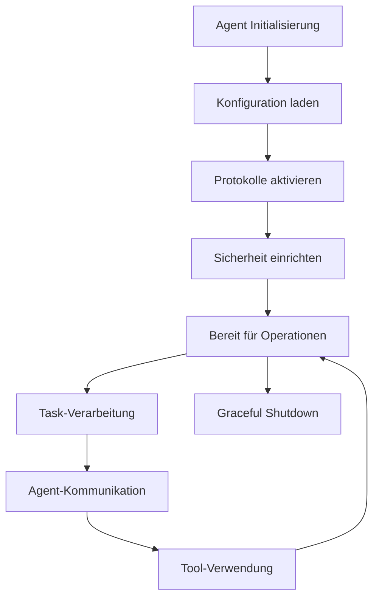

# Basis-Konzepte

Dieses Kapitel erklärt die grundlegenden Konzepte des KEI-Agent Python SDK und des zugrunde liegenden KEI-Agent Framework.

## 🤖 Agent-Architektur

### Was ist ein KEI-Agent?

Ein KEI-Agent ist eine autonome Software-Einheit, die:

- **Aufgaben planen** und ausführen kann
- **Mit anderen Agents kommuniziert** über verschiedene Protokolle
- **Kontextbewusst** arbeitet und Entscheidungen trifft
- **Tools und Services** nutzen kann
- **Sicherheitsrichtlinien** befolgt

### Agent-Lebenszyklus



## 🔌 Protokoll-Typen

Das KEI-Agent SDK unterstützt vier Hauptprotokolle:

### 1. RPC (Remote Procedure Call)

- **Synchrone** Request-Response-Kommunikation
- Ideal für **direkte Agent-Aufrufe**
- HTTP-basiert mit JSON-Payloads

```python
# RPC-Beispiel
result = await client.plan_task("Analysiere Daten")
```

### 2. Stream (WebSocket)

- **Bidirektionale** Echtzeit-Kommunikation
- Ideal für **kontinuierliche Datenströme**
- WebSocket-basiert

```python
# Stream-Beispiel
async def on_event(message):
    print(f"Empfangen: {message}")

await client.start_streaming_session(callback=on_event)
```

### 3. Bus (Message Bus)

- **Asynchrone** Publish-Subscribe-Kommunikation
- Ideal für **Event-basierte Architekturen**
- Entkoppelte Agent-Kommunikation

```python
# Bus-Beispiel
await client.send_agent_message("target-agent", "task_request", data)
```

### 4. MCP (Model Context Protocol)

- **Tool-Discovery** und -Verwendung
- Ideal für **KI-Model-Integration**
- Standardisierte Tool-Schnittstelle

```python
# MCP-Beispiel
tools = await client.discover_available_tools()
result = await client.use_tool("calculator", expression="2+2")
```

## 🔒 Sicherheitsmodell

### Authentifizierung

Das SDK unterstützt drei Authentifizierungsmethoden:

#### Bearer Token

```python
config = AgentClientConfig(
    api_token="your-bearer-token",
    auth_type=AuthType.BEARER
)
```

#### OIDC (OpenID Connect)

```python
config = SecurityConfig(
    auth_type=AuthType.OIDC,
    oidc_issuer="https://your-oidc-provider.com",
    oidc_client_id="your-client-id",
    oidc_client_secret="your-client-secret"
)
```

#### mTLS (Mutual TLS)

```python
config = SecurityConfig(
    auth_type=AuthType.MTLS,
    mtls_cert_path="/path/to/client.crt",
    mtls_key_path="/path/to/client.key",
    mtls_ca_path="/path/to/ca.crt"
)
```

### Autorisierung

- **RBAC** (Role-Based Access Control)
- **Audit-Logging** für Compliance
- **Token-Refresh** für langlebige Sessions

## ⚙️ Konfigurationsmanagement

### Hierarchische Konfiguration

```python
# 1. Agent-Basis-Konfiguration
agent_config = AgentClientConfig(
    base_url="https://kei-agent.com",
    api_token="token",
    agent_id="my-agent"
)

# 2. Protokoll-Konfiguration
protocol_config = ProtocolConfig(
    rpc_enabled=True,
    stream_enabled=True,
    auto_protocol_selection=True
)

# 3. Sicherheits-Konfiguration
security_config = SecurityConfig(
    auth_type=AuthType.BEARER,
    rbac_enabled=True,
    audit_enabled=True
)

# 4. Client erstellen
client = UnifiedKeiAgentClient(
    config=agent_config,
    protocol_config=protocol_config,
    security_config=security_config
)
```

### Umgebungsvariablen

```bash
# Basis-Konfiguration
KEI_AGENT_BASE_URL=https://kei-agent.com
KEI_AGENT_API_TOKEN=your-token
KEI_AGENT_ID=my-agent

# Protokoll-Einstellungen
KEI_AGENT_RPC_ENABLED=true
KEI_AGENT_STREAM_ENABLED=true

# Sicherheit
KEI_AGENT_AUTH_TYPE=bearer
KEI_AGENT_RBAC_ENABLED=true
```

## 🔄 Asynchrone Programmierung

### Async/Await Pattern

Das SDK ist vollständig asynchron:

```python
import asyncio

async def main():
    async with UnifiedKeiAgentClient(config) as client:
        # Alle Operationen sind async
        result = await client.plan_task("Task")

        # Parallele Ausführung
        tasks = [
            client.plan_task("Task 1"),
            client.plan_task("Task 2"),
            client.plan_task("Task 3")
        ]
        results = await asyncio.gather(*tasks)

# Ausführung
asyncio.run(main())
```

### Context Manager

```python
# Automatisches Resource-Management
async with UnifiedKeiAgentClient(config) as client:
    # Client wird automatisch initialisiert
    result = await client.plan_task("Task")
    # Client wird automatisch geschlossen
```

## 📊 Monitoring und Observability

### Structured Logging

```python
from kei_agent import get_logger

logger = get_logger("my-component")
logger.info("Operation started", extra={
    "operation": "plan_task",
    "agent_id": "my-agent",
    "correlation_id": "req-123"
})
```

### Health Checks

```python
from kei_agent import get_health_manager, APIHealthCheck

health = get_health_manager()
health.register_check(APIHealthCheck(name="kei_api", url="https://api.kei-framework.com/health"))
summary = await health.run_all_checks()
print(f"System Health: {summary.overall_status}")
```

### Tracing

```python
# Automatisches Tracing für alle Operationen
async with client.trace_operation("complex-task") as span:
    result = await client.plan_task("Task")
    span.set_attribute("result_size", len(result))
```

## 🎯 Best Practices

### 1. Konfiguration

- Verwenden Sie **Umgebungsvariablen** für Deployment-spezifische Werte
- Nutzen Sie **Type-Hints** für bessere IDE-Unterstützung
- Implementieren Sie **Konfigurationsvalidierung**

### 2. Fehlerbehandlung

- Verwenden Sie **spezifische Exception-Types**
- Implementieren Sie **Retry-Strategien**
- Nutzen Sie **Circuit Breaker** für externe Services

### 3. Performance

- Verwenden Sie **Connection Pooling**
- Implementieren Sie **Caching** wo sinnvoll
- Nutzen Sie **Batch-Operationen** für mehrere Requests

### 4. Sicherheit

- **Rotieren Sie Tokens** regelmäßig
- Verwenden Sie **mTLS** in produktiven Umgebungen
- Aktivieren Sie **Audit-Logging**

## 🔗 Nächste Schritte

- [Client-Verwendung](client-usage.md) - Praktische Anwendung
- [Protokolle](protocols.md) - Detaillierte Protokoll-Informationen
- [Authentifizierung](authentication.md) - Sicherheitsaspekte
- [Beispiele](../examples/index.md) - Praktische Beispiele
