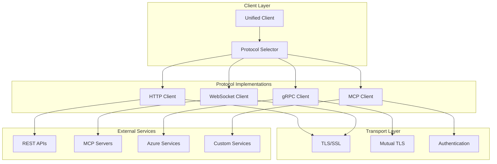

# 🔌 Protocol-Clients

<!-- API aus Code generieren -->

::: kei_agent.protocol_clients.BaseProtocolclient

::: kei_agent.protocol_clients.KEIRPCclient

::: kei_agent.protocol_clients.KEIStreamclient

::: kei_agent.protocol_clients.KEIBusclient

::: kei_agent.protocol_clients.KEIMCPclient

## 🏗️ Client-Architektur

### Protocol-Client-Übersicht



## 🌐 HTTP-Client

### Basis-HTTP-Client

```python
import aiohttp
import asyncio
from typing import Dict, Any, Optional, Union
from dataclasses import dataclass
import json

@dataclass
class HTTPClientConfig:
    """Konfiguration für HTTP-Client."""
    base_url: str
    timeout: float = 30.0
    max_retries: int = 3
    retry_delay: float = 1.0
    headers: Optional[Dict[str, str]] = None
    auth_token: Optional[str] = None
    verify_ssl: bool = True

class HTTPProtocolClient:
    """HTTP-Protocol-Client für REST-API-Kommunikation."""

    def __init__(self, config: HTTPClientConfig):
        self.config = config
        self.session: Optional[aiohttp.ClientSession] = None

    async def __aenter__(self):
        """Async Context Manager Entry."""
        await self.connect()
        return self

    async def __aexit__(self, exc_type, exc_val, exc_tb):
        """Async Context Manager Exit."""
        await self.disconnect()

    async def connect(self):
        """Stellt Verbindung her."""
        headers = self.config.headers or {}

        if self.config.auth_token:
            headers['Authorization'] = f'Bearer {self.config.auth_token}'

        connector = aiohttp.TCPConnector(
            verify_ssl=self.config.verify_ssl,
            limit=100,
            limit_per_host=30
        )

        timeout = aiohttp.ClientTimeout(total=self.config.timeout)

        self.session = aiohttp.ClientSession(
            base_url=self.config.base_url,
            headers=headers,
            connector=connector,
            timeout=timeout
        )

    async def disconnect(self):
        """Schließt Verbindung."""
        if self.session:
            await self.session.close()
            self.session = None

    async def request(
        self,
        method: str,
        path: str,
        data: Optional[Union[Dict, str]] = None,
        params: Optional[Dict[str, str]] = None,
        headers: Optional[Dict[str, str]] = None
    ) -> Dict[str, Any]:
        """Führt HTTP-Request aus mit Retry-Logic."""

        if not self.session:
            await self.connect()

        for attempt in range(self.config.max_retries + 1):
            try:
                # Request-Daten vorbereiten
                request_kwargs = {
                    'params': params,
                    'headers': headers
                }

                if data:
                    if isinstance(data, dict):
                        request_kwargs['json'] = data
                    else:
                        request_kwargs['data'] = data

                # Request ausführen
                async with self.session.request(method, path, **request_kwargs) as response:
                    response_data = await response.text()

                    # JSON-Response versuchen zu parsen
                    try:
                        response_json = json.loads(response_data)
                    except json.JSONDecodeError:
                        response_json = {'raw_response': response_data}

                    # Erfolgreiche Response
                    if response.status < 400:
                        return {
                            'status': response.status,
                            'headers': dict(response.headers),
                            'data': response_json
                        }

                    # Client-Fehler (4xx) - nicht wiederholen
                    if 400 <= response.status < 500:
                        raise aiohttp.ClientResponseError(
                            request_info=response.request_info,
                            history=response.history,
                            status=response.status,
                            message=response_data
                        )

                    # Server-Fehler (5xx) - wiederholen
                    if attempt < self.config.max_retries:
                        await asyncio.sleep(self.config.retry_delay * (2 ** attempt))
                        continue

                    raise aiohttp.ClientResponseError(
                        request_info=response.request_info,
                        history=response.history,
                        status=response.status,
                        message=response_data
                    )

            except aiohttp.ClientError as e:
                if attempt < self.config.max_retries:
                    await asyncio.sleep(self.config.retry_delay * (2 ** attempt))
                    continue
                raise

        raise Exception("Max retries exceeded")

    async def get(self, path: str, params: Optional[Dict[str, str]] = None) -> Dict[str, Any]:
        """GET-Request."""
        return await self.request('GET', path, params=params)

    async def post(self, path: str, data: Optional[Union[Dict, str]] = None) -> Dict[str, Any]:
        """POST-Request."""
        return await self.request('POST', path, data=data)

    async def put(self, path: str, data: Optional[Union[Dict, str]] = None) -> Dict[str, Any]:
        """PUT-Request."""
        return await self.request('PUT', path, data=data)

    async def delete(self, path: str) -> Dict[str, Any]:
        """DELETE-Request."""
        return await self.request('DELETE', path)
```

## 🔌 WebSocket-Client

### WebSocket-Protocol-Client

```python
import websockets
import json
import asyncio
from typing import Dict, Any, Callable, Optional
from dataclasses import dataclass

@dataclass
class WebSocketClientConfig:
    """Konfiguration für WebSocket-Client."""
    url: str
    auth_token: Optional[str] = None
    ping_interval: float = 30.0
    ping_timeout: float = 10.0
    close_timeout: float = 10.0
    max_size: int = 1024 * 1024  # 1MB
    compression: Optional[str] = 'deflate'

class WebSocketProtocolClient:
    """WebSocket-Protocol-Client für Echtzeit-Kommunikation."""

    def __init__(self, config: WebSocketClientConfig):
        self.config = config
        self.websocket: Optional[websockets.WebSocketServerProtocol] = None
        self.message_handlers: Dict[str, Callable] = {}
        self.is_connected = False

    async def connect(self):
        """Stellt WebSocket-Verbindung her."""
        headers = {}
        if self.config.auth_token:
            headers['Authorization'] = f'Bearer {self.config.auth_token}'

        try:
            self.websocket = await websockets.connect(
                self.config.url,
                extra_headers=headers,
                ping_interval=self.config.ping_interval,
                ping_timeout=self.config.ping_timeout,
                close_timeout=self.config.close_timeout,
                max_size=self.config.max_size,
                compression=self.config.compression
            )
            self.is_connected = True

            # Message-Handler-Task starten
            asyncio.create_task(self._message_handler_loop())

        except Exception as e:
            raise ConnectionError(f"WebSocket-Verbindung fehlgeschlagen: {e}")

    async def disconnect(self):
        """Schließt WebSocket-Verbindung."""
        if self.websocket:
            await self.websocket.close()
            self.websocket = None
            self.is_connected = False

    async def send_message(self, message_type: str, data: Dict[str, Any]) -> None:
        """Sendet Nachricht über WebSocket."""
        if not self.is_connected or not self.websocket:
            raise ConnectionError("WebSocket nicht verbunden")

        message = {
            'type': message_type,
            'timestamp': asyncio.get_event_loop().time(),
            'data': data
        }

        try:
            await self.websocket.send(json.dumps(message))
        except websockets.exceptions.ConnectionClosed:
            self.is_connected = False
            raise ConnectionError("WebSocket-Verbindung unterbrochen")

    async def _message_handler_loop(self):
        """Message-Handler-Loop für eingehende Nachrichten."""
        try:
            async for message in self.websocket:
                try:
                    data = json.loads(message)
                    message_type = data.get('type')

                    if message_type in self.message_handlers:
                        handler = self.message_handlers[message_type]
                        asyncio.create_task(handler(data))

                except json.JSONDecodeError:
                    print(f"Ungültige JSON-Nachricht erhalten: {message}")
                except Exception as e:
                    print(f"Fehler beim Verarbeiten der Nachricht: {e}")

        except websockets.exceptions.ConnectionClosed:
            self.is_connected = False
        except Exception as e:
            print(f"Fehler in Message-Handler-Loop: {e}")
            self.is_connected = False

    def register_handler(self, message_type: str, handler: Callable):
        """Registriert Handler für Nachrichtentyp."""
        self.message_handlers[message_type] = handler

    def unregister_handler(self, message_type: str):
        """Entfernt Handler für Nachrichtentyp."""
        if message_type in self.message_handlers:
            del self.message_handlers[message_type]
```

## 🤖 MCP-Client

### Model Context Protocol Client

```python
from typing import Dict, Any, List, Optional
import aiohttp
import json

class MCPProtocolClient:
    """MCP (Model Context Protocol) Client."""

    def __init__(self, server_url: str, auth_config: Optional[Dict[str, str]] = None):
        self.server_url = server_url.rstrip('/')
        self.auth_config = auth_config or {}
        self.session: Optional[aiohttp.ClientSession] = None

    async def __aenter__(self):
        await self.connect()
        return self

    async def __aexit__(self, exc_type, exc_val, exc_tb):
        await self.disconnect()

    async def connect(self):
        """Stellt Verbindung zum MCP-Server her."""
        headers = {'Content-Type': 'application/json'}

        # Authentifizierung konfigurieren
        if self.auth_config.get('type') == 'api_key':
            headers['X-API-Key'] = self.auth_config['api_key']
        elif self.auth_config.get('type') == 'bearer_token':
            headers['Authorization'] = f"Bearer {self.auth_config['token']}"

        self.session = aiohttp.ClientSession(headers=headers)

        # Server-Verfügbarkeit prüfen
        try:
            async with self.session.get(f"{self.server_url}/health") as response:
                if response.status != 200:
                    raise ConnectionError(f"MCP-Server nicht verfügbar: {response.status}")
        except aiohttp.ClientError as e:
            raise ConnectionError(f"Verbindung zum MCP-Server fehlgeschlagen: {e}")

    async def disconnect(self):
        """Schließt Verbindung zum MCP-Server."""
        if self.session:
            await self.session.close()
            self.session = None

    async def list_tools(self) -> List[Dict[str, Any]]:
        """Listet verfügbare Tools auf."""
        async with self.session.get(f"{self.server_url}/tools") as response:
            if response.status == 200:
                data = await response.json()
                return data.get('tools', [])
            else:
                raise Exception(f"Fehler beim Abrufen der Tools: {response.status}")

    async def get_tool_schema(self, tool_name: str) -> Dict[str, Any]:
        """Ruft Schema für spezifisches Tool ab."""
        async with self.session.get(f"{self.server_url}/tools/{tool_name}/schema") as response:
            if response.status == 200:
                return await response.json()
            else:
                raise Exception(f"Tool-Schema nicht gefunden: {tool_name}")

    async def execute_tool(self, tool_name: str, arguments: Dict[str, Any]) -> Dict[str, Any]:
        """Führt Tool mit gegebenen Argumenten aus."""
        payload = {
            'tool_name': tool_name,
            'arguments': arguments
        }

        async with self.session.post(
            f"{self.server_url}/tools/{tool_name}/execute",
            json=payload
        ) as response:
            result = await response.json()

            if response.status == 200:
                return result
            else:
                error_msg = result.get('error', 'Unbekannter Fehler')
                raise Exception(f"Tool-Ausführung fehlgeschlagen: {error_msg}")

    async def get_server_info(self) -> Dict[str, Any]:
        """Ruft Server-Informationen ab."""
        async with self.session.get(f"{self.server_url}/info") as response:
            if response.status == 200:
                return await response.json()
            else:
                raise Exception(f"Server-Info nicht verfügbar: {response.status}")
```

## 🔧 Client-Factory

### Protocol-Client-Factory

```python
from enum import Enum
from typing import Union, Dict, Any

class ProtocolType(Enum):
    HTTP = "http"
    WEBSOCKET = "websocket"
    MCP = "mcp"

class ProtocolClientFactory:
    """Factory für Protocol-Clients."""

    @staticmethod
    def create_client(
        protocol_type: ProtocolType,
        config: Union[HTTPClientConfig, WebSocketClientConfig, Dict[str, Any]]
    ):
        """Erstellt Protocol-Client basierend auf Typ."""

        if protocol_type == ProtocolType.HTTP:
            if not isinstance(config, HTTPClientConfig):
                config = HTTPClientConfig(**config)
            return HTTPProtocolClient(config)

        elif protocol_type == ProtocolType.WEBSOCKET:
            if not isinstance(config, WebSocketClientConfig):
                config = WebSocketClientConfig(**config)
            return WebSocketProtocolClient(config)

        elif protocol_type == ProtocolType.MCP:
            return MCPProtocolClient(
                server_url=config.get('server_url'),
                auth_config=config.get('auth_config')
            )

        else:
            raise ValueError(f"Unbekannter Protocol-Typ: {protocol_type}")

# Verwendungsbeispiel
async def example_usage():
    """Beispiel für Client-Verwendung."""

    # HTTP-Client
    http_config = HTTPClientConfig(
        base_url="https://api.example.com",
        auth_token="your-token"
    )

    async with ProtocolClientFactory.create_client(ProtocolType.HTTP, http_config) as client:
        response = await client.get("/users")
        print(f"HTTP Response: {response}")

    # WebSocket-Client
    ws_config = WebSocketClientConfig(
        url="wss://api.example.com/ws",
        auth_token="your-token"
    )

    ws_client = ProtocolClientFactory.create_client(ProtocolType.WEBSOCKET, ws_config)

    # Message-Handler registrieren
    async def handle_message(data):
        print(f"Received: {data}")

    ws_client.register_handler("notification", handle_message)

    await ws_client.connect()
    await ws_client.send_message("subscribe", {"events": ["user_updates"]})

    # MCP-Client
    mcp_config = {
        'server_url': 'http://localhost:8080',
        'auth_config': {'type': 'api_key', 'api_key': 'your-key'}
    }

    async with ProtocolClientFactory.create_client(ProtocolType.MCP, mcp_config) as client:
        tools = await client.list_tools()
        print(f"Available tools: {tools}")

        if tools:
            result = await client.execute_tool(
                tools[0]['name'],
                {'param1': 'value1'}
            )
            print(f"Tool result: {result}")
```

!!! info "Client-Auswahl"
Verwenden Sie den **HTTP-Client** für REST-APIs, den **WebSocket-Client** für Echtzeit-Kommunikation und den **MCP-Client** für Model Context Protocol-Server.

!!! tip "Performance-Optimierung"
Nutzen Sie Connection-Pooling und Keep-Alive-Verbindungen für bessere Performance bei häufigen Requests.
