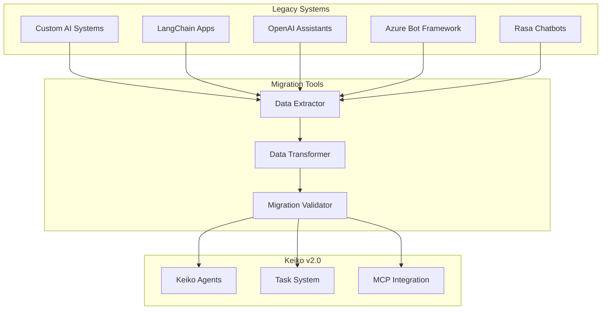

# 🔄 Migration from Legacy Systems

Leitfaden für die Migration von Legacy-Systemen zu Keiko Personal Assistant.

## 🏗️ Legacy-System-Unterstützung

### Unterstützte Legacy-Systeme



## 🤖 OpenAI Assistants Migration

### OpenAI Assistant zu Keiko Agent

```python
# migration/openai_migrator.py
import openai
from keiko.core.agent import Agent, AgentConfig
from keiko.migration.base import BaseMigrator

class OpenAIMigrator(BaseMigrator):
    """Migriert OpenAI Assistants zu Keiko Agents."""

    def __init__(self, openai_api_key: str):
        self.openai_client = openai.OpenAI(api_key=openai_api_key)
        super().__init__()

    async def extract_assistants(self) -> List[Dict[str, Any]]:
        """Extrahiert OpenAI Assistants."""

        assistants = []

        # Alle Assistants abrufen
        response = self.openai_client.beta.assistants.list()

        for assistant in response.data:
            assistant_data = {
                'id': assistant.id,
                'name': assistant.name,
                'description': assistant.description,
                'instructions': assistant.instructions,
                'model': assistant.model,
                'tools': [tool.type for tool in assistant.tools],
                'file_ids': assistant.file_ids,
                'metadata': assistant.metadata,
                'created_at': assistant.created_at
            }

            assistants.append(assistant_data)

        return assistants

    async def transform_assistant_to_agent(self, assistant: Dict[str, Any]) -> AgentConfig:
        """Transformiert OpenAI Assistant zu Keiko Agent."""

        # Capabilities aus Tools ableiten
        capabilities = []
        for tool in assistant.get('tools', []):
            if tool == 'code_interpreter':
                capabilities.extend(['code_execution', 'data_analysis'])
            elif tool == 'retrieval':
                capabilities.extend(['document_search', 'knowledge_retrieval'])
            elif tool == 'function':
                capabilities.append('function_calling')

        # Agent-Konfiguration erstellen
        config = AgentConfig(
            name=assistant['name'] or f"Migrated Assistant {assistant['id']}",
            type='specialist',
            capabilities=capabilities,
            description=assistant.get('description', ''),

            # Konfiguration
            timeout_seconds=300,
            max_concurrent_tasks=1,

            # Externe Konfiguration
            external_config={
                'openai_model': assistant.get('model', 'gpt-4'),
                'instructions': assistant.get('instructions', ''),
                'migrated_from': 'openai_assistant',
                'original_id': assistant['id'],
                'migration_date': datetime.utcnow().isoformat()
            }
        )

        return config

    async def migrate_assistant_files(self, assistant: Dict[str, Any]) -> List[str]:
        """Migriert Assistant-Dateien."""

        migrated_files = []

        for file_id in assistant.get('file_ids', []):
            try:
                # Datei von OpenAI herunterladen
                file_info = self.openai_client.files.retrieve(file_id)
                file_content = self.openai_client.files.content(file_id)

                # In Keiko-Storage speichern
                local_path = f"/data/migrated_files/{file_info.filename}"

                with open(local_path, 'wb') as f:
                    f.write(file_content.read())

                migrated_files.append(local_path)

            except Exception as e:
                print(f"Fehler beim Migrieren der Datei {file_id}: {e}")

        return migrated_files

# Verwendung
async def migrate_openai_assistants():
    """Migriert alle OpenAI Assistants."""

    migrator = OpenAIMigrator(openai_api_key="your-api-key")

    # Assistants extrahieren
    assistants = await migrator.extract_assistants()
    print(f"Gefunden: {len(assistants)} OpenAI Assistants")

    # Jeden Assistant migrieren
    for assistant in assistants:
        try:
            # Agent-Konfiguration erstellen
            agent_config = await migrator.transform_assistant_to_agent(assistant)

            # Dateien migrieren
            migrated_files = await migrator.migrate_assistant_files(assistant)

            # Agent in Keiko erstellen
            agent = Agent(agent_config)
            await agent_service.create_agent(agent)

            print(f"Assistant '{assistant['name']}' erfolgreich migriert")

        except Exception as e:
            print(f"Fehler beim Migrieren von Assistant '{assistant['name']}': {e}")
```

## 🦜 LangChain Migration

### LangChain Chain zu Keiko Agent

```python
# migration/langchain_migrator.py
from langchain.chains import LLMChain, ConversationChain
from langchain.agents import AgentExecutor
from keiko.core.agent import Agent, AgentConfig

class LangChainMigrator(BaseMigrator):
    """Migriert LangChain Chains zu Keiko Agents."""

    async def extract_chain_config(self, chain) -> Dict[str, Any]:
        """Extrahiert Konfiguration aus LangChain Chain."""

        config = {
            'chain_type': type(chain).__name__,
            'llm_model': getattr(chain.llm, 'model_name', 'unknown'),
            'prompt_template': None,
            'tools': [],
            'memory': None
        }

        # Prompt-Template extrahieren
        if hasattr(chain, 'prompt'):
            config['prompt_template'] = chain.prompt.template

        # Tools extrahieren (für Agent-Chains)
        if hasattr(chain, 'tools'):
            config['tools'] = [
                {
                    'name': tool.name,
                    'description': tool.description,
                    'func': tool.func.__name__ if hasattr(tool, 'func') else None
                }
                for tool in chain.tools
            ]

        # Memory extrahieren
        if hasattr(chain, 'memory') and chain.memory:
            config['memory'] = {
                'type': type(chain.memory).__name__,
                'return_messages': getattr(chain.memory, 'return_messages', False)
            }

        return config

    async def transform_chain_to_agent(self, chain_config: Dict[str, Any]) -> AgentConfig:
        """Transformiert LangChain Chain zu Keiko Agent."""

        # Capabilities basierend auf Chain-Typ bestimmen
        capabilities = []

        if chain_config['chain_type'] == 'LLMChain':
            capabilities.extend(['text_generation', 'conversation'])
        elif chain_config['chain_type'] == 'ConversationChain':
            capabilities.extend(['conversation', 'memory_management'])
        elif 'Agent' in chain_config['chain_type']:
            capabilities.extend(['tool_usage', 'reasoning', 'planning'])

        # Tools zu Capabilities hinzufügen
        for tool in chain_config.get('tools', []):
            if 'search' in tool['name'].lower():
                capabilities.append('web_search')
            elif 'calculator' in tool['name'].lower():
                capabilities.append('calculation')
            elif 'python' in tool['name'].lower():
                capabilities.append('code_execution')

        # Agent-Konfiguration erstellen
        config = AgentConfig(
            name=f"Migrated {chain_config['chain_type']}",
            type='specialist',
            capabilities=list(set(capabilities)),

            external_config={
                'llm_model': chain_config.get('llm_model'),
                'prompt_template': chain_config.get('prompt_template'),
                'tools': chain_config.get('tools', []),
                'memory_config': chain_config.get('memory'),
                'migrated_from': 'langchain',
                'original_chain_type': chain_config['chain_type']
            }
        )

        return config

# Custom Agent Implementation für LangChain-Migration
class MigratedLangChainAgent(Agent):
    """Agent für migrierte LangChain Chains."""

    async def execute_task(self, task: Task) -> TaskResult:
        """Führt Task mit LangChain-Kompatibilität aus."""

        # LangChain-spezifische Logik
        prompt_template = self.config.external_config.get('prompt_template')

        if prompt_template:
            # Prompt mit Task-Parametern formatieren
            formatted_prompt = prompt_template.format(**task.parameters)

            # LLM-Aufruf simulieren
            result = await self._call_llm(formatted_prompt)

            return TaskResult.success({
                'response': result,
                'prompt_used': formatted_prompt
            })
        else:
            return await super().execute_task(task)

    async def _call_llm(self, prompt: str) -> str:
        """Ruft LLM mit Prompt auf."""

        # Hier würde der tatsächliche LLM-Aufruf stehen
        # Für Demo-Zwecke simuliert
        return f"Response to: {prompt[:50]}..."
```

## 🤖 Azure Bot Framework Migration

### Bot Framework zu Keiko

```python
# migration/azure_bot_migrator.py
import json
from pathlib import Path

class AzureBotMigrator(BaseMigrator):
    """Migriert Azure Bot Framework Bots zu Keiko."""

    async def extract_bot_config(self, bot_project_path: str) -> Dict[str, Any]:
        """Extrahiert Bot-Konfiguration aus Azure Bot Framework."""

        project_path = Path(bot_project_path)

        # Bot-Konfiguration laden
        config_file = project_path / 'appsettings.json'
        with open(config_file, 'r') as f:
            app_settings = json.load(f)

        # Dialoge extrahieren
        dialogs = []
        dialogs_path = project_path / 'Dialogs'

        if dialogs_path.exists():
            for dialog_file in dialogs_path.glob('*.cs'):
                dialog_info = await self._extract_dialog_info(dialog_file)
                dialogs.append(dialog_info)

        # LUIS-Modelle extrahieren
        luis_models = []
        luis_path = project_path / 'CognitiveModels'

        if luis_path.exists():
            for luis_file in luis_path.glob('*.json'):
                with open(luis_file, 'r') as f:
                    luis_model = json.load(f)
                    luis_models.append(luis_model)

        return {
            'app_settings': app_settings,
            'dialogs': dialogs,
            'luis_models': luis_models,
            'bot_name': app_settings.get('BotName', 'Migrated Bot')
        }

    async def _extract_dialog_info(self, dialog_file: Path) -> Dict[str, Any]:
        """Extrahiert Dialog-Informationen aus C#-Datei."""

        with open(dialog_file, 'r') as f:
            content = f.read()

        # Vereinfachte Extraktion (in Realität würde man einen C#-Parser verwenden)
        dialog_info = {
            'name': dialog_file.stem,
            'file_path': str(dialog_file),
            'has_waterfall': 'WaterfallDialog' in content,
            'has_prompts': 'Prompt' in content,
            'has_luis': 'LuisRecognizer' in content
        }

        return dialog_info

    async def transform_bot_to_agent(self, bot_config: Dict[str, Any]) -> AgentConfig:
        """Transformiert Azure Bot zu Keiko Agent."""

        capabilities = ['conversation', 'dialog_management']

        # Capabilities basierend auf Features bestimmen
        if bot_config.get('luis_models'):
            capabilities.extend(['intent_recognition', 'entity_extraction'])

        for dialog in bot_config.get('dialogs', []):
            if dialog.get('has_waterfall'):
                capabilities.append('workflow_management')
            if dialog.get('has_prompts'):
                capabilities.append('user_interaction')

        config = AgentConfig(
            name=bot_config.get('bot_name', 'Migrated Azure Bot'),
            type='conversational',
            capabilities=list(set(capabilities)),

            external_config={
                'azure_app_id': bot_config['app_settings'].get('MicrosoftAppId'),
                'dialogs': bot_config.get('dialogs', []),
                'luis_models': bot_config.get('luis_models', []),
                'migrated_from': 'azure_bot_framework',
                'original_settings': bot_config['app_settings']
            }
        )

        return config
```

## 📊 Custom AI System Migration

### Generic AI System Migration

```python
# migration/custom_migrator.py
class CustomAIMigrator(BaseMigrator):
    """Generischer Migrator für Custom AI Systems."""

    def __init__(self, system_config: Dict[str, Any]):
        self.system_config = system_config
        super().__init__()

    async def analyze_system(self, system_path: str) -> Dict[str, Any]:
        """Analysiert Custom AI System."""

        analysis = {
            'system_type': 'unknown',
            'components': [],
            'data_sources': [],
            'models': [],
            'apis': [],
            'dependencies': []
        }

        system_path = Path(system_path)

        # Python-Dateien analysieren
        for py_file in system_path.rglob('*.py'):
            component_info = await self._analyze_python_file(py_file)
            analysis['components'].append(component_info)

        # Konfigurationsdateien finden
        for config_file in system_path.rglob('*.json'):
            with open(config_file, 'r') as f:
                try:
                    config_data = json.load(f)
                    analysis['data_sources'].append({
                        'file': str(config_file),
                        'type': 'json_config',
                        'data': config_data
                    })
                except:
                    pass

        # Requirements analysieren
        req_file = system_path / 'requirements.txt'
        if req_file.exists():
            with open(req_file, 'r') as f:
                analysis['dependencies'] = [
                    line.strip() for line in f.readlines()
                    if line.strip() and not line.startswith('#')
                ]

        return analysis

    async def _analyze_python_file(self, py_file: Path) -> Dict[str, Any]:
        """Analysiert Python-Datei."""

        with open(py_file, 'r') as f:
            content = f.read()

        component_info = {
            'file': str(py_file),
            'classes': [],
            'functions': [],
            'imports': [],
            'ai_frameworks': []
        }

        # Einfache Analyse (in Realität würde man AST verwenden)
        lines = content.split('\n')

        for line in lines:
            line = line.strip()

            if line.startswith('class '):
                class_name = line.split('class ')[1].split('(')[0].split(':')[0]
                component_info['classes'].append(class_name)

            elif line.startswith('def '):
                func_name = line.split('def ')[1].split('(')[0]
                component_info['functions'].append(func_name)

            elif line.startswith('import ') or line.startswith('from '):
                component_info['imports'].append(line)

                # AI-Frameworks erkennen
                if any(fw in line for fw in ['tensorflow', 'torch', 'sklearn', 'transformers']):
                    component_info['ai_frameworks'].append(line)

        return component_info

    async def create_migration_plan(self, analysis: Dict[str, Any]) -> Dict[str, Any]:
        """Erstellt Migration-Plan basierend auf System-Analyse."""

        plan = {
            'agents_to_create': [],
            'data_migration_tasks': [],
            'configuration_changes': [],
            'manual_steps': []
        }

        # Agents basierend auf Komponenten erstellen
        for component in analysis['components']:
            if any('AI' in cls or 'Agent' in cls or 'Bot' in cls for cls in component['classes']):
                agent_plan = {
                    'name': f"Migrated {component['file']}",
                    'type': 'specialist',
                    'source_file': component['file'],
                    'capabilities': self._infer_capabilities(component)
                }
                plan['agents_to_create'].append(agent_plan)

        # Daten-Migration-Tasks
        for data_source in analysis['data_sources']:
            if data_source['type'] == 'json_config':
                plan['data_migration_tasks'].append({
                    'type': 'config_migration',
                    'source': data_source['file'],
                    'target': f"keiko/config/{Path(data_source['file']).name}"
                })

        # Manuelle Schritte für komplexe Komponenten
        if analysis['ai_frameworks']:
            plan['manual_steps'].append(
                "Review AI framework dependencies and adapt to Keiko's architecture"
            )

        return plan

    def _infer_capabilities(self, component: Dict[str, Any]) -> List[str]:
        """Leitet Capabilities aus Komponenten-Analyse ab."""

        capabilities = []

        # Basierend auf Imports
        for import_line in component['imports']:
            if 'requests' in import_line or 'urllib' in import_line:
                capabilities.append('web_requests')
            elif 'json' in import_line:
                capabilities.append('data_processing')
            elif 'sqlite' in import_line or 'psycopg' in import_line:
                capabilities.append('database_access')

        # Basierend auf Funktionen
        for func in component['functions']:
            if 'process' in func.lower():
                capabilities.append('data_processing')
            elif 'generate' in func.lower():
                capabilities.append('content_generation')
            elif 'analyze' in func.lower():
                capabilities.append('analysis')

        return list(set(capabilities))
```

## 🔧 Migration-Utilities

### Migration-Validator

```python
# migration/validator.py
class MigrationValidator:
    """Validiert Migration-Ergebnisse."""

    async def validate_migration(self, migration_result: MigrationResult) -> ValidationResult:
        """Validiert vollständige Migration."""

        validation = ValidationResult()

        # Daten-Integrität prüfen
        data_validation = await self._validate_data_integrity(migration_result)
        validation.add_check('data_integrity', data_validation)

        # Funktionalität prüfen
        functionality_validation = await self._validate_functionality(migration_result)
        validation.add_check('functionality', functionality_validation)

        # Performance prüfen
        performance_validation = await self._validate_performance(migration_result)
        validation.add_check('performance', performance_validation)

        return validation

    async def _validate_data_integrity(self, migration_result: MigrationResult) -> bool:
        """Prüft Daten-Integrität nach Migration."""

        # Anzahl Datensätze vergleichen
        source_counts = await self._get_source_record_counts()
        target_counts = await self._get_target_record_counts()

        for table, source_count in source_counts.items():
            target_count = target_counts.get(table, 0)

            if abs(source_count - target_count) > source_count * 0.01:  # 1% Toleranz
                return False

        return True

    async def _validate_functionality(self, migration_result: MigrationResult) -> bool:
        """Prüft Funktionalität nach Migration."""

        # Test-Tasks ausführen
        test_tasks = [
            {'type': 'text_processing', 'params': {'text': 'Test'}},
            {'type': 'data_analysis', 'params': {'data': [1, 2, 3]}},
            {'type': 'conversation', 'params': {'message': 'Hello'}}
        ]

        for test_task in test_tasks:
            try:
                result = await self._execute_test_task(test_task)
                if not result.success:
                    return False
            except Exception:
                return False

        return True
```

!!! warning "Legacy-Migration-Hinweise"
    - Legacy-Migrationen sind komplex und erfordern oft manuelle Anpassungen
    - Testen Sie die Migration ausführlich in einer Staging-Umgebung
    - Dokumentieren Sie alle manuellen Schritte für zukünftige Referenz

!!! tip "Best Practices"
    - Analysieren Sie das Legacy-System gründlich vor der Migration
    - Erstellen Sie einen detaillierten Migration-Plan
    - Implementieren Sie umfassende Validierung und Tests
    - Behalten Sie das Legacy-System als Fallback bei
