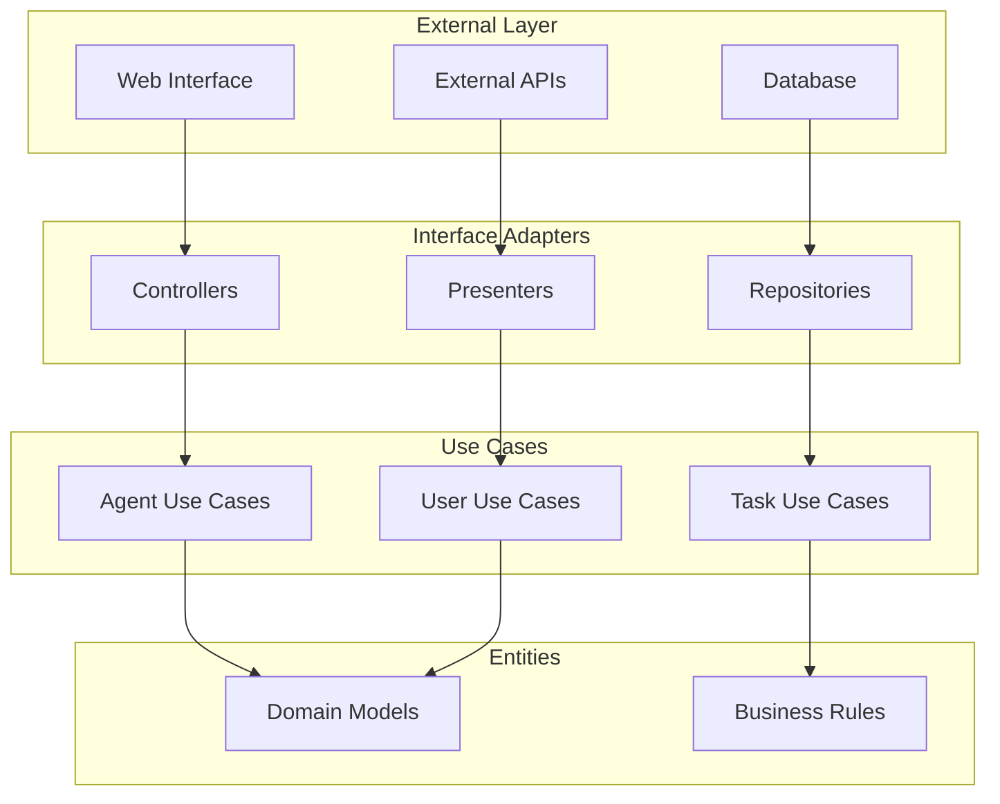

# 🎨 Design-Patterns

Keiko Personal Assistant nutzt bewährte Design-Patterns für saubere, wartbare und erweiterbare Architektur.

## 🏗️ Architektur-Patterns

### Clean Architecture



#### Implementation

```python
# Domain Layer - Entities
class Agent:
    """Domain-Entity für Agenten."""

    def __init__(self, agent_id: str, name: str, agent_type: str):
        self.id = agent_id
        self.name = name
        self.type = agent_type
        self._status = AgentStatus.INACTIVE

    def activate(self) -> None:
        """Business Rule: Agent aktivieren."""
        if self.type == "system" and not self._has_required_permissions():
            raise DomainException("System-Agent benötigt spezielle Berechtigungen")
        self._status = AgentStatus.ACTIVE

    def can_execute_task(self, task_type: str) -> bool:
        """Business Rule: Task-Ausführung prüfen."""
        return (
            self._status == AgentStatus.ACTIVE and
            task_type in self._supported_task_types()
        )

# Use Case Layer
class ExecuteAgentTaskUseCase:
    """Use Case für Agent-Task-Ausführung."""

    def __init__(self, agent_repo: AgentRepository, task_repo: TaskRepository):
        self.agent_repo = agent_repo
        self.task_repo = task_repo

    async def execute(self, request: ExecuteTaskRequest) -> TaskResult:
        """Führt Agent-Task aus."""
        # 1. Agent laden
        agent = await self.agent_repo.get_by_id(request.agent_id)
        if not agent:
            raise AgentNotFoundException(request.agent_id)

        # 2. Business Rules prüfen
        if not agent.can_execute_task(request.task_type):
            raise TaskExecutionNotAllowedException(agent.id, request.task_type)

        # 3. Task erstellen und ausführen
        task = Task.create(request.task_type, request.parameters)
        result = await agent.execute_task(task)

        # 4. Ergebnis speichern
        await self.task_repo.save_result(task.id, result)

        return result

# Interface Adapter Layer
class AgentController:
    """Controller für Agent-API."""

    def __init__(self, execute_task_use_case: ExecuteAgentTaskUseCase):
        self.execute_task_use_case = execute_task_use_case

    async def execute_task(self, request: HTTPRequest) -> HTTPResponse:
        """HTTP-Endpunkt für Task-Ausführung."""
        try:
            # Request validieren und konvertieren
            task_request = ExecuteTaskRequest.from_http(request)

            # Use Case ausführen
            result = await self.execute_task_use_case.execute(task_request)

            # Response erstellen
            return HTTPResponse.success(result.to_dict())

        except DomainException as e:
            return HTTPResponse.bad_request(str(e))
        except Exception as e:
            return HTTPResponse.internal_error("Task execution failed")
```

### Repository Pattern

```python
from abc import ABC, abstractmethod
from typing import List, Optional

# Abstract Repository
class AgentRepository(ABC):
    """Abstract Repository für Agenten."""

    @abstractmethod
    async def get_by_id(self, agent_id: str) -> Optional[Agent]:
        """Lädt Agent nach ID."""
        pass

    @abstractmethod
    async def get_by_type(self, agent_type: str) -> List[Agent]:
        """Lädt Agenten nach Typ."""
        pass

    @abstractmethod
    async def save(self, agent: Agent) -> None:
        """Speichert Agent."""
        pass

    @abstractmethod
    async def delete(self, agent_id: str) -> None:
        """Löscht Agent."""
        pass

# Concrete Repository
class PostgreSQLAgentRepository(AgentRepository):
    """PostgreSQL-Implementation des Agent-Repository."""

    def __init__(self, db_session: AsyncSession):
        self.db_session = db_session

    async def get_by_id(self, agent_id: str) -> Optional[Agent]:
        """Lädt Agent aus PostgreSQL."""
        query = select(AgentModel).where(AgentModel.id == agent_id)
        result = await self.db_session.execute(query)
        agent_model = result.scalar_one_or_none()

        if agent_model:
            return Agent.from_model(agent_model)
        return None

    async def save(self, agent: Agent) -> None:
        """Speichert Agent in PostgreSQL."""
        agent_model = AgentModel.from_domain(agent)
        self.db_session.add(agent_model)
        await self.db_session.commit()

# In-Memory Repository für Tests
class InMemoryAgentRepository(AgentRepository):
    """In-Memory-Implementation für Tests."""

    def __init__(self):
        self._agents: Dict[str, Agent] = {}

    async def get_by_id(self, agent_id: str) -> Optional[Agent]:
        return self._agents.get(agent_id)

    async def save(self, agent: Agent) -> None:
        self._agents[agent.id] = agent
```

## 🔧 Creational Patterns

### Factory Pattern

```python
from enum import Enum
from typing import Dict, Type

class AgentType(Enum):
    ORCHESTRATOR = "orchestrator"
    SPECIALIST = "specialist"
    WORKFLOW = "workflow"
    EXAMPLE = "example"

class AgentFactory:
    """Factory für Agent-Erstellung."""

    _agent_classes: Dict[AgentType, Type[Agent]] = {
        AgentType.ORCHESTRATOR: OrchestratorAgent,
        AgentType.SPECIALIST: SpecialistAgent,
        AgentType.WORKFLOW: WorkflowAgent,
        AgentType.EXAMPLE: ExampleAgent
    }

    @classmethod
    def create_agent(
        cls,
        agent_type: AgentType,
        config: AgentConfig
    ) -> Agent:
        """Erstellt Agent basierend auf Typ."""

        agent_class = cls._agent_classes.get(agent_type)
        if not agent_class:
            raise ValueError(f"Unbekannter Agent-Typ: {agent_type}")

        return agent_class(config)

    @classmethod
    def register_agent_type(
        cls,
        agent_type: AgentType,
        agent_class: Type[Agent]
    ) -> None:
        """Registriert neuen Agent-Typ."""
        cls._agent_classes[agent_type] = agent_class

# Abstract Factory für Protocol-Clients
class ProtocolClientFactory:
    """Abstract Factory für Protocol-Clients."""

    @staticmethod
    def create_http_client(config: HTTPConfig) -> HTTPClient:
        """Erstellt HTTP-Client."""
        return HTTPClient(config)

    @staticmethod
    def create_websocket_client(config: WebSocketConfig) -> WebSocketClient:
        """Erstellt WebSocket-Client."""
        return WebSocketClient(config)

    @staticmethod
    def create_mcp_client(config: MCPConfig) -> MCPClient:
        """Erstellt MCP-Client."""
        return MCPClient(config)
```

### Builder Pattern

```python
class AgentConfigBuilder:
    """Builder für Agent-Konfiguration."""

    def __init__(self):
        self._config = AgentConfig()

    def with_name(self, name: str) -> 'AgentConfigBuilder':
        """Setzt Agent-Name."""
        self._config.name = name
        return self

    def with_type(self, agent_type: AgentType) -> 'AgentConfigBuilder':
        """Setzt Agent-Typ."""
        self._config.type = agent_type
        return self

    def with_capability(self, capability: str) -> 'AgentConfigBuilder':
        """Fügt Capability hinzu."""
        self._config.capabilities.append(capability)
        return self

    def with_timeout(self, timeout_seconds: int) -> 'AgentConfigBuilder':
        """Setzt Timeout."""
        self._config.timeout_seconds = timeout_seconds
        return self

    def with_retry_policy(self, max_retries: int, delay: float) -> 'AgentConfigBuilder':
        """Konfiguriert Retry-Policy."""
        self._config.retry_policy = RetryPolicy(max_retries, delay)
        return self

    def build(self) -> AgentConfig:
        """Erstellt finale Konfiguration."""
        if not self._config.name:
            raise ValueError("Agent-Name ist erforderlich")
        if not self._config.type:
            raise ValueError("Agent-Typ ist erforderlich")

        return self._config

# Verwendung
config = (AgentConfigBuilder()
    .with_name("Image Generator")
    .with_type(AgentType.SPECIALIST)
    .with_capability("image_generation")
    .with_capability("image_editing")
    .with_timeout(300)
    .with_retry_policy(max_retries=3, delay=1.0)
    .build())
```

## 🔄 Behavioral Patterns

### Strategy Pattern

```python
from abc import ABC, abstractmethod

# Strategy Interface
class TaskExecutionStrategy(ABC):
    """Strategy für Task-Ausführung."""

    @abstractmethod
    async def execute(self, task: Task) -> TaskResult:
        """Führt Task aus."""
        pass

# Concrete Strategies
class SynchronousExecutionStrategy(TaskExecutionStrategy):
    """Synchrone Task-Ausführung."""

    async def execute(self, task: Task) -> TaskResult:
        """Führt Task synchron aus."""
        start_time = time.time()

        try:
            result = await self._execute_task_logic(task)
            return TaskResult.success(result, time.time() - start_time)
        except Exception as e:
            return TaskResult.failure(str(e), time.time() - start_time)

class AsynchronousExecutionStrategy(TaskExecutionStrategy):
    """Asynchrone Task-Ausführung."""

    def __init__(self, task_queue: TaskQueue):
        self.task_queue = task_queue

    async def execute(self, task: Task) -> TaskResult:
        """Führt Task asynchron aus."""
        # Task in Queue einreihen
        await self.task_queue.enqueue(task)

        # Sofortiges Result mit Task-ID
        return TaskResult.pending(task.id)

class BatchExecutionStrategy(TaskExecutionStrategy):
    """Batch-Task-Ausführung."""

    def __init__(self, batch_size: int = 10):
        self.batch_size = batch_size
        self.batch: List[Task] = []

    async def execute(self, task: Task) -> TaskResult:
        """Sammelt Tasks für Batch-Ausführung."""
        self.batch.append(task)

        if len(self.batch) >= self.batch_size:
            return await self._execute_batch()

        return TaskResult.batched(task.id)

# Context
class TaskExecutor:
    """Context für Task-Ausführung."""

    def __init__(self, strategy: TaskExecutionStrategy):
        self._strategy = strategy

    def set_strategy(self, strategy: TaskExecutionStrategy) -> None:
        """Ändert Ausführungsstrategie."""
        self._strategy = strategy

    async def execute_task(self, task: Task) -> TaskResult:
        """Führt Task mit aktueller Strategie aus."""
        return await self._strategy.execute(task)
```

### Observer Pattern

```python
from typing import List, Callable
from abc import ABC, abstractmethod

# Observer Interface
class TaskObserver(ABC):
    """Observer für Task-Events."""

    @abstractmethod
    async def on_task_created(self, task: Task) -> None:
        """Wird aufgerufen, wenn Task erstellt wird."""
        pass

    @abstractmethod
    async def on_task_started(self, task: Task) -> None:
        """Wird aufgerufen, wenn Task startet."""
        pass

    @abstractmethod
    async def on_task_completed(self, task: Task, result: TaskResult) -> None:
        """Wird aufgerufen, wenn Task abgeschlossen wird."""
        pass

    @abstractmethod
    async def on_task_failed(self, task: Task, error: Exception) -> None:
        """Wird aufgerufen, wenn Task fehlschlägt."""
        pass

# Concrete Observers
class MetricsObserver(TaskObserver):
    """Observer für Metriken-Sammlung."""

    async def on_task_created(self, task: Task) -> None:
        TASK_CREATED_COUNTER.labels(task_type=task.type).inc()

    async def on_task_completed(self, task: Task, result: TaskResult) -> None:
        TASK_DURATION_HISTOGRAM.labels(task_type=task.type).observe(result.duration)
        TASK_COMPLETED_COUNTER.labels(task_type=task.type, status="success").inc()

    async def on_task_failed(self, task: Task, error: Exception) -> None:
        TASK_COMPLETED_COUNTER.labels(task_type=task.type, status="failed").inc()

class NotificationObserver(TaskObserver):
    """Observer für Benachrichtigungen."""

    def __init__(self, notification_service: NotificationService):
        self.notification_service = notification_service

    async def on_task_completed(self, task: Task, result: TaskResult) -> None:
        if task.notify_on_completion:
            await self.notification_service.send_completion_notification(
                task.user_id, task.id, result
            )

class AuditObserver(TaskObserver):
    """Observer für Audit-Logging."""

    def __init__(self, audit_logger: AuditLogger):
        self.audit_logger = audit_logger

    async def on_task_created(self, task: Task) -> None:
        await self.audit_logger.log_task_created(task)

    async def on_task_completed(self, task: Task, result: TaskResult) -> None:
        await self.audit_logger.log_task_completed(task, result)

# Subject
class TaskSubject:
    """Subject für Task-Events."""

    def __init__(self):
        self._observers: List[TaskObserver] = []

    def attach(self, observer: TaskObserver) -> None:
        """Fügt Observer hinzu."""
        self._observers.append(observer)

    def detach(self, observer: TaskObserver) -> None:
        """Entfernt Observer."""
        self._observers.remove(observer)

    async def notify_task_created(self, task: Task) -> None:
        """Benachrichtigt Observer über Task-Erstellung."""
        for observer in self._observers:
            await observer.on_task_created(task)

    async def notify_task_completed(self, task: Task, result: TaskResult) -> None:
        """Benachrichtigt Observer über Task-Abschluss."""
        for observer in self._observers:
            await observer.on_task_completed(task, result)
```

### Command Pattern

```python
from abc import ABC, abstractmethod
from typing import Any, Optional

# Command Interface
class Command(ABC):
    """Command Interface."""

    @abstractmethod
    async def execute(self) -> Any:
        """Führt Command aus."""
        pass

    @abstractmethod
    async def undo(self) -> Any:
        """Macht Command rückgängig."""
        pass

# Concrete Commands
class CreateAgentCommand(Command):
    """Command für Agent-Erstellung."""

    def __init__(self, agent_service: AgentService, config: AgentConfig):
        self.agent_service = agent_service
        self.config = config
        self.created_agent_id: Optional[str] = None

    async def execute(self) -> str:
        """Erstellt Agent."""
        agent = await self.agent_service.create_agent(self.config)
        self.created_agent_id = agent.id
        return agent.id

    async def undo(self) -> None:
        """Löscht erstellten Agent."""
        if self.created_agent_id:
            await self.agent_service.delete_agent(self.created_agent_id)

class ExecuteTaskCommand(Command):
    """Command für Task-Ausführung."""

    def __init__(self, task_service: TaskService, task_request: TaskRequest):
        self.task_service = task_service
        self.task_request = task_request
        self.task_id: Optional[str] = None

    async def execute(self) -> TaskResult:
        """Führt Task aus."""
        task = await self.task_service.create_task(self.task_request)
        self.task_id = task.id
        return await self.task_service.execute_task(task.id)

    async def undo(self) -> None:
        """Bricht Task ab."""
        if self.task_id:
            await self.task_service.cancel_task(self.task_id)

# Command Invoker
class CommandInvoker:
    """Invoker für Commands."""

    def __init__(self):
        self._command_history: List[Command] = []

    async def execute_command(self, command: Command) -> Any:
        """Führt Command aus und speichert in Historie."""
        result = await command.execute()
        self._command_history.append(command)
        return result

    async def undo_last_command(self) -> None:
        """Macht letztes Command rückgängig."""
        if self._command_history:
            last_command = self._command_history.pop()
            await last_command.undo()

    async def undo_all_commands(self) -> None:
        """Macht alle Commands rückgängig."""
        while self._command_history:
            await self.undo_last_command()
```

## 🔗 Structural Patterns

### Adapter Pattern

```python
# Target Interface
class MCPToolInterface(ABC):
    """Standard-Interface für MCP-Tools."""

    @abstractmethod
    async def execute(self, arguments: Dict[str, Any]) -> Dict[str, Any]:
        """Führt Tool aus."""
        pass

# Adaptee (Legacy System)
class LegacyWeatherAPI:
    """Legacy Weather API."""

    def get_weather_data(self, city: str, country: str) -> dict:
        """Legacy-Methode für Wetterdaten."""
        # Legacy-Implementation
        return {"temperature": 20, "humidity": 60}

# Adapter
class WeatherAPIAdapter(MCPToolInterface):
    """Adapter für Legacy Weather API."""

    def __init__(self, legacy_api: LegacyWeatherAPI):
        self.legacy_api = legacy_api

    async def execute(self, arguments: Dict[str, Any]) -> Dict[str, Any]:
        """Adaptiert Legacy-API für MCP-Interface."""
        city = arguments.get("city")
        country = arguments.get("country", "")

        # Legacy-API aufrufen
        weather_data = self.legacy_api.get_weather_data(city, country)

        # Format für MCP anpassen
        return {
            "location": f"{city}, {country}",
            "temperature_celsius": weather_data["temperature"],
            "humidity_percent": weather_data["humidity"],
            "timestamp": time.time()
        }
```

### Decorator Pattern

```python
# Component Interface
class TaskExecutor(ABC):
    """Interface für Task-Ausführung."""

    @abstractmethod
    async def execute(self, task: Task) -> TaskResult:
        """Führt Task aus."""
        pass

# Concrete Component
class BasicTaskExecutor(TaskExecutor):
    """Basis-Task-Executor."""

    async def execute(self, task: Task) -> TaskResult:
        """Führt Task aus."""
        # Basis-Implementation
        return await self._execute_task_logic(task)

# Decorators
class LoggingTaskExecutor(TaskExecutor):
    """Decorator für Logging."""

    def __init__(self, executor: TaskExecutor):
        self._executor = executor

    async def execute(self, task: Task) -> TaskResult:
        """Führt Task mit Logging aus."""
        logger.info(f"Starting task execution: {task.id}")

        try:
            result = await self._executor.execute(task)
            logger.info(f"Task completed successfully: {task.id}")
            return result
        except Exception as e:
            logger.error(f"Task failed: {task.id}, error: {e}")
            raise

class MetricsTaskExecutor(TaskExecutor):
    """Decorator für Metriken."""

    def __init__(self, executor: TaskExecutor):
        self._executor = executor

    async def execute(self, task: Task) -> TaskResult:
        """Führt Task mit Metriken aus."""
        start_time = time.time()

        try:
            result = await self._executor.execute(task)
            TASK_DURATION_HISTOGRAM.observe(time.time() - start_time)
            TASK_SUCCESS_COUNTER.inc()
            return result
        except Exception as e:
            TASK_FAILURE_COUNTER.inc()
            raise

class RetryTaskExecutor(TaskExecutor):
    """Decorator für Retry-Logic."""

    def __init__(self, executor: TaskExecutor, max_retries: int = 3):
        self._executor = executor
        self.max_retries = max_retries

    async def execute(self, task: Task) -> TaskResult:
        """Führt Task mit Retry aus."""
        last_exception = None

        for attempt in range(self.max_retries + 1):
            try:
                return await self._executor.execute(task)
            except Exception as e:
                last_exception = e
                if attempt < self.max_retries:
                    await asyncio.sleep(2 ** attempt)  # Exponential backoff
                    continue
                raise last_exception

# Verwendung mit mehreren Decorators
executor = RetryTaskExecutor(
    MetricsTaskExecutor(
        LoggingTaskExecutor(
            BasicTaskExecutor()
        )
    ),
    max_retries=3
)
```

!!! info "Pattern-Auswahl"
    Die Wahl des richtigen Design-Patterns hängt vom spezifischen Problem ab. Verwenden Sie Patterns nur wenn sie echten Mehrwert bieten, nicht um der Patterns willen.

!!! tip "Kombinationen"
    Viele Patterns können effektiv kombiniert werden. Beispielsweise kann ein Factory Pattern mit Strategy Pattern kombiniert werden, um verschiedene Strategien basierend auf Konfiguration zu erstellen.
