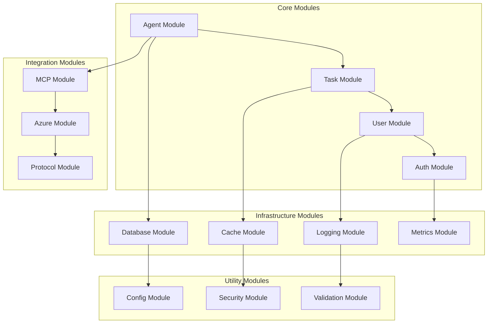
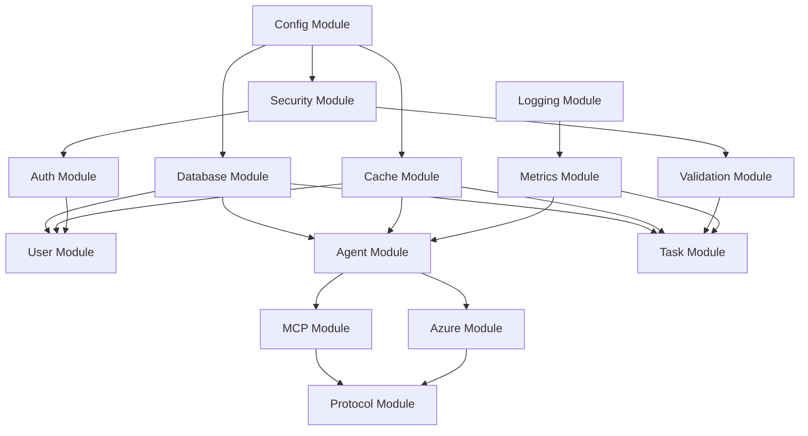

# 📦 Module-Architektur

Keiko Personal Assistant ist in modulare Komponenten unterteilt für bessere Wartbarkeit und Erweiterbarkeit.

## 🏗️ Module-Übersicht



## 🤖 Core Modules

### Agent Module

```python
# keiko/core/agent/__init__.py
"""Agent-Modul für Agent-Management und -Ausführung."""

from .models import Agent, AgentConfig, AgentStatus
from .services import AgentService, AgentOrchestrator
from .repositories import AgentRepository
from .factories import AgentFactory
from .exceptions import AgentException, AgentNotFoundException

__all__ = [
    "Agent", "AgentConfig", "AgentStatus",
    "AgentService", "AgentOrchestrator",
    "AgentRepository", "AgentFactory",
    "AgentException", "AgentNotFoundException"
]

# keiko/core/agent/models.py
from dataclasses import dataclass
from typing import Dict, Any, List
from enum import Enum

class AgentStatus(Enum):
    INACTIVE = "inactive"
    ACTIVE = "active"
    BUSY = "busy"
    ERROR = "error"

@dataclass
class AgentConfig:
    """Konfiguration für Agenten."""
    name: str
    type: str
    capabilities: List[str]
    timeout_seconds: int = 300
    max_concurrent_tasks: int = 1
    retry_policy: Dict[str, Any] = None

class Agent:
    """Domain-Model für Agenten."""

    def __init__(self, config: AgentConfig):
        self.id = generate_uuid()
        self.config = config
        self.status = AgentStatus.INACTIVE
        self.current_tasks: List[str] = []

    def can_accept_task(self) -> bool:
        """Prüft, ob Agent neue Tasks annehmen kann."""
        return (
            self.status == AgentStatus.ACTIVE and
            len(self.current_tasks) < self.config.max_concurrent_tasks
        )

    async def execute_task(self, task: 'Task') -> 'TaskResult':
        """Führt Task aus."""
        if not self.can_accept_task():
            raise AgentBusyException(self.id)

        self.status = AgentStatus.BUSY
        self.current_tasks.append(task.id)

        try:
            result = await self._execute_task_logic(task)
            return result
        finally:
            self.current_tasks.remove(task.id)
            self.status = AgentStatus.ACTIVE if self.current_tasks else AgentStatus.ACTIVE

# keiko/core/agent/services.py
class AgentService:
    """Service für Agent-Management."""

    def __init__(self, agent_repo: AgentRepository, event_bus: EventBus):
        self.agent_repo = agent_repo
        self.event_bus = event_bus

    async def create_agent(self, config: AgentConfig) -> Agent:
        """Erstellt neuen Agent."""
        agent = Agent(config)
        await self.agent_repo.save(agent)

        await self.event_bus.publish(AgentCreatedEvent(
            agent_id=agent.id,
            agent_type=config.type
        ))

        return agent

    async def activate_agent(self, agent_id: str) -> None:
        """Aktiviert Agent."""
        agent = await self.agent_repo.get_by_id(agent_id)
        if not agent:
            raise AgentNotFoundException(agent_id)

        agent.status = AgentStatus.ACTIVE
        await self.agent_repo.save(agent)

        await self.event_bus.publish(AgentActivatedEvent(agent_id=agent_id))
```

### Task Module

```python
# keiko/core/task/__init__.py
"""Task-Modul für Task-Management und -Ausführung."""

from .models import Task, TaskRequest, TaskResult, TaskStatus
from .services import TaskService, TaskScheduler
from .repositories import TaskRepository
from .executors import TaskExecutor, AsyncTaskExecutor

__all__ = [
    "Task", "TaskRequest", "TaskResult", "TaskStatus",
    "TaskService", "TaskScheduler",
    "TaskRepository", "TaskExecutor", "AsyncTaskExecutor"
]

# keiko/core/task/models.py
from dataclasses import dataclass
from typing import Dict, Any, Optional
from datetime import datetime
from enum import Enum

class TaskStatus(Enum):
    PENDING = "pending"
    RUNNING = "running"
    COMPLETED = "completed"
    FAILED = "failed"
    CANCELLED = "cancelled"

class TaskPriority(Enum):
    LOW = "low"
    NORMAL = "normal"
    HIGH = "high"
    CRITICAL = "critical"

@dataclass
class TaskRequest:
    """Request für Task-Erstellung."""
    task_type: str
    parameters: Dict[str, Any]
    priority: TaskPriority = TaskPriority.NORMAL
    timeout_seconds: Optional[int] = None
    user_id: Optional[str] = None

class Task:
    """Domain-Model für Tasks."""

    def __init__(self, request: TaskRequest):
        self.id = generate_uuid()
        self.type = request.task_type
        self.parameters = request.parameters
        self.priority = request.priority
        self.timeout_seconds = request.timeout_seconds
        self.user_id = request.user_id
        self.status = TaskStatus.PENDING
        self.created_at = datetime.utcnow()
        self.started_at: Optional[datetime] = None
        self.completed_at: Optional[datetime] = None
        self.result: Optional['TaskResult'] = None

    def start(self) -> None:
        """Startet Task."""
        if self.status != TaskStatus.PENDING:
            raise InvalidTaskStateException(self.id, self.status)

        self.status = TaskStatus.RUNNING
        self.started_at = datetime.utcnow()

    def complete(self, result: 'TaskResult') -> None:
        """Schließt Task ab."""
        if self.status != TaskStatus.RUNNING:
            raise InvalidTaskStateException(self.id, self.status)

        self.status = TaskStatus.COMPLETED
        self.completed_at = datetime.utcnow()
        self.result = result

@dataclass
class TaskResult:
    """Ergebnis einer Task-Ausführung."""
    success: bool
    data: Optional[Dict[str, Any]] = None
    error_message: Optional[str] = None
    execution_time_seconds: Optional[float] = None
    metadata: Optional[Dict[str, Any]] = None
```

### User Module

```python
# keiko/core/user/__init__.py
"""User-Modul für Benutzerverwaltung."""

from .models import User, UserRole, UserProfile
from .services import UserService, UserAuthService
from .repositories import UserRepository

__all__ = [
    "User", "UserRole", "UserProfile",
    "UserService", "UserAuthService",
    "UserRepository"
]

# keiko/core/user/models.py
class UserRole(Enum):
    ADMIN = "admin"
    OPERATOR = "operator"
    USER = "user"
    VIEWER = "viewer"

@dataclass
class UserProfile:
    """Benutzerprofil."""
    full_name: Optional[str] = None
    email: Optional[str] = None
    preferences: Dict[str, Any] = None
    timezone: str = "UTC"

class User:
    """Domain-Model für Benutzer."""

    def __init__(self, username: str, email: str, role: UserRole):
        self.id = generate_uuid()
        self.username = username
        self.email = email
        self.role = role
        self.profile = UserProfile()
        self.is_active = True
        self.created_at = datetime.utcnow()
        self.last_login: Optional[datetime] = None

    def has_permission(self, permission: str) -> bool:
        """Prüft Berechtigung."""
        role_permissions = {
            UserRole.ADMIN: ["*"],
            UserRole.OPERATOR: ["agents:*", "tasks:*"],
            UserRole.USER: ["tasks:create", "tasks:read"],
            UserRole.VIEWER: ["tasks:read", "agents:read"]
        }

        permissions = role_permissions.get(self.role, [])
        return "*" in permissions or permission in permissions
```

## 🔌 Integration Modules

### MCP Module

```python
# keiko/integration/mcp/__init__.py
"""MCP-Modul für Model Context Protocol Integration."""

from .client import MCPClient, MCPClientConfig
from .server_registry import MCPServerRegistry
from .tool_executor import ToolExecutor
from .protocol_selector import ProtocolSelector

__all__ = [
    "MCPClient", "MCPClientConfig",
    "MCPServerRegistry", "ToolExecutor",
    "ProtocolSelector"
]

# keiko/integration/mcp/client.py
class MCPClient:
    """Client für MCP-Server-Kommunikation."""

    def __init__(self, config: MCPClientConfig):
        self.config = config
        self.session: Optional[aiohttp.ClientSession] = None

    async def connect(self) -> None:
        """Stellt Verbindung zum MCP-Server her."""
        headers = {"Content-Type": "application/json"}

        if self.config.auth_config:
            headers.update(self._build_auth_headers())

        self.session = aiohttp.ClientSession(headers=headers)

    async def list_tools(self) -> List[Dict[str, Any]]:
        """Listet verfügbare Tools auf."""
        async with self.session.get(f"{self.config.base_url}/tools") as response:
            data = await response.json()
            return data.get("tools", [])

    async def execute_tool(self, tool_name: str, arguments: Dict[str, Any]) -> Dict[str, Any]:
        """Führt Tool aus."""
        payload = {"tool_name": tool_name, "arguments": arguments}

        async with self.session.post(
            f"{self.config.base_url}/tools/{tool_name}/execute",
            json=payload
        ) as response:
            return await response.json()
```

### Azure Module

```python
# keiko/integration/azure/__init__.py
"""Azure-Modul für Azure AI Foundry Integration."""

from .ai_client import AzureAIClient
from .storage_client import AzureStorageClient
from .key_vault_client import AzureKeyVaultClient

__all__ = [
    "AzureAIClient", "AzureStorageClient", "AzureKeyVaultClient"
]

# keiko/integration/azure/ai_client.py
class AzureAIClient:
    """Client für Azure AI Foundry."""

    def __init__(self, config: AzureAIConfig):
        self.config = config
        self.credential = DefaultAzureCredential()

    async def generate_completion(self, prompt: str, model: str = "gpt-4") -> str:
        """Generiert Text-Completion."""
        # Azure AI Foundry API-Aufruf
        pass

    async def generate_image(self, prompt: str, size: str = "1024x1024") -> str:
        """Generiert Bild."""
        # Azure AI Foundry API-Aufruf
        pass
```

## 🏗️ Infrastructure Modules

### Database Module

```python
# keiko/infrastructure/database/__init__.py
"""Database-Modul für Datenpersistierung."""

from .connection import DatabaseConnection, get_db_session
from .models import BaseModel
from .migrations import MigrationManager

__all__ = [
    "DatabaseConnection", "get_db_session",
    "BaseModel", "MigrationManager"
]

# keiko/infrastructure/database/connection.py
class DatabaseConnection:
    """Database-Verbindungsmanagement."""

    def __init__(self, config: DatabaseConfig):
        self.config = config
        self.engine: Optional[AsyncEngine] = None
        self.session_factory: Optional[async_sessionmaker] = None

    async def initialize(self) -> None:
        """Initialisiert Database-Verbindung."""
        self.engine = create_async_engine(
            self.config.connection_string,
            pool_size=self.config.pool_size,
            max_overflow=self.config.max_overflow
        )

        self.session_factory = async_sessionmaker(
            self.engine,
            expire_on_commit=False
        )

    async def get_session(self) -> AsyncSession:
        """Erstellt neue Database-Session."""
        if not self.session_factory:
            await self.initialize()

        return self.session_factory()
```

### Cache Module

```python
# keiko/infrastructure/cache/__init__.py
"""Cache-Modul für Redis-Integration."""

from .redis_client import RedisClient, RedisConfig
from .cache_service import CacheService
from .decorators import cached, cache_invalidate

__all__ = [
    "RedisClient", "RedisConfig",
    "CacheService", "cached", "cache_invalidate"
]

# keiko/infrastructure/cache/decorators.py
def cached(key_pattern: str, ttl: int = 3600):
    """Decorator für Caching."""

    def decorator(func):
        @wraps(func)
        async def wrapper(*args, **kwargs):
            cache_key = key_pattern.format(*args, **kwargs)

            # Cache prüfen
            cached_result = await redis_client.get(cache_key)
            if cached_result:
                return json.loads(cached_result)

            # Funktion ausführen
            result = await func(*args, **kwargs)

            # Ergebnis cachen
            await redis_client.setex(
                cache_key,
                ttl,
                json.dumps(result, default=str)
            )

            return result

        return wrapper
    return decorator
```

## 📋 Module-Dependencies

### Dependency-Graph



### Module-Konfiguration

```python
# keiko/config/modules.py
"""Modul-Konfiguration und Dependency Injection."""

from dependency_injector import containers, providers
from dependency_injector.wiring import Provide, inject

class ApplicationContainer(containers.DeclarativeContainer):
    """Dependency Injection Container."""

    # Configuration
    config = providers.Configuration()

    # Infrastructure
    database = providers.Singleton(
        DatabaseConnection,
        config=config.database
    )

    cache = providers.Singleton(
        RedisClient,
        config=config.redis
    )

    # Repositories
    user_repository = providers.Factory(
        UserRepository,
        db_session=database.provided.get_session
    )

    agent_repository = providers.Factory(
        AgentRepository,
        db_session=database.provided.get_session
    )

    # Services
    user_service = providers.Factory(
        UserService,
        user_repo=user_repository,
        cache=cache
    )

    agent_service = providers.Factory(
        AgentService,
        agent_repo=agent_repository,
        cache=cache
    )

# Verwendung
@inject
async def create_agent(
    config: AgentConfig,
    agent_service: AgentService = Provide[ApplicationContainer.agent_service]
) -> Agent:
    """Erstellt Agent mit Dependency Injection."""
    return await agent_service.create_agent(config)
```

!!! info "Modul-Design"
    Jedes Modul ist in sich geschlossen und definiert klare Interfaces für die Kommunikation mit anderen Modulen.

!!! tip "Erweiterbarkeit"
    Neue Module können einfach hinzugefügt werden, indem sie die definierten Interfaces implementieren und in den Dependency Injection Container registriert werden.
