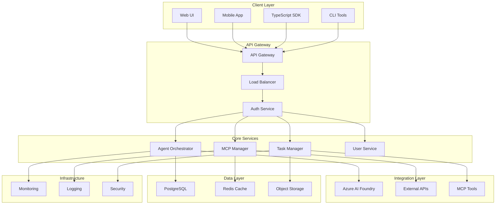
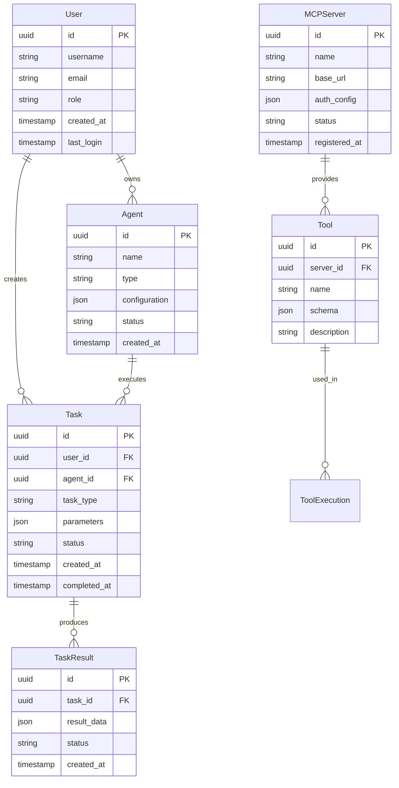
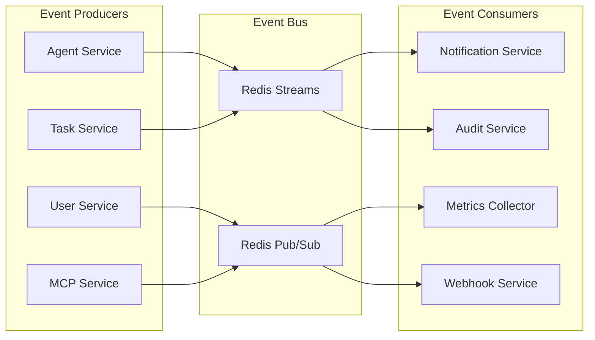
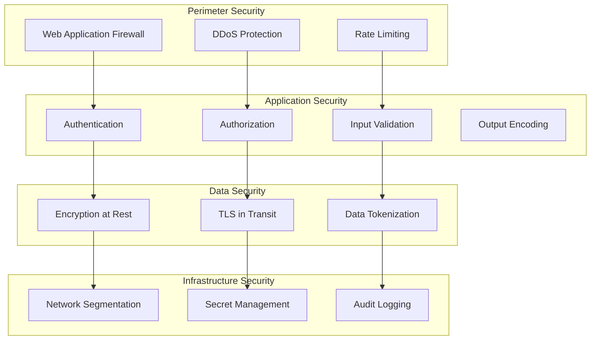
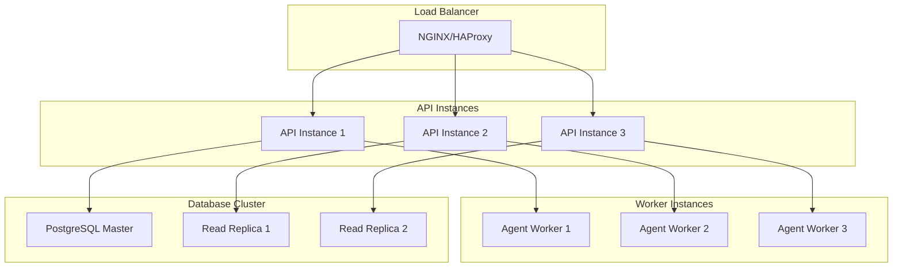

# 🏗️ Architektur-Übersicht

Keiko Personal Assistant basiert auf einer modernen, skalierbaren Microservices-Architektur mit Clean Code-Prinzipien.

## 🎯 Architektur-Prinzipien

### Design-Philosophie

- **Clean Architecture**: Trennung von Business-Logic und Infrastructure
- **Domain-Driven Design**: Fachliche Domänen im Zentrum
- **SOLID-Prinzipien**: Wartbarer und erweiterbarer Code
- **Async-First**: Optimiert für High-Performance Concurrent Operations
- **Event-Driven**: Lose gekoppelte Komponenten durch Events

## 🏛️ System-Architektur

### High-Level-Übersicht



## 🔧 Komponenten-Architektur

### Core-Services

#### Agent Orchestrator
```python
# Zentrale Agent-Verwaltung und -Orchestrierung
class AgentOrchestrator:
    """Koordiniert Agent-Ausführung und Workflow-Management."""

    def __init__(self):
        self.agent_registry = AgentRegistry()
        self.task_scheduler = TaskScheduler()
        self.workflow_engine = WorkflowEngine()

    async def execute_task(self, agent_id: str, task: AgentTask) -> TaskResult:
        """Führt Agent-Task aus."""
        agent = await self.agent_registry.get_agent(agent_id)
        return await agent.execute(task)

    async def orchestrate_workflow(self, workflow: Workflow) -> WorkflowResult:
        """Orchestriert Multi-Agent-Workflow."""
        return await self.workflow_engine.execute(workflow)
```

#### MCP Manager
```python
# Model Context Protocol Management
class MCPManager:
    """Verwaltet MCP-Server und Tool-Ausführung."""

    def __init__(self):
        self.server_registry = MCPServerRegistry()
        self.tool_executor = ToolExecutor()
        self.protocol_selector = ProtocolSelector()

    async def register_server(self, config: MCPServerConfig) -> str:
        """Registriert neuen MCP-Server."""
        return await self.server_registry.register(config)

    async def execute_tool(self, server_name: str, tool_name: str, args: dict) -> dict:
        """Führt MCP-Tool aus."""
        return await self.tool_executor.execute(server_name, tool_name, args)
```

#### Task Manager
```python
# Task-Lifecycle-Management
class TaskManager:
    """Verwaltet Task-Lifecycle und -Status."""

    def __init__(self):
        self.task_store = TaskStore()
        self.result_store = ResultStore()
        self.notification_service = NotificationService()

    async def create_task(self, task_request: TaskRequest) -> Task:
        """Erstellt neue Task."""
        task = Task.from_request(task_request)
        await self.task_store.save(task)
        return task

    async def update_task_status(self, task_id: str, status: TaskStatus) -> None:
        """Aktualisiert Task-Status."""
        await self.task_store.update_status(task_id, status)
        await self.notification_service.notify_status_change(task_id, status)
```

## 📊 Daten-Architektur

### Datenmodell



### Daten-Persistierung

#### PostgreSQL (Primary Database)
```sql
-- Benutzer und Authentifizierung
CREATE TABLE users (
    id UUID PRIMARY KEY DEFAULT gen_random_uuid(),
    username VARCHAR(50) UNIQUE NOT NULL,
    email VARCHAR(255) UNIQUE NOT NULL,
    password_hash VARCHAR(255) NOT NULL,
    role VARCHAR(20) DEFAULT 'user',
    created_at TIMESTAMP DEFAULT NOW(),
    last_login TIMESTAMP
);

-- Agent-Definitionen
CREATE TABLE agents (
    id UUID PRIMARY KEY DEFAULT gen_random_uuid(),
    name VARCHAR(100) NOT NULL,
    type VARCHAR(50) NOT NULL,
    configuration JSONB NOT NULL,
    status VARCHAR(20) DEFAULT 'active',
    created_at TIMESTAMP DEFAULT NOW(),
    updated_at TIMESTAMP DEFAULT NOW()
);

-- Task-Management
CREATE TABLE tasks (
    id UUID PRIMARY KEY DEFAULT gen_random_uuid(),
    user_id UUID REFERENCES users(id),
    agent_id UUID REFERENCES agents(id),
    task_type VARCHAR(100) NOT NULL,
    parameters JSONB NOT NULL,
    status VARCHAR(20) DEFAULT 'pending',
    priority VARCHAR(20) DEFAULT 'normal',
    created_at TIMESTAMP DEFAULT NOW(),
    started_at TIMESTAMP,
    completed_at TIMESTAMP
);
```

#### Redis (Caching & Sessions)
```python
# Session-Management
REDIS_KEYS = {
    "user_session": "session:{user_id}",
    "agent_status": "agent:status:{agent_id}",
    "task_cache": "task:cache:{task_id}",
    "mcp_server_health": "mcp:health:{server_name}",
    "rate_limit": "rate_limit:{client_ip}:{endpoint}"
}

# Cache-Strategien
CACHE_TTL = {
    "user_session": 3600,      # 1 Stunde
    "agent_status": 300,       # 5 Minuten
    "task_cache": 1800,        # 30 Minuten
    "mcp_server_health": 60,   # 1 Minute
    "rate_limit": 60           # 1 Minute
}
```

## 🔄 Event-Driven-Architektur

### Event-System



### Event-Definitionen

```python
from dataclasses import dataclass
from typing import Dict, Any, Optional
from datetime import datetime

@dataclass
class BaseEvent:
    """Basis-Event-Klasse."""
    event_type: str
    event_id: str
    timestamp: datetime
    source_service: str
    correlation_id: Optional[str] = None
    metadata: Optional[Dict[str, Any]] = None

@dataclass
class TaskCreatedEvent(BaseEvent):
    """Event für Task-Erstellung."""
    task_id: str
    user_id: str
    agent_id: str
    task_type: str

@dataclass
class TaskCompletedEvent(BaseEvent):
    """Event für Task-Abschluss."""
    task_id: str
    status: str
    duration_seconds: float
    result_size_bytes: int

@dataclass
class AgentStatusChangedEvent(BaseEvent):
    """Event für Agent-Status-Änderung."""
    agent_id: str
    old_status: str
    new_status: str
    reason: Optional[str] = None

@dataclass
class MCPToolExecutedEvent(BaseEvent):
    """Event für MCP-Tool-Ausführung."""
    server_name: str
    tool_name: str
    execution_time_ms: float
    success: bool
    error_message: Optional[str] = None
```

## 🔐 Sicherheits-Architektur

### Security-Layers



### Security-Implementation

```python
# Multi-Layer-Security
class SecurityManager:
    """Zentrale Sicherheitsverwaltung."""

    def __init__(self):
        self.auth_service = AuthenticationService()
        self.authz_service = AuthorizationService()
        self.encryption_service = EncryptionService()
        self.audit_logger = AuditLogger()

    async def authenticate_request(self, request: Request) -> User:
        """Authentifiziert Request."""
        token = self.extract_token(request)
        user = await self.auth_service.validate_token(token)
        await self.audit_logger.log_authentication(user.id, True)
        return user

    async def authorize_action(self, user: User, action: str, resource: str) -> bool:
        """Autorisiert Benutzer-Aktion."""
        authorized = await self.authz_service.check_permission(
            user.id, action, resource
        )
        await self.audit_logger.log_authorization(
            user.id, action, resource, authorized
        )
        return authorized
```

## 📈 Skalierungs-Architektur

### Horizontal Scaling



### Performance-Optimierungen

```python
# Connection Pooling
DATABASE_CONFIG = {
    "pool_size": 20,
    "max_overflow": 30,
    "pool_timeout": 30,
    "pool_recycle": 3600
}

# Async Processing
class AsyncTaskProcessor:
    """Asynchrone Task-Verarbeitung."""

    def __init__(self, max_workers: int = 10):
        self.semaphore = asyncio.Semaphore(max_workers)
        self.task_queue = asyncio.Queue()

    async def process_task(self, task: Task) -> TaskResult:
        """Verarbeitet Task asynchron."""
        async with self.semaphore:
            return await self._execute_task(task)
```

## 📋 Architektur-Qualitätsmerkmale

### Quality Attributes

| Merkmal | Zielwert | Implementierung |
|---------|----------|-----------------|
| **Verfügbarkeit** | 99.9% | Load Balancing, Health Checks, Failover |
| **Performance** | < 200ms Response Time | Caching, Connection Pooling, Async Processing |
| **Skalierbarkeit** | 1000+ concurrent users | Horizontal Scaling, Microservices |
| **Sicherheit** | Enterprise-grade | Multi-layer Security, Encryption, Audit |
| **Wartbarkeit** | Clean Code | SOLID Principles, DDD, Automated Testing |
| **Observability** | Full Monitoring | Metrics, Logging, Tracing, Alerting |

### Architektur-Metriken

```python
# Architektur-Qualitäts-Metriken
ARCHITECTURE_METRICS = {
    "coupling": "low",           # Lose Kopplung zwischen Services
    "cohesion": "high",          # Hohe Kohäsion innerhalb Services
    "complexity": "managed",     # Kontrollierte Komplexität
    "testability": "high",       # Hohe Testabdeckung möglich
    "deployability": "automated" # Automatisierte Deployments
}
```

!!! info "Architektur-Evolution"
    Die Architektur ist darauf ausgelegt, sich mit wachsenden Anforderungen zu entwickeln. Neue Services können einfach hinzugefügt und bestehende Services unabhängig skaliert werden.

!!! tip "Best Practices"
    - Verwenden Sie Dependency Injection für bessere Testbarkeit
    - Implementieren Sie Circuit Breaker für Resilience
    - Nutzen Sie Event Sourcing für kritische Business-Events
    - Setzen Sie auf Infrastructure as Code für reproduzierbare Deployments
