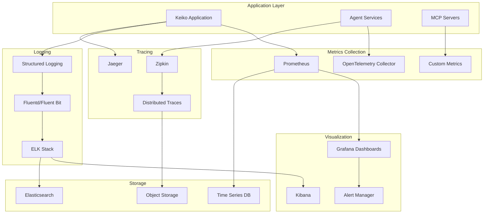

# 📊 Enterprise-Monitoring

Keiko Personal Assistant bietet umfassende Monitoring- und Observability-Funktionen für Enterprise-Umgebungen.

## 🏗️ Monitoring-Architektur

### Observability-Stack



## 📈 Metriken & KPIs

### System-Metriken

#### Performance-Metriken

```python
from prometheus_client import Counter, Histogram, Gauge, Summary
import time

# Request-Metriken
REQUEST_COUNT = Counter(
    'keiko_requests_total',
    'Gesamtanzahl der Requests',
    ['method', 'endpoint', 'status']
)

REQUEST_DURATION = Histogram(
    'keiko_request_duration_seconds',
    'Request-Dauer in Sekunden',
    ['method', 'endpoint'],
    buckets=[0.1, 0.25, 0.5, 1.0, 2.5, 5.0, 10.0]
)

# Agent-Metriken
AGENT_TASKS_ACTIVE = Gauge(
    'keiko_agent_tasks_active',
    'Anzahl aktiver Agent-Tasks',
    ['agent_id', 'task_type']
)

AGENT_TASK_DURATION = Summary(
    'keiko_agent_task_duration_seconds',
    'Agent-Task-Dauer in Sekunden',
    ['agent_id', 'task_type', 'status']
)

# MCP-Metriken
MCP_TOOL_CALLS = Counter(
    'keiko_mcp_tool_calls_total',
    'Gesamtanzahl der MCP-Tool-Aufrufe',
    ['server_name', 'tool_name', 'status']
)

MCP_SERVER_HEALTH = Gauge(
    'keiko_mcp_server_health',
    'MCP-Server-Gesundheitsstatus (1=healthy, 0=unhealthy)',
    ['server_name']
)
```

#### Business-Metriken

```python
# Benutzer-Metriken
USER_SESSIONS_ACTIVE = Gauge(
    'keiko_user_sessions_active',
    'Anzahl aktiver Benutzer-Sessions'
)

USER_ACTIONS = Counter(
    'keiko_user_actions_total',
    'Gesamtanzahl der Benutzer-Aktionen',
    ['action_type', 'user_role']
)

# Fehler-Metriken
ERROR_RATE = Counter(
    'keiko_errors_total',
    'Gesamtanzahl der Fehler',
    ['error_type', 'component', 'severity']
)

SECURITY_EVENTS = Counter(
    'keiko_security_events_total',
    'Gesamtanzahl der Sicherheitsereignisse',
    ['event_type', 'severity', 'source']
)
```

### Custom Metrics Decorator

```python
from functools import wraps
import time
from typing import Callable

def monitor_performance(metric_name: str, labels: dict = None):
    """Decorator für Performance-Monitoring."""

    def decorator(func: Callable):
        @wraps(func)
        async def wrapper(*args, **kwargs):
            start_time = time.time()
            labels_dict = labels or {}
            labels_dict.update({
                'function': func.__name__,
                'module': func.__module__
            })

            try:
                result = await func(*args, **kwargs)
                labels_dict['status'] = 'success'
                return result
            except Exception as e:
                labels_dict['status'] = 'error'
                labels_dict['error_type'] = type(e).__name__
                ERROR_RATE.labels(**labels_dict).inc()
                raise
            finally:
                duration = time.time() - start_time
                REQUEST_DURATION.labels(**labels_dict).observe(duration)
                REQUEST_COUNT.labels(**labels_dict).inc()

        return wrapper
    return decorator

# Verwendung
@monitor_performance('agent_task_execution', {'component': 'agent'})
async def execute_agent_task(agent_id: str, task: dict):
    """Führt eine Agent-Task aus mit Performance-Monitoring."""
    # Implementation
    pass
```

## 📝 Structured Logging

### Logging-Konfiguration

```python
import logging
import json
from datetime import datetime
from typing import Dict, Any
import uuid

class StructuredFormatter(logging.Formatter):
    """Strukturierter JSON-Formatter für Logs."""

    def format(self, record: logging.LogRecord) -> str:
        """Formatiert Log-Record als JSON."""
        log_entry = {
            'timestamp': datetime.utcnow().isoformat() + 'Z',
            'level': record.levelname,
            'logger': record.name,
            'message': record.getMessage(),
            'module': record.module,
            'function': record.funcName,
            'line': record.lineno
        }

        # Zusätzliche Felder aus dem Record
        if hasattr(record, 'correlation_id'):
            log_entry['correlation_id'] = record.correlation_id

        if hasattr(record, 'user_id'):
            log_entry['user_id'] = record.user_id

        if hasattr(record, 'agent_id'):
            log_entry['agent_id'] = record.agent_id

        if hasattr(record, 'task_id'):
            log_entry['task_id'] = record.task_id

        # Exception-Informationen
        if record.exc_info:
            log_entry['exception'] = {
                'type': record.exc_info[0].__name__,
                'message': str(record.exc_info[1]),
                'traceback': self.formatException(record.exc_info)
            }

        return json.dumps(log_entry, ensure_ascii=False)

# Logger-Konfiguration
def setup_logging():
    """Konfiguriert strukturiertes Logging."""

    # Root-Logger
    root_logger = logging.getLogger()
    root_logger.setLevel(logging.INFO)

    # Console-Handler
    console_handler = logging.StreamHandler()
    console_handler.setFormatter(StructuredFormatter())
    root_logger.addHandler(console_handler)

    # File-Handler für Audit-Logs
    audit_handler = logging.FileHandler('/var/log/keiko/audit.log')
    audit_handler.setFormatter(StructuredFormatter())
    audit_handler.setLevel(logging.WARNING)

    audit_logger = logging.getLogger('keiko.audit')
    audit_logger.addHandler(audit_handler)
    audit_logger.setLevel(logging.INFO)
```

### Correlation-ID-Middleware

```python
from fastapi import Request, Response
from fastapi.middleware.base import BaseHTTPMiddleware
import uuid
import logging

class CorrelationMiddleware(BaseHTTPMiddleware):
    """Middleware für Correlation-IDs."""

    async def dispatch(self, request: Request, call_next):
        # Correlation-ID aus Header oder generieren
        correlation_id = request.headers.get('X-Correlation-ID', str(uuid.uuid4()))

        # Correlation-ID in Request-State speichern
        request.state.correlation_id = correlation_id

        # Logger mit Correlation-ID konfigurieren
        logger = logging.getLogger('keiko.request')
        logger = logging.LoggerAdapter(logger, {'correlation_id': correlation_id})

        # Request verarbeiten
        response = await call_next(request)

        # Correlation-ID in Response-Header setzen
        response.headers['X-Correlation-ID'] = correlation_id

        return response
```

## 🔍 Distributed Tracing

### OpenTelemetry-Konfiguration

```python
from opentelemetry import trace
from opentelemetry.exporter.jaeger.thrift import JaegerExporter
from opentelemetry.sdk.trace import TracerProvider
from opentelemetry.sdk.trace.export import BatchSpanProcessor
from opentelemetry.instrumentation.fastapi import FastAPIInstrumentor
from opentelemetry.instrumentation.requests import RequestsInstrumentor

def setup_tracing():
    """Konfiguriert OpenTelemetry Tracing."""

    # Tracer-Provider konfigurieren
    trace.set_tracer_provider(TracerProvider())
    tracer = trace.get_tracer(__name__)

    # Jaeger-Exporter konfigurieren
    jaeger_exporter = JaegerExporter(
        agent_host_name="jaeger-agent",
        agent_port=6831,
    )

    # Span-Processor hinzufügen
    span_processor = BatchSpanProcessor(jaeger_exporter)
    trace.get_tracer_provider().add_span_processor(span_processor)

    # Auto-Instrumentierung aktivieren
    FastAPIInstrumentor.instrument()
    RequestsInstrumentor.instrument()

    return tracer

# Custom Tracing
tracer = setup_tracing()

async def traced_agent_execution(agent_id: str, task: dict):
    """Agent-Ausführung mit Tracing."""

    with tracer.start_as_current_span("agent_task_execution") as span:
        # Span-Attribute setzen
        span.set_attribute("agent.id", agent_id)
        span.set_attribute("task.type", task.get('task_type'))
        span.set_attribute("task.priority", task.get('priority', 'normal'))

        try:
            # Agent-Task ausführen
            result = await execute_task(agent_id, task)

            span.set_attribute("task.status", "completed")
            span.set_attribute("task.result_size", len(str(result)))

            return result

        except Exception as e:
            span.set_attribute("task.status", "failed")
            span.set_attribute("error.type", type(e).__name__)
            span.set_attribute("error.message", str(e))
            span.record_exception(e)
            raise
```

## 🚨 Alerting & Notifications

### Alert-Regeln

```yaml
# Prometheus Alert Rules
groups:
  - name: keiko.rules
    rules:
      # High Error Rate
      - alert: HighErrorRate
        expr: rate(keiko_errors_total[5m]) > 0.1
        for: 2m
        labels:
          severity: warning
        annotations:
          summary: "Hohe Fehlerrate erkannt"
          description: "Fehlerrate von {{ $value }} in den letzten 5 Minuten"

      # Agent Task Failures
      - alert: AgentTaskFailures
        expr: rate(keiko_agent_task_duration_seconds_count{status="failed"}[5m]) > 0.05
        for: 1m
        labels:
          severity: critical
        annotations:
          summary: "Agent-Task-Fehler erkannt"
          description: "Agent {{ $labels.agent_id }} hat Fehlerrate von {{ $value }}"

      # MCP Server Down
      - alert: MCPServerDown
        expr: keiko_mcp_server_health == 0
        for: 30s
        labels:
          severity: critical
        annotations:
          summary: "MCP-Server nicht erreichbar"
          description: "MCP-Server {{ $labels.server_name }} ist nicht erreichbar"

      # High Memory Usage
      - alert: HighMemoryUsage
        expr: process_resident_memory_bytes / 1024 / 1024 > 1000
        for: 5m
        labels:
          severity: warning
        annotations:
          summary: "Hoher Speicherverbrauch"
          description: "Speicherverbrauch: {{ $value }}MB"
```

### Notification-Channels

```python
from abc import ABC, abstractmethod
from typing import Dict, Any
import aiohttp
import smtplib
from email.mime.text import MIMEText

class NotificationChannel(ABC):
    """Basis-Klasse für Notification-Channels."""

    @abstractmethod
    async def send_notification(self, alert: Dict[str, Any]) -> bool:
        """Sendet eine Benachrichtigung."""
        pass

class SlackNotification(NotificationChannel):
    """Slack-Benachrichtigungen."""

    def __init__(self, webhook_url: str):
        self.webhook_url = webhook_url

    async def send_notification(self, alert: Dict[str, Any]) -> bool:
        """Sendet Slack-Benachrichtigung."""

        severity_colors = {
            'critical': '#FF0000',
            'warning': '#FFA500',
            'info': '#00FF00'
        }

        payload = {
            'attachments': [{
                'color': severity_colors.get(alert.get('severity'), '#808080'),
                'title': alert.get('summary', 'Keiko Alert'),
                'text': alert.get('description', ''),
                'fields': [
                    {
                        'title': 'Severity',
                        'value': alert.get('severity', 'unknown'),
                        'short': True
                    },
                    {
                        'title': 'Component',
                        'value': alert.get('component', 'unknown'),
                        'short': True
                    }
                ],
                'timestamp': alert.get('timestamp')
            }]
        }

        async with aiohttp.ClientSession() as session:
            async with session.post(self.webhook_url, json=payload) as response:
                return response.status == 200

class EmailNotification(NotificationChannel):
    """E-Mail-Benachrichtigungen."""

    def __init__(self, smtp_host: str, smtp_port: int, username: str, password: str):
        self.smtp_host = smtp_host
        self.smtp_port = smtp_port
        self.username = username
        self.password = password

    async def send_notification(self, alert: Dict[str, Any]) -> bool:
        """Sendet E-Mail-Benachrichtigung."""

        subject = f"Keiko Alert: {alert.get('summary', 'Unknown Alert')}"
        body = f"""
        Alert Details:

        Summary: {alert.get('summary', 'N/A')}
        Description: {alert.get('description', 'N/A')}
        Severity: {alert.get('severity', 'N/A')}
        Component: {alert.get('component', 'N/A')}
        Timestamp: {alert.get('timestamp', 'N/A')}
        """

        msg = MIMEText(body)
        msg['Subject'] = subject
        msg['From'] = self.username
        msg['To'] = alert.get('recipient', 'admin@example.com')

        try:
            with smtplib.SMTP(self.smtp_host, self.smtp_port) as server:
                server.starttls()
                server.login(self.username, self.password)
                server.send_message(msg)
            return True
        except Exception:
            return False
```

## 📊 Dashboards

### Grafana-Dashboard-Konfiguration

```json
{
  "dashboard": {
    "title": "Keiko Personal Assistant - Overview",
    "panels": [
      {
        "title": "Request Rate",
        "type": "graph",
        "targets": [
          {
            "expr": "rate(keiko_requests_total[5m])",
            "legendFormat": "{{method}} {{endpoint}}"
          }
        ]
      },
      {
        "title": "Error Rate",
        "type": "graph",
        "targets": [
          {
            "expr": "rate(keiko_errors_total[5m])",
            "legendFormat": "{{error_type}}"
          }
        ]
      },
      {
        "title": "Agent Tasks",
        "type": "graph",
        "targets": [
          {
            "expr": "keiko_agent_tasks_active",
            "legendFormat": "{{agent_id}} - {{task_type}}"
          }
        ]
      },
      {
        "title": "MCP Server Health",
        "type": "stat",
        "targets": [
          {
            "expr": "keiko_mcp_server_health",
            "legendFormat": "{{server_name}}"
          }
        ]
      }
    ]
  }
}
```

## 📋 Monitoring-Checkliste

### Metriken

- [ ] **System-Metriken** (CPU, Memory, Disk, Network) erfasst
- [ ] **Application-Metriken** (Requests, Errors, Latency) implementiert
- [ ] **Business-Metriken** (User Actions, Tasks) definiert
- [ ] **Custom-Metriken** für spezifische Use Cases erstellt

### Logging

- [ ] **Strukturiertes Logging** implementiert
- [ ] **Correlation-IDs** für Request-Tracking aktiviert
- [ ] **Log-Aggregation** konfiguriert
- [ ] **Log-Retention** definiert

### Tracing

- [ ] **Distributed Tracing** aktiviert
- [ ] **Service-Dependencies** visualisiert
- [ ] **Performance-Bottlenecks** identifiziert

### Alerting

- [ ] **Alert-Regeln** definiert
- [ ] **Notification-Channels** konfiguriert
- [ ] **Escalation-Policies** implementiert
- [ ] **Alert-Fatigue** vermieden

### Dashboards

- [ ] **System-Overview** Dashboard erstellt
- [ ] **Application-Performance** Dashboard konfiguriert
- [ ] **Business-KPIs** Dashboard implementiert
- [ ] **Security-Monitoring** Dashboard aktiviert

!!! info "Best Practices"
    - Implementieren Sie Monitoring von Anfang an, nicht als Nachgedanke
    - Verwenden Sie aussagekräftige Metriken-Namen und Labels
    - Setzen Sie sinnvolle Alert-Schwellwerte basierend auf historischen Daten
    - Dokumentieren Sie Ihre Monitoring-Setup für das Operations-Team
