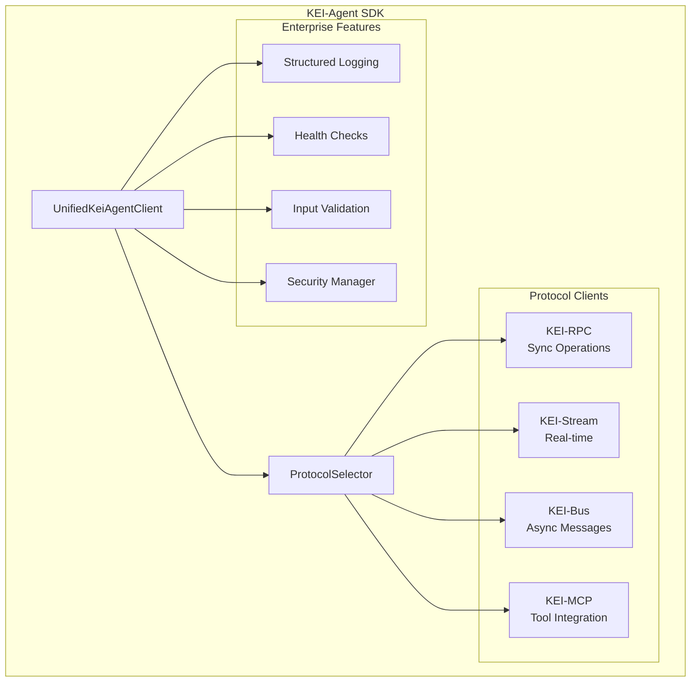

# KEI-Agent Python SDK

Enterprise-Grade Python SDK für Multi-Agent-Systeme mit umfassender Protokoll-Unterstützung.

## 🚀 Überblick

Einheitliche, typisierte API für intelligente Agenten:

- **Multi-Protocol**: KEI-RPC, KEI-Stream, KEI-Bus, KEI-MCP
- **Enterprise Security**: Authentifizierung und Input-Validierung
- **Production Ready**: Structured Logging und Health Checks
- **Developer Experience**: Type Hints und deutsche Dokumentation

## ⚡ Quick Start

```python
import asyncio
import httpx
from kei_agent import UnifiedKeiAgentClient, AgentClientConfig, CapabilityManager, CapabilityProfile

# 1) Agent Erstellen
config = AgentClientConfig(
    base_url="https://api.kei-framework.com",
    api_token="your-token",
    agent_id="blogpost-agent"
)

# 2) Agent Definition
async def main():
    async with UnifiedKeiAgentClient(config=config) as client:

        # 3) Tool erstellen
        async def web_search_tool(query: str) -> dict:
            async with httpx.AsyncClient() as http:
                response = await http.get(f"https://api.duckduckgo.com/?q={query}&format=json")
                data = response.json()
                return {"results": data.get("RelatedTopics", [])[:3]}

        # 4) Tool Zugriff für Agent realisieren
        capability_manager = CapabilityManager(client._legacy_client)
        await capability_manager.register_capability(
            CapabilityProfile(
                name="web_search",
                version="1.0.0",
                description="Web-Suche"
            ),
            handler=web_search_tool
        )

        # 5) Aufgabe für den Agent Definieren
        task = await client.plan_task(
            objective="Erstelle Blogpost über KI",
            context={"topic": "Künstliche Intelligenz"}
        )

        # 6) Ausführung Agent Starten
        search_result = await client.use_tool("web_search", **{"query": "KI Trends 2024"})

        # 7) Agent liefert die Response
        print(f"Gefunden: {len(search_result['results'])} Ergebnisse")
        return search_result

asyncio.run(main())
```

## 🏗️ Architektur



## 🎯 Features

- **🔌 Multi-Protocol**: RPC, Stream, Bus, MCP
- **🛡️ Security**: Multi-Auth, Input Validation, RBAC
- **📊 Monitoring**: Structured Logging, Health Checks
- **🔧 Developer**: Type Safety, deutsche Dokumentation

## 📚 Navigation

- [**Installation**](getting-started/installation.md) | [**Quick Start**](getting-started/quickstart.md) | [**Konfiguration**](getting-started/configuration.md)
- [**Konzepte**](user-guide/concepts.md) | [**Client-Verwendung**](user-guide/client-usage.md) | [**Protokolle**](user-guide/protocols.md)
- [**Logging**](enterprise/logging.md) | [**Health Checks**](enterprise/health-checks.md) | [**Security**](enterprise/security.md)
- [**API-Referenz**](api/index.md) | [**Migration**](migration/from-legacy.md) | [**Troubleshooting**](troubleshooting/index.md)

---

**Bereit loszulegen?** → [Installation](getting-started/installation.md) | [Quick Start](getting-started/quickstart.md)
