# Basis-Konzepte

Grundlegende Konzepte des KEI-Agent Python SDK.

## 🤖 Agent-Architektur

Ein KEI-Agent ist eine autonome Software-Einheit, die:

- **Aufgaben planen** und ausführen kann
- **Mit anderen Agents kommuniziert** über verschiedene Protokolle
- **Tools und Services** nutzen kann
- **Sicherheitsrichtlinien** befolgt

```mermaid
graph TD
    A[Agent Initialisierung] --> B[Konfiguration laden]
    B --> C[Protokolle aktivieren]
    C --> D[Bereit für Operationen]
    D --> E[Task-Verarbeitung]
    E --> F[Agent-Kommunikation]
    F --> G[Tool-Verwendung]
    G --> D
```



## 🔌 Protokolle

### RPC (Remote Procedure Call)
- **Synchrone** Request-Response-Kommunikation
- HTTP-basiert mit JSON-Payloads

```python
result = await client.plan_task("Analysiere Daten")
```

### Stream (WebSocket)
- **Bidirektionale** Echtzeit-Kommunikation
- WebSocket-basiert

```python
async def on_event(message):
    print(f"Empfangen: {message}")

await client.start_streaming_session(callback=on_event)
```

### Bus (Message Bus)
- **Asynchrone** Publish-Subscribe-Kommunikation
- Event-basierte Architekturen

```python
await client.send_agent_message("target-agent", "task_request", data)
```

### MCP (Model Context Protocol)
- **Tool-Discovery** und -Verwendung
- KI-Model-Integration

```python
tools = await client.discover_available_tools()
result = await client.use_tool("calculator", expression="2+2")
## 🔒 Sicherheit

```python
from kei_agent import SecurityConfig, AuthType

# Bearer Token
config = SecurityConfig(
    auth_type=AuthType.BEARER,
    api_token="your-token",
    rbac_enabled=True,
    audit_enabled=True
)
```

## 🔄 Asynchrone Programmierung

```python
import asyncio

async def main():
    async with UnifiedKeiAgentClient(config) as client:
        result = await client.plan_task("Task")

        # Parallele Ausführung
        tasks = [
            client.plan_task("Task 1"),
            client.plan_task("Task 2")
        ]
        results = await asyncio.gather(*tasks)

asyncio.run(main())
```

## 📊 Monitoring

```python
from kei_agent import get_logger, get_health_manager

# Logging
logger = get_logger("my-component")
logger.info("Operation started")

# Health Checks
health = get_health_manager()
summary = await health.run_all_checks()
print(f"Status: {summary.overall_status}")
```

---

**Nächste Schritte:** [Client-Verwendung](client-usage.md) | [Protokolle](protocols.md)
