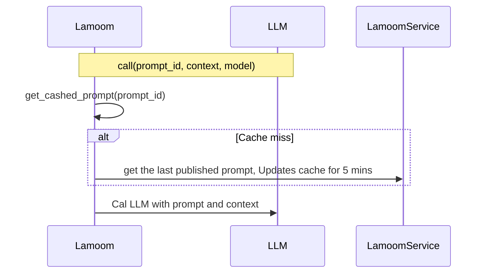
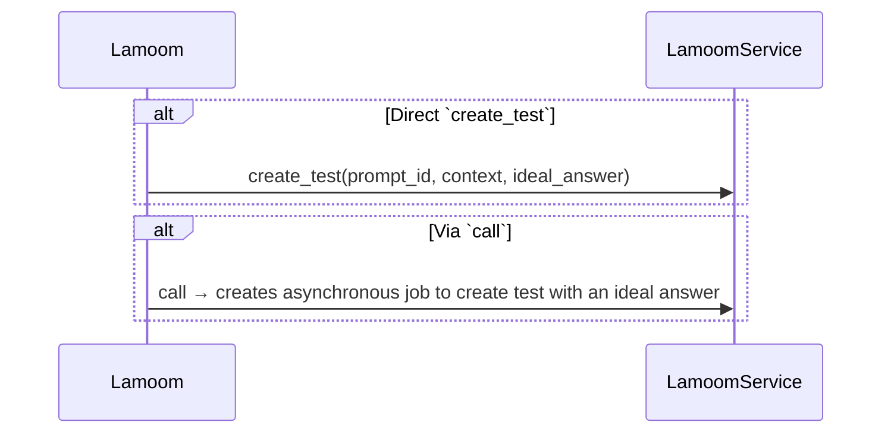
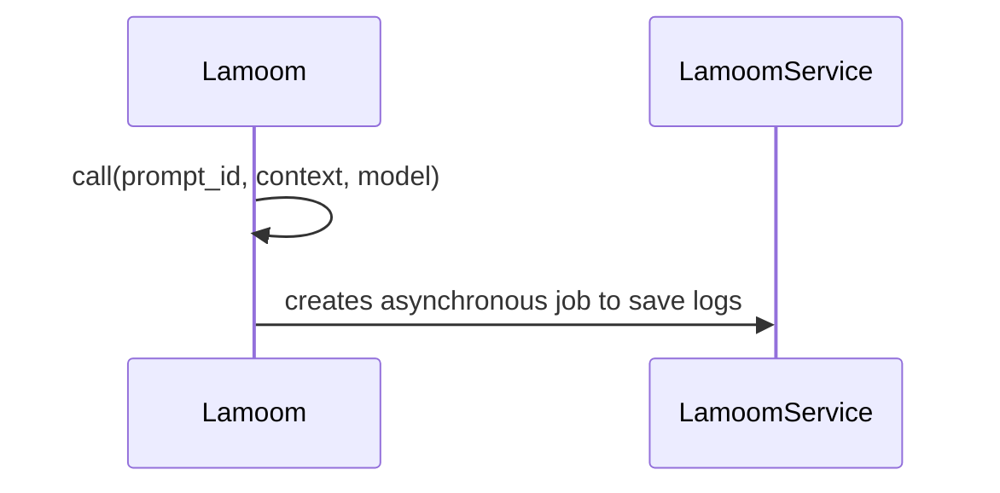
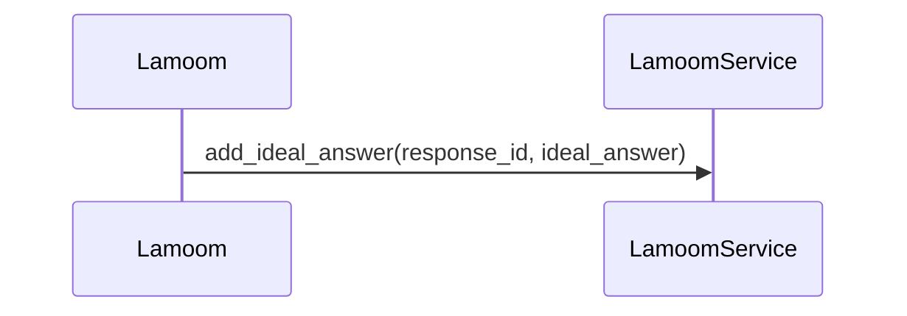

# Lamoom

## Our Philosophy

Lamoom, derived from "Lambda on Mechanisms," refers to computation within a system that iteratively guides the LLM to perform correctly. Inspired by Amazon's culture, as Jeff Bezos said, "Good intentions don't work, mechanisms do," we focus on building mechanisms for LLMs rather than relying on their good intentions


## Introduction
Lamoom is a dynamic, all-in-one library designed for managing and optimizing prompts and making tests based on the ideal answer for large language models (LLMs) in production and R&D. It facilitates dynamic data integration, latency and cost metrics visibility, and efficient load distribution across multiple AI models.

[](https://www.youtube.com/watch?v=1opO_5kRf98 "Lamoom Introduction Video")

## Getting Started

To help you get started quickly, you can explore our [Getting Started Notebook](docs/getting_started_notebook.ipynb) which provides step-by-step examples of using Lamoom.

## Features

- **CI/CD testing**: Generates tests based on the context and ideal answer (usually written by the human).
- **Dynamic Prompt Development**: Avoid budget exceptions with dynamic data.
- **Multi-Model Support**: Seamlessly integrate with various LLMs like OpenAI, Anthropic, and more.
- **Real-Time Insights**: Monitor interactions, request/response metrics in production.
- **Prompt Testing and Evaluation**: Quickly test and iterate on prompts using historical data.
- **Smart Prompt Caching**: Efficiently cache prompts for 5 minutes to reduce latency while keeping them updated.
- **Asynchronous Logging**: Record interactions without blocking the main execution flow.

## Core Functionality

### Prompt Management and Caching
Lamoom implements an efficient prompt caching system with a 5-minute TTL (Time-To-Live):
- **Automatic Updates**: When you call a prompt, Lamoom checks if a newer version exists on the server.
- **Cache Invalidation**: Prompts are automatically refreshed after 5 minutes to ensure up-to-date content.
- **Local Fallback**: If the LamoomService is unavailable, Lamoom library falls back to the locally defined prompt.
- **Version Control**: Track prompt versions between local and server instances.




### Test Generation and CI/CD Integration
Lamoom supports two methods for test creation:
1. **Inline Test Generation**: Add `test_data` with an ideal answer during normal LLM calls to automatically generate tests.
2. **Direct Test Creation**: Use the `create_test()` method to explicitly create tests for specific prompts.

Tests automatically compare LLM responses to ideal answers, helping maintain prompt quality as models or prompts evolve.



### Logging and Analytics
Interaction logging happens asynchronously using a worker pattern:
- **Performance Metrics**: Automatically track latency, token usage, and cost.
- **Complete Context**: Store the full prompt, context, and response for analysis.
- **Non-Blocking**: Logging happens in the background without impacting response times.



### Feedback Collection
Improve prompt quality through explicit feedback:
- **Ideal Answer Addition**: Associate ideal answers with previous responses using `add_ideal_answer()`.
- **Continuous Improvement**: Use feedback to automatically generate new tests and refine prompts.



## Installation

Install Flow Prompt using pip:

```bash
pip install lamoom
```

Obtain an API token from [Lamoom]('https://portal.lamoom.com') and add it as an env variable: `LAMOOM_API_TOKEN` ;

## Getting Started

To help you get started quickly, you can explore our [Getting Started Notebook](docs/getting_started_notebook.ipynb) which provides step-by-step examples of using Lamoom.

## Authentication

### Add Keys depending on models you're using:
```python
# Add LAMOOM_API_TOKEN as an environment variable:
os.setenv('LAMOOM_API_TOKEN', 'your_token_here')

# add OPENAI_API_KEY
os.setenv('OPENAI_API_KEY', 'your_key_here')

# add Azure Keys
os.setenv('AZURE_KEYS', '{"name_realm":{"url": "https://baseurl.azure.com/","key": "secret"}}')
# or creating flow_prompt obj
Lamoom(azure_keys={"realm_name":{"url": "https://baseurl.azure.com/", "key": "your_secret"}})

# add Custom Models Key
os.setenv('CUSTOM_API_KEY', 'your_key_here')
```

### Model Agnostic:
Mix models easily, and districute the load across models. The system will automatically distribute your load based on the weights. We support:
- Claude
- Gemini
- OpenAI (w/ Azure OpenAI models)
- Nebius with (Llama, DeepSeek, Mistral, Mixtral, dolphin, Qwen and others)
- OpenRouter woth open source models
- Custom providers

Model string format is the following for Claude, Gemini, OpenAI, Nebius:
`"{model_provider}/{model_name}"`
For Azure models format is the following:
`"azure/{realm}/{model_name}"`

```python
response_llm = client.call(agent.id, context, model = "openai/o4-mini")
response_llm = client.call(agent.id, context, model = "azure/useast/gpt-4.1-mini")
```

Custom model string format is the following:
`"custom/{provider_name}/{model_name}"`
where provider is provided in the env variable:
LAMOOM_CUSTOM_PROVIDERS={"provider_name": {"base_url": "https://","key":"key"}}

```python
response_llm = client.call(agent.id, context, model = "custom/provider_name/model_name")
```

### Lamoom Keys
Obtain an API token from Flow Prompt and add it:

```python
# As an environment variable:
os.setenv('LAMOOM_API_TOKEN', 'your_token_here')
# Via code: 
Lamoom(api_token='your_api_token')
```

## Usage Examples:

### Basic Usage
```python
from lamoom import Lamoom, Prompt

# Initialize and configure Lamoom
client = Lamoom(openai_key='your_api_key', openai_org='your_org')

# Create a prompt
prompt = Prompt('greet_user')
prompt.add("You're {name}. Say Hello and ask what's their name.", role="system")

# Call AI model with Lamoom
context = {"name": "John Doe"}
response = client.call(prompt.id, context, "openai/o4-mini")
print(response.content)
```

### Creating Tests While Using Prompts
```python
# Call with test_data to automatically generate tests
response = client.call(prompt.id, context, "openai/o4-mini", test_data={
    'ideal_answer': "Hello, I'm John Doe. What's your name?", 
    'model_name': "gemini/gemini-1.5-flash"
})
```

### Creating Tests Explicitly
```python
# Create a test directly
client.create_test(
    prompt.id,
    context,
    ideal_answer="Hello, I'm John Doe. What's your name?",
    model_name="gemini/gemini-1.5-flash"
)
```

### Adding Feedback to Previous Responses
```python
# Add an ideal answer to a previous response for quality assessment
client.add_ideal_answer(
    response_id=response.id,
    ideal_answer="Hello, I'm John Doe. What's your name?"
)
```

### To Add Search Credentials:
- Add Search ENgine id from here:
https://programmablesearchengine.google.com/controlpanel/create

- Get A google Search Key:
https://developers.google.com/custom-search/v1/introduction/?apix=true


### Monitoring and Management
- **Test Dashboard**: Review created tests and scores at https://cloud.lamoom.com/tests
- **Prompt Management**: Update prompts and rerun tests for published or saved versions
- **Analytics**: View logs with metrics (latency, cost, tokens) at https://cloud.lamoom.com/logs

The system is designed to allow prompt updates without code redeployment—simply publish a new prompt version online, and the library will automatically fetch and use it.

## Best Security Practices
For production environments, it is recommended to store secrets securely and not directly in your codebase. Consider using a secret management service or encrypted environment variables.

## Contributing
We welcome contributions! Please see our Contribution Guidelines for more information on how to get involved.

## License
This project is licensed under the Apache2.0 License - see the [LICENSE](LICENSE.txt) file for details.

## Contact
For support or contributions, please contact us via GitHub Issues.

