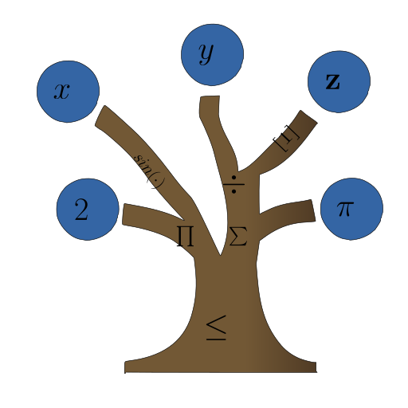

<!-- PROJECT LOGO -->
<br />
<div align="center">
  <a href="https://git.rwth-aachen.de/avt-svt/public/libale">
    
  </a>

  <h3 align="center">libALE</h3>

  <p align="center">
    A library for algebraic logical expression trees
    <br />
    <br />
    <a href=https://git.rwth-aachen.de/avt-svt/public/libale/issues>Report Bug</a>
    ·
    <a href=https://git.rwth-aachen.de/avt-svt/public/libale/issues>Request Feature</a>
  </p>
</div>

<div align="center">


</div>

## About

libALE is a C++ library designed to work with mathematical programs (MPs) and consists of three main components:

1. A domain-specific language (DSL) for the representation of MPs in an intuitive fashion
2. A flat-hierarchy data structure with symbol-table management for user-defined identifiers
3. An extensible set of operations implemented using the visitor pattern

# **Installation**

For compilation, a compiler supporting `C++17` is required.
Use the provided [CMakeLists.txt](./CMakeLists.txt) in the repository root directory.
The following command sequence (for Linux) will compile the libALE library and a demo executable named `ale_demo`:

    $ mkdir build && cd build
    $ cmake -S .. -B .
    $ make

The *.txt-based demo input file for the demo executable is located at [demo/input_files/](./demo/input_files/).
The demo input file is automatically copied into the build folder while building the project with CMake.
To run the demo executable with the provided default input file called [input.txt](./demo/input_files/input.txt), which has been copied into the build folder automatically, run the following command (from the build directory):

    $ ./ale_demo

Alternatively, the input file location and name can be passed via the command line:

    $ ./ale_demo ../demo/input_files/input.txt

# **ALE Modeling Language**

The following gives a short overview of the [File Structure](#file-structure), [Program Flow](#program-flow), definition and assignment of [Symbols](#symbols), and [Expressions](#expressions).
For extensive and advanced examples, the reader is encouraged to read and run the provided demo file, i.e., for the ALE syntax, the [input.txt](./demo/input_files/input.txt).

## **File Structure**

In the input file, end-of-line  comments can be initiated using the pound symbol (#) at any point.
All input between the pound symbol and the end of the current line is ignored.
**Whitespace** characters have no meaning except to separate keywords.
ALE supports the following statements, all of which are terminated by a **semicolon** (;):

- definition statements with an optional description in quotes (" "),
- assignment statements, and
- expression statements with an optional description in quotes (" ")

Definitions use the definition operator (:=), while assignments use the assignment operator (<-).
Expression statements are statements that are neither definitions nor assignment statements.
## **Symbols**

Symbols are named entities that refer to fixed values, variables, or functions of a particular type.
The names used are allowed to contain **letters**, **numbers**, and **underscores** and must start with a **letter**.
As usual, symbols can only be used once they have been defined.
All symbols are constructed from the basic types **real**,   **index**, and **boolean** and potentially derived types such as **set** and **tensor**.

### **Symbol Definitions - The Basic Types real, index, and boolean**
All definitions begin with a declarator indicating the desired data type (e.g., **real**, **index**, or **boolean**) and are terminated with a **semicolon** (;).
The following are valid definitions of different **scalar parameter** symbols, which are defined using the **definition operator** (:=):

    real a := 12.5e-2;                  # defines a scalar real parameter named "a" with value 12.5e-2
    index i := 2;                       # defines a scalar index parameter named "i" with value 2
    boolean b := true;                  # defines a scalar boolean parameter named "b" with the value true

**Scalar variable** symbols can be defined using essentially the same syntax as parameters, with the difference that variables are not assigned values but bound intervals.
Specific bounds can be assigned using the **in operator** (in).
For unbounded variables, the bound assignment is omitted.
Furthermore, variables can only be real scalars or tensors.
The following are valid definitions of different **scalar** variables:


    real x in [0,1];                    # defines a real scalar variable "x" with bounds [0,1].
    real y;                             # defines an unbounded real scalar variable named "y"


Integral variables can be defined by replacing the **real** declarator with either **binary** or **integer**.
In the case of a binary variable, no bounds can be assigned as they are implicit.
The following are valid definitions of different **binary** and **integer variables**:

    binary bx;                          # defines a binary scalar variable "bx"
    integer by in [2,10];               # defines a bounded integer scalar variable with bounds [2,10]

The values of binary and integer variables are still considered real values.

### **Symbol Definitions - Derived Types **set** and **tensor****

It is also possible to define **tensors** and **sets**.

#### Tensors
For the definition of a **tensor parameter**, its length in each dimension must be provided in square brackets after the declarator.
Furthermore, vector values are written in parentheses as a comma-separated list of entries.
Similarly, tensor values are written in terms of their subvectors (i.e., matrices are vectors of vectors, and so on).
The following are valid definitions of different **tensor parameters**:

    real[3] rv := (1.3, 2.4, 3.5);      # defines a real parameter vector of length 3
    index[2,2] im := ((1, 2), (3, 4));  # defines a real parameter index matrix of size 2x2

For convenience, tensors can also be initialized with a scalar:

    real[3,4] rm := 0;                  # defines a real parameter matrix parameter of size 3x4 filled with zeros

Similarly, the definition of **tensor variables** is possible:

    real[3] yv in [(1, 2, 3), (2.5, 1e2, 5.4)]; # defines a bounded real vector variable
    real[2,2] z in [0, ((20, 10), (23, 15))];   # defines a bounded real matrix variable with all lower bounds being zero
    integer[3] iy in [(1, 2, 3), (2, 10, 5)];   # defines a bounded integer vector variable

In the above example, one or both bounds of a tensor variable may be provided as a single scalar.

#### Sets

For the definition of **sets**, the declarator is composed of the keyword **set** and the desired element type in braces.
Therein, tensor-valued elements are denoted using the same notation as above with the **wildcard operator** (:) (for wildcards refer to [Assignments and Wildcards](#assignments-and-wildcards)), instead of the tensor lengths.
Similarly, set values are denoted as comma-separated lists in braces.
The following are valid definitions of different **set parameters**:

    set{index} i_set := {1, 3, 5};                     # defines an index set parameter containing 1, 3, and 5
    set{real[:]} v_set := {(1.3, 2.4), (3.5, 4.6, 2)}; # defines real vector set containing two vectors

Contiguous index set values can be denoted in short-hand using the **sequence operator** (..) as shown below.
The index set is considered empty when using the sequence operator with a start value greater than the end value.

    set{index} j_set := {1 .. 5};       # defines an index set parameter containing 1 through 5
    set{index} k_set := {1 .. 0};       # defines an empty set because start value > end value

### **Assignments and Wildcards**

Assignments can be used to assign a new value to a parameter using the **assignment operator** (<-):

    a <- 3.8;                           # Assigns the value 3.8 to the previously defined (see above) scalar real parameter "a"
If "a" is used after this line, it has the value 3.8 (until another value is assigned).

> However, certain constructs will eagerly evaluate the value of parameters during parsing.
Except for advanced users, we recommend assigning values directly after the definition of the respective symbol and before it is referenced. This way, knowledge about where values are eagerly evaluated during parse time and where they are evaluated during evaluation to their updated values is not required.
For more information on this topic, please refer to section [Program Flow](#program-flow).

It is also possible to (re-)assign the **lower bound**, **upper bound**, **branching priority**, and **initial point** attributes of a variable.
For these attribute assignments, the variable name, the appropriate suffix of the attribute (**.lb**, **.ub**, **.prio**, or **.init**), and the **assignment operator** are used:

    x.lb <- -1;                         # assigns the lower bound of x to be -1
    x.ub <- 3;                          # assigns the upper bound of x to be 3
    x.prio <- 2;                        # assings the branching priority of x to be 2;
    x.init <- 2;                        # assigns the initial point of x to be 2

Also, particular entries of tensors or values of scalars can later be changed using the **assignment operator**.
Wildcards can be used to indicate an assignment for all values of a particular index:

    i <- 1;                             # assigns the value 1 to i
    rm[1,2] <- 5.2;                     # assigns the value 5.2 to entry [1,2] of rm
    rm[2,:] <- 2.2;                     # assigns the value 2.2 to entries [2,1], [2,2], [2,3] of rm
    z.lb[1,:] <- 2;                     # assigns the lower bound 2 to entries [1,1], [2,2] of z

As shown above, wildcards may be used in definitions as a substitute for any indices.
This can be useful when, e.g., defining sets containing vectors of different sizes (see definition of "v_set" in [Sets](#sets)).
Furthermore, wildcards can be helpful in the definition of [User-Defined Function Symbols](#intrinsic-and-user-defined-function-symbols).

### **Intrinsic and User-defined Function Symbols**

>*Note:  So-called **expression symbols** were used in the past to encode functions without arguments. **Function symbols** will replace **expressions symbols** in the upcoming release\.
For further information on **expressions symbols** [depricated], please refer to the [input.txt](./demo/input_files/input.txt)*

For convenience, ALE provides some basic and special functions, which are already intrinsically defined.
Additionally, user-defined function symbols can be defined similarly to definitions.
ALE permits the usage of functions in definitions, assignments, functions, or expressions.
As such, they can be used to write reduced-space formulations procedurally.

> Note that depending on where the functions (with their required arguments) are used, they are *evaluated* in the first- or second stage of the ALE program flow (see [Particularities of the Program Flow](#particularities-of-the-program-flow)).

For a complete list of implemented intrinsic functions beyond the standard functions (exp(), log(), sin(), asin(), etc.), refer to doc/implementedFunctions/Implemented_functions.pdf in the [MAiNGO](https://git.rwth-aachen.de/avt-svt/public/maingo) git repository.
Furthermore, ALE provides some intrinsic functions for which no custom relaxations exist in MAiNGO.
The following set-based intrinsic functions expand over a set of any given type:

    sum(k in {1 .. 3} : rv[k])
    sum(k in { } : rv[k])               # sum over empty set equal by convention 0
    sum(v in v_set : v[1])
    min(r in {1.2, 10.0, -1.5} : r)
    max(k in {1 .. 3} : rv[k])
    product(k in {1 .. 3} : rv[k])

Note, however, that the min and max functions can also be used without set expansion:

    min(yv[2], 3e-2, 5.3, x)
    max(rm[1,1], rm[2,2])

Additionally, the functions as_index and as_real, which can interpret a real as an index and vice versa, are intrinsically defined.
Reals must represent a whole number if they are about to be converted to an index (the user must round manually if necessary).

    real x5 := 5;
    index i9 := as_index(x5);           # 'i9' will now have the value 5
    real x7 := as_real(i9);             # 'x7' will now have the value 5.0

User-defined **function symbols** are defined with a return type, an identifier, arguments, and an expression.
For further information on what constitutes a valid expression, refer to [Expressions](#expressions).
Both the return type and the arguments of a function must be of the same basic type.
(For a (unsave) workaround using as_index and as_real, please refer to the [input.txt](./demo/input_files/input.txt)).
The following are valid definitions of different function symbols:

    index i_func() := 5;                            # function without arguments returns an index and is called "i_func"; will always evaluate to 5
    index i8 := i_func() + 1;
    real r_func(real m) := m*3 + z[1,1];            # defines a real scalar function with an argument and also uses the previously defined symbol "z"
    real vr_func(real[2] m) := m[1]+m[2]+r_func(x); # function takes a vector of size 2 as an argument and uses r_func()
    real[2,2] function7 (real m) := ((m,m),(m,m));  # defines a matrix function that takes a scalar as an argument
    real[2,3] w_func(real [2,3,2] m) := m[:,:,1];
    boolean b_func(boolean m) := m;                 # defines a boolean function

## **Expressions**

The ALE syntax for denoting expressions is similar to other established modeling languages and should be mostly intuitive.
In the following, the different expression types and the allowed operators are discussed:

### **Scalar Real Expressions**

The basic building blocks of real scalar expressions are **constants**, **symbol names**, and **entries of real tensors**.
Constants can be any real number written in floating-point or scientific notation, as shown above in the definition of symbols.
Entries of tensors are accessed by bracket notation, as shown above, to assign tensor entries.
Operators are defined for **addition** (+), **subtraction** (-), **multiplication** (*), **division** (/), and **exponentiation** (^).
Parentheses are used to enforce precedence and to denote arguments to functions.
Furthermore, [Intrinsic and User-Defined Function Symbols](#intrinsic-and-user-defined-function-symbols) can be used in expressions.
The following are valid **real expressions**:

    x + sin(y[1])
    3 ^ (2 * z[1,1])

### **Scalar Index Expressions**

Similar to real expressions, the basic building blocks of index expressions are **constants**, **symbol names**, and **entries of real tensors**.
However, index expressions and, therefore, also constants and the values of symbols can only take whole values.
By the same token, only the operators for **addition** (+), **subtraction** (-), and **multiplication** (*) are defined for indexes.
Parentheses are used to enforce precedence.

### **Scalar Boolean Expressions**

The basic building blocks of boolean expressions are **constants**, **symbol names**, and **entries of real tensors**.
Furthermore, boolean expressions result from the **comparison operators** (<, <=, =, >=, >).
Boolean expressions and, therefore also, constants and the values of symbols can only be **true** or **false**.
Operators are defined for *conjunction* (&), *disjunction* (|), and *negation* (!).
Parentheses are used to enforce precedence.
The following are valid **boolean expressions**:

    b & false
    x * y[1] <= 2

Furthermore, ALE provides set-based conjunction similar to set-based real expressions.

    forall k in {1, 2} : z[k,1] <= z[1,k+1];
    forall r in {1.2, 10.0, -1.5} : x >= r;

### **Set Expressions**

The basic building blocks of set expressions are **constants** and **symbol names**.
These basic sets can be refined by employing an **indicator set**, which only contains those elements that satisfy a logical condition:

    {r in {1.2, 2.3, 3.4} : r <= 3}     # only contains 1.2 and 2.3
### **Symbolic differentiation**

Any **real** expression can be differentiated using the **diff**-function.
The first argument is the expression to be differentiated and the second argument specifies with respect to which variable the expression is differentiated.
This can be either a real variable or a real parameter.
The symbols contained in a call of the **diff**-function must be defined beforehand.
The differentiation is not recorded in the resulting expression.
Instead, the **diff**-function call is simply replaced by the result during parsing ([First Stage](#first-stage-parse-time)).

    diff(x*x, x)  # is equivalent to writing 2*x

Differentiating through and in user-defined functions is allowed:

    real func(real x) := 2 * x * x;
    real diff_func(real x) := diff(func(x), x);
    diff_func(1);

Differentiation is also implemented for differentiating tensor-valued functions to a single variable or differentiating a scalar function with respect to a tensor-valued input.
The shape of the output will correspond to the tensor.


    diff(y[1, 1], y[1])[1]              # differentiates 'y[1, 1]' w.r.t. y[1, 1] and y[1, 2]; therefore evaluates to (1, 0)[1]
    diff(((x, 1), (2*x, 2)), x)[1, 1]   # evaluates to ((1, 0), (2, 0))[1,1]

Situations, where both arguments to the **diff**-function are non-scalar, are not supported.
Non-differential nodes, such as **round** or **as_real** can not be differentiated with respect to their arguments.

## **Program Flow**

For convenience, constant [Expressions](#expressions) can be used in the definitions and assignments of symbols.
With constant expressions, we refer to expressions that only refer to parameters and not to variables.
The expressions used in assignments and definitions of symbols are evaluated sequentially in the [First Stage](#first-stage-parse-time) of the ALE program flow.
In the [Second Stage](#second-stage-evaluation-time), the  expression statements are evaluated by an *evaluator*.

### **First Stage (*Parse Time*)**

In the first stage, libALE parses/reads the input file.
LibALE parses the [Symbol](#symbols) definitions and assignments during this first stage and stores the [Expression](#expressions) statements.
The symbols are internally defined and then can then be used in the definition of other symbols, and values of parameters (or attributes of variables) can be changed (re-[assigned](#assignments-and-wildcards)) in a sequential manner.
Note that [Expressions](#expressions) used in the definitions or assignments of symbols are evaluated during parsing (sequential parsing and evaluation of definitions and assignments).
The  [Expressions](#expressions) in expression statements in the input file are only parsed, internally defined, and stored as expression trees.
These expressions are not evaluated yet (!).

### **Second Stage (*Evaluation Time*)**

During *evaluation time*, the values of all [Symbols](#symbols) equal their last set value.
Then, the expression in expression statements, which have been internally stored as expression trees, are evaluated by an *evaluator*.\
In the case of the ALE demo executable, the *evaluator* evaluates the expressions in the expression statements and prints the results onto the command line (note that the ALE *evaluator* can not evaluate variables).
In the case of [MAiNGO](https://git.rwth-aachen.de/avt-svt/public/maingo), the *evaluator* parses all symbols and the expression statements to MAiNGO where the symbols and the expressions (together with their section headings) are interpreted as an optimization problem, which is subsequently solved.

#### **Particularities of the Program Flow**

Note that there are a few particularities for function symbols and inline definitions.

#### **Function Symbols**

Any function symbols used in expressions are replaced by their right-hand side (RHS) expressions during evaluation.
If a function symbol is used in a definition or assignment, all symbols of the RHS of the function are set equal to their previous value ([first stage](#first-stage-parse-time)).
In these cases, the usage of variable values is not permitted.
If a function symbol is used in an expression statement, all symbols of the RHS of the function are set equal to their last set value ([second stage](#second-stage-evaluation-time)).
In these cases, depending on the used *evaluator*, the usage of variables values is permitted.

#### **Inline Definitions**

Inline definitions are evaluated in the [First Stage](#first-stage-parse-time).
With inline definitions, we refer to the construction of derived types (**tensors** or **sets**) without naming them.
The following expression statement "z;" will always be evaluated to 5, although the value of "k" is changed afterward.

    real k := 5;
    real z := (1,k,3)[2];               # inline definitions are evaluated in the first stage
    k <- 2;
    z;                                  # evaluates to 5

This is because the example above is identical to writing

    real k    := 5;
    real[3] t := (1,k,3);
    real z    := t[2];                  # inline definitions are evaluated in the first stage
    k <- 2;

#### **Symbolic differentiation**
Symbolic differentiation is carried out at parse time ([First Stage](#first-stage-parse-time)).
However, the resulting expression is still evaluated at run-time ([Second Stage](#second-stage-evaluation-time)).
One can think about the differentiation function in terms of a text replacement.
For example, this ALE snippet

    real x := 1;
    real k := 1;
    diff( k * x^2, x);
    k <- 2;
    x <- 2;

is identical to

    real x := 1;
    real k := 1;
    k*x^2;                              # returns 8
    k <- 2;
    x <- 2;

## How to Cite

If you use libALE in your research or work, please cite it as follows:

A. Zingler, D. Jungen, H. Djelassi, and A. Mitsos. libALE – a library for algebraic-logical expression trees, 2023. URL https://git.rwth-aachen.de/avt.svt/public/libale.git

### BibTeX

```bibtex
@misc{libale2023,
  author = {A. Zingler and D. Jungen and H. Djelassi and A. Mitsos},
  title = {libALE – a library for algebraic-logical expression trees},
  year = {2023},
  url = {https://git.rwth-aachen.de/avt.svt/public/libale.git}
}
```

