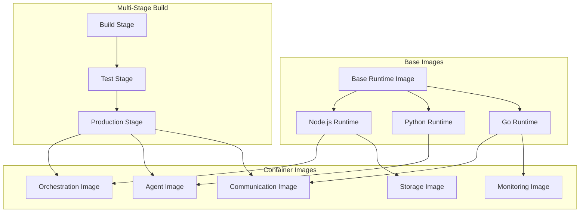
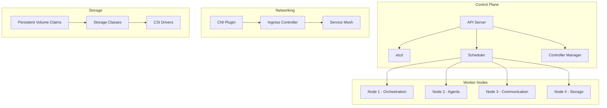

# Deployment Architecture

## Overview

The MAOS deployment architecture provides a comprehensive containerized solution using Docker and Kubernetes, enabling scalable, reliable, and maintainable deployments across various environments. The architecture supports multi-environment deployments, blue-green deployments, and automated CI/CD pipelines.

## Container Architecture

### 1. Container Strategy



### 2. Dockerfile Specifications

#### Orchestration Service
```dockerfile
# Multi-stage build for orchestration service
FROM node:18-alpine AS builder

WORKDIR /app

# Install dependencies
COPY package*.json ./
RUN npm ci --only=production && npm cache clean --force

# Copy source code
COPY src/ ./src/
COPY tsconfig.json ./

# Build application
RUN npm run build

# Production stage
FROM node:18-alpine AS production

# Create non-root user
RUN addgroup -g 1001 -S maos && \
    adduser -S maos -u 1001 -G maos

WORKDIR /app

# Copy built application
COPY --from=builder --chown=maos:maos /app/dist ./dist
COPY --from=builder --chown=maos:maos /app/node_modules ./node_modules
COPY --from=builder --chown=maos:maos /app/package.json ./

# Install security updates
RUN apk update && apk upgrade && \
    apk add --no-cache dumb-init curl && \
    rm -rf /var/cache/apk/*

# Switch to non-root user
USER maos

# Health check
HEALTHCHECK --interval=30s --timeout=3s --start-period=5s --retries=3 \
  CMD curl -f http://localhost:3000/health || exit 1

# Expose port
EXPOSE 3000

# Use dumb-init for proper signal handling
ENTRYPOINT ["dumb-init", "--"]
CMD ["node", "dist/index.js"]
```

#### Agent Service
```dockerfile
FROM python:3.11-slim AS builder

WORKDIR /app

# Install system dependencies
RUN apt-get update && \
    apt-get install -y --no-install-recommends \
    build-essential \
    git && \
    rm -rf /var/lib/apt/lists/*

# Copy requirements and install Python dependencies
COPY requirements.txt ./
RUN pip install --no-cache-dir -r requirements.txt

# Production stage
FROM python:3.11-slim AS production

# Create non-root user
RUN groupadd -r maos && useradd --no-log-init -r -g maos maos

WORKDIR /app

# Install runtime dependencies
RUN apt-get update && \
    apt-get install -y --no-install-recommends \
    curl && \
    rm -rf /var/lib/apt/lists/*

# Copy installed packages from builder
COPY --from=builder /usr/local/lib/python3.11/site-packages /usr/local/lib/python3.11/site-packages
COPY --from=builder /usr/local/bin /usr/local/bin

# Copy application code
COPY --chown=maos:maos src/ ./src/
COPY --chown=maos:maos config/ ./config/

# Switch to non-root user
USER maos

# Health check
HEALTHCHECK --interval=30s --timeout=3s --start-period=10s --retries=3 \
  CMD curl -f http://localhost:8000/health || exit 1

EXPOSE 8000

CMD ["python", "-m", "src.main"]
```

#### Database Migration Container
```dockerfile
FROM node:18-alpine

WORKDIR /app

# Install migration dependencies
COPY package*.json ./
RUN npm ci --only=production

# Copy migration scripts
COPY migrations/ ./migrations/
COPY scripts/migrate.js ./

# Create non-root user
RUN addgroup -g 1001 -S migrate && \
    adduser -S migrate -u 1001 -G migrate

USER migrate

CMD ["node", "migrate.js"]
```

### 3. Image Optimization

#### Multi-Stage Build Optimization
```dockerfile
# Build stage with full toolchain
FROM node:18-alpine AS dependencies
WORKDIR /app
COPY package*.json ./
RUN npm ci

FROM dependencies AS builder
COPY . .
RUN npm run build && \
    npm ci --only=production --ignore-scripts

# Minimal production image
FROM node:18-alpine AS production
RUN apk add --no-cache dumb-init

# Copy only production dependencies and built app
COPY --from=builder /app/node_modules /app/node_modules
COPY --from=builder /app/dist /app/dist
COPY --from=builder /app/package.json /app/

WORKDIR /app
USER node
ENTRYPOINT ["dumb-init", "--"]
CMD ["node", "dist/index.js"]
```

#### Image Size Optimization
```bash
# .dockerignore
node_modules/
npm-debug.log
Dockerfile*
.dockerignore
.git
.gitignore
README.md
.nyc_output
coverage
.env
tests/
docs/
*.test.js
.github/
```

## Kubernetes Architecture

### 1. Cluster Design



### 2. Deployment Manifests

#### Orchestration Service Deployment
```yaml
apiVersion: apps/v1
kind: Deployment
metadata:
  name: maos-orchestration
  namespace: maos
  labels:
    app: maos-orchestration
    component: orchestration
    version: v1.0.0
spec:
  replicas: 3
  strategy:
    type: RollingUpdate
    rollingUpdate:
      maxUnavailable: 1
      maxSurge: 1
  selector:
    matchLabels:
      app: maos-orchestration
  template:
    metadata:
      labels:
        app: maos-orchestration
        component: orchestration
        version: v1.0.0
    spec:
      serviceAccountName: maos-orchestration
      securityContext:
        fsGroup: 1001
        runAsNonRoot: true
        runAsUser: 1001
      containers:
      - name: orchestration
        image: maos/orchestration:v1.0.0
        imagePullPolicy: Always
        ports:
        - containerPort: 3000
          name: http
          protocol: TCP
        - containerPort: 9090
          name: metrics
          protocol: TCP
        env:
        - name: NODE_ENV
          value: "production"
        - name: PORT
          value: "3000"
        - name: METRICS_PORT
          value: "9090"
        - name: DATABASE_URL
          valueFrom:
            secretKeyRef:
              name: maos-secrets
              key: database-url
        - name: REDIS_URL
          valueFrom:
            secretKeyRef:
              name: maos-secrets
              key: redis-url
        resources:
          requests:
            cpu: 200m
            memory: 256Mi
            ephemeral-storage: 1Gi
          limits:
            cpu: 500m
            memory: 512Mi
            ephemeral-storage: 2Gi
        livenessProbe:
          httpGet:
            path: /health
            port: http
          initialDelaySeconds: 30
          periodSeconds: 10
          timeoutSeconds: 5
          failureThreshold: 3
        readinessProbe:
          httpGet:
            path: /ready
            port: http
          initialDelaySeconds: 5
          periodSeconds: 5
          timeoutSeconds: 3
          successThreshold: 1
          failureThreshold: 3
        volumeMounts:
        - name: config
          mountPath: /app/config
          readOnly: true
        - name: logs
          mountPath: /app/logs
      volumes:
      - name: config
        configMap:
          name: maos-orchestration-config
      - name: logs
        emptyDir: {}
      nodeSelector:
        maos.io/node-type: orchestration
      affinity:
        podAntiAffinity:
          preferredDuringSchedulingIgnoredDuringExecution:
          - weight: 100
            podAffinityTerm:
              labelSelector:
                matchExpressions:
                - key: app
                  operator: In
                  values:
                  - maos-orchestration
              topologyKey: kubernetes.io/hostname
      tolerations:
      - key: maos.io/orchestration
        operator: Equal
        value: "true"
        effect: NoSchedule
```

#### Agent Pool Deployment
```yaml
apiVersion: apps/v1
kind: Deployment
metadata:
  name: maos-agents
  namespace: maos
spec:
  replicas: 10
  strategy:
    type: RollingUpdate
    rollingUpdate:
      maxUnavailable: 2
      maxSurge: 3
  selector:
    matchLabels:
      app: maos-agents
  template:
    metadata:
      labels:
        app: maos-agents
        component: execution
    spec:
      serviceAccountName: maos-agents
      containers:
      - name: agent
        image: maos/agent:v1.0.0
        ports:
        - containerPort: 8000
          name: http
        env:
        - name: AGENT_TYPE
          value: "general"
        - name: ORCHESTRATION_URL
          value: "http://maos-orchestration:3000"
        - name: AGENT_ID
          valueFrom:
            fieldRef:
              fieldPath: metadata.name
        resources:
          requests:
            cpu: 100m
            memory: 128Mi
          limits:
            cpu: 1000m
            memory: 1Gi
        livenessProbe:
          httpGet:
            path: /health
            port: http
          initialDelaySeconds: 30
          periodSeconds: 10
        readinessProbe:
          httpGet:
            path: /ready
            port: http
          initialDelaySeconds: 5
          periodSeconds: 5
      nodeSelector:
        maos.io/node-type: agents
---
apiVersion: v1
kind: Service
metadata:
  name: maos-agents
  namespace: maos
spec:
  selector:
    app: maos-agents
  ports:
  - port: 8000
    targetPort: http
  type: ClusterIP
```

#### HorizontalPodAutoscaler
```yaml
apiVersion: autoscaling/v2
kind: HorizontalPodAutoscaler
metadata:
  name: maos-agents-hpa
  namespace: maos
spec:
  scaleTargetRef:
    apiVersion: apps/v1
    kind: Deployment
    name: maos-agents
  minReplicas: 5
  maxReplicas: 50
  metrics:
  - type: Resource
    resource:
      name: cpu
      target:
        type: Utilization
        averageUtilization: 70
  - type: Resource
    resource:
      name: memory
      target:
        type: Utilization
        averageUtilization: 80
  - type: Pods
    pods:
      metric:
        name: agent_queue_length
      target:
        type: AverageValue
        averageValue: "10"
  behavior:
    scaleUp:
      stabilizationWindowSeconds: 60
      policies:
      - type: Percent
        value: 100
        periodSeconds: 60
      - type: Pods
        value: 5
        periodSeconds: 60
    scaleDown:
      stabilizationWindowSeconds: 300
      policies:
      - type: Percent
        value: 10
        periodSeconds: 60
```

### 3. Configuration Management

#### ConfigMap for Application Configuration
```yaml
apiVersion: v1
kind: ConfigMap
metadata:
  name: maos-orchestration-config
  namespace: maos
data:
  config.yaml: |
    server:
      port: 3000
      metrics_port: 9090
      graceful_shutdown_timeout: 30s
    
    orchestration:
      max_concurrent_tasks: 1000
      task_timeout: 3600s
      retry_attempts: 3
      backoff_multiplier: 2.0
    
    agents:
      pool_size_min: 5
      pool_size_max: 50
      spawn_timeout: 60s
      health_check_interval: 30s
      termination_grace_period: 30s
    
    storage:
      checkpoint_interval: 300s
      retention_period: 7d
      compression: true
      encryption: true
    
    monitoring:
      metrics_interval: 10s
      log_level: info
      tracing_enabled: true
    
  logging.yaml: |
    level: info
    format: json
    outputs:
      - console
      - file
    file:
      path: /app/logs/app.log
      max_size: 100MB
      max_backups: 5
      max_age: 30
```

#### Secret Management
```yaml
apiVersion: v1
kind: Secret
metadata:
  name: maos-secrets
  namespace: maos
type: Opaque
data:
  database-url: <base64-encoded-database-url>
  redis-url: <base64-encoded-redis-url>
  jwt-secret: <base64-encoded-jwt-secret>
  encryption-key: <base64-encoded-encryption-key>
  
---
apiVersion: v1
kind: Secret
metadata:
  name: maos-tls-certs
  namespace: maos
type: kubernetes.io/tls
data:
  tls.crt: <base64-encoded-certificate>
  tls.key: <base64-encoded-private-key>
```

### 4. Service Mesh Integration

#### Istio Configuration
```yaml
apiVersion: networking.istio.io/v1beta1
kind: VirtualService
metadata:
  name: maos-orchestration-vs
  namespace: maos
spec:
  hosts:
  - maos-orchestration
  http:
  - match:
    - uri:
        prefix: /api/v1
    route:
    - destination:
        host: maos-orchestration
        port:
          number: 3000
    timeout: 30s
    retries:
      attempts: 3
      perTryTimeout: 10s
      retryOn: 5xx,gateway-error,connect-failure,refused-stream
  - match:
    - uri:
        prefix: /metrics
    route:
    - destination:
        host: maos-orchestration
        port:
          number: 9090

---
apiVersion: networking.istio.io/v1beta1
kind: DestinationRule
metadata:
  name: maos-orchestration-dr
  namespace: maos
spec:
  host: maos-orchestration
  trafficPolicy:
    connectionPool:
      tcp:
        maxConnections: 100
      http:
        http1MaxPendingRequests: 50
        maxRequestsPerConnection: 10
    loadBalancer:
      simple: LEAST_CONN
    outlierDetection:
      consecutiveGatewayErrors: 5
      consecutive5xxErrors: 5
      interval: 30s
      baseEjectionTime: 30s
      maxEjectionPercent: 50
  portLevelSettings:
  - port:
      number: 3000
    connectionPool:
      tcp:
        maxConnections: 50
```

## Multi-Environment Strategy

### 1. Environment Configuration

#### Development Environment
```yaml
# dev/values.yaml
global:
  environment: development
  domain: dev.maos.local
  
orchestration:
  replicas: 1
  resources:
    requests:
      cpu: 100m
      memory: 128Mi
    limits:
      cpu: 200m
      memory: 256Mi

agents:
  replicas: 3
  autoscaling:
    enabled: false
  resources:
    requests:
      cpu: 50m
      memory: 64Mi
    limits:
      cpu: 100m
      memory: 128Mi

database:
  size: small
  storage: 10Gi
  backups: false

monitoring:
  enabled: true
  retention: 1d

security:
  tls: false
  rbac: basic
```

#### Staging Environment
```yaml
# staging/values.yaml
global:
  environment: staging
  domain: staging.maos.com
  
orchestration:
  replicas: 2
  resources:
    requests:
      cpu: 200m
      memory: 256Mi
    limits:
      cpu: 500m
      memory: 512Mi

agents:
  replicas: 5
  autoscaling:
    enabled: true
    minReplicas: 3
    maxReplicas: 10
  resources:
    requests:
      cpu: 100m
      memory: 128Mi
    limits:
      cpu: 500m
      memory: 512Mi

database:
  size: medium
  storage: 50Gi
  backups: true
  backupRetention: 7d

monitoring:
  enabled: true
  retention: 7d

security:
  tls: true
  rbac: standard
```

#### Production Environment
```yaml
# production/values.yaml
global:
  environment: production
  domain: api.maos.com
  
orchestration:
  replicas: 3
  resources:
    requests:
      cpu: 500m
      memory: 512Mi
    limits:
      cpu: 1000m
      memory: 1Gi

agents:
  replicas: 10
  autoscaling:
    enabled: true
    minReplicas: 5
    maxReplicas: 50
  resources:
    requests:
      cpu: 200m
      memory: 256Mi
    limits:
      cpu: 1000m
      memory: 1Gi

database:
  size: large
  storage: 500Gi
  backups: true
  backupRetention: 30d
  replication: true

monitoring:
  enabled: true
  retention: 30d
  alerting: true

security:
  tls: true
  rbac: strict
  networkPolicies: true
  podSecurityStandards: restricted
```

### 2. Blue-Green Deployment

#### Blue-Green Deployment Strategy
```yaml
apiVersion: argoproj.io/v1alpha1
kind: Rollout
metadata:
  name: maos-orchestration-rollout
  namespace: maos
spec:
  replicas: 3
  strategy:
    blueGreen:
      activeService: maos-orchestration-active
      previewService: maos-orchestration-preview
      autoPromotionEnabled: false
      scaleDownDelaySeconds: 30
      prePromotionAnalysis:
        templates:
        - templateName: success-rate
        args:
        - name: service-name
          value: maos-orchestration-preview
      postPromotionAnalysis:
        templates:
        - templateName: success-rate
        args:
        - name: service-name
          value: maos-orchestration-active
      previewReplicaCount: 3
      promotionPolicy:
        activeDeadlineSeconds: 300
  selector:
    matchLabels:
      app: maos-orchestration
  template:
    metadata:
      labels:
        app: maos-orchestration
    spec:
      containers:
      - name: orchestration
        image: maos/orchestration:v1.0.0
        ports:
        - containerPort: 3000

---
apiVersion: v1
kind: Service
metadata:
  name: maos-orchestration-active
  namespace: maos
spec:
  selector:
    app: maos-orchestration
  ports:
  - port: 3000
    targetPort: 3000

---
apiVersion: v1
kind: Service
metadata:
  name: maos-orchestration-preview
  namespace: maos
spec:
  selector:
    app: maos-orchestration
  ports:
  - port: 3000
    targetPort: 3000
```

#### Analysis Template
```yaml
apiVersion: argoproj.io/v1alpha1
kind: AnalysisTemplate
metadata:
  name: success-rate
  namespace: maos
spec:
  args:
  - name: service-name
  metrics:
  - name: success-rate
    interval: 10s
    successCondition: result[0] >= 0.99
    failureLimit: 3
    provider:
      prometheus:
        address: http://prometheus:9090
        query: |
          sum(rate(http_requests_total{service="{{args.service-name}}", status!~"5.."}[5m])) /
          sum(rate(http_requests_total{service="{{args.service-name}}"}[5m]))
  - name: avg-response-time
    interval: 10s
    successCondition: result[0] < 0.5
    failureLimit: 3
    provider:
      prometheus:
        address: http://prometheus:9090
        query: |
          avg(rate(http_request_duration_seconds_sum{service="{{args.service-name}}"}[5m]) /
          rate(http_request_duration_seconds_count{service="{{args.service-name}}"}[5m]))
```

## CI/CD Pipeline

### 1. GitHub Actions Workflow

```yaml
# .github/workflows/deploy.yml
name: Deploy to Kubernetes

on:
  push:
    branches: [main, develop]
    tags: ['v*']
  pull_request:
    branches: [main]

env:
  REGISTRY: ghcr.io
  IMAGE_NAME: ${{ github.repository }}

jobs:
  test:
    runs-on: ubuntu-latest
    steps:
    - uses: actions/checkout@v3
    
    - name: Set up Node.js
      uses: actions/setup-node@v3
      with:
        node-version: '18'
        cache: 'npm'
    
    - name: Install dependencies
      run: npm ci
    
    - name: Run tests
      run: npm test
    
    - name: Run security scan
      run: npm audit --audit-level high

  build:
    needs: test
    runs-on: ubuntu-latest
    permissions:
      contents: read
      packages: write
    outputs:
      image-digest: ${{ steps.build.outputs.digest }}
    steps:
    - uses: actions/checkout@v3
    
    - name: Log in to Container Registry
      uses: docker/login-action@v2
      with:
        registry: ${{ env.REGISTRY }}
        username: ${{ github.actor }}
        password: ${{ secrets.GITHUB_TOKEN }}
    
    - name: Extract metadata
      id: meta
      uses: docker/metadata-action@v4
      with:
        images: ${{ env.REGISTRY }}/${{ env.IMAGE_NAME }}
        tags: |
          type=ref,event=branch
          type=ref,event=pr
          type=sha
          type=semver,pattern={{version}}
          type=semver,pattern={{major}}.{{minor}}
    
    - name: Build and push Docker image
      id: build
      uses: docker/build-push-action@v4
      with:
        context: .
        push: true
        tags: ${{ steps.meta.outputs.tags }}
        labels: ${{ steps.meta.outputs.labels }}
        cache-from: type=gha
        cache-to: type=gha,mode=max

  security-scan:
    needs: build
    runs-on: ubuntu-latest
    steps:
    - name: Run Trivy vulnerability scanner
      uses: aquasecurity/trivy-action@master
      with:
        image-ref: ${{ env.REGISTRY }}/${{ env.IMAGE_NAME }}:${{ github.sha }}
        format: 'sarif'
        output: 'trivy-results.sarif'
    
    - name: Upload Trivy scan results
      uses: github/codeql-action/upload-sarif@v2
      with:
        sarif_file: 'trivy-results.sarif'

  deploy-dev:
    if: github.ref == 'refs/heads/develop'
    needs: [build, security-scan]
    runs-on: ubuntu-latest
    environment: development
    steps:
    - uses: actions/checkout@v3
    
    - name: Setup Helm
      uses: azure/setup-helm@v3
      with:
        version: '3.10.0'
    
    - name: Configure kubectl
      uses: azure/k8s-set-context@v3
      with:
        method: kubeconfig
        kubeconfig: ${{ secrets.KUBE_CONFIG_DEV }}
    
    - name: Deploy to development
      run: |
        helm upgrade --install maos-dev ./helm/maos \
          --namespace maos-dev \
          --create-namespace \
          --values helm/maos/values-dev.yaml \
          --set image.tag=${{ github.sha }} \
          --wait --timeout=10m

  deploy-staging:
    if: github.ref == 'refs/heads/main'
    needs: [build, security-scan]
    runs-on: ubuntu-latest
    environment: staging
    steps:
    - uses: actions/checkout@v3
    
    - name: Setup Helm
      uses: azure/setup-helm@v3
      with:
        version: '3.10.0'
    
    - name: Configure kubectl
      uses: azure/k8s-set-context@v3
      with:
        method: kubeconfig
        kubeconfig: ${{ secrets.KUBE_CONFIG_STAGING }}
    
    - name: Deploy to staging
      run: |
        helm upgrade --install maos-staging ./helm/maos \
          --namespace maos-staging \
          --create-namespace \
          --values helm/maos/values-staging.yaml \
          --set image.tag=${{ github.sha }} \
          --wait --timeout=15m
    
    - name: Run integration tests
      run: |
        kubectl wait --for=condition=ready pod -l app=maos-orchestration -n maos-staging --timeout=300s
        npm run test:integration

  deploy-production:
    if: startsWith(github.ref, 'refs/tags/v')
    needs: [build, security-scan]
    runs-on: ubuntu-latest
    environment: production
    steps:
    - uses: actions/checkout@v3
    
    - name: Setup Helm
      uses: azure/setup-helm@v3
      with:
        version: '3.10.0'
    
    - name: Configure kubectl
      uses: azure/k8s-set-context@v3
      with:
        method: kubeconfig
        kubeconfig: ${{ secrets.KUBE_CONFIG_PROD }}
    
    - name: Deploy to production
      run: |
        helm upgrade --install maos-prod ./helm/maos \
          --namespace maos-prod \
          --create-namespace \
          --values helm/maos/values-prod.yaml \
          --set image.tag=${{ github.ref_name }} \
          --wait --timeout=20m
    
    - name: Run smoke tests
      run: |
        kubectl wait --for=condition=ready pod -l app=maos-orchestration -n maos-prod --timeout=600s
        npm run test:smoke
```

### 2. Helm Chart Structure

```
helm/
├── maos/
│   ├── Chart.yaml
│   ├── values.yaml
│   ├── values-dev.yaml
│   ├── values-staging.yaml
│   ├── values-prod.yaml
│   └── templates/
│       ├── orchestration/
│       │   ├── deployment.yaml
│       │   ├── service.yaml
│       │   ├── configmap.yaml
│       │   └── hpa.yaml
│       ├── agents/
│       │   ├── deployment.yaml
│       │   ├── service.yaml
│       │   └── hpa.yaml
│       ├── communication/
│       │   ├── deployment.yaml
│       │   └── service.yaml
│       ├── storage/
│       │   ├── statefulset.yaml
│       │   ├── service.yaml
│       │   └── pvc.yaml
│       ├── monitoring/
│       │   ├── servicemonitor.yaml
│       │   └── prometheusrule.yaml
│       ├── security/
│       │   ├── rbac.yaml
│       │   ├── networkpolicy.yaml
│       │   └── podsecuritypolicy.yaml
│       └── _helpers.tpl
```

### 3. Monitoring and Observability

#### Prometheus Configuration
```yaml
apiVersion: monitoring.coreos.com/v1
kind: ServiceMonitor
metadata:
  name: maos-metrics
  namespace: maos
  labels:
    app: maos
spec:
  selector:
    matchLabels:
      app: maos
  endpoints:
  - port: metrics
    interval: 30s
    path: /metrics
    honorLabels: true
  - port: agent-metrics
    interval: 30s
    path: /metrics
    honorLabels: true

---
apiVersion: monitoring.coreos.com/v1
kind: PrometheusRule
metadata:
  name: maos-alerts
  namespace: maos
  labels:
    app: maos
spec:
  groups:
  - name: maos.rules
    rules:
    - alert: MAOSHighErrorRate
      expr: |
        (
          sum(rate(http_requests_total{job="maos", status=~"5.."}[5m])) /
          sum(rate(http_requests_total{job="maos"}[5m]))
        ) > 0.05
      for: 5m
      labels:
        severity: warning
      annotations:
        summary: "MAOS high error rate"
        description: "Error rate is {{ $value | humanizePercentage }}"
    
    - alert: MAOSHighLatency
      expr: |
        histogram_quantile(0.95, sum(rate(http_request_duration_seconds_bucket{job="maos"}[5m])) by (le)) > 0.5
      for: 5m
      labels:
        severity: warning
      annotations:
        summary: "MAOS high latency"
        description: "95th percentile latency is {{ $value }}s"
    
    - alert: MAOSAgentPoolLow
      expr: |
        sum(up{job="maos-agents"}) < 3
      for: 2m
      labels:
        severity: critical
      annotations:
        summary: "MAOS agent pool critically low"
        description: "Only {{ $value }} agents are running"
```