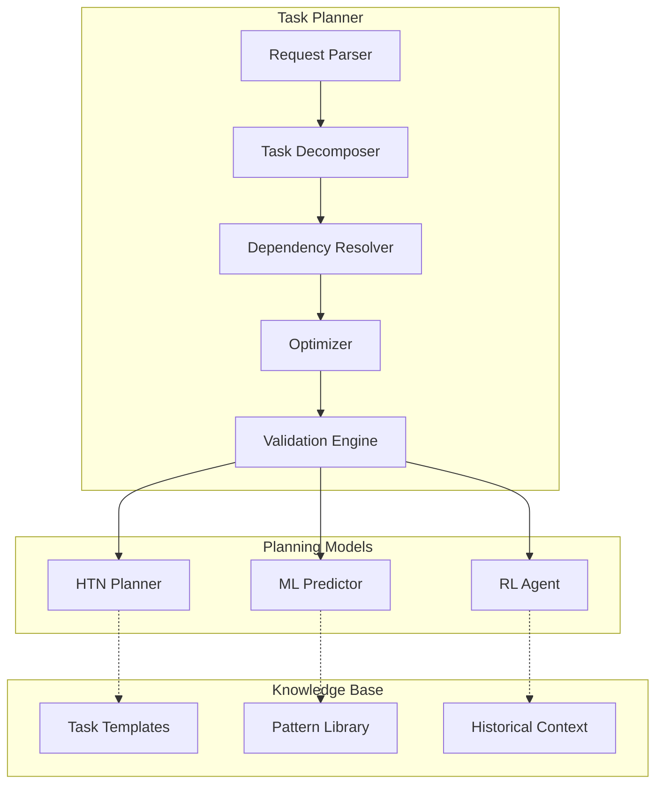
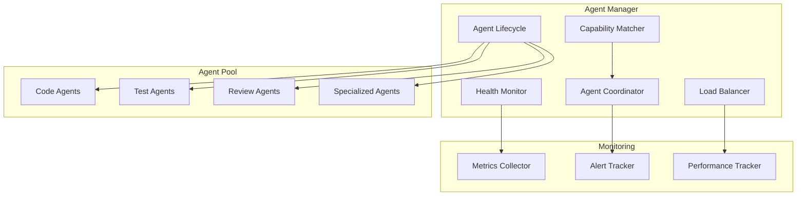
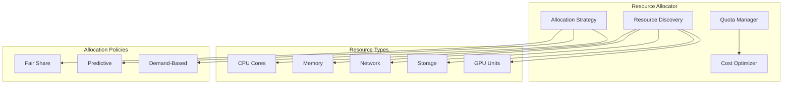
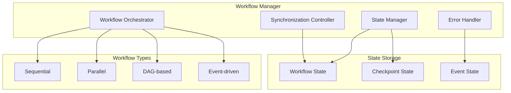

# Orchestration Layer Architecture

## Overview

The Orchestration Layer serves as the brain of MAOS, responsible for high-level planning, agent coordination, and resource management. It transforms complex user requests into executable workflows distributed across multiple agents.

## Components

### 1. Task Planner

#### Responsibilities
- **Request Analysis**: Parse and understand user requirements
- **Task Decomposition**: Break complex tasks into manageable subtasks
- **Dependency Resolution**: Identify task dependencies and execution order
- **Optimization**: Find optimal execution paths and resource usage

#### Architecture


#### Key Features
- **Hierarchical Task Networks (HTN)**: Structured task decomposition
- **Machine Learning Predictions**: Resource and time estimation
- **Reinforcement Learning**: Continuous optimization of planning strategies
- **Template-Based Planning**: Reusable task patterns

### 2. Agent Manager

#### Responsibilities
- **Agent Lifecycle**: Spawn, monitor, and terminate agents
- **Capability Matching**: Match tasks to agent capabilities
- **Health Monitoring**: Track agent health and performance
- **Load Balancing**: Distribute work across available agents

#### Architecture


#### Agent Types
- **Claude Code Agents**: Core development agents
- **Specialized Agents**: Domain-specific experts
- **Utility Agents**: System and support functions
- **Hybrid Agents**: Multi-capability agents

### 3. Resource Allocator

#### Responsibilities
- **Resource Discovery**: Identify available computational resources
- **Allocation Strategy**: Optimize resource distribution
- **Quota Management**: Enforce resource limits and policies
- **Cost Optimization**: Balance performance with resource costs

#### Architecture


### 4. Workflow Manager

#### Responsibilities
- **Workflow Orchestration**: Execute complex multi-agent workflows
- **State Management**: Track workflow progress and state
- **Error Handling**: Manage failures and recovery
- **Coordination**: Synchronize agent interactions

#### Architecture


## APIs and Interfaces

### Task Planner API
```typescript
interface TaskPlannerAPI {
  planTask(request: TaskRequest): Promise<ExecutionPlan>;
  validatePlan(plan: ExecutionPlan): Promise<ValidationResult>;
  optimizePlan(plan: ExecutionPlan): Promise<ExecutionPlan>;
  estimateResources(plan: ExecutionPlan): Promise<ResourceEstimate>;
}
```

### Agent Manager API
```typescript
interface AgentManagerAPI {
  spawnAgent(type: AgentType, config: AgentConfig): Promise<AgentInstance>;
  terminateAgent(agentId: string): Promise<void>;
  getAgentHealth(agentId?: string): Promise<HealthStatus>;
  matchCapabilities(requirements: Capability[]): Promise<AgentInstance[]>;
}
```

### Resource Allocator API
```typescript
interface ResourceAllocatorAPI {
  allocateResources(request: ResourceRequest): Promise<ResourceAllocation>;
  releaseResources(allocationId: string): Promise<void>;
  getResourceUsage(): Promise<ResourceUsage>;
  setQuotas(quotas: ResourceQuotas): Promise<void>;
}
```

### Workflow Manager API
```typescript
interface WorkflowManagerAPI {
  startWorkflow(plan: ExecutionPlan): Promise<WorkflowInstance>;
  pauseWorkflow(workflowId: string): Promise<void>;
  resumeWorkflow(workflowId: string): Promise<void>;
  getWorkflowStatus(workflowId: string): Promise<WorkflowStatus>;
}
```

## Data Models

### Task Request
```typescript
interface TaskRequest {
  id: string;
  type: TaskType;
  description: string;
  requirements: Requirement[];
  constraints: Constraint[];
  priority: Priority;
  deadline?: Date;
  context?: Record<string, any>;
}
```

### Execution Plan
```typescript
interface ExecutionPlan {
  id: string;
  tasks: Task[];
  dependencies: Dependency[];
  resourceRequirements: ResourceRequirement[];
  estimatedDuration: number;
  estimatedCost: number;
}
```

### Agent Instance
```typescript
interface AgentInstance {
  id: string;
  type: AgentType;
  capabilities: Capability[];
  status: AgentStatus;
  health: HealthMetrics;
  allocation: ResourceAllocation;
  workload: Task[];
}
```

## Performance Considerations

### Scalability Patterns
- **Horizontal Partitioning**: Distribute orchestration by domain
- **Caching**: Cache frequently used plans and templates
- **Lazy Loading**: Load resources on demand
- **Connection Pooling**: Reuse connections to reduce overhead

### Optimization Strategies
- **Plan Caching**: Reuse similar execution plans
- **Predictive Scaling**: Scale resources based on predicted load
- **Batch Processing**: Group similar operations
- **Circuit Breakers**: Prevent cascade failures