# MAOS System Architecture Documentation

## Overview

This directory contains comprehensive architectural documentation for the Multi-Agent Orchestration System (MAOS). The architecture is designed to support 20+ concurrent agents with enterprise-grade reliability, security, and scalability.

## Architecture Philosophy

MAOS follows these core architectural principles:
- **Layered Architecture**: Clear separation of concerns across 4 main layers
- **Microservices**: Distributed services with independent scaling
- **Event-Driven**: Asynchronous communication with event sourcing
- **Zero-Trust Security**: Security at every layer with encryption and access controls
- **Cloud-Native**: Container-based deployment with Kubernetes orchestration
- **Observability**: Comprehensive monitoring, logging, and tracing

## Documentation Structure

### 📋 Core Architecture Documents

| Document | Description |
|----------|-------------|
| [**System Architecture Overview**](system-architecture-overview.md) | High-level system design and component relationships |
| [**Orchestration Layer**](orchestration-layer.md) | Task planning, agent management, and resource allocation |
| [**Execution Layer**](execution-layer.md) | Claude Code agent pool and task execution engine |
| [**Communication Layer**](communication-layer.md) | Message bus, event processing, and consensus protocols |
| [**Storage Layer**](storage-layer.md) | Persistent storage, shared memory, and data management |

### 🛠️ Implementation Specifications

| Document | Description |
|----------|-------------|
| [**API Specifications**](apis/api-specifications.md) | REST, GraphQL, gRPC, and WebSocket API definitions |
| [**Integration Patterns**](integration-patterns.md) | Component interaction patterns and data flows |
| [**Fault Tolerance**](fault-tolerance.md) | Resilience patterns, error handling, and recovery mechanisms |

### 🚀 Deployment and Operations

| Document | Description |
|----------|-------------|
| [**Scalability Architecture**](scalability-architecture.md) | Horizontal scaling strategy for 20+ concurrent agents |
| [**Deployment Architecture**](deployment-architecture.md) | Container strategy, Kubernetes deployment, and CI/CD |
| [**Security Architecture**](security/security-architecture.md) | Zero-trust security, encryption, and access controls |

### 📝 Decision Records

| Document | Description |
|----------|-------------|
| [**Architecture Decision Records**](architecture-decision-records.md) | Key architectural decisions with context and rationale |

## System Architecture Summary

```mermaid
graph TB
    subgraph "MAOS Architecture Overview"
        subgraph "Client Layer"
            CLI[Claude Code CLI]
            WEB[Web Interface]
            API[External APIs]
        end
        
        subgraph "Orchestration Layer"
            TP[Task Planner]
            AM[Agent Manager]
            RA[Resource Allocator]
            WM[Workflow Manager]
        end
        
        subgraph "Execution Layer"
            CAP[Claude Code Agent Pool]
            SE[Specialized Engines]
            RT[Runtime Manager]
        end
        
        subgraph "Communication Layer"
            MB[Message Bus]
            ED[Event Dispatcher]
            CM[Consensus Manager]
            LB[Load Balancer]
        end
        
        subgraph "Storage Layer"
            SM[Shared Memory Store]
            CP[Checkpoint Manager]
            AL[Audit Logs]
            MS[Metadata Store]
        end
    end
    
    CLI --> TP
    WEB --> TP
    API --> TP
    
    TP --> AM
    AM --> RA
    RA --> WM
    
    WM --> CAP
    CAP --> SE
    SE --> RT
    
    RT --> MB
    MB --> ED
    ED --> CM
    CM --> LB
    
    LB --> SM
    SM --> CP
    CP --> AL
    AL --> MS
```

## Key Architectural Decisions

### Technology Stack
- **Container Platform**: Docker + Kubernetes
- **Message Bus**: Apache Kafka + Redis
- **Database**: PostgreSQL + Redis Cache
- **API Gateway**: Istio Service Mesh
- **Monitoring**: OpenTelemetry + Prometheus + Grafana
- **Security**: JWT + RBAC/ABAC + TLS 1.3

### Deployment Strategy
- **Blue-Green Deployments**: Zero-downtime deployments
- **Multi-Environment**: Dev, Staging, Production
- **Auto-Scaling**: HPA for 5-50 agents based on load
- **Multi-Region**: Active-passive for disaster recovery

### Security Model
- **Zero-Trust**: Never trust, always verify
- **Encryption**: AES-256 at rest, TLS 1.3 in transit
- **Access Control**: Multi-layered RBAC and ABAC
- **Audit**: Comprehensive audit logging

## Performance Characteristics

### Scalability Targets
- **Concurrent Agents**: 20+ agents (up to 50 with auto-scaling)
- **Throughput**: 1000+ tasks per minute
- **Response Time**: < 100ms for coordination operations
- **Availability**: 99.9% uptime SLA

### Resource Requirements
- **CPU**: 2-8 cores per orchestration node
- **Memory**: 4-16 GB per orchestration node
- **Storage**: 100GB+ for persistence layer
- **Network**: 1Gbps+ for inter-service communication

## Development Guidelines

### Code Organization
- **Layered Structure**: Follow the 4-layer architecture
- **Service Boundaries**: Clear service contracts and APIs
- **Error Handling**: Comprehensive error handling and recovery
- **Testing**: Unit, integration, and contract testing

### Deployment Process
1. **Development**: Local development with Docker Compose
2. **Integration**: Automated testing in staging environment
3. **Staging**: Full system testing with blue-green deployment
4. **Production**: Monitored rollout with automatic rollback

### Monitoring and Observability
- **Metrics**: Application and infrastructure metrics
- **Logging**: Structured logging with correlation IDs
- **Tracing**: Distributed tracing across all services
- **Alerting**: Proactive alerting on SLA violations

## Getting Started

### For Developers
1. Read the [System Architecture Overview](system-architecture-overview.md)
2. Review the [API Specifications](apis/api-specifications.md)
3. Study the [Integration Patterns](integration-patterns.md)
4. Check the [Architecture Decision Records](architecture-decision-records.md)

### For Operations Teams
1. Study the [Deployment Architecture](deployment-architecture.md)
2. Review the [Security Architecture](security/security-architecture.md)
3. Understand the [Fault Tolerance](fault-tolerance.md) mechanisms
4. Plan for [Scalability](scalability-architecture.md) requirements

### For Product Teams
1. Review the [System Architecture Overview](system-architecture-overview.md)
2. Understand the [API Specifications](apis/api-specifications.md)
3. Study the [Integration Patterns](integration-patterns.md) for client integration

## Contributing to Architecture

### Architecture Review Process
1. **RFC**: Create RFC for significant architectural changes
2. **Review**: Architecture Review Board evaluation
3. **ADR**: Document decision in Architecture Decision Record
4. **Implementation**: Follow approved architectural patterns

### Architecture Principles
- **Consistency**: Follow established patterns and conventions
- **Documentation**: Update architecture docs with changes
- **Backward Compatibility**: Maintain API compatibility
- **Performance**: Consider performance implications
- **Security**: Security-first design approach

## Support and Resources

### Internal Resources
- **Architecture Review Board**: Weekly architecture discussions
- **Technical Documentation**: Confluence space for detailed specs
- **Code Reviews**: Mandatory architecture review for major changes

### External Resources
- **Kubernetes Documentation**: [kubernetes.io](https://kubernetes.io)
- **Apache Kafka**: [kafka.apache.org](https://kafka.apache.org)
- **OpenTelemetry**: [opentelemetry.io](https://opentelemetry.io)
- **PostgreSQL**: [postgresql.org](https://postgresql.org)

## Versioning and Updates

This architectural documentation follows semantic versioning:
- **Major**: Significant architectural changes
- **Minor**: New components or patterns
- **Patch**: Documentation improvements and clarifications

### Current Version: 1.0.0
- Initial architecture design
- Support for 20+ concurrent agents
- Enterprise security and compliance
- Cloud-native deployment strategy

---

For questions about the architecture, please reach out to the Architecture Review Board or create an issue in the project repository.