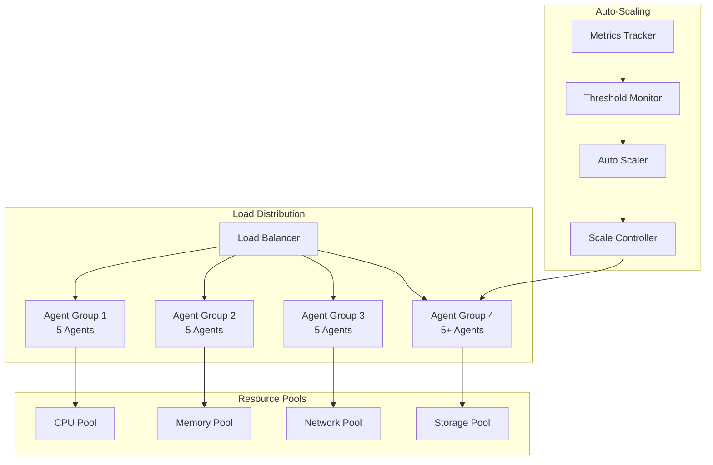

# Scalability Architecture for 20+ Concurrent Agents

## Overview

The MAOS scalability architecture is designed to efficiently handle 20+ concurrent agents with horizontal scaling capabilities, dynamic resource allocation, and performance optimization. The architecture ensures linear scalability while maintaining system stability and resource efficiency.

## Scalability Principles

### 1. Horizontal Scaling Strategy



### 2. Scaling Dimensions

#### Agent Pool Scaling
```typescript
interface AgentPoolConfig {
  name: string;
  agentType: AgentType;
  minSize: number;
  maxSize: number;
  targetUtilization: number;
  scaleUpThreshold: number;
  scaleDownThreshold: number;
  cooldownPeriod: number;
  healthCheckInterval: number;
}

class AgentPoolManager {
  private pools = new Map<string, AgentPool>();
  private scalingDecisions = new Map<string, ScalingDecision[]>();
  
  constructor(private resourceManager: ResourceManager) {}
  
  async scalePool(
    poolName: string, 
    targetSize: number, 
    reason: ScalingReason
  ): Promise<ScalingResult> {
    const pool = this.pools.get(poolName);
    if (!pool) {
      throw new Error(`Pool ${poolName} not found`);
    }
    
    const currentSize = pool.getCurrentSize();
    const deltaSize = targetSize - currentSize;
    
    if (deltaSize === 0) {
      return { success: true, message: 'No scaling needed' };
    }
    
    const scalingDecision: ScalingDecision = {
      poolName,
      currentSize,
      targetSize,
      deltaSize,
      reason,
      timestamp: new Date(),
      status: 'pending'
    };
    
    this.recordScalingDecision(poolName, scalingDecision);
    
    try {
      if (deltaSize > 0) {
        await this.scaleUp(pool, deltaSize, scalingDecision);
      } else {
        await this.scaleDown(pool, Math.abs(deltaSize), scalingDecision);
      }
      
      scalingDecision.status = 'completed';
      return { success: true, decision: scalingDecision };
    } catch (error) {
      scalingDecision.status = 'failed';
      scalingDecision.error = error.message;
      return { success: false, error: error.message, decision: scalingDecision };
    }
  }
  
  private async scaleUp(
    pool: AgentPool, 
    count: number, 
    decision: ScalingDecision
  ): Promise<void> {
    const requiredResources = this.calculateRequiredResources(pool.config.agentType, count);
    
    // Check resource availability
    const resourceAvailability = await this.resourceManager.checkAvailability(requiredResources);
    if (!resourceAvailability.available) {
      // Attempt resource optimization
      await this.optimizeResourceUsage();
      
      // Recheck availability
      const retryAvailability = await this.resourceManager.checkAvailability(requiredResources);
      if (!retryAvailability.available) {
        throw new Error('Insufficient resources for scaling up');
      }
    }
    
    // Spawn new agents in parallel
    const spawnPromises = Array.from({ length: count }, (_, index) => 
      this.spawnAgent(pool, `${pool.name}-agent-${pool.getCurrentSize() + index + 1}`)
    );
    
    const results = await Promise.allSettled(spawnPromises);
    const successful = results.filter(r => r.status === 'fulfilled').length;
    const failed = results.filter(r => r.status === 'rejected').length;
    
    if (failed > 0) {
      this.logger.warn('Some agents failed to spawn during scale up', {
        poolName: pool.name,
        successful,
        failed,
        errors: results
          .filter(r => r.status === 'rejected')
          .map(r => (r as PromiseRejectedResult).reason.message)
      });
    }
    
    decision.actualDelta = successful;
    pool.updateSize(pool.getCurrentSize() + successful);
  }
  
  private async scaleDown(
    pool: AgentPool, 
    count: number, 
    decision: ScalingDecision
  ): Promise<void> {
    // Select agents for termination (prefer idle agents)
    const candidates = await pool.selectTerminationCandidates(count);
    
    // Gracefully terminate selected agents
    const terminationPromises = candidates.map(agent => 
      this.terminateAgent(agent, { graceful: true, timeout: 30000 })
    );
    
    const results = await Promise.allSettled(terminationPromises);
    const successful = results.filter(r => r.status === 'fulfilled').length;
    
    decision.actualDelta = -successful;
    pool.updateSize(pool.getCurrentSize() - successful);
    
    // Release freed resources
    const freedResources = this.calculateRequiredResources(pool.config.agentType, successful);
    await this.resourceManager.releaseResources(freedResources);
  }
}
```

#### Resource Scaling
```typescript
interface ResourceScalingConfig {
  cpu: ScalableResource;
  memory: ScalableResource;
  storage: ScalableResource;
  network: ScalableResource;
}

interface ScalableResource {
  min: number;
  max: number;
  step: number;
  utilization: {
    target: number;
    scaleUpThreshold: number;
    scaleDownThreshold: number;
  };
  cooldown: {
    scaleUp: number;
    scaleDown: number;
  };
}

class ResourceScaler {
  private scalingHistory = new Map<string, ResourceScalingEvent[]>();
  
  async scaleResources(
    component: string, 
    metrics: ResourceMetrics
  ): Promise<ResourceScalingDecision> {
    const config = await this.getResourceConfig(component);
    const decisions: ResourceAllocationChange[] = [];
    
    // CPU Scaling
    if (this.shouldScaleCPU(metrics.cpu, config.cpu)) {
      const cpuDecision = this.calculateCPUScaling(metrics.cpu, config.cpu);
      decisions.push(cpuDecision);
    }
    
    // Memory Scaling
    if (this.shouldScaleMemory(metrics.memory, config.memory)) {
      const memoryDecision = this.calculateMemoryScaling(metrics.memory, config.memory);
      decisions.push(memoryDecision);
    }
    
    // Storage Scaling
    if (this.shouldScaleStorage(metrics.storage, config.storage)) {
      const storageDecision = this.calculateStorageScaling(metrics.storage, config.storage);
      decisions.push(storageDecision);
    }
    
    // Network Scaling
    if (this.shouldScaleNetwork(metrics.network, config.network)) {
      const networkDecision = this.calculateNetworkScaling(metrics.network, config.network);
      decisions.push(networkDecision);
    }
    
    if (decisions.length === 0) {
      return { scaleNeeded: false, message: 'No scaling required' };
    }
    
    // Execute scaling decisions
    const results = await Promise.allSettled(
      decisions.map(decision => this.executeResourceScaling(component, decision))
    );
    
    const successful = results.filter(r => r.status === 'fulfilled').length;
    const failed = results.filter(r => r.status === 'rejected').length;
    
    return {
      scaleNeeded: true,
      decisions,
      successful,
      failed,
      message: `Resource scaling completed: ${successful} successful, ${failed} failed`
    };
  }
  
  private shouldScaleCPU(cpuMetrics: CPUMetrics, config: ScalableResource): boolean {
    const utilization = cpuMetrics.utilization;
    const lastScaling = this.getLastScaling('cpu');
    
    if (!lastScaling || this.isCooldownExpired(lastScaling, config.cooldown)) {
      return utilization > config.utilization.scaleUpThreshold || 
             utilization < config.utilization.scaleDownThreshold;
    }
    
    return false;
  }
  
  private calculateCPUScaling(
    cpuMetrics: CPUMetrics, 
    config: ScalableResource
  ): ResourceAllocationChange {
    const currentAllocation = cpuMetrics.allocated;
    const utilization = cpuMetrics.utilization;
    
    let targetAllocation: number;
    
    if (utilization > config.utilization.scaleUpThreshold) {
      // Scale up
      targetAllocation = Math.min(
        currentAllocation + config.step,
        config.max
      );
    } else {
      // Scale down
      targetAllocation = Math.max(
        currentAllocation - config.step,
        config.min
      );
    }
    
    return {
      resourceType: 'cpu',
      currentAllocation,
      targetAllocation,
      delta: targetAllocation - currentAllocation,
      reason: utilization > config.utilization.target ? 'high_utilization' : 'low_utilization'
    };
  }
}
```

### 3. Load Balancing and Distribution

#### Intelligent Load Balancer
```typescript
interface LoadBalancingStrategy {
  name: string;
  weight: number;
  selectAgent(agents: AgentInstance[], task: Task): AgentInstance;
}

class WeightedRoundRobinStrategy implements LoadBalancingStrategy {
  name = 'weighted_round_robin';
  weight = 1.0;
  private currentWeights = new Map<string, number>();
  
  selectAgent(agents: AgentInstance[], task: Task): AgentInstance {
    let selected: AgentInstance | null = null;
    let maxCurrentWeight = -1;
    
    const totalWeight = agents.reduce((sum, agent) => sum + agent.weight, 0);
    
    for (const agent of agents) {
      const currentWeight = this.currentWeights.get(agent.id) || 0;
      const newWeight = currentWeight + agent.weight;
      
      this.currentWeights.set(agent.id, newWeight);
      
      if (newWeight > maxCurrentWeight) {
        maxCurrentWeight = newWeight;
        selected = agent;
      }
    }
    
    if (selected) {
      const selectedWeight = this.currentWeights.get(selected.id)! - totalWeight;
      this.currentWeights.set(selected.id, selectedWeight);
    }
    
    return selected!;
  }
}

class LeastConnectionsStrategy implements LoadBalancingStrategy {
  name = 'least_connections';
  weight = 1.5;
  
  selectAgent(agents: AgentInstance[], task: Task): AgentInstance {
    return agents.reduce((leastBusy, current) => {
      const currentLoad = current.activeConnections / current.maxConnections;
      const leastBusyLoad = leastBusy.activeConnections / leastBusy.maxConnections;
      
      return currentLoad < leastBusyLoad ? current : leastBusy;
    });
  }
}

class ResourceAwareStrategy implements LoadBalancingStrategy {
  name = 'resource_aware';
  weight = 2.0;
  
  selectAgent(agents: AgentInstance[], task: Task): AgentInstance {
    const taskResources = this.estimateTaskResources(task);
    
    return agents
      .filter(agent => this.canHandleTask(agent, taskResources))
      .sort((a, b) => {
        const aScore = this.calculateResourceScore(a, taskResources);
        const bScore = this.calculateResourceScore(b, taskResources);
        return bScore - aScore; // Higher score is better
      })[0];
  }
  
  private calculateResourceScore(
    agent: AgentInstance, 
    requiredResources: ResourceRequirements
  ): number {
    const cpuScore = (agent.resources.cpu - agent.usage.cpu) / requiredResources.cpu;
    const memoryScore = (agent.resources.memory - agent.usage.memory) / requiredResources.memory;
    const utilization = agent.usage.cpu / agent.resources.cpu;
    
    // Prefer agents with low utilization but sufficient resources
    return (cpuScore + memoryScore) * (1 - utilization);
  }
}

class AdaptiveLoadBalancer {
  private strategies: LoadBalancingStrategy[] = [
    new WeightedRoundRobinStrategy(),
    new LeastConnectionsStrategy(),
    new ResourceAwareStrategy()
  ];
  
  private performanceHistory = new Map<string, PerformanceMetric[]>();
  private strategyWeights = new Map<string, number>();
  
  constructor() {
    this.initializeStrategyWeights();
  }
  
  selectAgent(agents: AgentInstance[], task: Task): AgentInstance {
    const availableAgents = agents.filter(agent => 
      agent.status === 'idle' || agent.status === 'ready'
    );
    
    if (availableAgents.length === 0) {
      throw new Error('No available agents');
    }
    
    if (availableAgents.length === 1) {
      return availableAgents[0];
    }
    
    // Use the best performing strategy
    const bestStrategy = this.getBestStrategy();
    return bestStrategy.selectAgent(availableAgents, task);
  }
  
  private getBestStrategy(): LoadBalancingStrategy {
    let bestStrategy = this.strategies[0];
    let bestScore = this.strategyWeights.get(bestStrategy.name) || 0;
    
    for (const strategy of this.strategies) {
      const score = this.strategyWeights.get(strategy.name) || 0;
      if (score > bestScore) {
        bestScore = score;
        bestStrategy = strategy;
      }
    }
    
    return bestStrategy;
  }
  
  recordPerformance(
    strategyName: string, 
    metric: PerformanceMetric
  ): void {
    if (!this.performanceHistory.has(strategyName)) {
      this.performanceHistory.set(strategyName, []);
    }
    
    const history = this.performanceHistory.get(strategyName)!;
    history.push(metric);
    
    // Keep only last 1000 metrics
    if (history.length > 1000) {
      history.splice(0, history.length - 1000);
    }
    
    // Update strategy weight based on performance
    this.updateStrategyWeight(strategyName);
  }
  
  private updateStrategyWeight(strategyName: string): void {
    const history = this.performanceHistory.get(strategyName);
    if (!history || history.length < 10) return;
    
    const recentMetrics = history.slice(-100); // Last 100 metrics
    const avgResponseTime = recentMetrics.reduce((sum, m) => sum + m.responseTime, 0) / recentMetrics.length;
    const avgThroughput = recentMetrics.reduce((sum, m) => sum + m.throughput, 0) / recentMetrics.length;
    const errorRate = recentMetrics.filter(m => m.error).length / recentMetrics.length;
    
    // Calculate score (lower response time, higher throughput, lower error rate = better)
    const responseTimeScore = 1000 / Math.max(avgResponseTime, 1);
    const throughputScore = avgThroughput;
    const errorScore = 1 - errorRate;
    
    const overallScore = (responseTimeScore + throughputScore + errorScore) / 3;
    this.strategyWeights.set(strategyName, overallScore);
  }
}
```

### 4. Task Distribution and Queuing

#### Distributed Task Queue
```typescript
interface TaskQueue {
  enqueue(task: Task): Promise<void>;
  dequeue(agentId?: string): Promise<Task | null>;
  peek(): Promise<Task | null>;
  size(): Promise<number>;
  clear(): Promise<void>;
}

class PriorityTaskQueue implements TaskQueue {
  private queues = new Map<Priority, Task[]>();
  private waitingAgents = new Set<string>();
  
  constructor() {
    this.queues.set('critical', []);
    this.queues.set('high', []);
    this.queues.set('medium', []);
    this.queues.set('low', []);
  }
  
  async enqueue(task: Task): Promise<void> {
    const priorityQueue = this.queues.get(task.priority)!;
    
    // Insert task in the correct position based on deadline and creation time
    let insertIndex = priorityQueue.length;
    for (let i = 0; i < priorityQueue.length; i++) {
      if (this.shouldInsertBefore(task, priorityQueue[i])) {
        insertIndex = i;
        break;
      }
    }
    
    priorityQueue.splice(insertIndex, 0, task);
    
    // Notify waiting agents
    this.notifyWaitingAgents();
  }
  
  async dequeue(agentId?: string): Promise<Task | null> {
    // Check queues in priority order
    const priorities: Priority[] = ['critical', 'high', 'medium', 'low'];
    
    for (const priority of priorities) {
      const queue = this.queues.get(priority)!;
      
      if (agentId) {
        // Find task suitable for specific agent
        for (let i = 0; i < queue.length; i++) {
          if (await this.isTaskSuitableForAgent(queue[i], agentId)) {
            return queue.splice(i, 1)[0];
          }
        }
      } else {
        // Return first task in priority order
        if (queue.length > 0) {
          return queue.shift()!;
        }
      }
    }
    
    // No tasks available, add agent to waiting list
    if (agentId) {
      this.waitingAgents.add(agentId);
    }
    
    return null;
  }
  
  async peek(): Promise<Task | null> {
    const priorities: Priority[] = ['critical', 'high', 'medium', 'low'];
    
    for (const priority of priorities) {
      const queue = this.queues.get(priority)!;
      if (queue.length > 0) {
        return queue[0];
      }
    }
    
    return null;
  }
  
  async size(): Promise<number> {
    return Array.from(this.queues.values())
      .reduce((total, queue) => total + queue.length, 0);
  }
  
  private shouldInsertBefore(newTask: Task, existingTask: Task): boolean {
    // First sort by deadline (if present)
    if (newTask.deadline && existingTask.deadline) {
      const newDeadline = new Date(newTask.deadline).getTime();
      const existingDeadline = new Date(existingTask.deadline).getTime();
      
      if (newDeadline !== existingDeadline) {
        return newDeadline < existingDeadline;
      }
    } else if (newTask.deadline && !existingTask.deadline) {
      return true; // Tasks with deadlines get priority
    } else if (!newTask.deadline && existingTask.deadline) {
      return false;
    }
    
    // Then sort by creation time (FIFO within same deadline)
    return new Date(newTask.createdAt).getTime() < new Date(existingTask.createdAt).getTime();
  }
  
  private async isTaskSuitableForAgent(task: Task, agentId: string): Promise<boolean> {
    const agent = await this.agentService.getAgent(agentId);
    if (!agent) return false;
    
    // Check if agent has required capabilities
    const hasCapabilities = task.requirements.every(req => 
      agent.capabilities.includes(req.capability)
    );
    
    // Check if agent has sufficient resources
    const hasResources = await this.resourceManager.canAllocate(
      agentId, 
      task.resourceRequirements
    );
    
    return hasCapabilities && hasResources;
  }
  
  private notifyWaitingAgents(): void {
    // Notify all waiting agents that new tasks are available
    for (const agentId of this.waitingAgents) {
      this.eventEmitter.emit('task.available', { agentId });
    }
    this.waitingAgents.clear();
  }
}
```

#### Work Stealing Algorithm
```typescript
class WorkStealingTaskDistributor {
  private localQueues = new Map<string, Task[]>();
  private globalQueue: Task[] = [];
  private stealingRatio = 0.5; // Steal half of the victim's tasks
  private stealingThreshold = 2; // Minimum tasks needed to steal
  
  async distributeTask(task: Task): Promise<void> {
    // Try to assign to least loaded agent
    const agents = await this.getActiveAgents();
    const leastLoaded = this.findLeastLoadedAgent(agents);
    
    if (leastLoaded) {
      await this.assignTaskToAgent(task, leastLoaded.id);
    } else {
      // All agents are busy, add to global queue
      this.globalQueue.push(task);
    }
  }
  
  async stealWork(thiefAgentId: string): Promise<Task | null> {
    // First try global queue
    if (this.globalQueue.length > 0) {
      return this.globalQueue.shift()!;
    }
    
    // Find victim with most work
    const victim = this.findVictimAgent(thiefAgentId);
    if (!victim) {
      return null;
    }
    
    const victimQueue = this.localQueues.get(victim)!;
    const tasksToSteal = Math.floor(victimQueue.length * this.stealingRatio);
    
    if (tasksToSteal > 0) {
      // Steal from the end of victim's queue (oldest tasks)
      const stolenTasks = victimQueue.splice(-tasksToSteal, tasksToSteal);
      
      // Take one task for immediate execution
      const taskToExecute = stolenTasks.pop()!;
      
      // Put remaining tasks in thief's queue
      if (stolenTasks.length > 0) {
        const thiefQueue = this.localQueues.get(thiefAgentId) || [];
        thiefQueue.push(...stolenTasks);
        this.localQueues.set(thiefAgentId, thiefQueue);
      }
      
      this.logger.debug('Work stealing completed', {
        thief: thiefAgentId,
        victim,
        stolenTasks: tasksToSteal,
        immediateTask: taskToExecute.id
      });
      
      return taskToExecute;
    }
    
    return null;
  }
  
  private findVictimAgent(thiefAgentId: string): string | null {
    let bestVictim: string | null = null;
    let maxTasks = this.stealingThreshold;
    
    for (const [agentId, queue] of this.localQueues) {
      if (agentId !== thiefAgentId && queue.length > maxTasks) {
        maxTasks = queue.length;
        bestVictim = agentId;
      }
    }
    
    return bestVictim;
  }
  
  private findLeastLoadedAgent(agents: AgentInstance[]): AgentInstance | null {
    if (agents.length === 0) return null;
    
    return agents.reduce((least, current) => {
      const leastLoad = this.getAgentLoad(least.id);
      const currentLoad = this.getAgentLoad(current.id);
      
      return currentLoad < leastLoad ? current : least;
    });
  }
  
  private getAgentLoad(agentId: string): number {
    const queue = this.localQueues.get(agentId) || [];
    return queue.length;
  }
  
  async assignTaskToAgent(task: Task, agentId: string): Promise<void> {
    if (!this.localQueues.has(agentId)) {
      this.localQueues.set(agentId, []);
    }
    
    const queue = this.localQueues.get(agentId)!;
    queue.push(task);
    
    // Notify agent of new task
    this.eventEmitter.emit('task.assigned', {
      taskId: task.id,
      agentId
    });
  }
  
  async getNextTask(agentId: string): Promise<Task | null> {
    const queue = this.localQueues.get(agentId) || [];
    
    if (queue.length > 0) {
      return queue.shift()!;
    }
    
    // No local work, try to steal
    return this.stealWork(agentId);
  }
}
```

### 5. Performance Optimization

#### Agent Pool Optimization
```typescript
class AgentPoolOptimizer {
  private optimizationHistory = new Map<string, OptimizationEvent[]>();
  
  async optimizePool(poolName: string): Promise<OptimizationResult> {
    const pool = await this.getPool(poolName);
    const metrics = await this.collectPoolMetrics(pool);
    
    const optimizations: Optimization[] = [];
    
    // CPU Optimization
    const cpuOptimization = await this.optimizeCPUUsage(pool, metrics);
    if (cpuOptimization) optimizations.push(cpuOptimization);
    
    // Memory Optimization
    const memoryOptimization = await this.optimizeMemoryUsage(pool, metrics);
    if (memoryOptimization) optimizations.push(memoryOptimization);
    
    // Task Distribution Optimization
    const distributionOptimization = await this.optimizeTaskDistribution(pool, metrics);
    if (distributionOptimization) optimizations.push(distributionOptimization);
    
    // Agent Specialization Optimization
    const specializationOptimization = await this.optimizeAgentSpecialization(pool, metrics);
    if (specializationOptimization) optimizations.push(specializationOptimization);
    
    if (optimizations.length === 0) {
      return { optimized: false, message: 'Pool is already optimized' };
    }
    
    // Execute optimizations
    const results = await Promise.allSettled(
      optimizations.map(opt => this.executeOptimization(pool, opt))
    );
    
    const successful = results.filter(r => r.status === 'fulfilled').length;
    const failed = results.filter(r => r.status === 'rejected').length;
    
    // Record optimization event
    this.recordOptimizationEvent(poolName, {
      timestamp: new Date(),
      optimizations,
      successful,
      failed,
      metrics: await this.collectPoolMetrics(pool) // Post-optimization metrics
    });
    
    return {
      optimized: true,
      appliedOptimizations: successful,
      failedOptimizations: failed,
      message: `Applied ${successful} optimizations, ${failed} failed`
    };
  }
  
  private async optimizeCPUUsage(
    pool: AgentPool, 
    metrics: PoolMetrics
  ): Promise<Optimization | null> {
    const avgCpuUtil = metrics.agents.reduce((sum, agent) => 
      sum + agent.resources.cpu.utilization, 0) / metrics.agents.length;
    
    const cpuVariance = this.calculateVariance(
      metrics.agents.map(agent => agent.resources.cpu.utilization)
    );
    
    // High variance indicates uneven CPU distribution
    if (cpuVariance > 0.3) {
      const underutilized = metrics.agents.filter(agent => 
        agent.resources.cpu.utilization < 0.5
      );
      const overutilized = metrics.agents.filter(agent => 
        agent.resources.cpu.utilization > 0.9
      );
      
      if (underutilized.length > 0 && overutilized.length > 0) {
        return {
          type: 'cpu_rebalancing',
          description: 'Rebalance CPU allocation across agents',
          actions: [
            {
              type: 'reallocate_cpu',
              parameters: {
                fromAgents: overutilized.map(a => a.id),
                toAgents: underutilized.map(a => a.id),
                amount: 'auto'
              }
            }
          ],
          expectedImpact: 'Improved CPU utilization distribution'
        };
      }
    }
    
    return null;
  }
  
  private async optimizeTaskDistribution(
    pool: AgentPool, 
    metrics: PoolMetrics
  ): Promise<Optimization | null> {
    const taskCounts = metrics.agents.map(agent => agent.activeTasks.length);
    const maxTasks = Math.max(...taskCounts);
    const minTasks = Math.min(...taskCounts);
    const taskImbalance = (maxTasks - minTasks) / Math.max(maxTasks, 1);
    
    // High imbalance indicates poor task distribution
    if (taskImbalance > 0.5) {
      return {
        type: 'task_rebalancing',
        description: 'Improve task distribution across agents',
        actions: [
          {
            type: 'adjust_load_balancing',
            parameters: {
              strategy: 'least_connections',
              weights: 'dynamic'
            }
          },
          {
            type: 'enable_work_stealing',
            parameters: {
              threshold: Math.ceil(maxTasks * 0.7),
              stealingRatio: 0.3
            }
          }
        ],
        expectedImpact: 'More even task distribution and better throughput'
      };
    }
    
    return null;
  }
  
  private async optimizeAgentSpecialization(
    pool: AgentPool, 
    metrics: PoolMetrics
  ): Promise<Optimization | null> {
    const taskTypes = await this.analyzeTaskTypes(pool);
    const agentCapabilities = metrics.agents.map(agent => ({
      id: agent.id,
      capabilities: agent.capabilities,
      performance: agent.performance
    }));
    
    // Find opportunities for specialization
    const specializationOpportunities = this.findSpecializationOpportunities(
      taskTypes, 
      agentCapabilities
    );
    
    if (specializationOpportunities.length > 0) {
      return {
        type: 'agent_specialization',
        description: 'Optimize agent capabilities for common task types',
        actions: specializationOpportunities.map(opp => ({
          type: 'update_agent_capabilities',
          parameters: {
            agentId: opp.agentId,
            addCapabilities: opp.recommendedCapabilities,
            removeCapabilities: opp.unusedCapabilities
          }
        })),
        expectedImpact: 'Better task-agent matching and improved performance'
      };
    }
    
    return null;
  }
  
  private calculateVariance(values: number[]): number {
    const mean = values.reduce((sum, val) => sum + val, 0) / values.length;
    const squaredDiffs = values.map(val => Math.pow(val - mean, 2));
    return squaredDiffs.reduce((sum, diff) => sum + diff, 0) / values.length;
  }
  
  private findSpecializationOpportunities(
    taskTypes: TaskTypeAnalysis[],
    agentCapabilities: AgentCapabilityAnalysis[]
  ): SpecializationOpportunity[] {
    const opportunities: SpecializationOpportunity[] = [];
    
    // Find agents that could benefit from specialization
    for (const agent of agentCapabilities) {
      const mostUsedCapabilities = this.findMostUsedCapabilities(agent);
      const unusedCapabilities = this.findUnusedCapabilities(agent);
      
      if (unusedCapabilities.length > 2 && mostUsedCapabilities.length < agent.capabilities.length * 0.7) {
        opportunities.push({
          agentId: agent.id,
          recommendedCapabilities: mostUsedCapabilities,
          unusedCapabilities,
          potentialImprovement: this.estimatePerformanceImprovement(agent, mostUsedCapabilities)
        });
      }
    }
    
    return opportunities.filter(opp => opp.potentialImprovement > 0.15); // 15% improvement threshold
  }
}