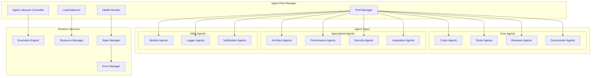
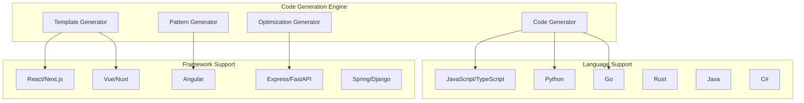
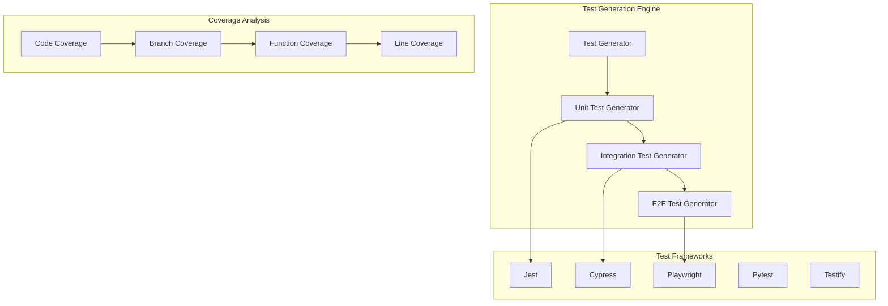
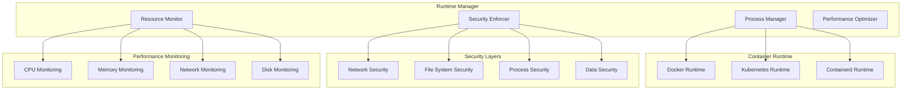
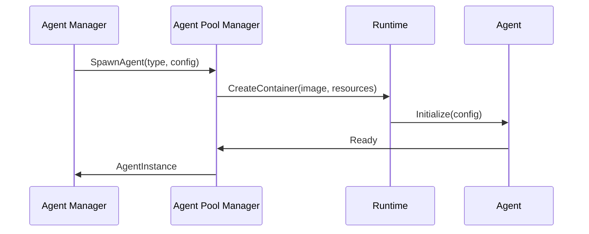
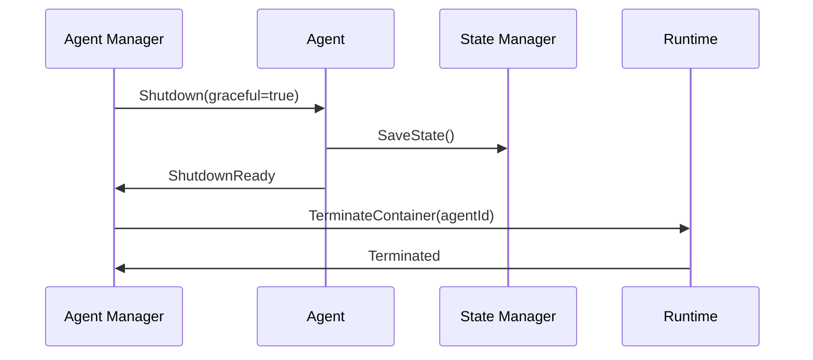

# Execution Layer Architecture

## Overview

The Execution Layer is responsible for the actual execution of tasks through a pool of specialized agents. It manages agent lifecycles, task execution, and provides runtime services for optimal performance and reliability.

## Components

### 1. Claude Code Agent Pool

#### Architecture


#### Agent Specifications

##### Core Development Agents
```typescript
interface CoderAgent {
  capabilities: [
    'code-generation',
    'refactoring',
    'debugging',
    'optimization'
  ];
  languages: string[];
  frameworks: string[];
  maxConcurrentTasks: number;
  specializationLevel: 'generalist' | 'specialist' | 'expert';
}

interface TesterAgent {
  capabilities: [
    'unit-testing',
    'integration-testing',
    'performance-testing',
    'security-testing'
  ];
  testFrameworks: string[];
  coverageTargets: CoverageConfig;
  automationLevel: 'manual' | 'semi-auto' | 'full-auto';
}

interface ReviewerAgent {
  capabilities: [
    'code-review',
    'architecture-review',
    'security-review',
    'performance-review'
  ];
  reviewCriteria: ReviewCriteria[];
  qualityGates: QualityGate[];
  reviewDepth: 'surface' | 'deep' | 'comprehensive';
}
```

##### Specialized Agents
```typescript
interface ArchitectAgent {
  capabilities: [
    'system-design',
    'pattern-recognition',
    'technology-selection',
    'scalability-planning'
  ];
  architecturalPatterns: Pattern[];
  technologyStacks: TechStack[];
  designPrinciples: Principle[];
}

interface PerformanceAgent {
  capabilities: [
    'performance-analysis',
    'bottleneck-identification',
    'optimization-recommendations',
    'benchmarking'
  ];
  profilingTools: Tool[];
  benchmarkSuites: BenchmarkSuite[];
  performanceTargets: PerformanceTarget[];
}
```

### 2. Specialized Engines

#### Code Generation Engine


#### Test Generation Engine


### 3. Runtime Manager

#### Responsibilities
- **Process Management**: Manage agent processes and containers
- **Resource Monitoring**: Track resource usage and optimization
- **Security Enforcement**: Apply security policies and constraints
- **Performance Optimization**: Dynamic optimization of agent performance

#### Architecture


## Agent Lifecycle Management

### 1. Agent Spawning


### 2. Agent Health Management
```typescript
interface HealthCheck {
  type: 'heartbeat' | 'capability' | 'performance' | 'resource';
  interval: number;
  timeout: number;
  retryCount: number;
  escalationPolicy: EscalationPolicy;
}

interface HealthStatus {
  overall: 'healthy' | 'degraded' | 'unhealthy' | 'unknown';
  metrics: {
    cpu: number;
    memory: number;
    responseTime: number;
    errorRate: number;
    taskSuccessRate: number;
  };
  lastCheck: Date;
  issues: HealthIssue[];
}
```

### 3. Agent Termination


## Task Execution Patterns

### 1. Sequential Execution
```typescript
class SequentialExecutor {
  async execute(tasks: Task[]): Promise<ExecutionResult[]> {
    const results: ExecutionResult[] = [];
    for (const task of tasks) {
      const result = await this.executeTask(task);
      results.push(result);
      if (result.status === 'failed' && task.failureStrategy === 'stop') {
        break;
      }
    }
    return results;
  }
}
```

### 2. Parallel Execution
```typescript
class ParallelExecutor {
  async execute(tasks: Task[], maxConcurrency: number): Promise<ExecutionResult[]> {
    const semaphore = new Semaphore(maxConcurrency);
    const promises = tasks.map(task => 
      semaphore.acquire().then(async () => {
        try {
          return await this.executeTask(task);
        } finally {
          semaphore.release();
        }
      })
    );
    return Promise.all(promises);
  }
}
```

### 3. Pipeline Execution
```typescript
class PipelineExecutor {
  async execute(stages: Stage[]): Promise<PipelineResult> {
    let data: any = {};
    for (const stage of stages) {
      const result = await this.executeStage(stage, data);
      data = { ...data, ...result.output };
      if (result.status === 'failed') {
        return { status: 'failed', stage: stage.name, data };
      }
    }
    return { status: 'completed', data };
  }
}
```

## Performance Optimization

### 1. Agent Pool Optimization
- **Dynamic Sizing**: Adjust pool size based on load
- **Warm-up Strategies**: Pre-initialize agents for common tasks
- **Affinity Scheduling**: Schedule tasks to agents with relevant context
- **Resource Sharing**: Share resources between compatible agents

### 2. Task Optimization
- **Task Batching**: Group similar tasks for efficient execution
- **Caching**: Cache intermediate results and compiled code
- **Preemption**: Allow high-priority tasks to interrupt low-priority ones
- **Load Balancing**: Distribute load evenly across agents

### 3. Resource Optimization
```typescript
interface ResourceOptimizer {
  optimizeAllocation(agents: AgentInstance[]): ResourceAllocation[];
  predictResourceNeeds(tasks: Task[]): ResourcePrediction;
  rebalanceResources(): Promise<void>;
  identifyBottlenecks(): BottleneckAnalysis;
}
```

## Error Handling and Recovery

### 1. Error Classification
```typescript
enum ErrorType {
  TRANSIENT = 'transient',          // Temporary, retry possible
  PERMANENT = 'permanent',          // Requires intervention
  RESOURCE = 'resource',            // Resource constraints
  TIMEOUT = 'timeout',              // Time limit exceeded
  VALIDATION = 'validation',        // Input validation failed
  DEPENDENCY = 'dependency',        // External dependency failed
}
```

### 2. Recovery Strategies
```typescript
interface RecoveryStrategy {
  errorType: ErrorType;
  maxRetries: number;
  backoffStrategy: BackoffStrategy;
  fallbackAction: FallbackAction;
  escalationPolicy: EscalationPolicy;
}
```

### 3. Circuit Breaker Pattern
```typescript
class CircuitBreaker {
  private state: 'closed' | 'open' | 'half-open' = 'closed';
  private failureCount = 0;
  private lastFailureTime?: Date;
  
  async execute<T>(operation: () => Promise<T>): Promise<T> {
    if (this.state === 'open') {
      if (this.shouldAttemptReset()) {
        this.state = 'half-open';
      } else {
        throw new Error('Circuit breaker is open');
      }
    }
    
    try {
      const result = await operation();
      this.onSuccess();
      return result;
    } catch (error) {
      this.onFailure();
      throw error;
    }
  }
}
```