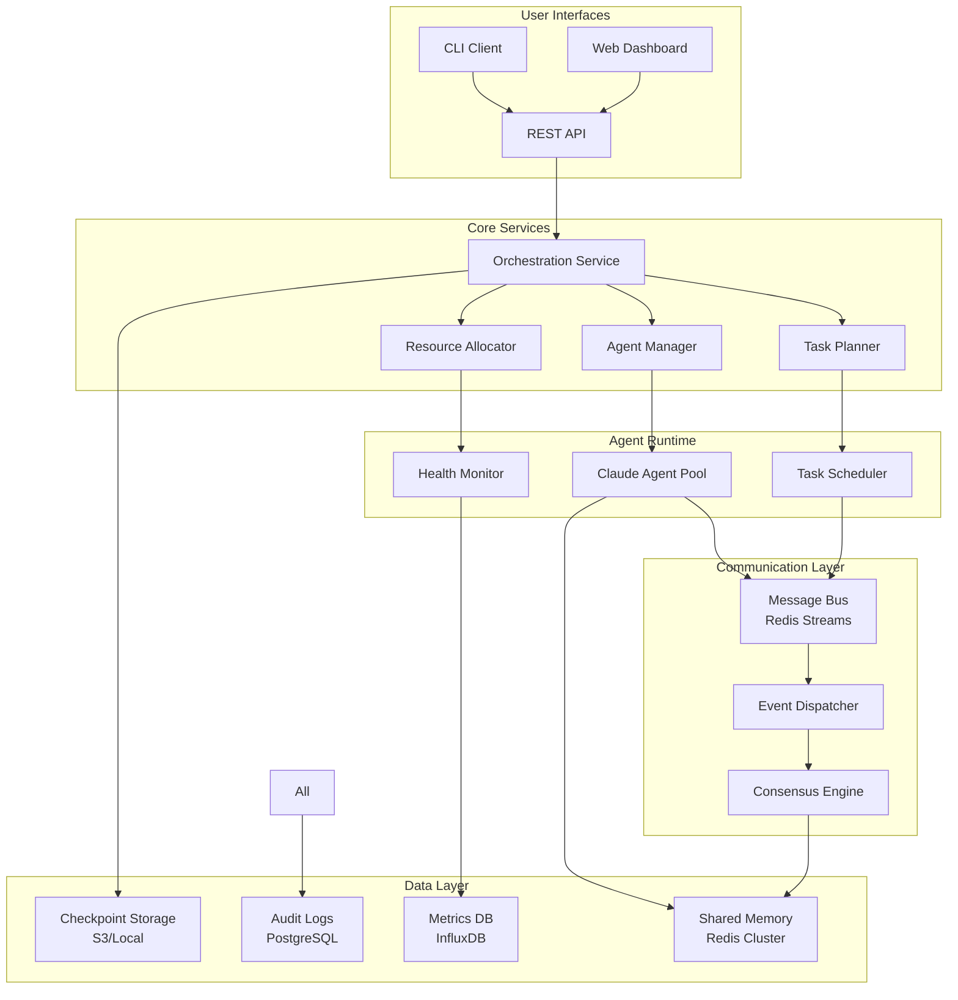
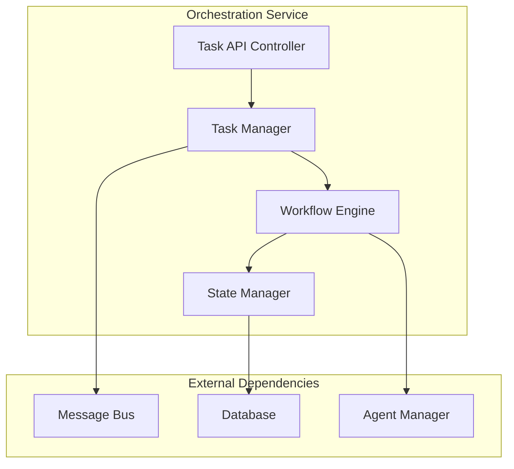
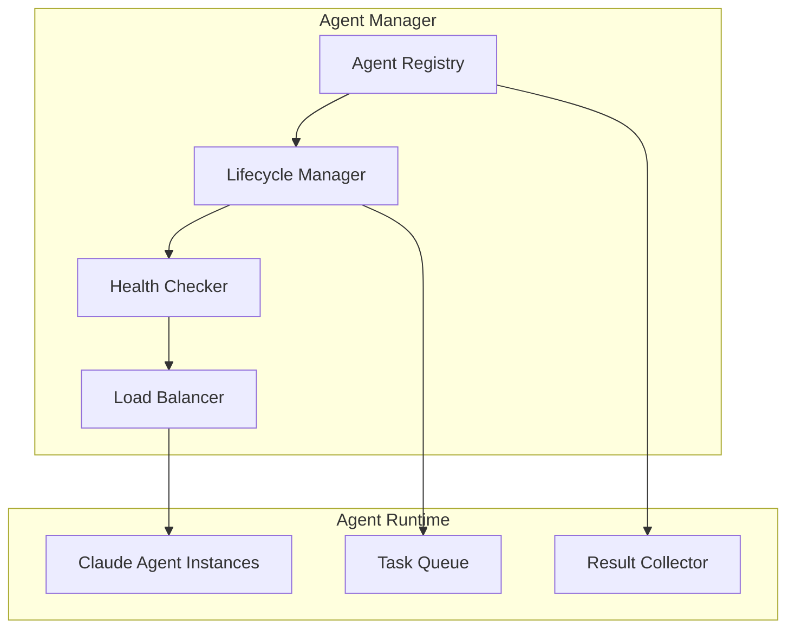
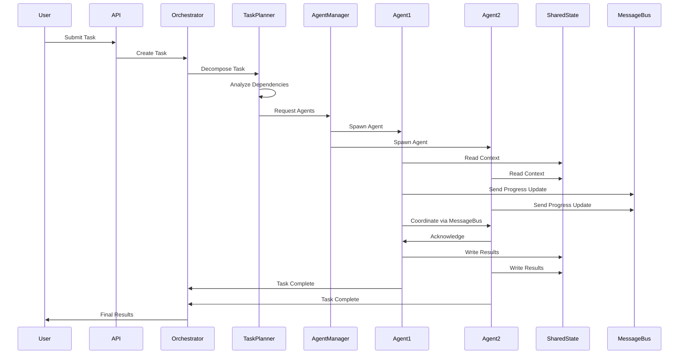
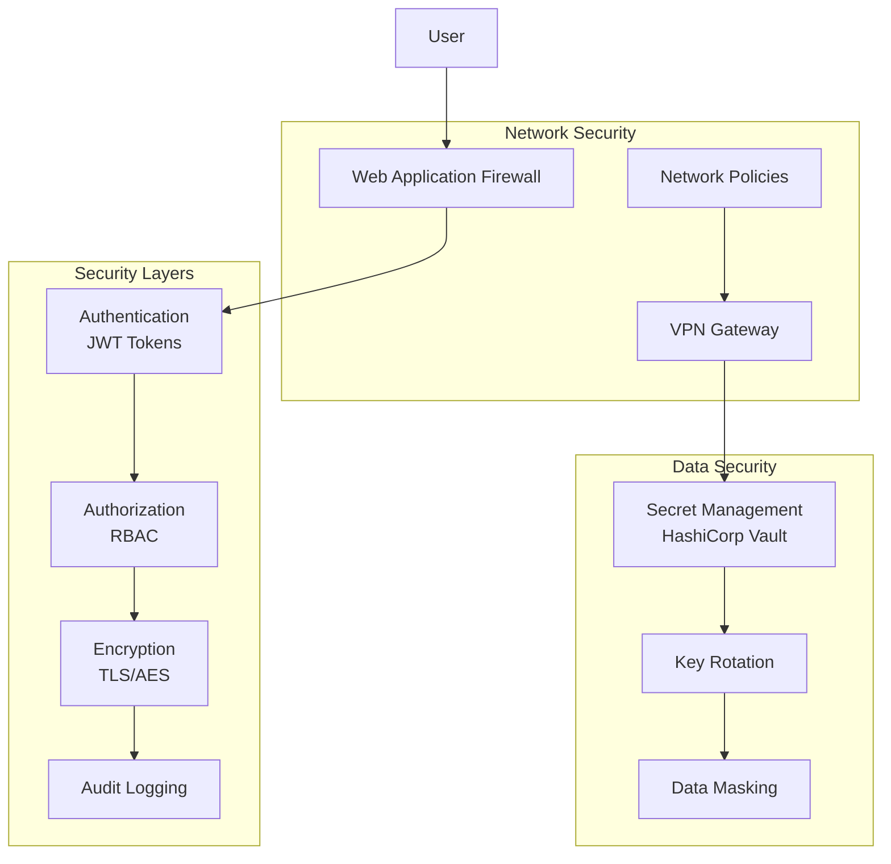
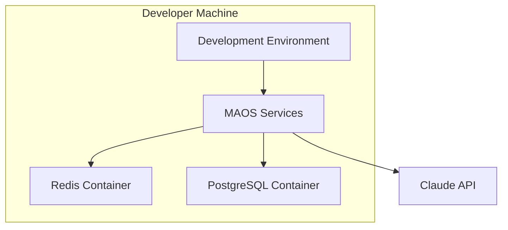
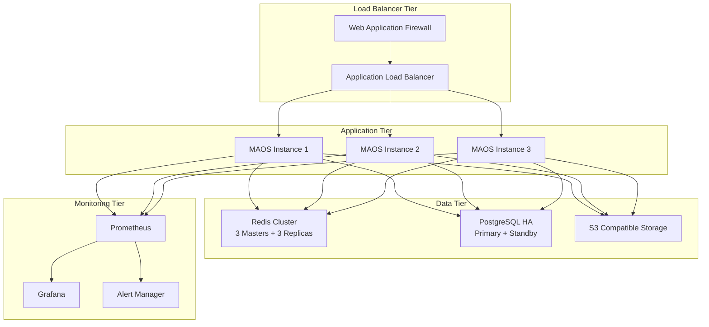

# MAOS System Architecture Overview

## Introduction

The Multi-Agent Orchestration System (MAOS) is designed to enable true parallel execution of AI agents with shared state management, inter-agent communication, and automatic fault tolerance. This document provides a comprehensive overview of the system architecture using the C4 model.

## System Context

```mermaid
graph TB
    subgraph "External Systems"
        Claude[Claude API]
        Storage[Cloud Storage<br/>S3/MinIO]
        Monitor[External Monitoring<br/>DataDog/New Relic]
    end
    
    subgraph "Users"
        Dev[Developers]
        Ops[Operations Team]
        End[End Users]
    end
    
    subgraph "MAOS System"
        System[MAOS Platform]
    end
    
    Dev --> System
    Ops --> System
    End --> System
    
    System --> Claude
    System --> Storage
    System --> Monitor
    
    System --> Dev : Task Results
    System --> Ops : Metrics & Alerts
    System --> End : Completed Work
```

## Container Architecture (Level 2)



## Component Architecture (Level 3)

### Orchestration Service



### Agent Manager



## Data Flow Architecture



## Security Architecture



## Deployment Architecture

### Development Environment



### Production Environment



## Quality Attributes

### Performance Characteristics

| Component | Throughput | Latency (P95) | Scalability |
|-----------|------------|---------------|-------------|
| API Gateway | 10K req/s | <50ms | Horizontal |
| Message Bus | 100K msg/s | <5ms | Horizontal |
| Shared State | 50K ops/s | <2ms | Horizontal |
| Agent Spawn | 100 agents/min | <2s | Vertical |
| Checkpoints | 1 save/30s | <5s | Vertical |

### Reliability Targets

| Metric | Target | Measurement |
|--------|--------|-------------|
| System Uptime | 99.9% | Monthly availability |
| Data Durability | 99.999% | Annual data loss rate |
| Recovery Time | <60s | MTTR from failures |
| Checkpoint RPO | 30s | Maximum data loss |
| Agent Failure Recovery | <10s | Time to restart agent |

### Scalability Limits

| Resource | Current Limit | Future Target |
|----------|---------------|---------------|
| Concurrent Agents | 20 | 100 |
| Shared Memory | 10GB | 100GB |
| Task Queue Depth | 10K | 100K |
| Message Throughput | 100K/s | 1M/s |
| Concurrent Users | 100 | 1K |

## Architecture Decision Records (ADRs)

### ADR-001: Message Bus Technology
**Decision**: Use Redis Streams for message bus
**Rationale**: Native pub/sub, persistence, consumer groups, high performance
**Alternatives**: RabbitMQ, Apache Kafka, Amazon SQS
**Trade-offs**: Single point of failure without clustering

### ADR-002: Shared State Storage
**Decision**: Use Redis Cluster for shared state
**Rationale**: In-memory performance, atomic operations, horizontal scaling
**Alternatives**: PostgreSQL, MongoDB, DynamoDB
**Trade-offs**: Memory cost vs disk-based alternatives

### ADR-003: Agent Runtime
**Decision**: Use Claude Code Task API directly
**Rationale**: Native parallel execution, no simulation overhead
**Alternatives**: Custom agent framework, other LLM APIs
**Trade-offs**: Dependency on specific Claude features

### ADR-004: Checkpoint Storage
**Decision**: Use S3-compatible storage with local caching
**Rationale**: Durability, cost-effectiveness, standard interface
**Alternatives**: Block storage, database BLOB storage
**Trade-offs**: Network latency for checkpoint restoration

## Quality Assurance

### Testability
- Unit tests for all components
- Integration tests for service interactions
- End-to-end tests for complete workflows
- Chaos engineering for failure scenarios
- Performance benchmarks for SLA validation

### Maintainability
- Clear separation of concerns
- Dependency injection for testability
- Configuration externalization
- Comprehensive logging and metrics
- API versioning strategy

### Security
- Principle of least privilege
- Defense in depth
- Secure by default configuration
- Regular security audits
- Automated vulnerability scanning

## Conclusion

The MAOS architecture is designed for high availability, scalability, and maintainability while ensuring true parallel agent execution. The modular design allows for independent scaling of components and provides clear upgrade paths for future enhancements.

Key architectural strengths:
- True parallel execution with measurable performance gains
- Fault-tolerant design with automatic recovery
- Horizontal scalability for growing workloads
- Clear separation of concerns for maintainability
- Comprehensive observability for operations

The architecture supports the primary goal of 3-5x performance improvement through parallel processing while maintaining system reliability and operational simplicity.