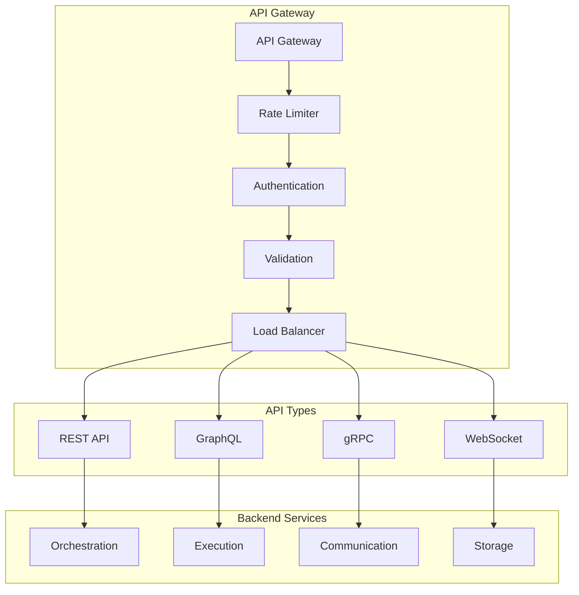

# MAOS API Specifications

## Overview

This document defines the comprehensive API specifications for the Multi-Agent Orchestration System (MAOS), including REST APIs, GraphQL endpoints, gRPC services, and WebSocket connections.

## API Architecture

### 1. API Gateway



### 2. API Standards

#### REST API Principles
- **RESTful Design**: Following REST architectural constraints
- **HTTP Methods**: Proper use of GET, POST, PUT, PATCH, DELETE
- **Status Codes**: Consistent HTTP status codes
- **Content Types**: JSON as primary format with protobuf support
- **Versioning**: URI versioning (v1, v2) with backward compatibility

#### Response Standards
```typescript
interface APIResponse<T> {
  success: boolean;
  data?: T;
  error?: APIError;
  metadata: {
    timestamp: string;
    requestId: string;
    version: string;
    pagination?: PaginationMetadata;
  };
}

interface APIError {
  code: string;
  message: string;
  details?: Record<string, any>;
  stack?: string; // Only in development
}

interface PaginationMetadata {
  page: number;
  pageSize: number;
  totalItems: number;
  totalPages: number;
  hasNext: boolean;
  hasPrevious: boolean;
}
```

## REST API Endpoints

### 1. Orchestration API

#### Task Management
```typescript
// Create Task
POST /api/v1/tasks
Content-Type: application/json
Authorization: Bearer <token>

interface CreateTaskRequest {
  type: TaskType;
  description: string;
  requirements: Requirement[];
  constraints?: Constraint[];
  priority: 'low' | 'medium' | 'high' | 'critical';
  deadline?: string;
  context?: Record<string, any>;
}

interface CreateTaskResponse {
  taskId: string;
  status: TaskStatus;
  estimatedDuration?: number;
  estimatedCost?: number;
}

// Get Task Status
GET /api/v1/tasks/{taskId}
Authorization: Bearer <token>

interface TaskStatusResponse {
  id: string;
  status: TaskStatus;
  progress: number;
  currentStep?: string;
  result?: any;
  error?: string;
  createdAt: string;
  updatedAt: string;
  estimatedCompletion?: string;
}

// List Tasks
GET /api/v1/tasks?status=running&page=1&limit=50
Authorization: Bearer <token>

interface ListTasksResponse {
  tasks: TaskSummary[];
  pagination: PaginationMetadata;
}

// Cancel Task
DELETE /api/v1/tasks/{taskId}
Authorization: Bearer <token>

// Update Task Priority
PATCH /api/v1/tasks/{taskId}/priority
Content-Type: application/json
Authorization: Bearer <token>

interface UpdatePriorityRequest {
  priority: 'low' | 'medium' | 'high' | 'critical';
  reason?: string;
}
```

#### Workflow Management
```typescript
// Create Workflow
POST /api/v1/workflows
Content-Type: application/json
Authorization: Bearer <token>

interface CreateWorkflowRequest {
  name: string;
  description?: string;
  steps: WorkflowStep[];
  dependencies?: WorkflowDependency[];
  configuration?: WorkflowConfig;
}

interface WorkflowStep {
  id: string;
  type: 'task' | 'decision' | 'parallel' | 'loop';
  configuration: Record<string, any>;
  onSuccess?: string; // Next step ID
  onFailure?: string; // Next step ID
}

// Execute Workflow
POST /api/v1/workflows/{workflowId}/execute
Content-Type: application/json
Authorization: Bearer <token>

interface ExecuteWorkflowRequest {
  parameters?: Record<string, any>;
  overrides?: WorkflowOverride[];
}

// Get Workflow Status
GET /api/v1/workflows/{workflowId}/executions/{executionId}
Authorization: Bearer <token>

interface WorkflowExecutionResponse {
  id: string;
  workflowId: string;
  status: ExecutionStatus;
  currentStep: string;
  progress: number;
  steps: StepExecution[];
  startTime: string;
  endTime?: string;
  result?: any;
  error?: string;
}
```

### 2. Agent Management API

#### Agent Lifecycle
```typescript
// Spawn Agent
POST /api/v1/agents
Content-Type: application/json
Authorization: Bearer <token>

interface SpawnAgentRequest {
  type: AgentType;
  name?: string;
  capabilities?: string[];
  configuration?: AgentConfig;
  resources?: ResourceRequirements;
}

interface SpawnAgentResponse {
  agentId: string;
  status: AgentStatus;
  capabilities: string[];
  endpoint: string;
  createdAt: string;
}

// Get Agent Information
GET /api/v1/agents/{agentId}
Authorization: Bearer <token>

interface AgentInfoResponse {
  id: string;
  type: AgentType;
  name: string;
  status: AgentStatus;
  capabilities: string[];
  currentTasks: string[];
  health: HealthMetrics;
  resources: ResourceAllocation;
  statistics: AgentStatistics;
  createdAt: string;
  lastHeartbeat: string;
}

// List Agents
GET /api/v1/agents?type=coder&status=active
Authorization: Bearer <token>

interface ListAgentsResponse {
  agents: AgentSummary[];
  summary: {
    total: number;
    active: number;
    idle: number;
    busy: number;
    error: number;
  };
}

// Terminate Agent
DELETE /api/v1/agents/{agentId}?graceful=true
Authorization: Bearer <token>

// Update Agent Configuration
PATCH /api/v1/agents/{agentId}/config
Content-Type: application/json
Authorization: Bearer <token>

interface UpdateAgentConfigRequest {
  resources?: ResourceRequirements;
  capabilities?: string[];
  configuration?: Partial<AgentConfig>;
}
```

#### Agent Pool Management
```typescript
// Get Pool Status
GET /api/v1/agent-pools/{poolId}
Authorization: Bearer <token>

interface PoolStatusResponse {
  id: string;
  name: string;
  type: PoolType;
  capacity: {
    min: number;
    max: number;
    current: number;
    target: number;
  };
  agents: AgentSummary[];
  utilization: number;
  health: PoolHealth;
}

// Scale Pool
POST /api/v1/agent-pools/{poolId}/scale
Content-Type: application/json
Authorization: Bearer <token>

interface ScalePoolRequest {
  targetSize: number;
  reason?: string;
  graceful?: boolean;
}

// Configure Auto-scaling
PUT /api/v1/agent-pools/{poolId}/autoscaling
Content-Type: application/json
Authorization: Bearer <token>

interface AutoscalingConfig {
  enabled: boolean;
  minSize: number;
  maxSize: number;
  targetUtilization: number;
  scaleUpThreshold: number;
  scaleDownThreshold: number;
  cooldownPeriod: number;
}
```

### 3. Resource Management API

#### Resource Allocation
```typescript
// Allocate Resources
POST /api/v1/resources/allocate
Content-Type: application/json
Authorization: Bearer <token>

interface AllocateResourcesRequest {
  requestId: string;
  requirements: ResourceRequirements;
  priority: ResourcePriority;
  duration?: number;
  constraints?: ResourceConstraint[];
}

interface ResourceRequirements {
  cpu: number;
  memory: number;
  gpu?: number;
  storage?: number;
  network?: NetworkRequirements;
}

interface AllocateResourcesResponse {
  allocationId: string;
  resources: ResourceAllocation;
  expiresAt?: string;
}

// Release Resources
DELETE /api/v1/resources/allocations/{allocationId}
Authorization: Bearer <token>

// Get Resource Usage
GET /api/v1/resources/usage
Authorization: Bearer <token>

interface ResourceUsageResponse {
  total: ResourceCapacity;
  allocated: ResourceUsage;
  available: ResourceCapacity;
  utilization: {
    cpu: number;
    memory: number;
    gpu: number;
    storage: number;
  };
  allocations: AllocationSummary[];
}

// Set Resource Quotas
PUT /api/v1/resources/quotas
Content-Type: application/json
Authorization: Bearer <token>

interface ResourceQuotas {
  user: Record<string, ResourceLimits>;
  team: Record<string, ResourceLimits>;
  project: Record<string, ResourceLimits>;
}
```

### 4. Monitoring and Observability API

#### Metrics
```typescript
// Get System Metrics
GET /api/v1/metrics?component=orchestration&timeRange=1h
Authorization: Bearer <token>

interface MetricsResponse {
  timeRange: TimeRange;
  metrics: Metric[];
  summary: MetricSummary;
}

interface Metric {
  name: string;
  type: 'counter' | 'gauge' | 'histogram';
  value: number;
  timestamp: string;
  labels: Record<string, string>;
}

// Get Performance Metrics
GET /api/v1/metrics/performance/{componentId}
Authorization: Bearer <token>

interface PerformanceMetricsResponse {
  componentId: string;
  metrics: {
    responseTime: TimeSeries;
    throughput: TimeSeries;
    errorRate: TimeSeries;
    availability: TimeSeries;
  };
}

// Get Health Status
GET /api/v1/health
Authorization: Bearer <token>

interface HealthResponse {
  overall: HealthStatus;
  components: ComponentHealth[];
  timestamp: string;
}

interface ComponentHealth {
  name: string;
  status: HealthStatus;
  message?: string;
  lastCheck: string;
  dependencies: DependencyHealth[];
}
```

## GraphQL API

### 1. Schema Definition

```graphql
type Query {
  # Task queries
  task(id: ID!): Task
  tasks(
    filter: TaskFilter
    pagination: PaginationInput
    sort: SortInput
  ): TaskConnection!
  
  # Agent queries
  agent(id: ID!): Agent
  agents(
    filter: AgentFilter
    pagination: PaginationInput
  ): AgentConnection!
  
  # Workflow queries
  workflow(id: ID!): Workflow
  workflowExecution(id: ID!): WorkflowExecution
  
  # System queries
  systemStatus: SystemStatus!
  metrics(input: MetricsInput!): MetricsResponse!
}

type Mutation {
  # Task mutations
  createTask(input: CreateTaskInput!): Task!
  updateTask(id: ID!, input: UpdateTaskInput!): Task!
  cancelTask(id: ID!): Boolean!
  
  # Agent mutations
  spawnAgent(input: SpawnAgentInput!): Agent!
  terminateAgent(id: ID!, graceful: Boolean = true): Boolean!
  updateAgentConfig(id: ID!, input: UpdateAgentConfigInput!): Agent!
  
  # Workflow mutations
  createWorkflow(input: CreateWorkflowInput!): Workflow!
  executeWorkflow(id: ID!, input: ExecuteWorkflowInput!): WorkflowExecution!
  
  # Resource mutations
  allocateResources(input: AllocateResourcesInput!): ResourceAllocation!
  releaseResources(allocationId: ID!): Boolean!
}

type Subscription {
  # Real-time task updates
  taskUpdates(taskId: ID): TaskUpdate!
  
  # Real-time agent updates
  agentUpdates(agentId: ID): AgentUpdate!
  
  # System events
  systemEvents(filter: EventFilter): SystemEvent!
  
  # Metrics streams
  metricsStream(input: MetricsStreamInput!): Metric!
}

# Types
type Task {
  id: ID!
  type: TaskType!
  description: String!
  status: TaskStatus!
  progress: Float!
  priority: Priority!
  requirements: [Requirement!]!
  constraints: [Constraint!]!
  result: JSON
  error: String
  createdAt: DateTime!
  updatedAt: DateTime!
  createdBy: User!
  assignedAgent: Agent
  workflow: Workflow
  dependencies: [Task!]!
  dependents: [Task!]!
}

type Agent {
  id: ID!
  type: AgentType!
  name: String!
  status: AgentStatus!
  capabilities: [String!]!
  currentTasks: [Task!]!
  health: HealthMetrics!
  resources: ResourceAllocation
  statistics: AgentStatistics!
  createdAt: DateTime!
  lastHeartbeat: DateTime!
}

type Workflow {
  id: ID!
  name: String!
  description: String
  status: WorkflowStatus!
  steps: [WorkflowStep!]!
  executions: [WorkflowExecution!]!
  createdAt: DateTime!
  updatedAt: DateTime!
}
```

### 2. Resolvers

```typescript
const resolvers = {
  Query: {
    task: async (_, { id }, context) => {
      await context.auth.requirePermission('tasks:read');
      return context.services.taskService.getTask(id);
    },
    
    tasks: async (_, { filter, pagination, sort }, context) => {
      await context.auth.requirePermission('tasks:list');
      return context.services.taskService.listTasks({
        filter,
        pagination,
        sort
      });
    },
    
    agent: async (_, { id }, context) => {
      await context.auth.requirePermission('agents:read');
      return context.services.agentService.getAgent(id);
    },
    
    systemStatus: async (_, __, context) => {
      await context.auth.requirePermission('system:read');
      return context.services.systemService.getStatus();
    }
  },
  
  Mutation: {
    createTask: async (_, { input }, context) => {
      await context.auth.requirePermission('tasks:create');
      return context.services.taskService.createTask(input);
    },
    
    spawnAgent: async (_, { input }, context) => {
      await context.auth.requirePermission('agents:create');
      return context.services.agentService.spawnAgent(input);
    }
  },
  
  Subscription: {
    taskUpdates: {
      subscribe: (_, { taskId }, context) => {
        context.auth.requirePermission('tasks:subscribe');
        return context.pubsub.asyncIterator(`TASK_UPDATES_${taskId || '*'}`);
      }
    },
    
    systemEvents: {
      subscribe: (_, { filter }, context) => {
        context.auth.requirePermission('system:subscribe');
        return context.pubsub.asyncIterator('SYSTEM_EVENTS');
      }
    }
  },
  
  Task: {
    assignedAgent: async (task, _, context) => {
      if (!task.assignedAgentId) return null;
      return context.loaders.agentLoader.load(task.assignedAgentId);
    },
    
    workflow: async (task, _, context) => {
      if (!task.workflowId) return null;
      return context.loaders.workflowLoader.load(task.workflowId);
    }
  },
  
  Agent: {
    currentTasks: async (agent, _, context) => {
      return context.services.taskService.getTasksByAgent(agent.id);
    },
    
    statistics: async (agent, _, context) => {
      return context.services.metricsService.getAgentStatistics(agent.id);
    }
  }
};
```

## gRPC Services

### 1. Service Definitions

```protobuf
syntax = "proto3";

package maos.v1;

option go_package = "github.com/maos/api/v1";

import "google/protobuf/timestamp.proto";
import "google/protobuf/duration.proto";
import "google/protobuf/empty.proto";

// Orchestration Service
service OrchestrationService {
  rpc CreateTask(CreateTaskRequest) returns (CreateTaskResponse);
  rpc GetTask(GetTaskRequest) returns (GetTaskResponse);
  rpc ListTasks(ListTasksRequest) returns (ListTasksResponse);
  rpc CancelTask(CancelTaskRequest) returns (google.protobuf.Empty);
  rpc WatchTask(WatchTaskRequest) returns (stream TaskEvent);
  
  rpc CreateWorkflow(CreateWorkflowRequest) returns (CreateWorkflowResponse);
  rpc ExecuteWorkflow(ExecuteWorkflowRequest) returns (ExecuteWorkflowResponse);
  rpc WatchWorkflow(WatchWorkflowRequest) returns (stream WorkflowEvent);
}

// Agent Service
service AgentService {
  rpc SpawnAgent(SpawnAgentRequest) returns (SpawnAgentResponse);
  rpc TerminateAgent(TerminateAgentRequest) returns (google.protobuf.Empty);
  rpc GetAgent(GetAgentRequest) returns (GetAgentResponse);
  rpc ListAgents(ListAgentsRequest) returns (ListAgentsResponse);
  rpc WatchAgents(WatchAgentsRequest) returns (stream AgentEvent);
  rpc SendCommand(SendCommandRequest) returns (SendCommandResponse);
}

// Resource Service
service ResourceService {
  rpc AllocateResources(AllocateResourcesRequest) returns (AllocateResourcesResponse);
  rpc ReleaseResources(ReleaseResourcesRequest) returns (google.protobuf.Empty);
  rpc GetResourceUsage(GetResourceUsageRequest) returns (GetResourceUsageResponse);
  rpc WatchResources(WatchResourcesRequest) returns (stream ResourceEvent);
}

// Metrics Service
service MetricsService {
  rpc GetMetrics(GetMetricsRequest) returns (GetMetricsResponse);
  rpc StreamMetrics(StreamMetricsRequest) returns (stream Metric);
  rpc GetHealth(GetHealthRequest) returns (GetHealthResponse);
}

// Messages
message CreateTaskRequest {
  string type = 1;
  string description = 2;
  repeated Requirement requirements = 3;
  repeated Constraint constraints = 4;
  Priority priority = 5;
  google.protobuf.Timestamp deadline = 6;
  map<string, string> context = 7;
}

message CreateTaskResponse {
  string task_id = 1;
  TaskStatus status = 2;
  google.protobuf.Duration estimated_duration = 3;
  double estimated_cost = 4;
}

message TaskEvent {
  string task_id = 1;
  TaskEventType event_type = 2;
  TaskStatus status = 3;
  double progress = 4;
  string message = 5;
  google.protobuf.Timestamp timestamp = 6;
}

message SpawnAgentRequest {
  AgentType type = 1;
  string name = 2;
  repeated string capabilities = 3;
  AgentConfig configuration = 4;
  ResourceRequirements resources = 5;
}

message SpawnAgentResponse {
  string agent_id = 1;
  AgentStatus status = 2;
  repeated string capabilities = 3;
  string endpoint = 4;
  google.protobuf.Timestamp created_at = 5;
}

enum TaskStatus {
  TASK_STATUS_UNKNOWN = 0;
  TASK_STATUS_PENDING = 1;
  TASK_STATUS_RUNNING = 2;
  TASK_STATUS_COMPLETED = 3;
  TASK_STATUS_FAILED = 4;
  TASK_STATUS_CANCELLED = 5;
}

enum AgentStatus {
  AGENT_STATUS_UNKNOWN = 0;
  AGENT_STATUS_INITIALIZING = 1;
  AGENT_STATUS_READY = 2;
  AGENT_STATUS_BUSY = 3;
  AGENT_STATUS_IDLE = 4;
  AGENT_STATUS_ERROR = 5;
  AGENT_STATUS_TERMINATED = 6;
}

enum Priority {
  PRIORITY_UNKNOWN = 0;
  PRIORITY_LOW = 1;
  PRIORITY_MEDIUM = 2;
  PRIORITY_HIGH = 3;
  PRIORITY_CRITICAL = 4;
}
```

### 2. gRPC Interceptors

```typescript
// Authentication Interceptor
class AuthInterceptor implements ServerInterceptor {
  intercept(call: ServerCallStream, metadata: Metadata, next: NextCallback) {
    const token = metadata.get('authorization')[0];
    if (!token) {
      throw new Error('Authentication required');
    }
    
    try {
      const decoded = this.jwtService.verify(token);
      call.metadata.set('user', JSON.stringify(decoded));
      return next();
    } catch (error) {
      throw new Error('Invalid token');
    }
  }
}

// Logging Interceptor
class LoggingInterceptor implements ServerInterceptor {
  intercept(call: ServerCallStream, metadata: Metadata, next: NextCallback) {
    const startTime = Date.now();
    const method = call.getPath();
    
    console.log(`gRPC ${method} started`);
    
    const originalEnd = call.end.bind(call);
    call.end = (...args) => {
      const duration = Date.now() - startTime;
      console.log(`gRPC ${method} completed in ${duration}ms`);
      return originalEnd(...args);
    };
    
    return next();
  }
}

// Rate Limiting Interceptor
class RateLimitInterceptor implements ServerInterceptor {
  private limiter = new Map<string, TokenBucket>();
  
  intercept(call: ServerCallStream, metadata: Metadata, next: NextCallback) {
    const clientId = this.getClientId(call);
    
    if (!this.limiter.has(clientId)) {
      this.limiter.set(clientId, new TokenBucket({
        capacity: 100,
        tokensPerInterval: 10,
        interval: 'second'
      }));
    }
    
    const bucket = this.limiter.get(clientId)!;
    if (!bucket.tryRemoveTokens(1)) {
      throw new Error('Rate limit exceeded');
    }
    
    return next();
  }
}
```

## WebSocket API

### 1. Connection Management

```typescript
interface WebSocketConnection {
  id: string;
  userId: string;
  subscriptions: Set<string>;
  lastActivity: Date;
  metadata: ConnectionMetadata;
}

class WebSocketManager {
  private connections = new Map<string, WebSocketConnection>();
  
  handleConnection(ws: WebSocket, request: IncomingMessage): void {
    const connectionId = generateConnectionId();
    const token = this.extractToken(request);
    const user = this.authenticateToken(token);
    
    const connection: WebSocketConnection = {
      id: connectionId,
      userId: user.id,
      subscriptions: new Set(),
      lastActivity: new Date(),
      metadata: {
        userAgent: request.headers['user-agent'],
        ipAddress: request.socket.remoteAddress
      }
    };
    
    this.connections.set(connectionId, connection);
    
    ws.on('message', (data) => {
      this.handleMessage(connectionId, data);
    });
    
    ws.on('close', () => {
      this.handleDisconnection(connectionId);
    });
    
    this.sendMessage(connectionId, {
      type: 'connected',
      connectionId,
      timestamp: new Date().toISOString()
    });
  }
  
  handleMessage(connectionId: string, data: Buffer): void {
    const connection = this.connections.get(connectionId);
    if (!connection) return;
    
    connection.lastActivity = new Date();
    
    try {
      const message = JSON.parse(data.toString());
      this.processMessage(connectionId, message);
    } catch (error) {
      this.sendError(connectionId, 'Invalid JSON message');
    }
  }
}
```

### 2. Message Types

```typescript
interface WebSocketMessage {
  id: string;
  type: MessageType;
  timestamp: string;
  payload: any;
}

type MessageType = 
  | 'subscribe'
  | 'unsubscribe'
  | 'task_update'
  | 'agent_update'
  | 'system_event'
  | 'metrics'
  | 'error'
  | 'ping'
  | 'pong';

interface SubscribeMessage {
  type: 'subscribe';
  channel: string;
  filter?: Record<string, any>;
}

interface TaskUpdateMessage {
  type: 'task_update';
  taskId: string;
  status: TaskStatus;
  progress: number;
  result?: any;
  error?: string;
}

interface AgentUpdateMessage {
  type: 'agent_update';
  agentId: string;
  status: AgentStatus;
  health: HealthMetrics;
  currentTasks: string[];
}

interface SystemEventMessage {
  type: 'system_event';
  event: SystemEvent;
}

interface MetricsMessage {
  type: 'metrics';
  metrics: Metric[];
}
```

### 3. Real-time Subscriptions

```typescript
class SubscriptionManager {
  private subscriptions = new Map<string, Set<string>>(); // channel -> connectionIds
  
  subscribe(connectionId: string, channel: string, filter?: any): void {
    if (!this.subscriptions.has(channel)) {
      this.subscriptions.set(channel, new Set());
    }
    
    this.subscriptions.get(channel)!.add(connectionId);
    
    // Send acknowledgment
    this.webSocketManager.sendMessage(connectionId, {
      type: 'subscribed',
      channel,
      timestamp: new Date().toISOString()
    });
  }
  
  unsubscribe(connectionId: string, channel: string): void {
    const subscribers = this.subscriptions.get(channel);
    if (subscribers) {
      subscribers.delete(connectionId);
      if (subscribers.size === 0) {
        this.subscriptions.delete(channel);
      }
    }
  }
  
  broadcast(channel: string, message: any, filter?: (connectionId: string) => boolean): void {
    const subscribers = this.subscriptions.get(channel);
    if (!subscribers) return;
    
    for (const connectionId of subscribers) {
      if (!filter || filter(connectionId)) {
        this.webSocketManager.sendMessage(connectionId, {
          type: 'broadcast',
          channel,
          message,
          timestamp: new Date().toISOString()
        });
      }
    }
  }
  
  // Specific subscription handlers
  subscribeToTaskUpdates(connectionId: string, taskId?: string): void {
    const channel = taskId ? `task:${taskId}` : 'tasks:all';
    this.subscribe(connectionId, channel);
  }
  
  subscribeToAgentUpdates(connectionId: string, agentId?: string): void {
    const channel = agentId ? `agent:${agentId}` : 'agents:all';
    this.subscribe(connectionId, channel);
  }
  
  subscribeToSystemEvents(connectionId: string, eventType?: string): void {
    const channel = eventType ? `system:${eventType}` : 'system:all';
    this.subscribe(connectionId, channel);
  }
}
```

## API Security

### 1. Authentication and Authorization

```typescript
interface JWTPayload {
  sub: string; // User ID
  email: string;
  roles: string[];
  permissions: string[];
  iat: number;
  exp: number;
}

class AuthService {
  async authenticate(token: string): Promise<AuthContext> {
    try {
      const payload = jwt.verify(token, this.secretKey) as JWTPayload;
      
      return {
        userId: payload.sub,
        email: payload.email,
        roles: payload.roles,
        permissions: new Set(payload.permissions),
        isAuthenticated: true
      };
    } catch (error) {
      throw new UnauthorizedError('Invalid or expired token');
    }
  }
  
  hasPermission(context: AuthContext, permission: string): boolean {
    return context.permissions.has(permission) || 
           context.permissions.has('admin:*');
  }
  
  requirePermission(context: AuthContext, permission: string): void {
    if (!this.hasPermission(context, permission)) {
      throw new ForbiddenError(`Missing permission: ${permission}`);
    }
  }
}
```

### 2. Rate Limiting

```typescript
class RateLimiter {
  private stores = new Map<string, TokenBucket>();
  
  constructor(private config: RateLimitConfig) {}
  
  async checkLimit(key: string, tokens = 1): Promise<boolean> {
    if (!this.stores.has(key)) {
      this.stores.set(key, new TokenBucket({
        capacity: this.config.capacity,
        tokensPerInterval: this.config.tokensPerInterval,
        interval: this.config.interval
      }));
    }
    
    const bucket = this.stores.get(key)!;
    return bucket.tryRemoveTokens(tokens);
  }
  
  // Middleware
  middleware() {
    return async (req: Request, res: Response, next: NextFunction) => {
      const key = this.getKey(req);
      const allowed = await this.checkLimit(key);
      
      if (!allowed) {
        return res.status(429).json({
          error: 'Too Many Requests',
          retryAfter: this.getRetryAfter(key)
        });
      }
      
      next();
    };
  }
}
```

### 3. Input Validation

```typescript
// Validation schemas using Zod
const CreateTaskSchema = z.object({
  type: z.enum(['code', 'test', 'review', 'deploy']),
  description: z.string().min(1).max(1000),
  requirements: z.array(RequirementSchema),
  constraints: z.array(ConstraintSchema).optional(),
  priority: z.enum(['low', 'medium', 'high', 'critical']),
  deadline: z.string().datetime().optional(),
  context: z.record(z.any()).optional()
});

const SpawnAgentSchema = z.object({
  type: z.enum(['coder', 'tester', 'reviewer', 'documenter']),
  name: z.string().optional(),
  capabilities: z.array(z.string()).optional(),
  configuration: AgentConfigSchema.optional(),
  resources: ResourceRequirementsSchema.optional()
});

// Validation middleware
function validateSchema<T>(schema: ZodSchema<T>) {
  return (req: Request, res: Response, next: NextFunction) => {
    try {
      req.body = schema.parse(req.body);
      next();
    } catch (error) {
      if (error instanceof ZodError) {
        return res.status(400).json({
          error: 'Validation Error',
          details: error.errors
        });
      }
      next(error);
    }
  };
}
```

## Error Handling

### 1. Error Classification

```typescript
enum ErrorCode {
  VALIDATION_ERROR = 'VALIDATION_ERROR',
  AUTHENTICATION_ERROR = 'AUTHENTICATION_ERROR',
  AUTHORIZATION_ERROR = 'AUTHORIZATION_ERROR',
  RESOURCE_NOT_FOUND = 'RESOURCE_NOT_FOUND',
  RESOURCE_CONFLICT = 'RESOURCE_CONFLICT',
  RATE_LIMIT_EXCEEDED = 'RATE_LIMIT_EXCEEDED',
  INTERNAL_SERVER_ERROR = 'INTERNAL_SERVER_ERROR',
  SERVICE_UNAVAILABLE = 'SERVICE_UNAVAILABLE',
  TIMEOUT_ERROR = 'TIMEOUT_ERROR',
  DEPENDENCY_ERROR = 'DEPENDENCY_ERROR'
}

class APIError extends Error {
  constructor(
    public code: ErrorCode,
    public message: string,
    public statusCode: number,
    public details?: any
  ) {
    super(message);
    this.name = 'APIError';
  }
}
```

### 2. Global Error Handler

```typescript
function errorHandler(
  error: Error,
  req: Request,
  res: Response,
  next: NextFunction
): void {
  const requestId = req.headers['x-request-id'] as string;
  
  // Log error
  logger.error('API Error', {
    error: error.message,
    stack: error.stack,
    requestId,
    path: req.path,
    method: req.method,
    userId: req.user?.id
  });
  
  // Handle known errors
  if (error instanceof APIError) {
    return res.status(error.statusCode).json({
      success: false,
      error: {
        code: error.code,
        message: error.message,
        details: error.details
      },
      metadata: {
        timestamp: new Date().toISOString(),
        requestId
      }
    });
  }
  
  // Handle Zod validation errors
  if (error instanceof ZodError) {
    return res.status(400).json({
      success: false,
      error: {
        code: ErrorCode.VALIDATION_ERROR,
        message: 'Validation failed',
        details: error.errors
      },
      metadata: {
        timestamp: new Date().toISOString(),
        requestId
      }
    });
  }
  
  // Handle unknown errors
  res.status(500).json({
    success: false,
    error: {
      code: ErrorCode.INTERNAL_SERVER_ERROR,
      message: 'Internal server error'
    },
    metadata: {
      timestamp: new Date().toISOString(),
      requestId
    }
  });
}
```