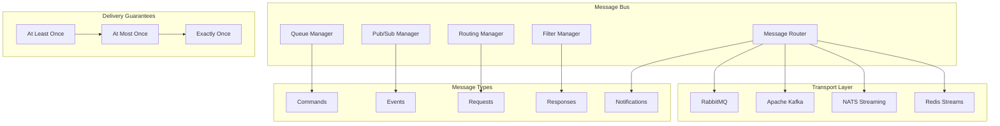
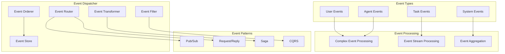
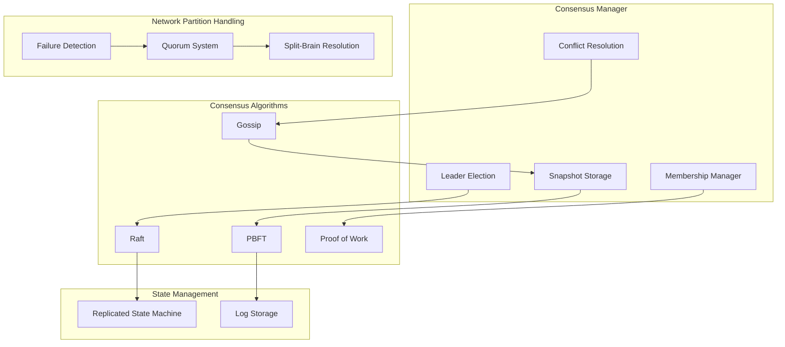
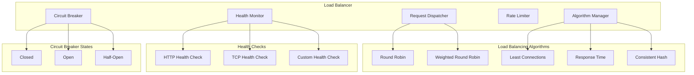

# Communication Layer Architecture

## Overview

The Communication Layer provides reliable, scalable, and secure messaging infrastructure for inter-agent communication, event processing, and distributed coordination. It ensures consistency, ordering, and delivery guarantees across the multi-agent system.

## Components

### 1. Message Bus

#### Architecture


#### Message Bus Features
- **Multi-Protocol Support**: RabbitMQ, Kafka, NATS, Redis
- **Topic-Based Routing**: Flexible message routing
- **Content-Based Filtering**: Filter messages by content
- **Dead Letter Queues**: Handle failed message delivery
- **Message Replay**: Replay messages for recovery

#### Message Schema
```typescript
interface Message {
  id: string;
  type: MessageType;
  source: string;
  destination: string[];
  timestamp: Date;
  correlationId?: string;
  replyTo?: string;
  priority: Priority;
  ttl?: number;
  headers: Record<string, string>;
  payload: any;
  deliveryOptions: DeliveryOptions;
}

interface DeliveryOptions {
  guarantee: 'at-least-once' | 'at-most-once' | 'exactly-once';
  retry: RetryPolicy;
  timeout: number;
  persistent: boolean;
}
```

### 2. Event Dispatcher

#### Responsibilities
- **Event Routing**: Route events to interested subscribers
- **Event Transformation**: Transform events between formats
- **Event Filtering**: Filter events based on criteria
- **Event Ordering**: Maintain event ordering guarantees

#### Architecture


#### Event Types
```typescript
interface AgentEvent {
  type: 'agent.spawned' | 'agent.terminated' | 'agent.health.changed';
  agentId: string;
  agentType: string;
  metadata: Record<string, any>;
}

interface TaskEvent {
  type: 'task.started' | 'task.completed' | 'task.failed' | 'task.cancelled';
  taskId: string;
  agentId: string;
  progress: number;
  result?: any;
  error?: Error;
}

interface SystemEvent {
  type: 'system.scaling' | 'system.failure' | 'system.recovery';
  component: string;
  severity: 'info' | 'warning' | 'error' | 'critical';
  details: Record<string, any>;
}
```

### 3. Consensus Manager

#### Responsibilities
- **Leader Election**: Elect leaders for distributed coordination
- **State Synchronization**: Maintain consistent state across nodes
- **Conflict Resolution**: Resolve conflicts in distributed operations
- **Membership Management**: Manage cluster membership

#### Architecture


#### Consensus Protocols

##### Raft Implementation
```typescript
class RaftConsensus {
  private state: 'follower' | 'candidate' | 'leader' = 'follower';
  private currentTerm = 0;
  private votedFor?: string;
  private log: LogEntry[] = [];
  private commitIndex = 0;
  
  async startElection(): Promise<void> {
    this.state = 'candidate';
    this.currentTerm++;
    this.votedFor = this.nodeId;
    
    const votes = await this.requestVotes();
    if (votes > this.nodes.length / 2) {
      this.becomeLeader();
    } else {
      this.becomeFollower();
    }
  }
  
  async appendEntry(entry: LogEntry): Promise<boolean> {
    if (this.state !== 'leader') {
      throw new Error('Only leader can append entries');
    }
    
    this.log.push(entry);
    const success = await this.replicateToFollowers(entry);
    if (success) {
      this.commitIndex = this.log.length - 1;
    }
    return success;
  }
}
```

##### Byzantine Fault Tolerant (BFT) Implementation
```typescript
class ByzantineConsensus {
  private phase: 'prepare' | 'commit' | 'reply' = 'prepare';
  private proposals = new Map<string, Proposal>();
  private votes = new Map<string, Vote[]>();
  
  async proposeValue(value: any): Promise<boolean> {
    const proposal: Proposal = {
      id: generateId(),
      value,
      timestamp: Date.now(),
      signature: this.sign(value)
    };
    
    await this.broadcast('prepare', proposal);
    const prepareVotes = await this.collectVotes('prepare', proposal.id);
    
    if (prepareVotes.length >= this.byzantineThreshold) {
      await this.broadcast('commit', proposal);
      const commitVotes = await this.collectVotes('commit', proposal.id);
      
      return commitVotes.length >= this.byzantineThreshold;
    }
    
    return false;
  }
}
```

### 4. Load Balancer

#### Responsibilities
- **Request Distribution**: Distribute requests across available agents
- **Health Monitoring**: Monitor agent health for routing decisions
- **Circuit Breaking**: Implement circuit breaker pattern
- **Rate Limiting**: Control request rates to prevent overload

#### Architecture


#### Load Balancing Strategies
```typescript
interface LoadBalancingStrategy {
  name: string;
  selectAgent(agents: AgentInstance[], request: Request): AgentInstance;
  updateWeights(agents: AgentInstance[]): void;
}

class WeightedRoundRobinStrategy implements LoadBalancingStrategy {
  private currentWeights = new Map<string, number>();
  
  selectAgent(agents: AgentInstance[], request: Request): AgentInstance {
    let selected: AgentInstance | null = null;
    let maxWeight = 0;
    
    for (const agent of agents) {
      const currentWeight = this.currentWeights.get(agent.id) || 0;
      const newWeight = currentWeight + agent.weight;
      this.currentWeights.set(agent.id, newWeight);
      
      if (newWeight > maxWeight) {
        maxWeight = newWeight;
        selected = agent;
      }
    }
    
    if (selected) {
      this.currentWeights.set(selected.id, 
        this.currentWeights.get(selected.id)! - this.getTotalWeight(agents));
    }
    
    return selected!;
  }
}
```

## Communication Patterns

### 1. Request-Response Pattern
```typescript
class RequestResponseHandler {
  async handleRequest<T, R>(
    request: Request<T>,
    handler: (data: T) => Promise<R>
  ): Promise<Response<R>> {
    try {
      const result = await handler(request.data);
      return {
        id: request.id,
        status: 'success',
        data: result,
        timestamp: new Date()
      };
    } catch (error) {
      return {
        id: request.id,
        status: 'error',
        error: error.message,
        timestamp: new Date()
      };
    }
  }
}
```

### 2. Publish-Subscribe Pattern
```typescript
class PubSubManager {
  private subscriptions = new Map<string, Set<Subscriber>>();
  
  subscribe(topic: string, subscriber: Subscriber): void {
    if (!this.subscriptions.has(topic)) {
      this.subscriptions.set(topic, new Set());
    }
    this.subscriptions.get(topic)!.add(subscriber);
  }
  
  async publish(topic: string, message: any): Promise<void> {
    const subscribers = this.subscriptions.get(topic);
    if (subscribers) {
      const promises = Array.from(subscribers).map(sub => 
        sub.handleMessage(message).catch(error => 
          console.error(`Subscriber error: ${error.message}`)
        )
      );
      await Promise.all(promises);
    }
  }
}
```

### 3. Saga Pattern
```typescript
class SagaOrchestrator {
  async executeSaga(saga: Saga): Promise<SagaResult> {
    const compensations: Compensation[] = [];
    
    try {
      for (const step of saga.steps) {
        const result = await this.executeStep(step);
        if (step.compensation) {
          compensations.unshift(step.compensation);
        }
        
        if (!result.success) {
          await this.executeCompensations(compensations);
          return { success: false, error: result.error };
        }
      }
      
      return { success: true };
    } catch (error) {
      await this.executeCompensations(compensations);
      return { success: false, error: error.message };
    }
  }
}
```

## Security Features

### 1. Message Encryption
```typescript
class MessageEncryption {
  async encryptMessage(message: Message, recipientKey: string): Promise<EncryptedMessage> {
    const symmetricKey = generateSymmetricKey();
    const encryptedPayload = await encrypt(JSON.stringify(message.payload), symmetricKey);
    const encryptedKey = await encryptAsymmetric(symmetricKey, recipientKey);
    
    return {
      ...message,
      encryptedPayload,
      encryptedKey,
      signature: await this.signMessage(message)
    };
  }
  
  async decryptMessage(encryptedMessage: EncryptedMessage): Promise<Message> {
    const symmetricKey = await decryptAsymmetric(
      encryptedMessage.encryptedKey, 
      this.privateKey
    );
    const payload = await decrypt(encryptedMessage.encryptedPayload, symmetricKey);
    
    const message = {
      ...encryptedMessage,
      payload: JSON.parse(payload)
    };
    
    if (!await this.verifySignature(message, encryptedMessage.signature)) {
      throw new Error('Message signature verification failed');
    }
    
    return message;
  }
}
```

### 2. Access Control
```typescript
interface AccessControl {
  canSend(sender: string, topic: string): Promise<boolean>;
  canReceive(receiver: string, topic: string): Promise<boolean>;
  canSubscribe(subscriber: string, topic: string): Promise<boolean>;
}

class RoleBasedAccessControl implements AccessControl {
  async canSend(sender: string, topic: string): Promise<boolean> {
    const senderRoles = await this.getUserRoles(sender);
    const requiredPermissions = await this.getTopicPermissions(topic, 'send');
    return this.hasPermissions(senderRoles, requiredPermissions);
  }
}
```

## Performance Optimizations

### 1. Message Batching
```typescript
class MessageBatcher {
  private batches = new Map<string, Message[]>();
  private batchTimers = new Map<string, NodeJS.Timeout>();
  
  addMessage(destination: string, message: Message): void {
    if (!this.batches.has(destination)) {
      this.batches.set(destination, []);
      this.scheduleBatchSend(destination);
    }
    
    this.batches.get(destination)!.push(message);
    
    if (this.batches.get(destination)!.length >= this.maxBatchSize) {
      this.sendBatch(destination);
    }
  }
  
  private scheduleBatchSend(destination: string): void {
    const timer = setTimeout(() => {
      this.sendBatch(destination);
    }, this.batchTimeout);
    
    this.batchTimers.set(destination, timer);
  }
}
```

### 2. Connection Pooling
```typescript
class ConnectionPool {
  private pools = new Map<string, Connection[]>();
  private activeConnections = new Map<string, number>();
  
  async getConnection(endpoint: string): Promise<Connection> {
    const pool = this.pools.get(endpoint) || [];
    
    if (pool.length > 0) {
      return pool.pop()!;
    }
    
    if (this.activeConnections.get(endpoint) || 0 < this.maxConnections) {
      return this.createConnection(endpoint);
    }
    
    return this.waitForConnection(endpoint);
  }
  
  releaseConnection(endpoint: string, connection: Connection): void {
    if (!connection.isHealthy()) {
      connection.close();
      return;
    }
    
    const pool = this.pools.get(endpoint) || [];
    pool.push(connection);
    this.pools.set(endpoint, pool);
  }
}
```