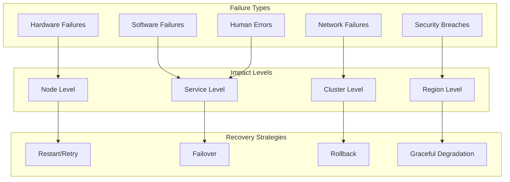
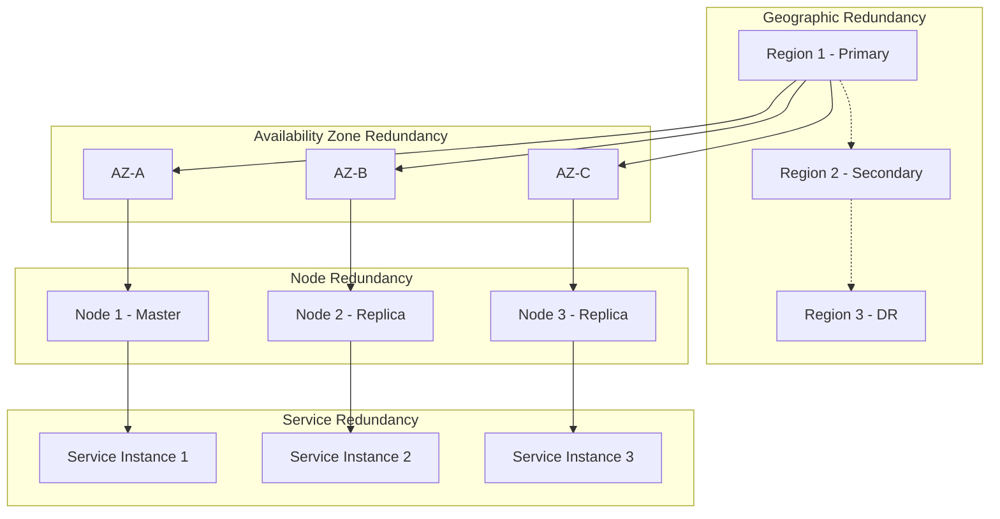

# Fault Tolerance and Recovery Architecture

## Overview

The MAOS fault tolerance architecture ensures system resilience, availability, and data integrity in the face of various failure scenarios. It implements multiple layers of protection including redundancy, graceful degradation, automatic recovery, and disaster recovery mechanisms.

## Fault Tolerance Principles

### 1. Failure Categories



### 2. Fault Tolerance Patterns

#### Circuit Breaker Pattern
```typescript
enum CircuitState {
  CLOSED = 'closed',
  OPEN = 'open',
  HALF_OPEN = 'half_open'
}

interface CircuitBreakerConfig {
  failureThreshold: number;
  successThreshold: number;
  timeout: number;
  monitoringPeriod: number;
}

class CircuitBreaker {
  private state: CircuitState = CircuitState.CLOSED;
  private failureCount = 0;
  private successCount = 0;
  private lastFailureTime?: Date;
  private nextAttemptTime?: Date;
  
  constructor(private config: CircuitBreakerConfig) {}
  
  async execute<T>(operation: () => Promise<T>): Promise<T> {
    if (this.state === CircuitState.OPEN) {
      if (this.shouldAttemptReset()) {
        this.state = CircuitState.HALF_OPEN;
      } else {
        throw new Error('Circuit breaker is OPEN');
      }
    }
    
    try {
      const result = await operation();
      this.onSuccess();
      return result;
    } catch (error) {
      this.onFailure();
      throw error;
    }
  }
  
  private onSuccess(): void {
    this.failureCount = 0;
    
    if (this.state === CircuitState.HALF_OPEN) {
      this.successCount++;
      if (this.successCount >= this.config.successThreshold) {
        this.state = CircuitState.CLOSED;
        this.successCount = 0;
      }
    }
  }
  
  private onFailure(): void {
    this.failureCount++;
    this.lastFailureTime = new Date();
    
    if (this.failureCount >= this.config.failureThreshold) {
      this.state = CircuitState.OPEN;
      this.nextAttemptTime = new Date(Date.now() + this.config.timeout);
    }
  }
  
  private shouldAttemptReset(): boolean {
    return this.nextAttemptTime && new Date() > this.nextAttemptTime;
  }
}
```

#### Bulkhead Pattern
```typescript
interface BulkheadConfig {
  name: string;
  maxConcurrency: number;
  queueSize: number;
  timeout: number;
}

class Bulkhead {
  private activeRequests = 0;
  private queue: Array<{
    operation: () => Promise<any>;
    resolve: (value: any) => void;
    reject: (error: any) => void;
  }> = [];
  
  constructor(private config: BulkheadConfig) {}
  
  async execute<T>(operation: () => Promise<T>): Promise<T> {
    return new Promise((resolve, reject) => {
      if (this.activeRequests < this.config.maxConcurrency) {
        this.executeImmediately(operation, resolve, reject);
      } else if (this.queue.length < this.config.queueSize) {
        this.queue.push({ operation, resolve, reject });
      } else {
        reject(new Error('Bulkhead queue is full'));
      }
    });
  }
  
  private async executeImmediately<T>(
    operation: () => Promise<T>,
    resolve: (value: T) => void,
    reject: (error: any) => void
  ): Promise<void> {
    this.activeRequests++;
    
    const timeoutId = setTimeout(() => {
      reject(new Error('Operation timed out'));
    }, this.config.timeout);
    
    try {
      const result = await operation();
      clearTimeout(timeoutId);
      resolve(result);
    } catch (error) {
      clearTimeout(timeoutId);
      reject(error);
    } finally {
      this.activeRequests--;
      this.processQueue();
    }
  }
  
  private processQueue(): void {
    if (this.queue.length > 0 && this.activeRequests < this.config.maxConcurrency) {
      const { operation, resolve, reject } = this.queue.shift()!;
      this.executeImmediately(operation, resolve, reject);
    }
  }
}
```

#### Retry Pattern with Exponential Backoff
```typescript
interface RetryConfig {
  maxAttempts: number;
  initialDelayMs: number;
  maxDelayMs: number;
  backoffMultiplier: number;
  jitterMs: number;
  retryableErrors?: string[];
}

class RetryExecutor {
  constructor(private config: RetryConfig) {}
  
  async execute<T>(operation: () => Promise<T>): Promise<T> {
    let attempt = 0;
    let delay = this.config.initialDelayMs;
    
    while (attempt < this.config.maxAttempts) {
      try {
        return await operation();
      } catch (error) {
        attempt++;
        
        if (attempt >= this.config.maxAttempts || !this.isRetryableError(error)) {
          throw error;
        }
        
        // Add jitter to prevent thundering herd
        const jitter = Math.random() * this.config.jitterMs;
        const totalDelay = Math.min(delay + jitter, this.config.maxDelayMs);
        
        await this.sleep(totalDelay);
        delay *= this.config.backoffMultiplier;
      }
    }
    
    throw new Error('Max retry attempts exceeded');
  }
  
  private isRetryableError(error: any): boolean {
    if (!this.config.retryableErrors) {
      return true; // Retry all errors by default
    }
    
    return this.config.retryableErrors.some(retryableError => 
      error.message.includes(retryableError)
    );
  }
  
  private sleep(ms: number): Promise<void> {
    return new Promise(resolve => setTimeout(resolve, ms));
  }
}
```

## System Resilience Architecture

### 1. Multi-Level Redundancy



### 2. Health Monitoring and Detection

#### Health Check Framework
```typescript
interface HealthCheck {
  name: string;
  type: 'liveness' | 'readiness' | 'startup';
  interval: number;
  timeout: number;
  successThreshold: number;
  failureThreshold: number;
  check: () => Promise<HealthCheckResult>;
}

interface HealthCheckResult {
  healthy: boolean;
  message?: string;
  details?: Record<string, any>;
  responseTime: number;
}

class HealthMonitor {
  private checks = new Map<string, HealthCheck>();
  private results = new Map<string, HealthCheckResult>();
  private intervals = new Map<string, NodeJS.Timeout>();
  
  registerCheck(check: HealthCheck): void {
    this.checks.set(check.name, check);
    this.startMonitoring(check);
  }
  
  private startMonitoring(check: HealthCheck): void {
    const interval = setInterval(async () => {
      try {
        const startTime = Date.now();
        const result = await Promise.race([
          check.check(),
          this.timeout(check.timeout)
        ]);
        
        result.responseTime = Date.now() - startTime;
        this.results.set(check.name, result);
        
        if (!result.healthy) {
          this.handleUnhealthyCheck(check, result);
        }
      } catch (error) {
        const errorResult: HealthCheckResult = {
          healthy: false,
          message: error.message,
          responseTime: check.timeout
        };
        
        this.results.set(check.name, errorResult);
        this.handleUnhealthyCheck(check, errorResult);
      }
    }, check.interval);
    
    this.intervals.set(check.name, interval);
  }
  
  private async handleUnhealthyCheck(
    check: HealthCheck, 
    result: HealthCheckResult
  ): Promise<void> {
    // Emit health event
    this.eventEmitter.emit('health.check.failed', {
      check: check.name,
      type: check.type,
      result
    });
    
    // Trigger recovery actions based on check type
    if (check.type === 'liveness') {
      await this.triggerRestart();
    } else if (check.type === 'readiness') {
      await this.removeFromLoadBalancer();
    }
  }
  
  private timeout(ms: number): Promise<never> {
    return new Promise((_, reject) => {
      setTimeout(() => reject(new Error('Health check timeout')), ms);
    });
  }
  
  getOverallHealth(): OverallHealth {
    const allResults = Array.from(this.results.values());
    const healthy = allResults.every(result => result.healthy);
    
    return {
      healthy,
      checks: Object.fromEntries(this.results),
      summary: {
        total: allResults.length,
        healthy: allResults.filter(r => r.healthy).length,
        unhealthy: allResults.filter(r => !r.healthy).length
      }
    };
  }
}
```

#### Failure Detection Service
```typescript
interface FailureDetector {
  detectFailure(component: string): Promise<FailureDetection>;
  subscribeToFailures(callback: (failure: FailureEvent) => void): void;
}

class PhiAccrualFailureDetector implements FailureDetector {
  private heartbeats = new Map<string, number[]>();
  private suspicionLevels = new Map<string, number>();
  
  private readonly PHI_THRESHOLD = 8.0; // Adjustable suspicion threshold
  private readonly WINDOW_SIZE = 100; // Heartbeat history window
  
  recordHeartbeat(component: string): void {
    const timestamp = Date.now();
    const history = this.heartbeats.get(component) || [];
    
    history.push(timestamp);
    if (history.length > this.WINDOW_SIZE) {
      history.shift();
    }
    
    this.heartbeats.set(component, history);
    this.suspicionLevels.set(component, 0); // Reset suspicion
  }
  
  async detectFailure(component: string): Promise<FailureDetection> {
    const history = this.heartbeats.get(component) || [];
    const now = Date.now();
    
    if (history.length < 2) {
      return { component, failed: false, phi: 0 };
    }
    
    const intervals = this.calculateIntervals(history);
    const expectedInterval = this.mean(intervals);
    const variance = this.variance(intervals, expectedInterval);
    
    const timeSinceLastHeartbeat = now - history[history.length - 1];
    const phi = this.calculatePhi(timeSinceLastHeartbeat, expectedInterval, variance);
    
    this.suspicionLevels.set(component, phi);
    
    return {
      component,
      failed: phi > this.PHI_THRESHOLD,
      phi,
      expectedInterval,
      timeSinceLastHeartbeat
    };
  }
  
  private calculatePhi(timeSince: number, mean: number, variance: number): number {
    const standardDeviation = Math.sqrt(variance);
    const y = (timeSince - mean) / standardDeviation;
    const e = Math.exp(-y * (1.5976 + 0.070566 * y * y));
    
    if (timeSince > mean) {
      return -Math.log10(e / (1.0 + e));
    } else {
      return -Math.log10(1.0 - 1.0 / (1.0 + e));
    }
  }
  
  private calculateIntervals(timestamps: number[]): number[] {
    const intervals: number[] = [];
    for (let i = 1; i < timestamps.length; i++) {
      intervals.push(timestamps[i] - timestamps[i - 1]);
    }
    return intervals;
  }
  
  private mean(values: number[]): number {
    return values.reduce((sum, val) => sum + val, 0) / values.length;
  }
  
  private variance(values: number[], mean: number): number {
    const squaredDiffs = values.map(val => Math.pow(val - mean, 2));
    return this.mean(squaredDiffs);
  }
}
```

### 3. Graceful Degradation

#### Service Degradation Manager
```typescript
interface DegradationLevel {
  level: number;
  name: string;
  description: string;
  enabledFeatures: string[];
  disabledFeatures: string[];
  resourceLimits: ResourceLimits;
}

class GracefulDegradationManager {
  private currentLevel = 0;
  private degradationLevels: DegradationLevel[] = [
    {
      level: 0,
      name: 'Normal Operation',
      description: 'All features available',
      enabledFeatures: ['*'],
      disabledFeatures: [],
      resourceLimits: { cpu: 100, memory: 100, network: 100 }
    },
    {
      level: 1,
      name: 'Minor Degradation',
      description: 'Non-critical features disabled',
      enabledFeatures: ['core', 'essential'],
      disabledFeatures: ['analytics', 'reporting'],
      resourceLimits: { cpu: 80, memory: 80, network: 90 }
    },
    {
      level: 2,
      name: 'Major Degradation',
      description: 'Only core features available',
      enabledFeatures: ['core'],
      disabledFeatures: ['analytics', 'reporting', 'notifications'],
      resourceLimits: { cpu: 60, memory: 60, network: 70 }
    },
    {
      level: 3,
      name: 'Critical Degradation',
      description: 'Minimal functionality only',
      enabledFeatures: ['health', 'status'],
      disabledFeatures: ['*'],
      resourceLimits: { cpu: 30, memory: 30, network: 40 }
    }
  ];
  
  degradeService(trigger: DegradationTrigger): void {
    const targetLevel = this.calculateTargetLevel(trigger);
    
    if (targetLevel > this.currentLevel) {
      this.applyDegradation(targetLevel);
    }
  }
  
  private calculateTargetLevel(trigger: DegradationTrigger): number {
    switch (trigger.type) {
      case 'resource_exhaustion':
        return trigger.severity === 'high' ? 3 : 2;
      case 'service_failure':
        return trigger.criticalService ? 2 : 1;
      case 'network_partition':
        return 2;
      case 'load_spike':
        return 1;
      default:
        return 0;
    }
  }
  
  private async applyDegradation(level: number): Promise<void> {
    const degradationConfig = this.degradationLevels[level];
    this.currentLevel = level;
    
    // Disable features
    await this.disableFeatures(degradationConfig.disabledFeatures);
    
    // Apply resource limits
    await this.applyResourceLimits(degradationConfig.resourceLimits);
    
    // Notify monitoring systems
    this.eventEmitter.emit('degradation.applied', {
      level,
      config: degradationConfig,
      timestamp: new Date()
    });
    
    // Log degradation
    this.logger.warn('Service degradation applied', {
      level,
      name: degradationConfig.name,
      disabledFeatures: degradationConfig.disabledFeatures
    });
  }
  
  async recover(): Promise<void> {
    if (this.currentLevel > 0) {
      // Check if recovery is safe
      const healthStatus = await this.healthMonitor.getOverallHealth();
      const resourceStatus = await this.resourceMonitor.getStatus();
      
      if (healthStatus.healthy && resourceStatus.utilizationNormal) {
        await this.applyDegradation(0);
        this.logger.info('Service recovered from degradation');
      }
    }
  }
}
```

## Automatic Recovery Mechanisms

### 1. Self-Healing Components

#### Auto-Recovery Service
```typescript
interface RecoveryStrategy {
  name: string;
  trigger: FailureType;
  actions: RecoveryAction[];
  timeout: number;
  maxAttempts: number;
  escalationPolicy?: EscalationPolicy;
}

interface RecoveryAction {
  type: 'restart' | 'failover' | 'scale' | 'rollback' | 'cleanup';
  parameters: Record<string, any>;
  timeout: number;
}

class AutoRecoveryService {
  private recoveryStrategies = new Map<FailureType, RecoveryStrategy>();
  private recoveryAttempts = new Map<string, number>();
  
  registerStrategy(strategy: RecoveryStrategy): void {
    this.recoveryStrategies.set(strategy.trigger, strategy);
  }
  
  async handleFailure(failure: FailureEvent): Promise<RecoveryResult> {
    const strategy = this.recoveryStrategies.get(failure.type);
    if (!strategy) {
      return { success: false, message: 'No recovery strategy found' };
    }
    
    const attemptKey = `${failure.component}-${failure.type}`;
    const attempts = this.recoveryAttempts.get(attemptKey) || 0;
    
    if (attempts >= strategy.maxAttempts) {
      await this.escalate(failure, strategy.escalationPolicy);
      return { success: false, message: 'Max recovery attempts exceeded' };
    }
    
    this.recoveryAttempts.set(attemptKey, attempts + 1);
    
    try {
      const result = await this.executeRecoveryStrategy(strategy, failure);
      
      if (result.success) {
        this.recoveryAttempts.delete(attemptKey);
      }
      
      return result;
    } catch (error) {
      return { success: false, message: error.message };
    }
  }
  
  private async executeRecoveryStrategy(
    strategy: RecoveryStrategy, 
    failure: FailureEvent
  ): Promise<RecoveryResult> {
    this.logger.info('Executing recovery strategy', {
      strategy: strategy.name,
      failure: failure.type,
      component: failure.component
    });
    
    for (const action of strategy.actions) {
      try {
        await this.executeRecoveryAction(action, failure);
      } catch (error) {
        return { 
          success: false, 
          message: `Recovery action failed: ${action.type}`,
          error: error.message 
        };
      }
    }
    
    // Verify recovery
    const verified = await this.verifyRecovery(failure);
    return { success: verified, message: verified ? 'Recovery successful' : 'Recovery verification failed' };
  }
  
  private async executeRecoveryAction(
    action: RecoveryAction, 
    failure: FailureEvent
  ): Promise<void> {
    switch (action.type) {
      case 'restart':
        await this.restartComponent(failure.component, action.parameters);
        break;
      case 'failover':
        await this.failoverComponent(failure.component, action.parameters);
        break;
      case 'scale':
        await this.scaleComponent(failure.component, action.parameters);
        break;
      case 'rollback':
        await this.rollbackComponent(failure.component, action.parameters);
        break;
      case 'cleanup':
        await this.cleanupComponent(failure.component, action.parameters);
        break;
      default:
        throw new Error(`Unknown recovery action: ${action.type}`);
    }
  }
}
```

### 2. Rollback Mechanisms

#### Automated Rollback Service
```typescript
interface RollbackPoint {
  id: string;
  timestamp: Date;
  version: string;
  configuration: any;
  dataSnapshot?: string;
  healthState: HealthState;
}

class RollbackService {
  private rollbackPoints = new Map<string, RollbackPoint[]>();
  
  async createRollbackPoint(component: string): Promise<string> {
    const rollbackId = this.generateRollbackId();
    const currentConfig = await this.getCurrentConfiguration(component);
    const healthState = await this.getCurrentHealthState(component);
    
    const rollbackPoint: RollbackPoint = {
      id: rollbackId,
      timestamp: new Date(),
      version: await this.getCurrentVersion(component),
      configuration: currentConfig,
      dataSnapshot: await this.createDataSnapshot(component),
      healthState
    };
    
    if (!this.rollbackPoints.has(component)) {
      this.rollbackPoints.set(component, []);
    }
    
    const points = this.rollbackPoints.get(component)!;
    points.push(rollbackPoint);
    
    // Keep only last 10 rollback points
    if (points.length > 10) {
      points.shift();
    }
    
    return rollbackId;
  }
  
  async rollback(
    component: string, 
    rollbackId?: string
  ): Promise<RollbackResult> {
    const points = this.rollbackPoints.get(component) || [];
    
    let targetPoint: RollbackPoint;
    if (rollbackId) {
      targetPoint = points.find(p => p.id === rollbackId)!;
      if (!targetPoint) {
        throw new Error(`Rollback point ${rollbackId} not found`);
      }
    } else {
      // Use most recent rollback point
      targetPoint = points[points.length - 1];
      if (!targetPoint) {
        throw new Error('No rollback points available');
      }
    }
    
    try {
      // Stop the component
      await this.stopComponent(component);
      
      // Restore configuration
      await this.restoreConfiguration(component, targetPoint.configuration);
      
      // Restore data if snapshot exists
      if (targetPoint.dataSnapshot) {
        await this.restoreDataSnapshot(component, targetPoint.dataSnapshot);
      }
      
      // Restart component
      await this.startComponent(component);
      
      // Verify rollback
      const currentHealth = await this.getCurrentHealthState(component);
      const rollbackSuccessful = this.compareHealthStates(
        currentHealth, 
        targetPoint.healthState
      );
      
      return {
        success: rollbackSuccessful,
        rollbackPoint: targetPoint,
        message: rollbackSuccessful ? 'Rollback completed successfully' : 'Rollback verification failed'
      };
    } catch (error) {
      return {
        success: false,
        rollbackPoint: targetPoint,
        message: `Rollback failed: ${error.message}`,
        error
      };
    }
  }
  
  async canRollback(component: string): Promise<boolean> {
    const points = this.rollbackPoints.get(component) || [];
    return points.length > 0;
  }
  
  private async createDataSnapshot(component: string): Promise<string | undefined> {
    // Implementation depends on component type and data storage
    try {
      const snapshot = await this.dataService.createSnapshot(component);
      return snapshot.id;
    } catch (error) {
      this.logger.warn('Failed to create data snapshot', {
        component,
        error: error.message
      });
      return undefined;
    }
  }
}
```

## Disaster Recovery

### 1. Disaster Recovery Planning

```typescript
enum DisasterType {
  DATA_CENTER_FAILURE = 'datacenter_failure',
  REGIONAL_OUTAGE = 'regional_outage',
  CYBER_ATTACK = 'cyber_attack',
  DATA_CORRUPTION = 'data_corruption',
  HUMAN_ERROR = 'human_error',
  NATURAL_DISASTER = 'natural_disaster'
}

interface DisasterRecoveryPlan {
  disasterType: DisasterType;
  rto: number; // Recovery Time Objective (seconds)
  rpo: number; // Recovery Point Objective (seconds)
  steps: RecoveryStep[];
  resources: RequiredResource[];
  responsibilities: ResponsibilityMatrix;
  testingSchedule: TestingSchedule;
}

interface RecoveryStep {
  id: string;
  name: string;
  description: string;
  dependencies: string[];
  executor: string;
  estimatedDuration: number;
  automatable: boolean;
  procedure: RecoveryProcedure;
}

class DisasterRecoveryManager {
  private recoveryPlans = new Map<DisasterType, DisasterRecoveryPlan>();
  private activeRecoveries = new Map<string, RecoveryExecution>();
  
  async initiateDisasterRecovery(
    disasterType: DisasterType,
    severity: 'low' | 'medium' | 'high' | 'critical'
  ): Promise<RecoveryExecution> {
    const plan = this.recoveryPlans.get(disasterType);
    if (!plan) {
      throw new Error(`No recovery plan found for disaster type: ${disasterType}`);
    }
    
    const executionId = this.generateExecutionId();
    const execution: RecoveryExecution = {
      id: executionId,
      disasterType,
      severity,
      plan,
      startTime: new Date(),
      status: 'in_progress',
      completedSteps: [],
      currentStep: null,
      estimatedCompletion: this.calculateEstimatedCompletion(plan)
    };
    
    this.activeRecoveries.set(executionId, execution);
    
    // Start execution
    this.executeRecoveryPlan(execution);
    
    return execution;
  }
  
  private async executeRecoveryPlan(execution: RecoveryExecution): Promise<void> {
    try {
      const sortedSteps = this.topologicalSort(execution.plan.steps);
      
      for (const step of sortedSteps) {
        execution.currentStep = step;
        
        this.logger.info('Executing recovery step', {
          executionId: execution.id,
          step: step.name
        });
        
        const stepResult = await this.executeRecoveryStep(step, execution);
        execution.completedSteps.push({
          step,
          result: stepResult,
          completedAt: new Date()
        });
        
        if (!stepResult.success) {
          execution.status = 'failed';
          execution.error = stepResult.error;
          return;
        }
      }
      
      execution.status = 'completed';
      execution.endTime = new Date();
      
      // Verify recovery
      const verificationResult = await this.verifyRecovery(execution);
      if (!verificationResult.success) {
        execution.status = 'verification_failed';
        execution.error = verificationResult.error;
      }
      
    } catch (error) {
      execution.status = 'failed';
      execution.error = error.message;
      execution.endTime = new Date();
    }
  }
}
```

### 2. Data Backup and Restoration

```typescript
interface BackupStrategy {
  type: 'full' | 'incremental' | 'differential';
  frequency: string; // Cron expression
  retention: RetentionPolicy;
  destinations: BackupDestination[];
  encryption: EncryptionConfig;
  compression: CompressionConfig;
}

interface BackupDestination {
  type: 'local' | 's3' | 'gcs' | 'azure';
  config: any;
  priority: number;
}

class BackupService {
  private strategies = new Map<string, BackupStrategy>();
  
  async createBackup(
    component: string, 
    type: 'full' | 'incremental' = 'incremental'
  ): Promise<BackupMetadata> {
    const strategy = this.strategies.get(component);
    if (!strategy) {
      throw new Error(`No backup strategy found for component: ${component}`);
    }
    
    const backupId = this.generateBackupId();
    const startTime = new Date();
    
    try {
      // Collect data
      const data = await this.collectBackupData(component, type);
      
      // Compress data
      const compressedData = await this.compressData(data, strategy.compression);
      
      // Encrypt data
      const encryptedData = await this.encryptData(compressedData, strategy.encryption);
      
      // Store to all destinations
      const storageResults = await Promise.allSettled(
        strategy.destinations.map(dest => 
          this.storeBackup(dest, backupId, encryptedData)
        )
      );
      
      // Verify at least one successful storage
      const successfulStores = storageResults.filter(r => r.status === 'fulfilled');
      if (successfulStores.length === 0) {
        throw new Error('All backup storage destinations failed');
      }
      
      const metadata: BackupMetadata = {
        id: backupId,
        component,
        type,
        size: encryptedData.length,
        originalSize: data.length,
        compressionRatio: compressedData.length / data.length,
        startTime,
        endTime: new Date(),
        destinations: strategy.destinations.map((dest, index) => ({
          destination: dest,
          success: storageResults[index].status === 'fulfilled',
          error: storageResults[index].status === 'rejected' ? 
            (storageResults[index] as PromiseRejectedResult).reason.message : undefined
        })),
        checksum: await this.calculateChecksum(encryptedData)
      };
      
      await this.storeBackupMetadata(metadata);
      return metadata;
      
    } catch (error) {
      throw new Error(`Backup failed: ${error.message}`);
    }
  }
  
  async restoreFromBackup(
    backupId: string, 
    targetComponent?: string
  ): Promise<RestoreResult> {
    const metadata = await this.getBackupMetadata(backupId);
    if (!metadata) {
      throw new Error(`Backup ${backupId} not found`);
    }
    
    const component = targetComponent || metadata.component;
    
    try {
      // Stop target component
      await this.stopComponent(component);
      
      // Download backup data
      const encryptedData = await this.downloadBackup(metadata);
      
      // Verify checksum
      const checksum = await this.calculateChecksum(encryptedData);
      if (checksum !== metadata.checksum) {
        throw new Error('Backup data integrity check failed');
      }
      
      // Decrypt data
      const strategy = this.strategies.get(metadata.component)!;
      const compressedData = await this.decryptData(encryptedData, strategy.encryption);
      
      // Decompress data
      const data = await this.decompressData(compressedData, strategy.compression);
      
      // Restore data
      await this.restoreData(component, data);
      
      // Start component
      await this.startComponent(component);
      
      // Verify restoration
      const verificationResult = await this.verifyRestore(component);
      
      return {
        success: verificationResult.success,
        component,
        backupId,
        restoredSize: data.length,
        duration: Date.now() - Date.now(), // TODO: Fix timing
        message: verificationResult.message
      };
      
    } catch (error) {
      // Attempt to restart component even if restore failed
      try {
        await this.startComponent(component);
      } catch (startError) {
        this.logger.error('Failed to restart component after failed restore', {
          component,
          error: startError.message
        });
      }
      
      return {
        success: false,
        component,
        backupId,
        error: error.message
      };
    }
  }
}